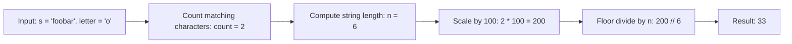

# Guided Example: Percentage of Letter in String

## 1. Problem Overview & Representative Instance

Given a string $s$ and a target character $letter$, the objective is to determine the percentage of characters in $s$ that equal $letter$, rounded down to the nearest whole percent.

The mathematical calculation follows standard percentage proportion with integer floor division:
$$\text{Percentage} = \left\lfloor \frac{\text{count}(letter) \times 100}{|s|} \right\rfloor$$

Consider the representative instance:
$$s = \text{"foobar"}, \quad letter = \text{'o'}$$

The string $s$ has length $n = 6$. We count the occurrences of character `'o'`:
- Index $0$: `'f'` $\ne$ `'o'`
- Index $1$: `'o'` $=$ `'o'` (Occurrence 1)
- Index $2$: `'o'` $=$ `'o'` (Occurrence 2)
- Index $3$: `'b'` $\ne$ `'o'`
- Index $4$: `'a'` $\ne$ `'o'`
- Index $5$: `'r'` $\ne$ `'o'`

Total count of character `'o'` is $2$.
Applying the percentage formula:
$$\text{Fraction} = \frac{2}{6} = \frac{1}{3} \approx 0.3333\dots$$
$$\text{Percentage} = \left\lfloor \frac{2 \times 100}{6} \right\rfloor = \left\lfloor \frac{200}{6} \right\rfloor = \lfloor 33.333\dots \rfloor = 33$$

Thus, the rounded-down percentage is $33$.

## 2. Mathematical & Algorithmic Principles

### Exact Integer Arithmetic vs. Floating-Point Roundoff

Computing percentages using floating-point division:
$$\text{floor}\left( \frac{\text{count}}{n} \times 100 \right)$$
can introduce subtle floating-point precision inaccuracies (such as representation error where $\frac{1}{3} \times 100 \approx 33.333333333333336$).

By rearranging the terms algebraically into an integer-first multiplication:
$$\text{Percentage} = (\text{count} \times 100) \mathbin{/\!\!/} n$$
all calculations remain strictly within the domain of integers $\mathbb{Z}_{\ge 0}$.

Because $\text{count} \le n \le 100$, the numerator $\text{count} \times 100$ never exceeds $10^4$, fitting comfortably within a standard $32$-bit integer without any possibility of arithmetic overflow.

### Monotonicity and Range Guarantees

Since $0 \le \text{count} \le n$:
$$0 \le \frac{\text{count} \times 100}{n} \le 100$$
- When $\text{count} = 0$, the numerator is $0$, yielding $0 \mathbin{/\!\!/} n = 0$.
- When $\text{count} = n$, the formula evaluates to $(n \times 100) \mathbin{/\!\!/} n = 100$.
- For all intermediate counts, the floor division operator $\lfloor x \rfloor$ discards the fractional remainder, guaranteeing strict conformance with the "rounded down" problem specification.

## 3. Step-by-Step Walkthrough with Intermediate State

Let us trace the execution over $s = \text{"foobar"}$ and $letter = \text{'o'}$.

| Processing Stage | Target Variable | Value | Description |
|---|---|---|---|
| Step 1: Length Measurement | $n = \lvert s \rvert$ | $6$ | Total characters in string $s$ |
| Step 2: Linear Scan | $\text{count}$ | $2$ | Incremented at indices $1$ and $2$ |
| Step 3: Numerator Scaling | $\text{num} = \text{count} \times 100$ | $200$ | Integer scaling before division |
| Step 4: Floor Division | $\text{result} = \text{num} \mathbin{/\!\!/} n$ | $33$ | $200 \mathbin{/\!\!/} 6 = 33$ remainder $2$ |

- **Step 1:** Measure string length $n = 6$.
- **Step 2:** Scan each character of $s$, tallying occurrences of target character `'o'`. The tally increments from $0 \to 1$ at index $1$, and from $1 \to 2$ at index $2$.
- **Step 3:** Form the scaled numerator $2 \times 100 = 200$.
- **Step 4:** Perform integer division: $200 = 33 \times 6 + 2$. The integer quotient is $33$.

The final computed value is $33$.

## 4. Comprehensive State Trace

The table below catalogs percentage calculations across a spectrum of input patterns.

| Input String $s$ | Target $letter$ | String Length $n$ | Occurrence Count | Scaled Numerator | Floor Division | Result Percentage |
|---|---|---|---|---|---|---|
| $\text{"foobar"}$ | `'o'` | $6$ | $2$ | $200$ | $200 \mathbin{/\!\!/} 6$ | $33$ |
| $\text{"jjjj"}$ | `'k'` | $4$ | $0$ | $0$ | $0 \mathbin{/\!\!/} 4$ | $0$ |
| $\text{"aaaa"}$ | `'a'` | $4$ | $4$ | $400$ | $400 \mathbin{/\!\!/} 4$ | $100$ |
| $\text{"z"}$ | `'z'` | $1$ | $1$ | $100$ | $100 \mathbin{/\!\!/} 1$ | $100$ |
| $\text{"abc"}$ | `'a'` | $3$ | $1$ | $100$ | $100 \mathbin{/\!\!/} 3$ | $33$ |
| $\text{"aba"}$ | `'a'` | $3$ | $2$ | $200$ | $200 \mathbin{/\!\!/} 3$ | $66$ |
| $\text{"xyxyxyxy"}$ | `'x'` | $8$ | $4$ | $400$ | $400 \mathbin{/\!\!/} 8$ | $50$ |
| String of $100$ chars with one `'b'` | `'b'` | $100$ | $1$ | $100$ | $100 \mathbin{/\!\!/} 100$ | $1$ |

In the case $s = \text{"aba"}$ with $letter = \text{'a'}$, the exact fraction is $\frac{2}{3} = 66.666\dots\%$. The floor division truncates the fraction, yielding exactly $66$ without rounding up to $67$.

## 5. Algorithmic Correctness & Soundness

The correctness of this computation is substantiated by modular arithmetic:

1. **Euclidean Division Theorem:**
   For any integers $A \ge 0$ and $B > 0$, there exist unique integers $q \ge 0$ (the quotient) and $r$ (the remainder) such that:
   $$A = q \cdot B + r \quad \text{with} \quad 0 \le r < B$$
   Here $A = \text{count} \times 100$ and $B = n$. The integer division operator computes $q = \lfloor A / B \rfloor$.
2. **Floor Truncation Equivalence:**
   By definition:
   $$\frac{A}{B} = q + \frac{r}{B}$$
   Since $0 \le \frac{r}{B} < 1$, $\lfloor A / B \rfloor = q$.
   This matches the requirement to round down to the nearest whole integer.
3. **Guard Against Undefined Division:**
   The problem constraints specify $1 \le |s| \le 100$. Because $|s| \ge 1$, division by zero is strictly impossible.

## 6. Edge Cases & Anti-Patterns

1. **Target Character Absent ($\text{count} = 0$):**
   - For $s = \text{"jjjj"}$ and $letter = \text{'k'}$, $\text{count} = 0$.
   - $0 \times 100 \mathbin{/\!\!/} 4 = 0$. The algorithm returns $0$.
2. **Target Character Comprises Entire String ($\text{count} = n$):**
   - For $s = \text{"aaaa"}$ and $letter = \text{'a'}$, $\text{count} = 4, n = 4$.
   - $400 \mathbin{/\!\!/} 4 = 100$. The algorithm returns $100$.
3. **Rounding Down vs. Rounding to Nearest:**
   - In standard school rounding, $66.666\dots$ rounds up to $67$, and $33.333\dots$ rounds to $33$.
   - The problem explicitly demands rounding **down** ($\lfloor \cdot \rfloor$). Applying standard `round()` would produce $67$ for $\text{"aba"}$, causing a test failure. Floor division preserves correct behavior.
4. **Single-Character String ($n = 1$):**
   - If match: $100 \mathbin{/\!\!/} 1 = 100$.
   - If mismatch: $0 \mathbin{/\!\!/} 1 = 0$.

## 7. Complexity Analysis

The complexity parameters are governed by the length of the string $N = |s|$.

| Metric | Bound | Justification |
|---|---|---|
| Character Frequency Count | $O(N)$ | Single linear pass inspecting each character in $s$ to compare against $letter$. |
| Arithmetic Operations | $O(1)$ | One multiplication ($\text{count} \times 100$) and one integer division ($\mathbin{/\!\!/} n$). |
| Total Time Complexity | $O(N)$ | For $N \le 100$, takes fewer than $200$ CPU instructions, executing in $< 1\text{ }\mu\text{s}$. |
| Auxiliary Space Complexity | $O(1)$ | Uses only a single integer counter. No arrays or memory buffers are allocated. |
