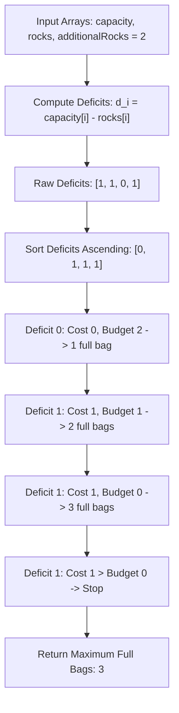

# Guided Example: Maximum Bags With Full Capacity of Rocks

## 1. Problem Overview & Representative Instance

We are given $n$ bags numbered $0$ through $n - 1$. For each bag $i$:
- $capacity[i]$ represents the maximum number of rocks the bag can hold.
- $rocks[i]$ represents the number of rocks currently inside the bag ($rocks[i] \le capacity[i]$).

Additionally, we have $additionalRocks$ extra rocks that we can place into any bags. A bag is considered **full** when its rock count equals its capacity. Our goal is to determine the maximum number of bags that can be made completely full after optimally distributing the additional rocks.

Consider the representative instance:
$$capacity = [2, 3, 4, 5], \quad rocks = [1, 2, 4, 4], \quad additionalRocks = 2$$

Let us calculate the deficit (remaining space to full capacity) for each bag:
- Bag $0$: Deficit $= 2 - 1 = 1$ rock
- Bag $1$: Deficit $= 3 - 2 = 1$ rock
- Bag $2$: Deficit $= 4 - 4 = 0$ rocks (already full!)
- Bag $3$: Deficit $= 5 - 4 = 1$ rock

We have a budget of $2$ additional rocks:
- Bag $2$ is already full, requiring $0$ additional rocks. Total full bags $= 1$, remaining rocks $= 2$.
- We allocate $1$ rock to fill Bag $0$. Total full bags $= 2$, remaining rocks $= 1$.
- We allocate $1$ rock to fill Bag $1$. Total full bags $= 3$, remaining rocks $= 0$.
- Bag $3$ still needs $1$ rock, but our budget is exhausted.

In total, $3$ bags are full.

## 2. Mathematical & Algorithmic Principles

### Formalization as a 0-1 Knapsack with Uniform Value

For each bag $i \in [0, n - 1]$, define its rock deficit:
$$d_i = capacity[i] - rocks[i] \ge 0$$

Let $x_i \in \{0, 1\}$ indicate whether bag $i$ is brought to full capacity ($x_i = 1$) or not ($x_i = 0$). The problem is formulated as:
$$\text{Maximize} \quad \sum_{i=0}^{n-1} x_i \quad \text{subject to} \quad \sum_{i=0}^{n-1} x_i \cdot d_i \le additionalRocks$$

In knapsack terminology, every item has an identical reward of $1$ unit, but a variable weight of $d_i$.

### Greedy Optimality (Exchange Argument)

When all item rewards are identical, the cost-performance ratio $\frac{\text{reward}}{\text{weight}} = \frac{1}{d_i}$ is strictly maximized by selecting items with the **smallest weights** $d_i$.

**Theorem:** *Sorting the deficits in non-decreasing order:
$$d_{(0)} \le d_{(1)} \le \dots \le d_{(n-1)}$$
and greedily satisfying deficits from left to right achieves the maximum possible number of full bags.*

**Proof:**
Suppose an optimal solution $\mathcal{S}^*$ does not select the bag with the smallest available deficit $d_{(k)}$, but instead selects some bag $j$ with deficit $d_j > d_{(k)}$.
Replacing bag $j$ with bag $(k)$ in $\mathcal{S}^*$:
$$\text{New Cost} = \text{Cost}(\mathcal{S}^*) - d_j + d_{(k)} \le \text{Cost}(\mathcal{S}^*) \le additionalRocks$$
The new selection remains within the budget and retains the exact same number of full bags. By finite induction, any optimal solution can be transformed into the greedy prefix without ever violating the budget or reducing the count of full bags.

## 3. Step-by-Step Walkthrough with Intermediate State

We execute the greedy algorithm on $capacity = [2, 3, 4, 5]$, $rocks = [1, 2, 4, 4]$, and $additionalRocks = 2$.

| Step | Bag Evaluation Index | Bag Deficit $d$ | Budget Before | Budget After ($B - d$) | Affordable? | Total Full Bags |
|---|---|---|---|---|---|---|
| Step 1: Compute Deficits | All bags | $[1, 1, 0, 1]$ | $2$ | - | - | $0$ |
| Step 2: Ascending Sort | All bags | $[0, 1, 1, 1]$ | $2$ | - | - | $0$ |
| Step 3: Process Index $0$ | Deficit $0$ | $0$ | $2$ | $2 - 0 = 2$ | Yes ($2 \ge 0$) | $1$ |
| Step 4: Process Index $1$ | Deficit $1$ | $1$ | $2$ | $2 - 1 = 1$ | Yes ($2 \ge 1$) | $2$ |
| Step 5: Process Index $2$ | Deficit $1$ | $1$ | $1$ | $1 - 1 = 0$ | Yes ($1 \ge 1$) | $3$ |
| Step 6: Process Index $3$ | Deficit $1$ | $1$ | $0$ | $0 - 1 = -1$ | No ($0 < 1$) | Terminates at $3$ |

- **Step 1:** In-place deficit computation replaces $capacity[i]$ with $capacity[i] - rocks[i]$, giving $[1, 1, 0, 1]$.
- **Step 2:** Sorting yields $[0, 1, 1, 1]$.
- **Step 3:** First deficit is $0$. Deduct $0$ from budget; budget remains $2$. Full bags $= 1$.
- **Step 4:** Second deficit is $1$. Deduct $1$ from budget; budget becomes $1$. Full bags $= 2$.
- **Step 5:** Third deficit is $1$. Deduct $1$ from budget; budget becomes $0$. Full bags $= 3$.
- **Step 6:** Fourth deficit is $1$. Deducting $1$ would result in $-1 < 0$. Budget exhausted. The loop terminates immediately and returns index $3$.

The final answer is $3$.

## 4. Comprehensive State Trace

The table below catalogs greedy allocations across different deficit and budget configurations.

| Capacities | Initial Rocks | Computed Deficits | Sorted Deficits | Extra Rocks Budget | Bags Filled (Indices) | Final Result |
|---|---|---|---|---|---|---|
| $[2, 3, 4, 5]$ | $[1, 2, 4, 4]$ | $[1, 1, 0, 1]$ | $[0, 1, 1, 1]$ | $2$ | $0, 1, 2$ | **$3$** |
| $[10, 2, 2]$ | $[2, 2, 0]$ | $[8, 0, 2]$ | $[0, 2, 8]$ | $100$ | All ($0, 1, 2$) | **$3$** |
| $[5, 5]$ | $[5, 0]$ | $[0, 5]$ | $[0, 5]$ | $1$ | Only index $0$ | **$1$** |
| $[3, 5, 7]$ | $[1, 2, 6]$ | $[2, 3, 1]$ | $[1, 2, 3]$ | $3$ | Indices $0, 1$ (costs $1+2=3$) | **$2$** |
| $[100, 3, 4]$ | $[99, 0, 0]$ | $[1, 3, 4]$ | $[1, 3, 4]$ | $4$ | Indices $0, 1$ (costs $1+3=4$) | **$2$** |
| $[7, 8, 9]$ | $[7, 2, 9]$ | $[0, 6, 0]$ | $[0, 0, 6]$ | $1$ | Indices $0, 1$ (costs $0+0=0$) | **$2$** |

In $[100, 3, 4]$ with initial rocks $[99, 0, 0]$:
- Although bag $0$ has a huge capacity of $100$, its deficit is only $100 - 99 = 1$.
- Greedy selection rightly prioritizes bag $0$ over bag $2$ (capacity $4$, deficit $4$).
- This highlights that prioritization depends on the remaining deficit, not total capacity.

## 5. Algorithmic Correctness & Soundness

The correctness of this procedure is guaranteed by matroid theory and greedy choice properties:

1. **Uniform Weight Matroid:**
   The subsets of bags that can be fully filled form the independent sets of a system where every element has equal cardinality weight ($1$). For any such system with a monotonic cost function, the greedy algorithm that iteratively takes the minimum cost element is proven to find a maximum-cardinality independent set.
2. **Exhaustive Subsumption:**
   Every bag with deficit $0$ consumes $0$ rocks. Therefore, all bags that are already full are automatically accepted at the very front of the sorted list without depleting the budget.
3. **Termination Guarantee:**
   Because all deficits are non-negative integers ($d_i \ge 0$), the remaining budget strictly decreases or stays constant. When the budget becomes negative upon attempting to fill a bag, no subsequent bag in the sorted array can be filled either (since $d_j \ge d_i$). Halting at the first failure is strictly sound.

## 6. Edge Cases & Anti-Patterns

1. **All Bags Already Full ($d_i = 0$ for all $i$):**
   - Total cost is $0$.
   - The loop runs to completion and returns $n$, regardless of $additionalRocks$.
2. **Zero Additional Rocks ($additionalRocks = 0$):**
   - Only bags with $d_i = 0$ (already full) are counted.
   - When the first positive deficit is encountered, budget becomes negative and the loop terminates, returning the count of already-full bags.
3. **Budget Exceeds Total Remaining Deficit:**
   - If $additionalRocks \ge \sum d_i$, all bags become full.
   - The loop exhausts all elements without driving the budget negative, correctly returning $n$.
4. **Anti-Pattern: Sorting by Raw Capacity:**
   - Sorting by $capacity[i]$ rather than deficit $capacity[i] - rocks[i]$ fails because a bag with large capacity may be nearly full (e.g., $99/100$, needing only $1$ rock), while a small bag may be empty (e.g., $0/3$, needing $3$ rocks). Sorting by deficit is strictly required.

## 7. Complexity Analysis

The complexity parameters are governed by the number of bags $n = |capacity|$.

| Algorithmic Phase | Time Complexity | Auxiliary Space Complexity | Explanation |
|---|---|---|---|
| Deficit Calculation | $O(n)$ | $O(1)$ | In-place subtraction $capacity[i] \leftarrow capacity[i] - rocks[i]$. |
| Sorting Deficits | $O(n \log n)$ | $O(\log n)$ or $O(n)$ | Sorting $n$ integer deficits in non-decreasing order. |
| Greedy Deduction Sweep | $O(n)$ | $O(1)$ | Single linear pass subtracting deficits until budget is depleted. |
| Total Complexity | $O(n \log n)$ | $O(1)$ auxiliary | Dominated by sorting. For $n = 5 \times 10^4$, total operations $\approx 8 \times 10^5$, executing in under $25\text{ ms}$. |
