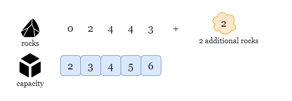
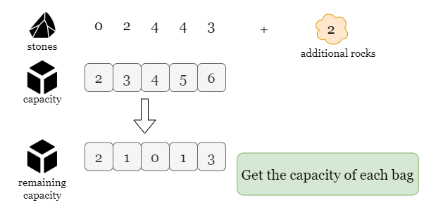
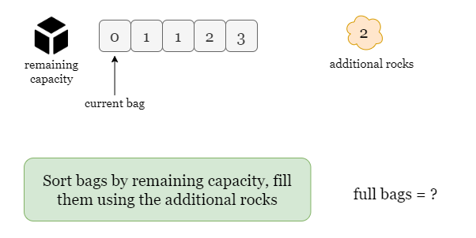
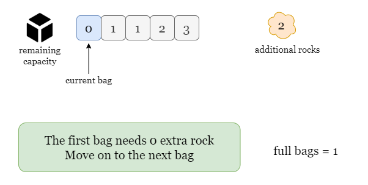
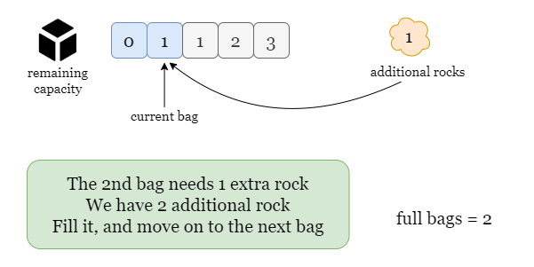
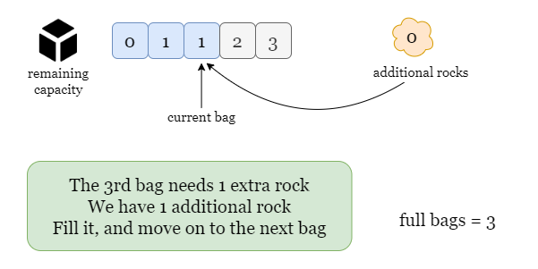
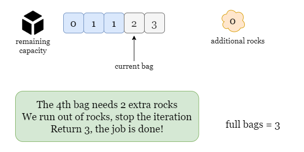

## Solution

---

### Overview

In this problem, we are given two arrays `rocks` and `capacity` of the same length `n`, which represent `n` bags. Each bag `i` has a maximum capacity of $\text{capacity}[i]$ and currently contains $\text{rocks}[i]$ rocks. We are also given `additionalRock` to fill the bags if they are unfilled.

For example, in the picture below, the first bag has a capacity of `2` and currently contains `0` rocks, thus we can fill it with `2` additional rocks. However, the last bag has a capacity of `6` and currently contains `3` rocks, thus we can't fill it since we only have `2` additonal rocks but it requires `3`.



We want to fill as many bags as possible, the question is: how many bags can we fill?

---

### Approach 1: Greedy

#### Intuition

Since we want to fill the bags, thus we only care about the **remaining capacity** of each bag. For example:
- Bag 1 has a capacity of `5` and currently contains `3` rocks.
- Bag 2 has a capacity of `20` and currently contians `18` rocks.

It takes the same amount of rocks (`2`) to fill both bags, so for us there is no difference between the two bags: they both have `2` remaining capacity.

Therefore, we need to calculate the remaining capacity of each bag `i`, by letting its capacity $\text{capacity}[i]$ substract the number of rocks it currently has $\text{rocks}[i]$. That is:
$remaining capacity of bag i = \text{capacity}[i] - \text{rocks}[i]$.

As we would like to full as many bags as possible, we will fill the bag with the smallest remaining capacity first.

Therefore, we should sort all the bags by the order of remaining capacity, then start to fill them using `additionalRocks` from the bag with the smallest remaining capacity. This process stops when we don't have enough rocks to fill the current bag. Since we sort by remaining capacity, all subsequent bags will have no less remaining capacity than the current one, so if we can't fill this bag, it means we can't fill any of the bags after it.

Please refer to the slides below.













<br>

#### Algorithm

1) Calculate the remaining capacity of each bag and store the values in an array $\text{remaining}_{capacity}$, set $\text{full}_{bags} = 0$.
2) Sort $\text{remaining}_{capacity}$.
3) Iterate over the sorted $\text{remaining}_{capacity}$, for each value `cap`, check we have enough `additionalRocks` to fill `cap`.
- If so, increment $\text{full}_{bags}$ by 1, decrement `additionalRocks` by `cap`, and move on to the next bag.
- Otherwise, stop iterating as we don't have enough rocks to continue.
4) After we run out of rocks or finish the iteration, return $\text{full}_{bags}$.

#### Implementation

```python
class Solution:
    def maximumBags(self, capacity: List[int], rocks: List[int], additionalRocks: int) -> int:
        # Sort bags by the remaining capacity.
        remaining_capacity = [cap - rock for cap, rock in zip(capacity, rocks)]
        remaining_capacity.sort()
        full_bags = 0

        # Iterate over sorted bags and fill them using additional rocks.
        for curr_capacity in remaining_capacity:
            # If we can fill the current one, fill it and move on.
            # Otherwise, stop the iteration.
            if additionalRocks >= curr_capacity:
                additionalRocks -= curr_capacity
                full_bags += 1
            else:
                break

        # Return `full_bags` after the iteration stops.
        return full_bags
```

#### Complexity Analysis

Let $n$ be the size of the input array `capacity`.

* Time complexity: $O(n \cdot \log n)$

- We use an array $\text{remaining}_{capacity}$ to store the remaining capacity of each bag and it takes $O(n)$ time.
- Sorting $\text{remaining}_{capacity}$ requires $O(n \cdot \log n)$ time.
- We iterate over the sorted array $\text{remaining}_{capacity}$ and it takes $O(n)$ time.
- To sum up, the overall time complexity is $O(n \cdot \log n)$.

* Space complexity: $O(n)$

- We use an array of size $n$ to store the remaining capacity of each bag.

<br/>