# Guided Example: Minimum Lines to Represent a Line Chart

## 1. Problem Overview & Representative Instance

We are given a 2D integer array $stockPrices$, where each entry $stockPrices[i] = [day_i, price_i]$ records the stock price on a specific day. All day values are distinct. A line chart is formed by plotting these points on a 2D Cartesian plane (with $day$ on the horizontal axis and $price$ on the vertical axis) and connecting chronologically consecutive points with straight line segments.

Our objective is to compute the minimum number of straight lines needed to represent the entire line chart. Consecutive segments that lie along the same line (having identical collinear slope) are merged into a single line.

Consider the representative instance:
$$stockPrices = [[1, 7], [2, 6], [3, 5], [4, 4], [5, 4], [6, 3], [7, 2], [8, 1]]$$

The points are already ordered chronologically across days $1$ through $8$:
- Segment $1 \to 2$: from $(1, 7)$ to $(2, 6)$, slope is $\frac{6 - 7}{2 - 1} = -1$
- Segment $2 \to 3$: from $(2, 6)$ to $(3, 5)$, slope is $\frac{5 - 6}{3 - 2} = -1$ (Collinear with line 1)
- Segment $3 \to 4$: from $(3, 5)$ to $(4, 4)$, slope is $\frac{4 - 5}{4 - 3} = -1$ (Collinear with line 1)
- Segment $4 \to 5$: from $(4, 4)$ to $(5, 4)$, slope is $\frac{4 - 4}{5 - 4} = 0$ (Slope changed! Starts Line 2)
- Segment $5 \to 6$: from $(5, 4)$ to $(6, 3)$, slope is $\frac{3 - 4}{6 - 5} = -1$ (Slope changed! Starts Line 3)
- Segment $6 \to 7$: from $(6, 3)$ to $(7, 2)$, slope is $\frac{2 - 3}{7 - 6} = -1$ (Collinear with line 3)
- Segment $7 \to 8$: from $(7, 2)$ to $(8, 1)$, slope is $\frac{1 - 2}{8 - 7} = -1$ (Collinear with line 3)

The line chart consists of three continuous linear sections:
1. Days $1$ to $4$: A falling line with slope $-1$.
2. Days $4$ to $5$: A horizontal line with slope $0$.
3. Days $5$ to $8$: A falling line with slope $-1$.

Thus, exactly $3$ straight lines are required.

```mermaid
flowchart LR
    accTitle: Collinear Segment Merging
    accDescr: Pipeline illustrating chronological sorting, cross-product collinearity checking, and minimum line segment counting.
    A["Sort stockPrices by day: (x_0, y_0) < ... < (x_{n-1}, y_{n-1})"] --> B["First Segment (1, 7) -> (2, 6): dy/dx = -1/1 (Line 1)"]
    B --> C["Segments to (3, 5) and (4, 4): same slope -1 (Extend Line 1)"]
    C --> D["Segment (4, 4) -> (5, 4): slope = 0 != -1 (Start Line 2)"]
    D --> E["Segment (5, 4) -> (6, 3): slope = -1 != 0 (Start Line 3)"]
    E --> F["Segments to (7, 2) and (8, 1): same slope -1 (Extend Line 3)"]
    F --> G["Total Minimum Lines: 3"]
```

## 2. Mathematical & Algorithmic Principles

### Point Collinearity and the Cross-Product

Let $P_1 = (x_1, y_1)$, $P_2 = (x_2, y_2)$, and $P_3 = (x_3, y_3)$ be three consecutive points sorted by day ($x_1 < x_2 < x_3$).

The segment from $P_1$ to $P_2$ has directional differences:
$$\Delta x_1 = x_2 - x_1, \quad \Delta y_1 = y_2 - y_1$$
The segment from $P_2$ to $P_3$ has directional differences:
$$\Delta x_2 = x_3 - x_2, \quad \Delta y_2 = y_3 - y_2$$

These two segments lie on the exact same straight line if and only if their slopes match:
$$\frac{\Delta y_1}{\Delta x_1} = \frac{\Delta y_2}{\Delta x_2}$$

Because floating-point division can introduce precision errors (such as $\frac{1}{3} \ne 0.3333333333333333$), we clear denominators using cross-multiplication:
$$\Delta y_1 \cdot \Delta x_2 = \Delta x_1 \cdot \Delta y_2$$
Equivalently, the 2D cross-product must be zero:
$$\Delta y_1 \cdot \Delta x_2 - \Delta x_1 \cdot \Delta y_2 = 0$$

### Elimination of Floating-Point Inaccuracies

With coordinate values up to $10^9$, differences can be up to $10^9$, and their product can reach $10^{18}$. This fits comfortably within standard $64$-bit signed integers ($\approx 9.22 \times 10^{18}$). Using integer cross-multiplication guarantees $100\%$ exact arithmetic with zero precision loss.

### Line Counting Logic

1. If $n = |stockPrices| \le 1$, no lines are needed ($0$ lines).
2. If $n = 2$, two points form exactly $1$ line.
3. For $n \ge 3$:
   - Sort the array by day.
   - Start the first line with segment $(P_0, P_1)$, setting $\text{ans} = 1$.
   - For each subsequent segment from $P_i$ to $P_{i+1}$:
     - If $\Delta y_{i-1} \cdot \Delta x_i \ne \Delta x_{i-1} \cdot \Delta y_i$, a directional bend occurs: increment $\text{ans} \leftarrow \text{ans} + 1$.
     - Update the reference slope differences $(\Delta x_{i-1}, \Delta y_{i-1}) \leftarrow (\Delta x_i, \Delta y_i)$.
4. Return $\text{ans}$.

## 3. Step-by-Step Walkthrough with Intermediate State

We execute the cross-product sweep on $stockPrices = [[1, 7], [2, 6], [3, 5], [4, 4], [5, 4], [6, 3], [7, 2], [8, 1]]$.

| Step | Adjacent Segment $(P_i, P_{i+1})$ | $\Delta x_i$ | $\Delta y_i$ | Cross-Product Test ($\Delta y_{prev} \cdot \Delta x_i = \Delta x_{prev} \cdot \Delta y_i$) | Collinear? | Line Count $\text{ans}$ |
|---|---|---|---|---|---|---|
| 1 | $(1, 7) \to (2, 6)$ | $1$ | $-1$ | Initial reference segment | - | $1$ |
| 2 | $(2, 6) \to (3, 5)$ | $1$ | $-1$ | $(-1)(1) = (1)(-1) \implies -1 = -1$ | Collinear | $1$ |
| 3 | $(3, 5) \to (4, 4)$ | $1$ | $-1$ | $(-1)(1) = (1)(-1) \implies -1 = -1$ | Collinear | $1$ |
| 4 | $(4, 4) \to (5, 4)$ | $1$ | $0$ | $(-1)(1) \ne (1)(0) \implies -1 \ne 0$ | Bend! New line | $2$ |
| 5 | $(5, 4) \to (6, 3)$ | $1$ | $-1$ | $(0)(1) \ne (1)(-1) \implies 0 \ne -1$ | Bend! New line | $3$ |
| 6 | $(6, 3) \to (7, 2)$ | $1$ | $-1$ | $(-1)(1) = (1)(-1) \implies -1 = -1$ | Collinear | $3$ |
| 7 | $(7, 2) \to (8, 1)$ | $1$ | $-1$ | $(-1)(1) = (1)(-1) \implies -1 = -1$ | Collinear | $3$ |

- **Step 1:** The first segment between $(1, 7)$ and $(2, 6)$ initializes Line 1 with differences $\Delta x = 1, \Delta y = -1$.
- **Steps 2 and 3:** Segments maintain cross-product equality. They continue Line 1.
- **Step 4:** At $(4, 4) \to (5, 4)$, the price stabilizes (horizontal). The cross-product check $-1 \times 1 \ne 1 \times 0$ detects a slope change. Line count increments to $2$.
- **Step 5:** At $(5, 4) \to (6, 3)$, the price drops again. Cross-product $0 \times 1 \ne 1 \times (-1)$ detects a second slope change. Line count increments to $3$.
- **Steps 6 and 7:** Segments return to slope $-1$ and match the preceding segment, continuing Line 3.

The total line count is $3$.

## 4. Comprehensive State Trace

The table below catalogs collinearity evaluations across diverse chart topologies.

| Input Points | Sorted Order | Slopes Observed | Slope Transitions | Output Line Count |
|---|---|---|---|---|
| $[[1,7], [2,6], [3,5], [4,4], [5,4], [6,3], [7,2], [8,1]]$ | Sorted | $-1, -1, -1, 0, -1, -1, -1$ | $-1 \to 0 \to -1$ ($2$ bends) | **$3$** |
| $[[3, 4], [1, 2], [7, 8], [2, 3]]$ | $[(1,2), (2,3), (3,4), (7,8)]$ | $1, 1, 1$ | None ($0$ bends) | **$1$** |
| $[[5, 10]]$ | $[(5, 10)]$ | None | Empty | **$0$** |
| $[[9, 2], [1, 8]]$ | $[(1, 8), (9, 2)]$ | $-\frac{6}{8}$ | Single segment | **$1$** |
| $[[4, 6], [1, 6], [9, 6], [2, 6]]$ | $[(1,6), (2,6), (4,6), (9,6)]$ | $0, 0, 0$ | None (Horizontal line) | **$1$** |
| $[[1, 1], [500000000, 500000000], [10^9, 10^9]]$ | Chronological | $1, 1$ | None (Large values collinear) | **$1$** |

In $[[3, 4], [1, 2], [7, 8], [2, 3]]$, points arrive unsorted with non-uniform day gaps ($\Delta x \in \{1, 1, 4\}$). Sorting by day exposes that all three intervals share the identical slope $1$, collapsing the entire sequence into a single line.

## 5. Algorithmic Correctness & Soundness

The correctness of the algorithm relies on Euclidean geometry and total ordering:

1. **Chronological Line Graph Property:**
   A line chart is uniquely determined by connecting points in strictly increasing order of their $x$-coordinates ($days$). Sorting points by $day$ is therefore a necessary precondition to construct the true physical graph.
2. **Exact Slope Preservation:**
   Two consecutive line segments $P_{i-1} P_i$ and $P_i P_{i+1}$ can be drawn with a single unbroken straight line if and only if they share a common point $P_i$ and have identical slopes.
   Because $P_i$ is shared by definition of consecutive segments in a polygonal path, identical slope is both necessary and sufficient for collinearity.
3. **Cross-Product Equivalence:**
   Since days are strictly increasing, $x_i > x_{i-1} \implies \Delta x_i > 0$.
   Because denominators are strictly non-zero, the cross-multiplication:
   $$\frac{\Delta y_{i-1}}{\Delta x_{i-1}} = \frac{\Delta y_i}{\Delta x_i} \iff \Delta y_{i-1} \cdot \Delta x_i = \Delta x_{i-1} \cdot \Delta y_i$$
   is a strict bijection. No division by zero is ever possible.

## 6. Edge Cases & Anti-Patterns

1. **Single Point ($n = 1$):**
   - A single point does not form a line segment.
   - The algorithm handles $n \le 1$ by returning $0$.
2. **Two Points ($n = 2$):**
   - Any two points determine a unique line.
   - The loop performs zero bend checks, returning $1$.
3. **Unsorted Input Points:**
   - Input points are not guaranteed to arrive in chronological order.
   - Sorting by $day$ is mandatory. Attempting to process unsorted points creates false slopes and incorrect bends.
4. **Anti-Pattern: Floating-Point Division (`float(dy) / dx`):**
   - In floating-point arithmetic, fractions like $\frac{1}{3}$ and $\frac{2}{6}$ can produce slightly different binary mantissas, causing false bend detections. Integer cross-multiplication guarantees zero precision error.

## 7. Complexity Analysis

The operational parameters depend on the number of stock price entries $N = |stockPrices|$.

| Dimension | Complexity | Details |
|---|---|---|
| Sorting by Day | $O(N \log N)$ | Chronological sorting of $N$ coordinate pairs. |
| Collinearity Sweep | $O(N)$ | Single linear pass inspecting $N - 2$ adjacent pairs with $O(1)$ cross-multiplications. |
| Total Time Complexity | $O(N \log N)$ | Dominated by sorting. For $N = 10^5$, total operations $\approx 1.7 \times 10^6$, executing in $\approx 35\text{ ms}$. |
| Auxiliary Space Complexity | $O(\log N)$ or $O(N)$ | Auxiliary memory used by the sorting algorithm. No extra arrays or hash maps are allocated. |
| Arithmetic Width | $64$-bit integers | Products of coordinate differences reach up to $10^{18}$, fitting within standard $64$-bit signed integers. |
