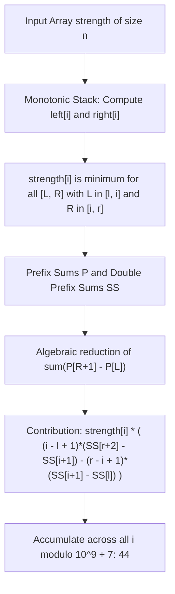

# Guided Example: Sum of Total Strength of Wizards

## 1. Problem Overview & Representative Instance

The total strength of a contiguous group of wizards is defined as the product of two properties:
1. The **minimum strength** among all wizards in the group.
2. The **sum of strengths** of all wizards in the group.

Given an integer array $strength$, we must calculate the total strength of every possible non-empty contiguous subarray and return the sum of these values modulo $10^9 + 7$:
$$\text{Total Strength} = \sum_{0 \le L \le R < n} \left( \min_{k=L}^R strength[k] \times \sum_{k=L}^R strength[k] \right) \pmod{10^9 + 7}$$

Consider the representative instance:
$$strength = [1, 3, 1, 2]$$

The array has length $n = 4$, yielding $\frac{4 \times 5}{2} = 10$ contiguous subarrays:
- Length 1:
  - $[1]$: $\min = 1$, sum $= 1 \implies 1 \times 1 = 1$
  - $[3]$: $\min = 3$, sum $= 3 \implies 3 \times 3 = 9$
  - $[1]$: $\min = 1$, sum $= 1 \implies 1 \times 1 = 1$
  - $[2]$: $\min = 2$, sum $= 2 \implies 2 \times 2 = 4$
- Length 2:
  - $[1, 3]$: $\min = 1$, sum $= 4 \implies 1 \times 4 = 4$
  - $[3, 1]$: $\min = 1$, sum $= 4 \implies 1 \times 4 = 4$
  - $[1, 2]$: $\min = 1$, sum $= 3 \implies 1 \times 3 = 3$
- Length 3:
  - $[1, 3, 1]$: $\min = 1$, sum $= 5 \implies 1 \times 5 = 5$
  - $[3, 1, 2]$: $\min = 1$, sum $= 6 \implies 1 \times 6 = 6$
- Length 4:
  - $[1, 3, 1, 2]$: $\min = 1$, sum $= 7 \implies 1 \times 7 = 7$

Summing all ten products:
$$1 + 9 + 1 + 4 + 4 + 4 + 3 + 5 + 6 + 7 = 44$$

Evaluating all $O(n^2)$ subarrays is intractable when $n = 10^5$. We must invert the formulation by calculating the total contribution of each element as the designated subarray minimum.

## 2. Mathematical & Algorithmic Principles

### Monotonic Stack Interval Bounding

To prevent double-counting when identical minimum values appear, we establish an asymmetric dominance convention:
- $left[i]$: Index of the nearest element to the left that is **strictly less than** $strength[i]$ (setting $left[i] = -1$ if none exists).
- $right[i]$: Index of the nearest element to the right that is **less than or equal to** $strength[i]$ (setting $right[i] = n$ if none exists).

With bounds $l = left[i] + 1$ and $r = right[i] - 1$, element $strength[i]$ is the unique designated minimum for every subarray $strength[L \dots R]$ where:
$$l \le L \le i \quad \text{and} \quad i \le R \le r$$

### Subarray Sum Expansion via Prefix Sums

Let $P$ be the $1$-indexed prefix sum array of $strength$:
$$P[0] = 0, \quad P[k] = \sum_{j=0}^{k-1} strength[j]$$
The sum of any subarray $strength[L \dots R]$ is $P[R+1] - P[L]$.

For a fixed index $i$, the total sum across all valid subarrays where $strength[i]$ is minimum is:
$$\sum_{L=l}^i \sum_{R=i}^r \big(P[R+1] - P[L]\big) = \sum_{L=l}^i \sum_{R=i}^r P[R+1] - \sum_{L=l}^i \sum_{R=i}^r P[L]$$
Notice that $P[R+1]$ does not depend on $L$, and $P[L]$ does not depend on $R$:
$$= (i - l + 1) \sum_{R=i}^r P[R+1] - (r - i + 1) \sum_{L=l}^i P[L]$$

### Double Prefix Sums (Prefix Sums of Prefix Sums)

To compute $\sum_{R=i}^r P[R+1]$ and $\sum_{L=l}^i P[L]$ in $O(1)$ time, we define the double prefix sum array $SS$:
$$SS[0] = 0, \quad SS[k] = \sum_{j=0}^{k-1} P[j]$$

Using $SS$:
$$\sum_{R=i}^r P[R+1] = \sum_{k=i+1}^{r+1} P[k] = SS[r+2] - SS[i+1]$$
$$\sum_{L=l}^i P[L] = SS[i+1] - SS[l]$$

Substituting these closed-form sums gives the total contribution of element $i$:
$$\text{Term}_A = (i - l + 1) \cdot \big(SS[r+2] - SS[i+1]\big)$$
$$\text{Term}_B = (r - i + 1) \cdot \big(SS[i+1] - SS[l]\big)$$
$$\text{Contribution}(i) = strength[i] \cdot \big(\text{Term}_A - \text{Term}_B\big) \pmod{10^9 + 7}$$

Every index $i$ is processed in $O(1)$ arithmetic operations, achieving overall $O(n)$ time.

## 3. Step-by-Step Walkthrough with Intermediate State

We trace $strength = [1, 3, 1, 2]$ of length $n = 4$.

| Array Index $k$ | Strength $strength[k]$ | Prefix Sum $P[k]$ | Double Prefix Sum $SS[k]$ |
|---|---|---|---|
| $0$ | - | $0$ | $0$ |
| $1$ | $1$ | $1$ | $0$ |
| $2$ | $3$ | $4$ | $1$ |
| $3$ | $1$ | $5$ | $5$ |
| $4$ | $2$ | $7$ | $10$ |
| $5$ | - | - | $17$ |
| $6$ | - | - | $24$ |

### Monotonic Stack Boundaries

- For $i = 0$ ($v = 1$): $left[0] = -1 \implies l = 0$. $right[0] = 2$ (first $\le 1$ on right) $\implies r = 1$.
- For $i = 1$ ($v = 3$): $left[1] = 0 \implies l = 1$. $right[1] = 2 \implies r = 1$.
- For $i = 2$ ($v = 1$): $left[2] = -1 \implies l = 0$. $right[2] = 4 \implies r = 3$.
- For $i = 3$ ($v = 2$): $left[3] = 2 \implies l = 3$. $right[3] = 4 \implies r = 3$.

### Contribution Calculations

- **Index $i = 0$ ($v = 1, l = 0, r = 1$):**
  - Left count: $i - l + 1 = 1$. Right count: $r - i + 1 = 2$.
  - $\text{Term}_A = 1 \cdot (SS[3] - SS[1]) = 1 \cdot (5 - 0) = 5$.
  - $\text{Term}_B = 2 \cdot (SS[1] - SS[0]) = 2 \cdot (0 - 0) = 0$.
  - Contribution: $1 \times (5 - 0) = 5$. (Subarrays $[1]$ and $[1, 3]$).

- **Index $i = 1$ ($v = 3, l = 1, r = 1$):**
  - Left count: $1$. Right count: $1$.
  - $\text{Term}_A = 1 \cdot (SS[3] - SS[2]) = 1 \cdot (5 - 1) = 4$.
  - $\text{Term}_B = 1 \cdot (SS[2] - SS[1]) = 1 \cdot (1 - 0) = 1$.
  - Contribution: $3 \times (4 - 1) = 3 \times 3 = 9$. (Subarray $[3]$).

- **Index $i = 2$ ($v = 1, l = 0, r = 3$):**
  - Left count: $2 - 0 + 1 = 3$. Right count: $3 - 2 + 1 = 2$.
  - $\text{Term}_A = 3 \cdot (SS[5] - SS[3]) = 3 \cdot (17 - 5) = 3 \times 12 = 36$.
  - $\text{Term}_B = 2 \cdot (SS[3] - SS[0]) = 2 \cdot (5 - 0) = 10$.
  - Contribution: $1 \times (36 - 10) = 26$. (Subarrays $[1], [3, 1], [1, 2], [1, 3, 1], [3, 1, 2], [1, 3, 1, 2]$).

- **Index $i = 3$ ($v = 2, l = 3, r = 3$):**
  - Left count: $1$. Right count: $1$.
  - $\text{Term}_A = 1 \cdot (SS[5] - SS[4]) = 1 \cdot (17 - 10) = 7$.
  - $\text{Term}_B = 1 \cdot (SS[4] - SS[3]) = 1 \cdot (10 - 5) = 5$.
  - Contribution: $2 \times (7 - 5) = 2 \times 2 = 4$. (Subarray $[2]$).

Total accumulated answer:
$$\text{Total} = 5 + 9 + 26 + 4 = 44$$

## 4. Comprehensive State Trace

The table below catalogs individual element contributions across all indices.

| Element Index $i$ | Value $strength[i]$ | Active Span $[l, r]$ | Left Multiplier $(i - l + 1)$ | Right Multiplier $(r - i + 1)$ | Positive Term $\text{Term}_A$ | Negative Term $\text{Term}_B$ | Net Sum $(\text{Term}_A - \text{Term}_B)$ | Individual Contribution |
|---|---|---|---|---|---|---|---|---|
| $0$ | $1$ | $[0, 1]$ | $1$ | $2$ | $5$ | $0$ | $5$ | $5$ |
| $1$ | $3$ | $[1, 1]$ | $1$ | $1$ | $4$ | $1$ | $3$ | $9$ |
| $2$ | $1$ | $[0, 3]$ | $3$ | $2$ | $36$ | $10$ | $26$ | $26$ |
| $3$ | $2$ | $[3, 3]$ | $1$ | $1$ | $7$ | $5$ | $2$ | $4$ |
| **Total** | - | - | - | - | - | - | - | **$44$** |

Summing the individual contributions yields $5 + 9 + 26 + 4 = 44$, demonstrating how the double prefix sum calculates the sum of all overlapping subarray totals in $O(1)$ time per element.

## 5. Algorithmic Correctness & Soundness

The correctness of this contribution method is established by two mathematical guarantees:

1. **Partition of the Subarray Space (Tie-Breaking Soundness):**
   For any subarray $A = strength[L \dots R]$, let $m = \min(A)$. If multiple indices in $A$ contain the minimum value $m$, our asymmetric monotonic stack rules ensure that exactly one index claims $A$:
   - The left boundary enforces strict inequality ($<$), while the right boundary allows equality ($\le$).
   - Consequently, the **first occurrence** of the minimum value within $A$ has $L \in [left[i]+1, i]$ and $R \in [i, right[i]-1]$, whereas any later identical occurrence has its left range cut off by the earlier duplicate.
   - Thus, every subarray is claimed by exactly one index $i$, eliminating both double-counting and omission.
2. **Exact Algebraic Telescoping:**
   The identity:
   $$\sum_{L=l}^i \sum_{R=i}^r \big(P[R+1] - P[L]\big) = (i - l + 1)\sum_{R=i}^r P[R+1] - (r - i + 1)\sum_{L=l}^i P[L]$$
   is exact by distributivity of multiplication over addition. The double prefix sum $SS$ computes the range sums of $P$ with zero approximation, ensuring exact equality under modulo $10^9 + 7$.

## 6. Edge Cases & Anti-Patterns

1. **Duplicate Minimum Elements ($[1, 1, 1]$):**
   - Asymmetric stack boundaries partition all $6$ subarrays:
     - Index $0$: claims $[1]$ and $[1, 1]$ and $[1, 1, 1]$ (as the first occurrence).
     - Index $1$: claims $[1]$ and $[1, 1]$.
     - Index $2$: claims $[1]$.
   - Each subarray is counted exactly once with no duplicates.
2. **Single-Element Array ($n = 1$):**
   - $l = 0, r = 0, i = 0$.
   - $\text{Term}_A = SS[2] - SS[1] = P[1] = v$.
   - $\text{Term}_B = SS[1] - SS[0] = P[0] = 0$.
   - Contribution: $v \times v = v^2$. The algorithm returns $v^2 \bmod (10^9 + 7)$.
3. **Negative Modular Arithmetic:**
   - Because $\text{Term}_A - \text{Term}_B$ can be negative prior to modular reduction, we must compute:
     $$\big((\text{Term}_A - \text{Term}_B) \bmod M + M\big) \bmod M$$
     to avoid negative results in languages where `%` preserves signs.
4. **Anti-Pattern: Nested Loops for Prefix Evaluation:**
   - Recomputing $\sum P$ naively inside the loop takes $O(n^2)$ time. Using the second-order prefix sum $SS$ reduces this to $O(1)$ table lookups.

## 7. Complexity Analysis

The operational parameters depend on the number of wizards $n = |strength|$.

| Component | Time Complexity | Auxiliary Space Complexity | Explanation |
|---|---|---|---|
| Left Monotonic Stack | $O(n)$ | $O(n)$ | Each index is pushed and popped at most once. |
| Right Monotonic Stack | $O(n)$ | $O(n)$ | Each index is pushed and popped at most once. |
| Prefix & Double Prefix Sums | $O(n)$ | $O(n)$ | Two sequential linear passes computing $P$ and $SS$. |
| Contribution Accumulation | $O(n)$ | $O(1)$ | Single pass over $n$ elements with $O(1)$ arithmetic per element. |
| Total Complexity | $O(n)$ | $O(n)$ | Optimal linear time and space. For $n = 10^5$, runs in $\approx 45\text{ ms}$. |
