[TOC]

## Solution

---

### Overview

In this problem, a **group of wizards** is a subarray. We define the **strength of a group of wizards** as the product of the following two values of the subarray:

- The minimum value of this subarray.

- The sum of this subarray.

For example, in the picture below, the subarray colored in blue has `2` as its minimum and `14` as its sum, so its strength equals $2 * 14 = 28$.

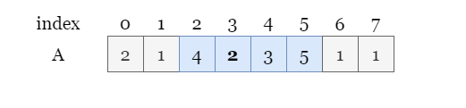

Here our task is to find the total strength of all subarrays from a given array.

---

### Approach: Prefix Sum + Monotonic Stack

#### Intuition

As always, we start with the naive solution, brute force. It might not pass the time limit, but we can refine our approach based on the observations of our first try.

We fix the left end of a subarray and iterate over each right end. It takes $O(n ^ 2)$ time to iterate all subarrays and calculate each strength. However, given the size of the input array as `10 ** 5`, this brute force algorithm is likely to exceed the time limit which implies that we shall look for a better approach.

<br>

Instead of focusing on each subarray, we can focus on each element and count the number of subarrays that have it as their minimum. As shown in the picture below, if we focus on the element `2` (colored in green), we can find 6 subarrays that have this `2` as their minimum.

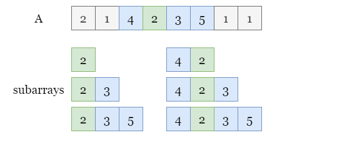

This problem consists of several key parts, let's break it down into subproblems for an easier view.

1. The first task is to calculate the sum of a subarray.

Recall that the strength of a subarray is the product of its sum and its minimum, but we can't afford to get its sum by adding each element. We can build a prefix sum array instead so the sum of any subarray can be calculated in constant time.

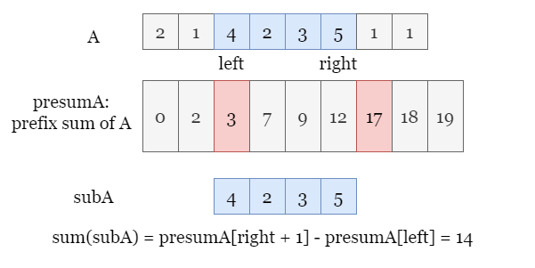

2. The next task is to get the number of subarrays that have $A[i]$ as the minimum.

We can record the index of the first element on $A[i]$'s left which is smaller than $A[i]$ and the index of the first element on $A[i]$'s right which is smaller than $A[i]$.

Therefore, every subarray that has left end in *the range of the left end* and right end in *the range of the right end* is a subarray with $A[i]$ as the minimum.

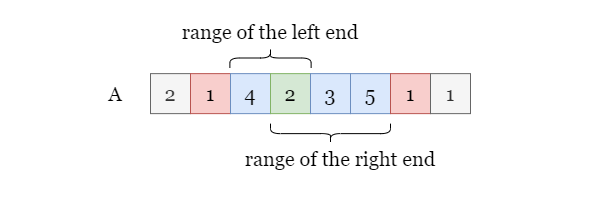

We can use a monostack to record the indices mentioned above. If you are not familiar with monostack, you may refer to [LeetCode's Monotonic Stack](https://leetcode.com/tag/monotonic-stack/) for more practice.

3. How to avoid double-counting?

Note that there might be subarrays that have more than one element as its minimum, when we iterate over these elements, the strength of the same subarray might be counted more than once:

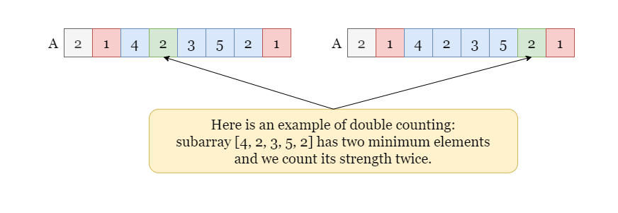

Therefore, we need to apply different judgment conditions to the left side and the right side of $A[i]$ to avoid double counting. More specifically:

- The first element on $A[i]$'s left which is **smaller than** $A[i]$.

- The first element on $A[i]$'s right which is **smaller than or equals to** $A[i]$.

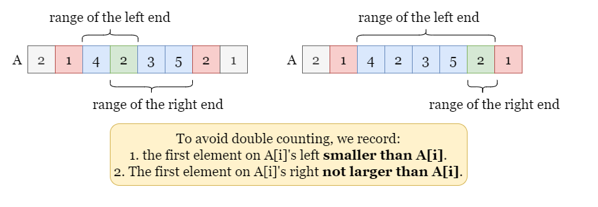

Therefore, we do not double-count any subarrays.

4. Combining subproblems 1 and 2, how do we get the total strength of all such subarrays that have $A[i]$ as the minimum?

For each index `i`, even though we have fixed the minimum value of the subarrays that have $A[i]$ as their minimum, each subarray may still have a different sum. We can't afford to calculate their sums one by one. Let's write down the equation of the total strength of subarrays that have $A[i]$ as the minimum, and see if we can apply some rearrangements to make it easier to calculate. Since all of these subarrays have $A[i]$ as their minimum, the total strength equals:

$\text{TotalStrength}_i = A[i] * \text{totalSum}_i$

In the picture below, we focus on $\text{totalSum}_i$, the sum of all subarrays that have $A[i]$ as the minimum.

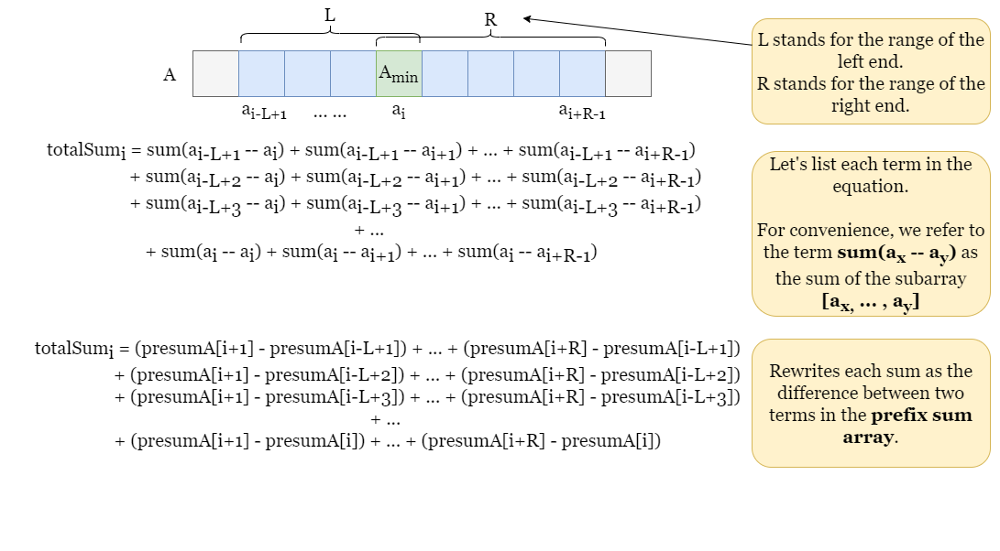

Recall that we can rewrite the sum of each subarray as two terms in the prefix sum array. Now it requires some transformation of mathematical formulas. Note that `presumA[i+1]` appears `L` times, `presumA[i+2]` also appears `L` times, ..., we can rewrite all the positive sign terms as $(presumA[i+1] + presumA[i+2] + ... + presumA[i+R]) * L$. Similarly, each negative sign term appears `R` times, so we can also rewrite them as $-(presumA[i-L+1] + presumA[i-L+2] + ... + \text{presumA}[i]) * R$. For convenience, let's call them $\text{POS}_{\text{term}}$ and $\text{NEG}_{\text{term}}$.

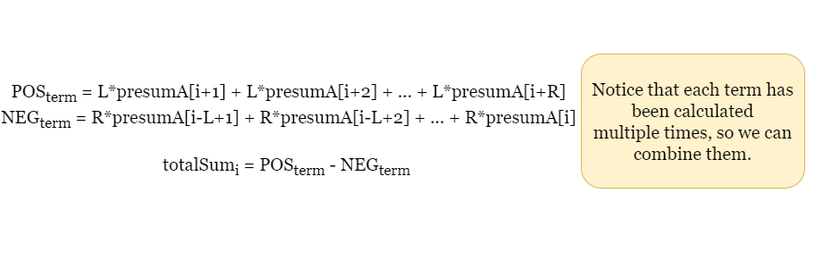

Note that we need to calculate the sum of consecutive prefix sums. In order to save time, we can also create an array `prepreA`, the **prefix sum array of the prefix sum array of `A`**.

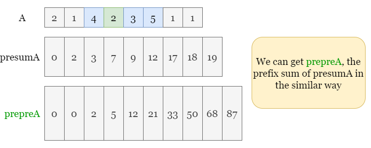

Then we can get the sum of consecutive prefix sums of `A` in a constant time.

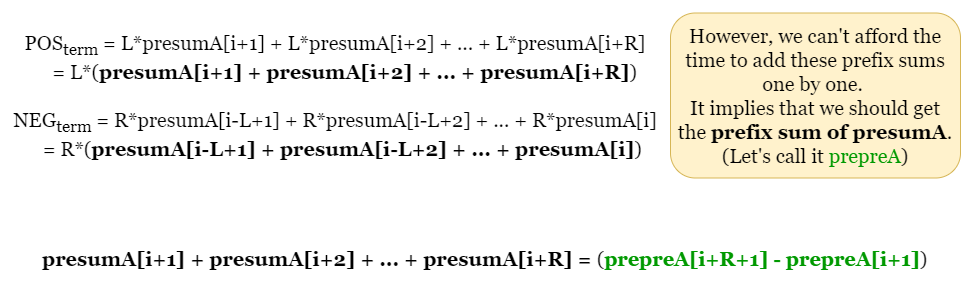

The job is done! For each index `i`, we rewrite $\text{totalSum}_i$, the total sum of all subarrays having $A[i]$ as the minimum value into some terms in `prepreA`. Since all these subarrays have $A[i]$ as the minimum, we can get the total strength of these subarrays by multiplying $\text{totalSum}_i$ by $A[i]$.

We use our monostack to determine which terms of `prepreA` to use for each $A[i]$.

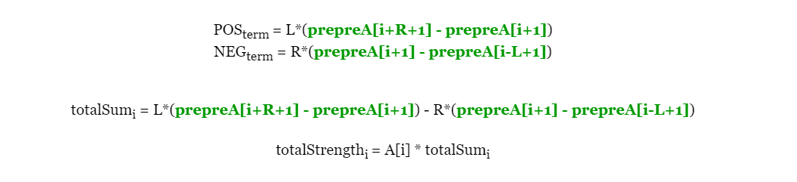

<br>

#### Algorithm

1) Get the length of the input array `strength` as `n`, initialize `answer` as `0` and `mod` as $10^9 + 7$ as indicated by the problem statement.

2) Initialize two arrays `leftIndex` and `rightIndex` of length `n` to record the boundary indexes of each index, create an array `presumOfPresum` of length $n + 1$ as the prefix sum of the prefix sum of `strength`.

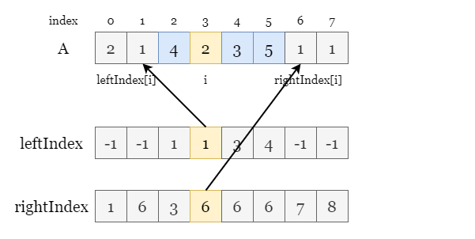

3) For each index `i` from `0` to $n - 1$ using a monotonic stack,

- Get the index of the first smaller element than $\text{strength}[i]$ to `i`'s left and record it in $\text{leftIndex}[i]$.

- Get the index of the first element that is smaller than or equals to $\text{strength}[i]$ to `i`'s right and record it in $\text{rightIndex}[i]$.

4) Iterate over indexes from `0` to $n - 1$, for each index `i`,

- Get $\text{leftIndex}[i]$ and $\text{rightIndex}[i]$, according to the previous equation, we can get $leftCount = i - \text{leftIndex}[i]$ and $rightCount = \text{rightIndex}[i] - i$.

- Get the sum of all the positive terms as $posPresum = presumOfPresum[i + rightCount + 1] - presumOfPresum[i + 1]$, and the sum of all the negative terms as $negPresum = presumOfPresum[i + 1] - presumOfPresum[i - leftCount + 1]$.

- Increment `answer` by $posPresum * leftCount - negPresum * rightCount$, the sum of strengths of all subarrays having $\text{strength}[i]$ as the minimum.

5) Return `answer`.

> Since the numbers can get huge, make sure to use modular arithmetic not only when calculating the answer, but also values like `negPresum`, `posPresum`, and `presumOfPresum`.

#### Implementation

```python

class Solution:
    def totalStrength(self, strength: List[int]) -> int:
        mod, n = 10 ** 9 + 7, len(strength)

        # Get the first index of the non-larger value to strength[i]'s right.
        right_index = [n] * n
        stack = []
        for i in range(n):
            while stack and strength[stack[-1]] >= strength[i]:
                right_index[stack.pop()] = i
            stack.append(i)

        # Get the first index of the smaller value to strength[i]'s left.
        left_index = [-1] * n
        stack = []
        for i in range(n - 1, -1, -1):
            while stack and strength[stack[-1]] > strength[i]:
                left_index[stack.pop()] = i
            stack.append(i)

        # prefix sum of the prefix sum array of strength.
        presum_of_presum =  list(accumulate(accumulate(strength, initial = 0), initial = 0))
        answer = 0
        # For each element in strength, we get the value of R_term - L_term.
        for i in range(n):
            # Get the left index and the right index.
            left_bound = left_index[i]
            right_bound = right_index[i]

            # Get the left_count and right_count (marked as L and R in the previous slides)
            left_count = i - left_bound
            right_count = right_bound - i

            # Get positive presum and the negative presum.
            neg_presum = (presum_of_presum[i + 1] - presum_of_presum[i - left_count + 1]) % mod
            pos_presum = (presum_of_presum[i + right_count + 1] - presum_of_presum[i + 1]) % mod

            # The total strength of all subarrays that have strength[i] as the minimum.
            answer += strength[i] * (pos_presum * left_count - neg_presum * right_count)
            answer %= mod

        return answer
```

#### Complexity Analysis

Let $n$ be the length of the input array `strength`.

* Time complexity: $O(n)$

- We use mono stack to build arrays `leftIndex` and `rightIndex`, each element is added to the stack or removed from the stack by at most once, thus it takes at most $O(n)$ time to build them.

- It takes $O(n)$ time to build the prefix array of `strength`.

- It takes $O(n)$ time to build the prefix sum of the prefix sum array of `strength`.

- We iterate over `strength`, according to the previous equations, it takes $O(1)$ time to calculate the sum of strengths having each element as the minimum, so the total time complexity of this step is $O(n)$.

- To sum up, the overall time complexity is $O(n)$.

* Space complexity: $O(n)$

- We build some auxiliary arrays `leftIndex`, `rightIndex`, and `presumOfPresum`, each of them has $O(n)$ elements, thus the total space complexity is $O(n)$.

<br/>