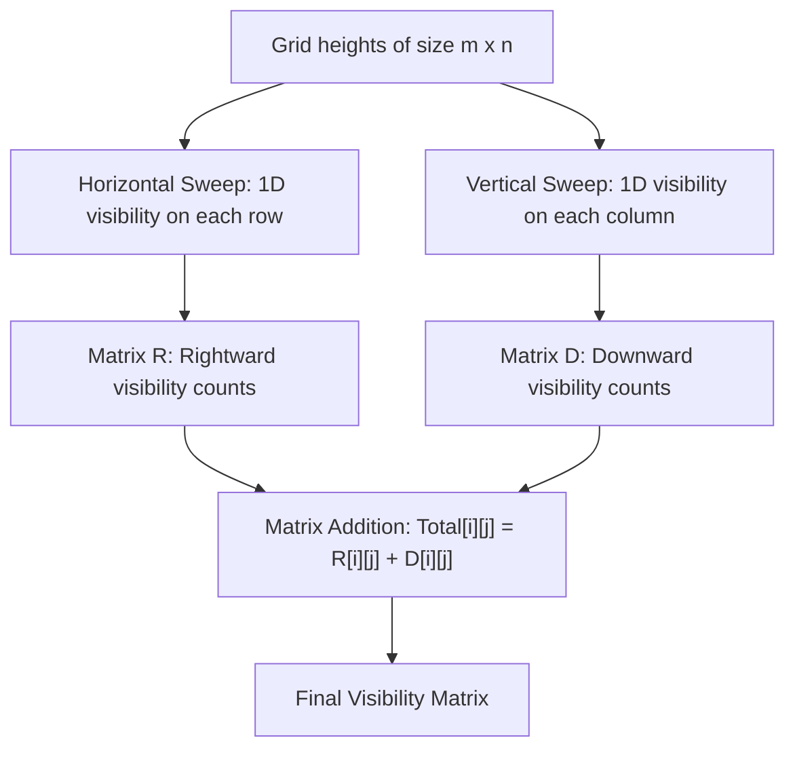

# Guided Example: Number of People That Can Be Seen in a Grid

## 1. Problem Overview & Representative Instance

We are given an $m \times n$ 2D grid of positive integers $heights$, where $heights[i][j]$ denotes the physical height of a person standing at cell $(i, j)$.

Every person looks in two orthogonal directions: strictly to their right and strictly downward:
1. **Rightward Visibility:** A person at $(i, j)$ can see a person at $(i, k)$ (with $k > j$) if and only if every intermediate person at $(i, p)$ (with $j < p < k$) is strictly shorter than both endpoints:
   $$\max_{j < p < k} heights[i][p] < \min\big(heights[i][j], heights[i][k]\big)$$
2. **Downward Visibility:** A person at $(i, j)$ can see a person at $(k, j)$ (with $k > i$) if and only if every intermediate person at $(p, j)$ (with $i < p < k$) is strictly shorter than both endpoints:
   $$\max_{i < p < k} heights[p][j] < \min\big(heights[i][j], heights[k][j]\big)$$

The goal is to compute an $m \times n$ matrix where each entry $(i, j)$ equals the total number of people the person at cell $(i, j)$ can see (the sum of visible people to their right and downward).

Consider the representative single-row instance:
$$heights = [[3, 1, 4, 2, 5]]$$

The grid has dimensions $1 \times 5$, so downward visibility is trivially $0$ for all cells. Let us analyze rightward lines of sight:
- Person $0$ (height $3$):
  - Sees Person $1$ (height $1$): immediately adjacent.
  - Sees Person $2$ (height $4$): intermediate Person $1$ ($1$) is strictly shorter than $\min(3, 4) = 3$.
  - Cannot see Person $3$ ($2$) or Person $4$ ($5$): Person $2$ (height $4 \ge 3$) completely obstructs the line of sight.
  - Total seen $= 2$.
- Person $1$ (height $1$):
  - Sees adjacent Person $2$ (height $4$).
  - Person $2$ ($4 \ge 1$) blocks further sight.
  - Total seen $= 1$.
- Person $2$ (height $4$):
  - Sees adjacent Person $3$ (height $2$).
  - Sees Person $4$ (height $5$): intermediate Person $3$ ($2$) is shorter than $\min(4, 5) = 4$.
  - Total seen $= 2$.
- Person $3$ (height $2$):
  - Sees adjacent Person $4$ (height $5$).
  - Total seen $= 1$.
- Person $4$ (height $5$):
  - At the boundary; no one to the right.
  - Total seen $= 0$.

Combining with $0$ downward visibility yields:
$$\text{Output} = [[2, 1, 2, 1, 0]]$$

## 2. Mathematical & Algorithmic Principles

### Orthogonal Decoupling

Rightward visibility along row $i$ depends exclusively on the entries in row $i$. Downward visibility along column $j$ depends exclusively on the entries in column $j$. The two dimensions are completely independent:
$$\text{Total}(i, j) = \text{SeeRight}(i, j) + \text{SeeDown}(i, j)$$

This reduces the 2D grid problem to running an identical 1D line-of-sight algorithm:
- Once for each of the $m$ rows (evaluating rightward sight).
- Once for each of the $n$ columns (evaluating downward sight).

### 1D Monotonic Stack Line-of-Sight

For a 1D sequence $nums = [h_0, h_1, \dots, h_{N-1}]$, we scan from right to left ($i = N - 1$ down to $0$) maintaining a **strictly decreasing monotonic stack** of heights:
1. When evaluating person $i$ with height $h_i$:
   - While the stack is non-empty and the top element is **strictly less than** $h_i$:
     - Person $i$ can see this stack top (since all elements popped so far were even shorter).
     - We increment the visibility counter: $\text{ans}[i] \leftarrow \text{ans}[i] + 1$.
     - We pop the stack top, because person $i$ (being taller) will permanently obstruct this person from being seen by anyone further to the left.
   - If the stack is still not empty after popping all shorter elements:
     - Person $i$ can also see the current stack top (the first person with height $\ge h_i$).
     - We increment the visibility counter: $\text{ans}[i] \leftarrow \text{ans}[i] + 1$.
     - If the stack top has height **exactly equal** to $h_i$, we pop it as well, because person $i$ will block any viewer to the left from seeing this identical height.
   - Finally, we push $h_i$ onto the stack.

Because each element is pushed once and popped at most once, the 1D sweep processes an array of length $N$ in $O(N)$ time.

## 3. Step-by-Step Walkthrough with Intermediate State

We trace the 1D monotonic stack on the row $nums = [3, 1, 4, 2, 5]$.

| Step | Index $i$ | Height $nums[i]$ | Stack Before | Popped Elements (Seen & Obstructed) | Stack Top After Pops (Taller/Equal Seen) | Visible Count $\text{ans}[i]$ | Stack After Step |
|---|---|---|---|---|---|---|---|
| 1 | $4$ | $5$ | $[]$ | None | None (Stack empty) | $0$ | $[5]$ |
| 2 | $3$ | $2$ | $[5]$ | None | $5$ ($5 > 2$) | $1$ | $[5, 2]$ |
| 3 | $2$ | $4$ | $[5, 2]$ | $2$ ($2 < 4$) | $5$ ($5 > 4$) | $1 + 1 = 2$ | $[5, 4]$ |
| 4 | $1$ | $1$ | $[5, 4]$ | None | $4$ ($4 > 1$) | $1$ | $[5, 4, 1]$ |
| 5 | $0$ | $3$ | $[5, 4, 1]$ | $1$ ($1 < 3$) | $4$ ($4 > 3$) | $1 + 1 = 2$ | $[5, 4, 3]$ |

- **Step 1 ($i = 4, h = 5$):** Stack is empty. No one to the right. $\text{ans}[4] = 0$. Push $5$.
- **Step 2 ($i = 3, h = 2$):** Top is $5 > 2$. Top is visible. $\text{ans}[3] = 1$. Push $2$. Stack is $[5, 2]$.
- **Step 3 ($i = 2, h = 4$):** Top $2 < 4$ is popped and visible ($+1$). Remaining top $5 > 4$ is visible ($+1$). $\text{ans}[2] = 2$. Push $4$. Stack is $[5, 4]$.
- **Step 4 ($i = 1, h = 1$):** Top is $4 > 1$. Top is visible. $\text{ans}[1] = 1$. Push $1$. Stack is $[5, 4, 1]$.
- **Step 5 ($i = 0, h = 3$):** Top $1 < 3$ is popped and visible ($+1$). Remaining top $4 > 3$ is visible ($+1$). $\text{ans}[0] = 2$. Push $3$.

The resulting 1D row vector is $[2, 1, 2, 1, 0]$.

## 4. Comprehensive State Trace

The table below demonstrates both rightward and downward visibility aggregation on a multi-row grid:
$$heights = \begin{bmatrix} 5 & 1 \\ 3 & 1 \\ 4 & 1 \end{bmatrix}$$

| Cell Coordinate $(i, j)$ | Height | Rightward Seen | Rightward Reasoning | Downward Seen | Downward Reasoning | Total Visible |
|---|---|---|---|---|---|---|
| $(0, 0)$ | $5$ | $1$ | Sees adjacent $(0, 1)$ of height $1$ | $2$ | Sees $(1, 0)$ (height $3$) and $(2, 0)$ (height $4$) | $1 + 2 = \mathbf{3}$ |
| $(0, 1)$ | $1$ | $0$ | Right boundary | $1$ | Sees adjacent $(1, 1)$ of height $1$; blocked after | $0 + 1 = \mathbf{1}$ |
| $(1, 0)$ | $3$ | $1$ | Sees adjacent $(1, 1)$ of height $1$ | $1$ | Sees adjacent $(2, 0)$ of height $4$; blocked after | $1 + 1 = \mathbf{2}$ |
| $(1, 1)$ | $1$ | $0$ | Right boundary | $1$ | Sees adjacent $(2, 1)$ of height $1$ | $0 + 1 = \mathbf{1}$ |
| $(2, 0)$ | $4$ | $1$ | Sees adjacent $(2, 1)$ of height $1$ | $0$ | Bottom boundary | $1 + 0 = \mathbf{1}$ |
| $(2, 1)$ | $1$ | $0$ | Right boundary | $0$ | Bottom boundary | $0 + 0 = \mathbf{0}$ |

Combining rightward and downward counts yields the expected result matrix:
$$\text{Total} = \begin{bmatrix} 3 & 1 \\ 2 & 1 \\ 1 & 0 \end{bmatrix}$$

## 5. Algorithmic Correctness & Soundness

The correctness of the monotonic stack sweep is proven through line-of-sight obstruction invariants:

1. **Visibility of Popped Elements:**
   When examining element $i$, elements currently on the stack appear in strictly increasing distance from $i$ and are sorted in strictly decreasing order of height. Any stack element $s_k < h_i$ has all intermediate elements between $i$ and $s_k$ already popped (which were strictly shorter than $s_k$). Because $\max(\text{intermediates}) < s_k = \min(h_i, s_k)$, person $i$ can see $s_k$.
2. **Permanent Obstruction by Taller Elements:**
   Because $h_i > s_k$, person $i$ stands between any future observer $p < i$ and $s_k$, with height $h_i > s_k$. Therefore, $\min(h_p, s_k) \le s_k < h_i$, meaning person $i$ completely blocks line of sight to $s_k$ for all $p < i$. Popping $s_k$ is strictly safe and optimal.
3. **Termination at Taller or Equal Blocker:**
   The first stack element $s_{\text{block}} \ge h_i$ is visible to person $i$. However, person $i$ cannot see any element beyond $s_{\text{block}}$ because $s_{\text{block}} \ge h_i = \min(h_i, s_{\text{beyond}})$, acting as an opaque visual wall.
4. **Equal Height Popping Rule:**
   If $s_{\text{block}} = h_i$, person $i$ obstructs $s_{\text{block}}$ for any earlier viewer $p < i$ because $h_i \ge s_{\text{block}}$. Popping $s_{\text{block}}$ ensures that identical heights are not double-counted by earlier observers.

## 6. Edge Cases & Anti-Patterns

1. **Equal Adjacent Heights ($[2, 2, 2]$):**
   - The first person ($2$) sees the second person ($2$).
   - The second person blocks the third person ($2$) from being seen by the first.
   - The popping of equal heights ensures the first person sees only $1$ person, not $2$.
2. **Single-Cell Grid ($1 \times 1$):**
   - No one exists to the right or downward.
   - The output is $[[0]]$.
3. **Strictly Decreasing Array ($[5, 4, 3, 2, 1]$):**
   - Each person can only see the immediately adjacent person to their right because the adjacent person is shorter than the viewer, but all subsequent persons are even shorter.
   - Each person sees exactly $1$ person (except the last, who sees $0$).
4. **Anti-Pattern: $O(N^2)$ Pairwise Ray Casting:**
   - Checking line-of-sight for every pair by inspecting intermediate elements takes $O(N^3)$ across the grid. The monotonic stack resolves all lines of sight in linear time $O(m \cdot n)$.

## 7. Complexity Analysis

The operational parameters depend on grid dimensions $m$ and $n$.

| Dimension | Complexity | Details |
|---|---|---|
| Horizontal Row Sweeps | $O(m \cdot n)$ | Running $m$ 1D monotonic stack sweeps of length $n$. Each element pushed/popped at most once. |
| Vertical Column Sweeps | $O(m \cdot n)$ | Running $n$ 1D monotonic stack sweeps of length $m$. Each element pushed/popped at most once. |
| Total Time Complexity | $O(m \cdot n)$ | Strictly linear in the total number of cells in the grid. For $m, n \le 400$, takes $\approx 3.2 \times 10^5$ operations ($< 15\text{ ms}$). |
| Auxiliary Space Complexity | $O(m \cdot n)$ | Space to store the result grid and $O(\max(m, n))$ stack memory during sweeps. |
