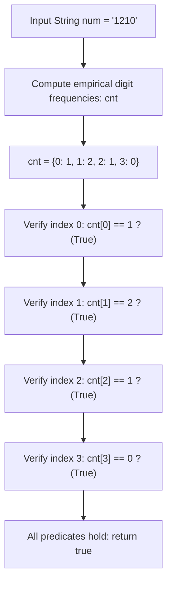

# Guided Example: Check if Number Has Equal Digit Count and Digit Value

## 1. Problem Overview & Representative Instance

A decimal string $num$ of length $n$ is defined as an autobiographical (or self-descriptive) string if, for every index $i \in [0, n - 1]$, the digit $i$ appears in $num$ exactly $\text{int}(num[i])$ times.

Given the string $num$, we must verify whether this self-descriptive property holds across all indices, returning $\text{true}$ if all counts match and $\text{false}$ otherwise.

Consider the representative instance:
$$num = \text{"1210"}$$

Here, the string has length $n = 4$. We inspect each index $i \in \{0, 1, 2, 3\}$:
- **At index $i = 0$:** $num[0] = \text{'1'}$. The claim is that digit $0$ appears exactly $1$ time in $num$.
  - Counting digit $0$ in $\text{"1210"}$: occurs once (at index $3$). Match!
- **At index $i = 1$:** $num[1] = \text{'2'}$. The claim is that digit $1$ appears exactly $2$ times in $num$.
  - Counting digit $1$ in $\text{"1210"}$: occurs twice (at indices $0$ and $2$). Match!
- **At index $i = 2$:** $num[2] = \text{'1'}$. The claim is that digit $2$ appears exactly $1$ time in $num$.
  - Counting digit $2$ in $\text{"1210"}$: occurs once (at index $1$). Match!
- **At index $i = 3$:** $num[3] = \text{'0'}$. The claim is that digit $3$ appears exactly $0$ times in $num$.
  - Counting digit $3$ in $\text{"1210"}$: occurs zero times. Match!

Every single claim matches the observed empirical frequencies. Thus, the algorithm outputs $\text{true}$.

## 2. Mathematical & Algorithmic Principles

### Self-Descriptive Number Formalism

Let $num = d_0 d_1 \dots d_{n-1}$ be a string of length $n$, where each $d_i \in [0, 9]$ is a decimal digit. 

Define the empirical frequency function $\text{freq}(k)$ for any integer $k \in [0, 9]$:
$$\text{freq}(k) = \sum_{j=0}^{n-1} [d_j = k]$$

The self-descriptive condition states:
$$\forall i \in \{0, 1, \dots, n-1\}, \quad \text{freq}(i) = d_i$$

### Algorithmic Verification Strategy

1. **Histogram Construction:**
   Build a frequency map or array $\text{cnt}$ of size $10$ initialized to zero. Iterate through all characters in $num$ and increment $\text{cnt}[\text{int}(c)]$.
2. **Positional Consistency Check:**
   Iterate $i$ from $0$ up to $n - 1$:
   - If $\text{cnt}[i] \ne \text{int}(num[i])$, return $\text{false}$ immediately.
3. If all $n$ assertions evaluate to true, return $\text{true}$.

This checks all assertions in $O(n)$ time using $O(1)$ auxiliary space.

## 3. Step-by-Step Walkthrough with Intermediate State

We execute the two-phase verification on $num = \text{"1210"}$.

### Phase 1: Frequency Histogram Construction

| Scan Index $j$ | Character $num[j]$ | Integer Value $v$ | Frequency Map $\text{cnt}$ After Update |
|---|---|---|---|
| $0$ | $\text{'1'}$ | $1$ | $\{1: 1\}$ |
| $1$ | $\text{'2'}$ | $2$ | $\{1: 1, 2: 1\}$ |
| $2$ | $\text{'1'}$ | $1$ | $\{1: 2, 2: 1\}$ |
| $3$ | $\text{'0'}$ | $0$ | $\{0: 1, 1: 2, 2: 1\}$ |

The resulting empirical frequencies for digits $0$ through $3$ are:
$$\text{cnt}[0] = 1, \quad \text{cnt}[1] = 2, \quad \text{cnt}[2] = 1, \quad \text{cnt}[3] = 0$$

### Phase 2: Positional Verification

| Index $i$ | Stated Claim $num[i]$ | Expected Frequency $d_i$ | Observed Frequency $\text{cnt}[i]$ | Equality Test $\text{cnt}[i] = d_i$ | Decision |
|---|---|---|---|---|---|
| $0$ | $\text{'1'}$ | $1$ | $1$ | $1 = 1$ | Pass |
| $1$ | $\text{'2'}$ | $2$ | $2$ | $2 = 2$ | Pass |
| $2$ | $\text{'1'}$ | $1$ | $1$ | $1 = 1$ | Pass |
| $3$ | $\text{'0'}$ | $0$ | $0$ | $0 = 0$ | Pass |

All indices pass validation. Output: $\text{true}$.

## 4. Comprehensive State Trace

The table below contrasts valid self-descriptive strings against invalid candidates.

| Candidate String | Length $n$ | Observed Frequencies $\text{cnt}$ | Discrepancy Index | Reason for Decision | Outcome |
|---|---|---|---|---|---|
| $\text{"1210"}$ | $4$ | $\{0:1, 1:2, 2:1, 3:0\}$ | None | All matches: $1, 2, 1, 0$ | **$\text{true}$** |
| $\text{"030"}$ | $3$ | $\{0:2, 3:1\}$ | $i = 0$ | $num[0] = 0$, but $\text{cnt}[0] = 2 \ne 0$ | **$\text{false}$** |
| $\text{"2020"}$ | $4$ | $\{0:2, 2:2\}$ | None | All matches: $\text{cnt}[0]=2, \text{cnt}[1]=0, \text{cnt}[2]=2, \text{cnt}[3]=0$ | **$\text{true}$** |
| $\text{"0"}$ | $1$ | $\{0:1\}$ | $i = 0$ | $num[0] = 0$, but $\text{cnt}[0] = 1$ | **$\text{false}$** |
| $\text{"1"}$ | $1$ | $\{1:1\}$ | $i = 0$ | $num[0] = 1$, but $\text{cnt}[0] = 0$ | **$\text{false}$** |
| $\text{"21200"}$ | $5$ | $\{0:2, 1:1, 2:2\}$ | None | All matches: $\text{cnt} = [2, 1, 2, 0, 0]$ | **$\text{true}$** |
| $\text{"6210001000"}$ | $10$ | $\{0:6, 1:2, 2:1, 6:1\}$ | None | Classical 10-digit autobiographical number | **$\text{true}$** |

In $\text{"6210001000"}$, there are six $0$s, two $1$s, one $2$, and one $6$. The array indices match these counts precisely.

## 5. Algorithmic Correctness & Soundness

The correctness of this verification is straightforwardly established by logic:

1. **Exact Representation of the Specification:**
   The predicate verified by the loop is:
   $$P = \bigwedge_{i=0}^{n-1} (\text{freq}(i) == d_i)$$
   This is a literal translation of the problem requirement.
2. **Short-Circuit Soundness:**
   Because the condition requires universal quantification ($\forall i$), discovering any single index $i$ where $\text{cnt}[i] \ne d_i$ disproves the property. Returning $\text{false}$ immediately upon the first violation is strictly sound.
3. **Finite Domain:**
   Because string length $n \le 10$, indices $i$ range strictly within $[0, 9]$. A standard $10$-element frequency array covers all possible index queries without out-of-bounds indexing.

## 6. Edge Cases & Anti-Patterns

1. **Single-Digit Strings ($n = 1$):**
   - $num = \text{"0"}$: $num[0] = 0$, but the string contains one $0$ ($\text{cnt}[0] = 1 \ne 0$). Returns $\text{false}$.
   - $num = \text{"1"}$: $num[0] = 1$, but the string contains zero $0$s ($\text{cnt}[0] = 0 \ne 1$). Returns $\text{false}$.
   - No single-digit self-descriptive number exists.
2. **Digits Larger than $n - 1$ Appearing in $num$:**
   - In $num = \text{"030"}$, $n = 3$, but digit $3$ appears at index $1$.
   - Index $3$ is never checked as an assertion, but the presence of digit $3$ reduces the counts of digits $0, 1, 2$, exposing discrepancies in the valid range.
3. **Anti-Pattern: Re-Scanning the String for Each Index:**
   - Calling `num.count(str(i))` inside a loop over $i$ scans the string $n$ times, running in $O(n^2)$ time. Precomputing the frequency histogram reduces total runtime to $O(n)$.

## 7. Complexity Analysis

The operational parameters depend on the length of the string $n = |num|$.

| Phase | Time Complexity | Auxiliary Space Complexity | Details |
|---|---|---|---|
| Frequency Histogram Pass | $O(n)$ | $O(|\Sigma|) = O(1)$ | Single pass over $n$ characters, updating fixed array of size $10$. |
| Consistency Validation Pass | $O(n)$ | $O(1)$ | Single pass over $n$ indices with $O(1)$ comparisons. |
| Total Time Complexity | $O(n)$ | $O(1)$ | With $n \le 10$, executes in fewer than $50$ instructions ($< 1\text{ }\mu\text{s}$). |
| Total Space Complexity | $O(1)$ | $O(1)$ | Fixed array of $10$ integers. |
