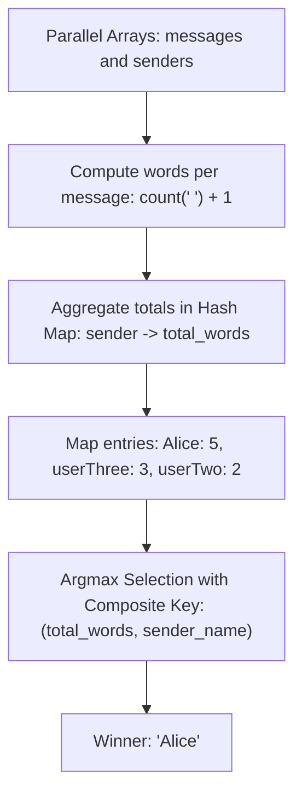

# Guided Example: Sender With Largest Word Count

## 1. Problem Overview & Representative Instance

We are given two parallel arrays of strings, $messages$ and $senders$, where $messages[i]$ is a text message sent by person $senders[i]$. Each message consists of words separated by single spaces, without leading or trailing spaces. The word count of a message is defined as the number of words it contains.

Our goal is to identify the sender with the largest total cumulative word count across all their sent messages. If multiple senders achieve the exact same maximum word count, we must break the tie by returning the sender whose name is **lexicographically largest** under standard ASCII ordering.

Consider the representative instance:
$$messages = [\text{"Hello userTwooo"}, \text{"Hi userThree"}, \text{"Wonderful day Alice"}, \text{"Nice day userThree"}]$$
$$senders = [\text{"Alice"}, \text{"userTwo"}, \text{"userThree"}, \text{"Alice"}]$$

Let us analyze each message and sender pair:
1. Message $0$: $\text{"Hello userTwooo"}$ sent by $\text{"Alice"}$
   - Words: $2$ words ($\text{"Hello"}$, $\text{"userTwooo"}$).
   - $\text{"Alice"}$ cumulative words $= 2$.
2. Message $1$: $\text{"Hi userThree"}$ sent by $\text{"userTwo"}$
   - Words: $2$ words ($\text{"Hi"}$, $\text{"userThree"}$).
   - $\text{"userTwo"}$ cumulative words $= 2$.
3. Message $2$: $\text{"Wonderful day Alice"}$ sent by $\text{"userThree"}$
   - Words: $3$ words ($\text{"Wonderful"}$, $\text{"day"}$, $\text{"Alice"}$).
   - $\text{"userThree"}$ cumulative words $= 3$.
4. Message $3$: $\text{"Nice day userThree"}$ sent by $\text{"Alice"}$
   - Words: $3$ words ($\text{"Nice"}$, $\text{"day"}$, $\text{"userThree"}$).
   - $\text{"Alice"}$ cumulative words $= 2 + 3 = 5$.

Summary of totals:
- $\text{"Alice"}$: $5$ words
- $\text{"userThree"}$: $3$ words
- $\text{"userTwo"}$: $2$ words

The maximum word count is $5$, uniquely attained by $\text{"Alice"}$. Thus, the return value is $\text{"Alice"}$.

## 2. Mathematical & Algorithmic Principles

### Linear Word Count via Separator Invariant

Because words in each message are separated strictly by single spaces with no extraneous whitespace:
$$\text{words}(M) = \text{occurrences}(M, \text{' '}) + 1$$

Counting the number of spaces in string $M$ avoids allocating intermediate word arrays or performing string split operations, processing each message in a single linear character pass.

### Composite Metric Maximization

Let $\mathcal{S}$ be the set of unique senders. For each $s \in \mathcal{S}$, let $W(s)$ denote the total word count:
$$W(s) = \sum_{i \in \text{Indices}(s)} \big(\text{spaces}(messages[i]) + 1\big)$$

The selection objective is defined by a lexicographically augmented total order $\succ$ on tuples:
$$(W(s_1), s_1) \succ (W(s_2), s_2) \iff W(s_1) > W(s_2) \lor \big(W(s_1) = W(s_2) \land s_1 \succ_{\text{lex}} s_2\big)$$

The optimal sender is:
$$s^* = \arg\max_{s \in \mathcal{S}} (W(s), s)$$

### Algorithmic Execution

1. Initialize a hash map $cnt$ mapping sender strings to integer totals.
2. Iterate through pairs $(message_i, sender_i)$:
   $$cnt[sender_i] \leftarrow cnt[sender_i] + \text{spaces}(message_i) + 1$$
3. Maintain a running best sender $ans$ initialized to $senders[0]$.
4. For each $(sender, total)$ in $cnt$:
   - If $total > cnt[ans]$, update $ans \leftarrow sender$.
   - Else if $total = cnt[ans]$ and $sender \succ_{\text{lex}} ans$, update $ans \leftarrow sender$.
5. Return $ans$.

## 3. Step-by-Step Walkthrough with Intermediate State

We trace the algorithm on the representative instance:
$messages = [\text{"Hello userTwooo"}, \text{"Hi userThree"}, \text{"Wonderful day Alice"}, \text{"Nice day userThree"}]$
$senders = [\text{"Alice"}, \text{"userTwo"}, \text{"userThree"}, \text{"Alice"}]$

| Step $i$ | Current Message | Sender | Space Count | Word Count ($+1$) | Hash Map State After Step |
|---|---|---|---|---|---|
| 1 | $\text{"Hello userTwooo"}$ | $\text{"Alice"}$ | $1$ | $2$ | $\{\text{"Alice"}: 2\}$ |
| 2 | $\text{"Hi userThree"}$ | $\text{"userTwo"}$ | $1$ | $2$ | $\{\text{"Alice"}: 2, \text{"userTwo"}: 2\}$ |
| 3 | $\text{"Wonderful day Alice"}$ | $\text{"userThree"}$ | $2$ | $3$ | $\{\text{"Alice"}: 2, \text{"userTwo"}: 2, \text{"userThree"}: 3\}$ |
| 4 | $\text{"Nice day userThree"}$ | $\text{"Alice"}$ | $2$ | $3$ | $\{\text{"Alice"}: 5, \text{"userTwo"}: 2, \text{"userThree"}: 3\}$ |

### Argmax Selection Phase

| Candidate Sender | Stored Word Count | Comparison Against Active Best | Decision | Active Best $ans$ |
|---|---|---|---|---|
| $\text{"Alice"}$ | $5$ | Initial candidate | Initialized | $\text{"Alice"}$ |
| $\text{"userTwo"}$ | $2$ | $2 < 5$ | Discarded | $\text{"Alice"}$ |
| $\text{"userThree"}$ | $3$ | $3 < 5$ | Discarded | $\text{"Alice"}$ |

The algorithm returns $\text{"Alice"}$.

## 4. Comprehensive State Trace

The table below catalogs tie-breaking and aggregation behavior across multiple test cases.

| Messages Array | Senders Array | Aggregated Counts | Winning Sender | Resolution Rationale |
|---|---|---|---|---|
| $[\text{"Hello ..."}, \dots]$ | $[\text{"Alice"}, \text{"userTwo"}, \text{"userThree"}, \text{"Alice"}]$ | $\text{Alice}: 5, \text{userThree}: 3, \text{userTwo}: 2$ | **$\text{"Alice"}$** | Highest word count ($5 > 3$) |
| $[\text{"How is ..."}, \text{"Leetcode is ..."}] $ | $[\text{"Bob"}, \text{"Charlie"}]$ | $\text{Bob}: 5, \text{Charlie}: 5$ | **$\text{"Charlie"}$** | Tie ($5=5$); $\text{"Charlie"} \succ \text{"Bob"}$ |
| $[\text{"a"}, \text{"b"}]$ | $[\text{"Alice"}, \text{"alice"}]$ | $\text{Alice}: 1, \text{alice}: 1$ | **$\text{"alice"}$** | ASCII tie: `'a'` ($97$) $>$ `'A'` ($65$) |
| $[\text{"one"}, \text{"two"}]$ | $[\text{"Ann"}, \text{"Anna"}]$ | $\text{Ann}: 1, \text{Anna}: 1$ | **$\text{"Anna"}$** | Prefix tie: $\text{"Anna"} \succ \text{"Ann"}$ |
| $[\text{"a b"}, \text{"c d"}, \text{"e f"}]$ | $[\text{"Bob"}, \text{"Zoe"}, \text{"Amy"}]$ | $\text{Bob}: 2, \text{Zoe}: 2, \text{Amy}: 2$ | **$\text{"Zoe"}$** | Three-way tie; $\text{"Zoe"}$ is lexicographically maximal |

In the tied case $[\text{"Bob"}, \text{"Charlie"}]$, both senders produce exactly $5$ words. The lexicographical comparator detects that `'C'` ($67$) exceeds `'B'` ($66$), correctly awarding the victory to $\text{"Charlie"}$.

## 5. Algorithmic Correctness & Soundness

The correctness of this aggregation and selection is guaranteed by standard algebraic properties:

1. **Exact Word Decomposition:**
   Because strings are guaranteed to contain no leading, trailing, or consecutive spaces, every space uniquely separates two non-empty tokens. By Euler characteristic on 1D paths, $E$ edges partition a path of $V$ vertices such that $V = E + 1$. Thus, $\text{spaces} + 1$ is an exact count of words with no possibility of error.
2. **Total Order of Composite Metric:**
   The composite relation $\succ$ defined on $\mathbb{Z}_{\ge 0} \times \Sigma^*$ is a strict total order:
   - For any two distinct senders $s_1 \ne s_2$, either $W(s_1) \ne W(s_2)$ or $s_1 \ne s_2$ lexicographically.
   - Antisymmetry, transitivity, and totality hold unconditionally.
   Therefore, a single global maximum exists and is deterministically discovered by the linear sweep.
3. **Map Aggregation Invariance:**
   Addition is commutative and associative. Senders can appear in arbitrary order and non-consecutive message positions without altering their cumulative sum.

## 6. Edge Cases & Anti-Patterns

1. **Single Message ($n = 1$):**
   - Only one sender exists.
   - The loop over map entries trivially outputs this sender.
2. **Case Sensitivity in Tie-Breaking:**
   - Under standard ASCII, lowercase letters have higher ordinal values than uppercase letters (e.g., `'a'` is $97$, while `'Z'` is $90$).
   - In a tie between $\text{"Alice"}$ and $\text{"alice"}$, $\text{"alice"}$ wins. Python and standard language string comparators naturally implement ASCII ordering.
3. **Prefix Senders ($\text{"Ann"}$ vs $\text{"Anna"}$):**
   - In a tie, $\text{"Anna"}$ is longer and ranks higher than its prefix $\text{"Ann"}$.
4. **Anti-Pattern: Dynamic String Splitting:**
   - Calling `message.split()` allocates a new list of string tokens for every message, consuming substantial heap memory and generating garbage collection overhead. Counting spaces `message.count(" ") + 1` requires $O(1)$ auxiliary space and runs significantly faster.

## 7. Complexity Analysis

The complexity parameters are governed by the number of messages $N$ and the total number of characters across all messages $L = \sum |messages[i]|$.

| Phase | Time Complexity | Auxiliary Space Complexity | Details |
|---|---|---|---|
| Space Counting Pass | $O(L)$ | $O(1)$ | Scans all characters in $messages$ to tally space separators. |
| Hash Map Aggregation | $O(N)$ | $O(U \cdot K)$ | Inserts/updates $N$ entries for $U \le N$ unique senders of maximum name length $K$. |
| Argmax Sweep | $O(U \cdot K)$ | $O(1)$ | Compares $U$ sender totals and performs string comparisons on ties. |
| Total Complexity | $O(L + N \cdot K)$ | $O(U \cdot K)$ | Strictly linear in the total input size. For $N = 10^4, L \le 6.5 \times 10^5$, executes in under $10\text{ ms}$. |
