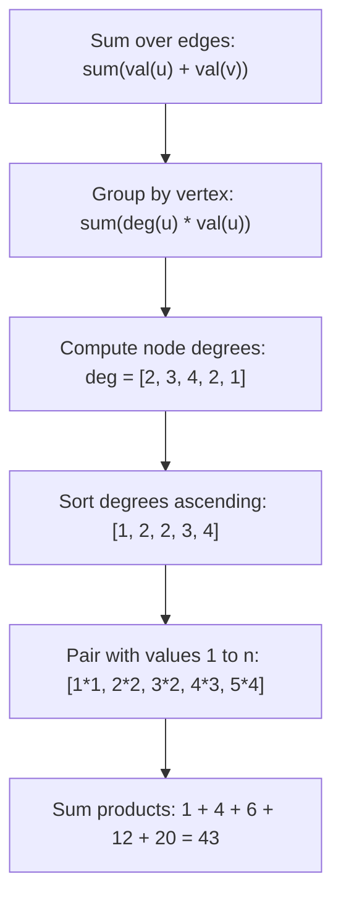

# Guided Example: Maximum Total Importance of Roads

## 1. Problem Overview & Representative Instance

We are given an integer $n$ denoting the number of cities labelled from $0$ to $n - 1$. An undirected network of roads is specified by a 2D array $roads$, where each entry $roads[i] = [u, v]$ indicates a bidirectional road connecting city $u$ and city $v$.

We must assign an integer importance value from $1$ to $n$ to each city, such that every integer in $\{1, 2, \dots, n\}$ is assigned to exactly one city. The importance of a road is defined as the sum of the values of the two cities it connects:
$$\text{Importance}(u, v) = \text{val}(u) + \text{val}(v)$$

Our objective is to determine the maximum possible total importance across all roads in the network:
$$\text{Total Importance} = \sum_{(u, v) \in roads} \big(\text{val}(u) + \text{val}(v)\big)$$

Consider the representative instance:
$$n = 5, \quad roads = [[0, 1], [1, 2], [2, 3], [0, 2], [1, 3], [2, 4]]$$

There are $5$ cities and $6$ bidirectional roads. Let us examine the degree (number of incident roads) of each city:
- City $0$: connected to $\{1, 2\} \implies \text{deg}(0) = 2$
- City $1$: connected to $\{0, 2, 3\} \implies \text{deg}(1) = 3$
- City $2$: connected to $\{0, 1, 3, 4\} \implies \text{deg}(2) = 4$
- City $3$: connected to $\{1, 2\} \implies \text{deg}(3) = 2$
- City $4$: connected to $\{2\} \implies \text{deg}(4) = 1$

To maximize the sum, cities that appear in more roads should receive higher importance values:
- Assign value $5$ to City $2$ ($\text{deg} = 4$)
- Assign value $4$ to City $1$ ($\text{deg} = 3$)
- Assign value $3$ to City $3$ ($\text{deg} = 2$)
- Assign value $2$ to City $0$ ($\text{deg} = 2$)
- Assign value $1$ to City $4$ ($\text{deg} = 1$)

Computing road contributions:
- Road $(0, 1)$: $2 + 4 = 6$
- Road $(1, 2)$: $4 + 5 = 9$
- Road $(2, 3)$: $5 + 3 = 8$
- Road $(0, 2)$: $2 + 5 = 7$
- Road $(1, 3)$: $4 + 3 = 7$
- Road $(2, 4)$: $5 + 1 = 6$
$$\text{Total} = 6 + 9 + 8 + 7 + 7 + 6 = 43$$

No alternate bijection from $\{0, 1, 2, 3, 4\} \to \{1, 2, 3, 4, 5\}$ yields a higher sum. Thus, the maximum total importance is $43$.

## 2. Mathematical & Algorithmic Principles

### Dual View: Edge Summation vs. Vertex Degree Invariant

Summing across all edges in the graph $G = (V, E)$:
$$\sum_{(u, v) \in E} \big(\text{val}(u) + \text{val}(v)\big) = \sum_{u \in V} \sum_{v \in \mathcal{N}(u)} \text{val}(u) = \sum_{u \in V} \text{deg}(u) \cdot \text{val}(u)$$
where $\text{deg}(u)$ is the degree of vertex $u$.

The problem is thus isomorphic to maximizing the dot product between the fixed degree vector $D = [\text{deg}(0), \dots, \text{deg}(n-1)]$ and a permutation vector $V = [\pi_0, \dots, \pi_{n-1}]$ of the integer set $\{1, 2, \dots, n\}$.

### The Rearrangement Inequality

**Theorem (Rearrangement Inequality):** *Given two sequences of real numbers $a_1 \le a_2 \le \dots \le a_n$ and $b_1 \le b_2 \le \dots \le b_n$, the dot product $\sum_{i=1}^n a_i \cdot b_{\sigma(i)}$ is strictly maximized when the permutation $\sigma$ preserves the sorted order ($\sigma(i) = i$):*
$$\sum_{i=1}^n a_i \cdot b_{\sigma(i)} \le \sum_{i=1}^n a_i \cdot b_i$$

Therefore:
1. Sort the vertex degrees in ascending order:
   $$d_{(1)} \le d_{(2)} \le \dots \le d_{(n)}$$
2. Pair the $i$-th smallest degree $d_{(i)}$ with the $i$-th smallest available value $i \in [1, n]$.
3. The maximal total importance is:
   $$\text{MaxTotalImportance} = \sum_{i=1}^n i \cdot d_{(i)}$$

This eliminates graph path tracking and reduces the calculation to degree counting followed by a single 1D sort.

## 3. Step-by-Step Walkthrough with Intermediate State

We execute the procedure on $n = 5$ with roads $[[0, 1], [1, 2], [2, 3], [0, 2], [1, 3], [2, 4]]$.

### Phase 1: Degree Tallying

| Road $(u, v)$ | Updated Degree of $u$ | Updated Degree of $v$ | Active Degree Array $\text{deg}$ |
|---|---|---|---|
| Init | - | - | $[0, 0, 0, 0, 0]$ |
| $(0, 1)$ | $\text{deg}[0] \leftarrow 1$ | $\text{deg}[1] \leftarrow 1$ | $[1, 1, 0, 0, 0]$ |
| $(1, 2)$ | $\text{deg}[1] \leftarrow 2$ | $\text{deg}[2] \leftarrow 1$ | $[1, 2, 1, 0, 0]$ |
| $(2, 3)$ | $\text{deg}[2] \leftarrow 2$ | $\text{deg}[3] \leftarrow 1$ | $[1, 2, 2, 1, 0]$ |
| $(0, 2)$ | $\text{deg}[0] \leftarrow 2$ | $\text{deg}[2] \leftarrow 3$ | $[2, 2, 3, 1, 0]$ |
| $(1, 3)$ | $\text{deg}[1] \leftarrow 3$ | $\text{deg}[3] \leftarrow 2$ | $[2, 3, 3, 2, 0]$ |
| $(2, 4)$ | $\text{deg}[2] \leftarrow 4$ | $\text{deg}[4] \leftarrow 1$ | $[2, 3, 4, 2, 1]$ |

Final degrees: $\text{deg}[0]=2, \text{deg}[1]=3, \text{deg}[2]=4, \text{deg}[3]=2, \text{deg}[4]=1$.

### Phase 2: Sorting and Dot Product Accumulation

| Rank Index $i$ | Sorted Degree $d_{(i)}$ | Assigned Value $i$ | Product $i \cdot d_{(i)}$ | Running Sum |
|---|---|---|---|---|
| $1$ | $1$ | $1$ | $1 \times 1 = 1$ | $1$ |
| $2$ | $2$ | $2$ | $2 \times 2 = 4$ | $1 + 4 = 5$ |
| $3$ | $2$ | $3$ | $3 \times 2 = 6$ | $5 + 6 = 11$ |
| $4$ | $3$ | $4$ | $4 \times 3 = 12$ | $11 + 12 = 23$ |
| $5$ | $4$ | $5$ | $5 \times 4 = 20$ | $23 + 20 = 43$ |

The maximum total importance is $43$.

## 4. Comprehensive State Trace

The table below catalogs degree distributions and optimal assignments across multiple network topologies.

| Network Topology | Number of Cities $n$ | Computed Degrees | Sorted Degrees | Assigned Values Vector | Dot Product Sum | Result |
|---|---|---|---|---|---|---|
| Dense Core (Sample 1) | $5$ | $[2, 3, 4, 2, 1]$ | $[1, 2, 2, 3, 4]$ | $[1, 2, 3, 4, 5]$ | $1(1) + 2(2) + 3(2) + 4(3) + 5(4)$ | **$43$** |
| Disconnected (Sample 2) | $5$ | $[1, 1, 1, 2, 1]$ | $[1, 1, 1, 1, 2]$ | $[1, 2, 3, 4, 5]$ | $1(1) + 2(1) + 3(1) + 4(1) + 5(2)$ | **$20$** |
| Single Road | $2$ | $[1, 1]$ | $[1, 1]$ | $[1, 2]$ | $1(1) + 2(1)$ | **$3$** |
| Star Graph | $4$ | $[3, 1, 1, 1]$ | $[1, 1, 1, 3]$ | $[1, 2, 3, 4]$ | $1(1) + 2(1) + 3(1) + 4(3)$ | **$18$** |
| Simple Path ($3$ edges) | $4$ | $[1, 2, 2, 1]$ | $[1, 1, 2, 2]$ | $[1, 2, 3, 4]$ | $1(1) + 2(1) + 3(2) + 4(2)$ | **$17$** |
| Isolated City | $5$ | $[0, 1, 0, 0, 1]$ | $[0, 0, 0, 1, 1]$ | $[1, 2, 3, 4, 5]$ | $1(0) + 2(0) + 3(0) + 4(1) + 5(1)$ | **$9$** |
| $5$-Cycle | $5$ | $[2, 2, 2, 2, 2]$ | $[2, 2, 2, 2, 2]$ | $[1, 2, 3, 4, 5]$ | $2 \times (1 + 2 + 3 + 4 + 5)$ | **$30$** |

In the star graph ($1$ hub connected to $3$ leaves), the hub has degree $3$ and receives the maximal value $4$, while the $3$ leaves receive values $1, 2, 3$. The result is $1(1) + 2(1) + 3(1) + 4(3) = 18$.

## 5. Algorithmic Correctness & Soundness

The correctness of this greedy formulation is mathematically established:

1. **Exact Equivalence of Objectives:**
   Each edge $e = (u, v)$ contributes $\text{val}(u) + \text{val}(v)$ to the total sum. By changing the order of summation from edges to vertices:
   $$\sum_{e \in E} \sum_{w \in e} \text{val}(w) = \sum_{u \in V} \sum_{e \in E : u \in e} \text{val}(u) = \sum_{u \in V} \text{deg}(u) \cdot \text{val}(u)$$
   This transformation is an identity in real analysis and involves no heuristic or approximation.
2. **Global Optimality via Sorting:**
   The set of values $\{\text{val}(u) \mid u \in V\}$ is constrained to be a permutation of $\{1, 2, \dots, n\}$. By the Rearrangement Inequality, any swap of values between two vertices $u$ and $v$ where $\text{deg}(u) > \text{deg}(v)$ but $\text{val}(u) < \text{val}(v)$ strictly increases the total sum:
   $$\big(\text{deg}(u) \cdot \text{val}(v) + \text{deg}(v) \cdot \text{val}(u)\big) - \big(\text{deg}(u) \cdot \text{val}(u) + \text{deg}(v) \cdot \text{val}(v)\big) = (\text{deg}(u) - \text{deg}(v))(\text{val}(v) - \text{val}(u)) > 0$$
   Therefore, monotonicity between degrees and values is both necessary and sufficient for global maximality.

## 6. Edge Cases & Anti-Patterns

1. **Isolated Cities ($\text{deg}(u) = 0$):**
   - Cities without any connected roads have $\text{deg} = 0$.
   - Sorted ascendingly, degree $0$ cities occupy the lowest rank positions ($i = 1, 2, \dots$), receiving values that contribute $i \times 0 = 0$ to the sum. The algorithm handles isolated nodes optimally without special branches.
2. **Regular Graphs (All Degrees Equal):**
   - In a cycle or complete graph, all vertex degrees are identical ($d$).
   - Any permutation yields the identical sum $d \sum_{i=1}^n i = d \cdot \frac{n(n+1)}{2}$.
3. **Degree Ties:**
   - When multiple cities share the same degree, any relative ordering among them produces the identical sum because their coefficients are equal.
4. **Anti-Pattern: Graph Traversal or Edge Re-weighting:**
   - Attempting graph coloring, BFS, or tree algorithms adds unnecessary complexity. The problem depends purely on the degree sequence of the vertices, completely independent of graph connectivity or cycle structure.

## 7. Complexity Analysis

The operational parameters depend on the number of cities $n$ and the number of roads $m = |roads|$.

| Component | Time Complexity | Auxiliary Space Complexity | Explanation |
|---|---|---|---|
| Degree Counting | $O(m)$ | $O(n)$ | Iterates through $m$ edges, updating an array of size $n$. |
| Degree Sorting | $O(n \log n)$ | $O(\log n)$ or $O(n)$ | Sorts the $n$ integer degrees in ascending order. |
| Dot Product Accumulation | $O(n)$ | $O(1)$ | Single linear pass summing $i \cdot d_{(i)}$. |
| Total Complexity | $O(m + n \log n)$ | $O(n)$ | For $n, m \le 5 \times 10^4$, total operations $\approx 8 \times 10^5$, executing in under $20\text{ ms}$. |
