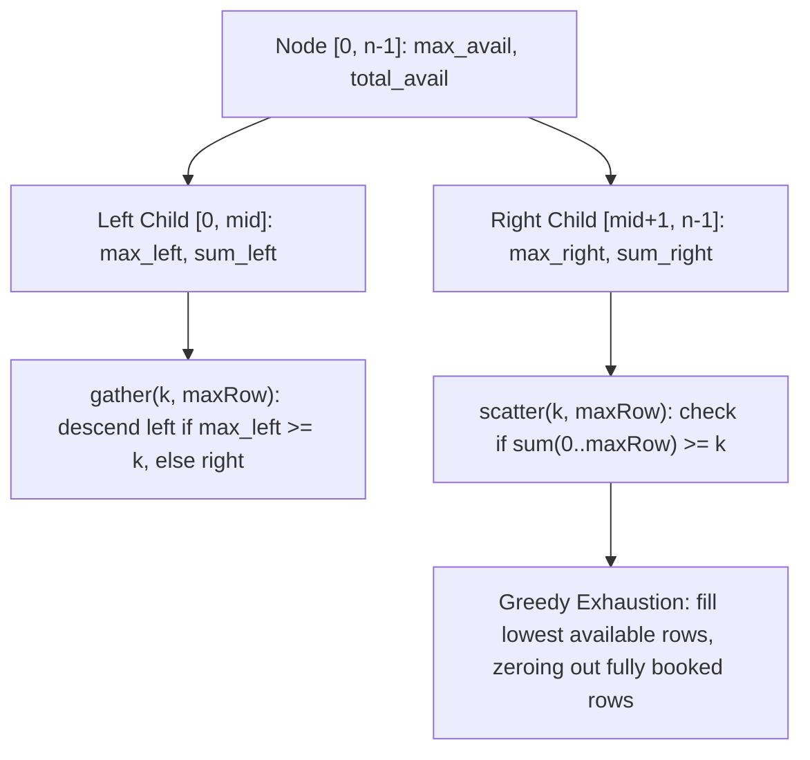

# Guided Example: Booking Concert Tickets in Groups

## 1. Problem Overview & Representative Instance

A concert hall features $n$ rows numbered from $0$ to $n - 1$, where each row contains exactly $m$ seats indexed from $0$ to $m - 1$. Initially, every seat in the hall is empty. We are required to design a ticket booking system supporting two distinct group allocation requests:

1. **`gather(k, maxRow)`**: Seeks to book $k$ contiguous seats in a single row with index $r \le \text{maxRow}$. The allocation must choose the smallest possible row index $r$. Within that row $r$, seats are allocated starting from the earliest available unreserved seat index. If such an allocation is possible, return the array $[r, \text{seat}]$, where $\text{seat}$ is the index of the first allocated seat; if no single row $\le \text{maxRow}$ possesses at least $k$ remaining seats, no seats are booked and the query returns empty $[]$.
2. **`scatter(k, maxRow)`**: Attempts to book $k$ seats in total across all rows from row $0$ up to row $\text{maxRow}$. Unlike `gather`, the seats need not belong to the same row. If the total number of free seats across rows $0$ through $\text{maxRow}$ is at least $k$, the booking succeeds: seats are greedily filled into the lowest available row indices first until all $k$ seats are assigned, and the query returns `true`. If the total available seats across rows $0$ through $\text{maxRow}$ is strictly less than $k$, no seats are booked anywhere and the query returns `false`.

Consider the representative problem instance:
- Hall dimensions: $n = 2$ rows, $m = 5$ seats per row.
- Operations sequence:
  1. `BookMyShow(2, 5)`: Initialize $2$ rows, each with $5$ vacant seats.
  2. `gather(4, 0)`: Request $4$ contiguous seats in row $\le 0$.
  3. `gather(2, 0)`: Request $2$ contiguous seats in row $\le 0$.
  4. `scatter(5, 1)`: Request $5$ distributed seats across rows $\le 1$.
  5. `scatter(5, 1)`: Request $5$ distributed seats across rows $\le 1$.

---

## 2. Mathematical & Algorithmic Principles

### Dual Information Tracking Over One-Dimensional Sequences

Each row $i \in [0, n - 1]$ has a fixed capacity $m$. Because seats within any individual row are always reserved contiguously from left to right (whether filled via `gather` or `scatter`), the remaining seats in row $i$ always form a single contiguous suffix interval $[m - \text{rem}[i], m - 1]$ of length $\text{rem}[i]$. Thus, the count of available contiguous seats in row $i$ is identical to the total number of remaining seats in row $i$.

A naive linear scan over rows from $0$ to $\text{maxRow}$ requires $O(n)$ time per operation, which for $10^5$ queries over $n = 50\,000$ rows results in prohibitive $O(q \cdot n)$ quadratic runtimes. 

To achieve sub-linear query times, we model the sequence of rows using a segment tree spanning the domain of rows $[0, n - 1]$. Each tree node covering row interval $[L, R]$ maintains two summary metrics:
1. **Maximum Capacity Metric ($\text{mx}$):**
   $$\text{mx}(u) = \max_{L \le i \le R} \text{rem}[i]$$
   This enables binary search on the tree to find the minimal row index $i \le \text{maxRow}$ such that $\text{rem}[i] \ge k$ in $O(\log n)$ steps.
2. **Total Sum Metric ($\text{sum}$):**
   $$\text{sum}(u) = \sum_{i=L}^R \text{rem}[i]$$
   This supports $O(\log n)$ range-sum queries over $[0, \text{maxRow}]$ to test the feasibility condition $\sum_{i=0}^{\text{maxRow}} \text{rem}[i] \ge k$ for `scatter`.

| Segment Tree Metric | Definition | Purpose in Operation |
|---|---|---|
| Subtree Maximum ($\text{mx}$) | $\max_{i \in [L, R]} \text{rem}[i]$ | Guides `gather` navigation to the leftmost row with $\ge k$ capacity |
| Subtree Sum ($\text{sum}$) | $\sum_{i \in [L, R]} \text{rem}[i]$ | Pre-checks overall feasibility for `scatter` across $[0, \text{maxRow}]$ |

### Amortized Cost of Row Exhaustion

In a `scatter` operation, when total available seats across $[0, \text{maxRow}]$ are sufficient, we must allocate seats row by row starting from the lowest index with available seats. While visiting a single row takes $O(\log n)$ point updates in the segment tree, a row whose capacity is reduced to $0$ will never be visited or modified again in future operations.

Because each of the $n$ rows can transition to capacity $0$ at most once across the entire sequence of operations, the total number of fully exhausting updates is bounded by $n$. In any single `scatter` operation, at most one partially filled row is created at the end of the allocation. Therefore, the amortized cost per `scatter` operation is $O(\log n)$ plus the cost of at most one partial leaf update.

---

## 3. Step-by-Step Walkthrough with Intermediate State

Let us trace the operations on the hall of $n = 2$ rows, each with capacity $m = 5$.

### Step 1: System Initialization `BookMyShow(2, 5)`
- Row $0$: remaining seats $\text{rem}[0] = 5$, first unreserved index $\text{ptr}[0] = 0$.
- Row $1$: remaining seats $\text{rem}[1] = 5$, first unreserved index $\text{ptr}[1] = 0$.
- Root of segment tree covers $[0, 1]$:
  $$\text{mx} = \max(5, 5) = 5, \quad \text{sum} = 5 + 5 = 10$$

### Step 2: First Query `gather(4, 0)`
- We require $k = 4$ contiguous seats within rows $\le 0$.
- Query the segment tree for the leftmost row in $[0, 0]$ with $\text{mx} \ge 4$:
  - Node for row $0$ has $\text{rem}[0] = 5 \ge 4$.
  - Found valid row $r = 0$.
- Allocation details:
  - First free seat index: $\text{seat} = m - \text{rem}[0] = 5 - 5 = 0$.
  - Update remaining seats: $\text{rem}[0] = 5 - 4 = 1$.
  - Update segment tree leaf for row $0$: $\text{mx} = 1, \text{sum} = 1$.
  - Parent node $[0, 1]$ recalculates: $\text{mx} = \max(1, 5) = 5$, $\text{sum} = 1 + 5 = 6$.
- Return value: $[0, 0]$.

### Step 3: Second Query `gather(2, 0)`
- We require $k = 2$ contiguous seats within rows $\le 0$.
- Query the segment tree for the leftmost row in $[0, 0]$ with $\text{mx} \ge 2$:
  - Node for row $0$ has $\text{mx} = 1$. Since $1 < 2$, the condition is not satisfied.
  - Range $[0, 0]$ contains no row with at least $2$ seats.
- No modifications made to tree state.
- Return value: `[]`.

### Step 4: Third Query `scatter(5, 1)`
- We require $k = 5$ seats distributed across rows $[0, 1]$.
- Step 4a (Feasibility Check):
  - Query range sum on segment tree for $[0, 1]$: $\text{sum} = 6$.
  - Since $6 \ge 5$, the allocation is feasible.
- Step 4b (Greedy Allocation):
  - Query leftmost row with $\text{rem}[i] \ge 1$: returns row $0$.
  - Row $0$ currently has $\text{rem}[0] = 1$ seat.
    - We take this $1$ seat: $k \leftarrow 5 - 1 = 4$.
    - Row $0$ is now fully exhausted: $\text{rem}[0] = 0$.
    - Update segment tree leaf $0$: $\text{mx} = 0, \text{sum} = 0$.
  - Move to row $1$: currently has $\text{rem}[1] = 5$ seats.
    - We need $k = 4$ seats. Since $\text{rem}[1] \ge 4$, row $1$ satisfies the remaining demand.
    - New remaining in row $1$: $\text{rem}[1] = 5 - 4 = 1$.
    - Update segment tree leaf $1$: $\text{mx} = 1, \text{sum} = 1$.
    - Remaining demand $k \leftarrow 0$. Allocation finishes.
  - Parent node $[0, 1]$ recalculates:
    $$\text{mx} = \max(0, 1) = 1, \quad \text{sum} = 0 + 1 = 1$$
- Return value: `true`.

### Step 5: Fourth Query `scatter(5, 1)`
- We require $k = 5$ seats distributed across rows $[0, 1]$.
- Step 5a (Feasibility Check):
  - Query range sum on segment tree for $[0, 1]$: $\text{sum} = 1$.
  - Required seats $5 > 1$ available seats. Allocation fails.
- No modifications are applied.
- Return value: `false`.

---

## 4. Comprehensive State Trace

| Operation | Arguments $(k, \text{maxRow})$ | Pre-Check / Segment Tree State | Row Modifications | Final Output | Post Tree $(\text{mx}, \text{sum})$ |
|---|---|---|---|---|---|
| `BookMyShow` | $(n=2, m=5)$ | Initialized array: $\text{rem} = [5, 5]$ | None | `null` | $(5, 10)$ |
| `gather` | $(k=4, \text{maxRow}=0)$ | $\text{mx}[0 \dots 0] = 5 \ge 4 \implies \text{row } 0$ | $\text{rem}[0] \leftarrow 1$ | `[0, 0]` | $(5, 6)$ |
| `gather` | $(k=2, \text{maxRow}=0)$ | $\text{mx}[0 \dots 0] = 1 < 2 \implies \text{infeasible}$ | None | `[]` | $(5, 6)$ |
| `scatter` | $(k=5, \text{maxRow}=1)$ | $\text{sum}[0 \dots 1] = 6 \ge 5 \implies \text{feasible}$ | $\text{rem}[0] \leftarrow 0$, $\text{rem}[1] \leftarrow 1$ | `true` | $(1, 1)$ |
| `scatter` | $(k=5, \text{maxRow}=1)$ | $\text{sum}[0 \dots 1] = 1 < 5 \implies \text{infeasible}$ | None | `false` | $(1, 1)$ |

---

## 5. Algorithmic Correctness & Soundness

### Correctness of `gather` Leftmost Search

To ensure we select the smallest row index $r \le \text{maxRow}$ with capacity at least $k$:
1. At any internal segment tree node $u$ spanning $[L, R]$, let mid-point be $M = \lfloor (L + R) / 2 \rfloor$.
2. The left child covers $[L, M]$ and the right child covers $[M + 1, R]$.
3. If the left child's maximum satisfies $\text{mx}(\text{left}) \ge k$, a valid row is guaranteed to exist within $[L, M \cap \text{maxRow}]$. By structural invariant, every row in the left subtree has a smaller index than any row in the right subtree. Hence, the search must recurse into the left child to preserve minimality.
4. Only if the left child cannot satisfy the demand ($\text{mx}(\text{left}) < k$) does the search consider the right child, provided the search range intersects $[M + 1, \text{maxRow}]$.
5. This invariant guarantees that the returned row index is strictly the minimal valid index.

### Atomicity and All-or-Nothing Guarantee of `scatter`

A critical requirement of `scatter` is atomicity: if total capacity is insufficient, no seats may be booked.
- The algorithm verifies $\sum_{i=0}^{\text{maxRow}} \text{rem}[i] \ge k$ via an initial segment tree range sum query before any state modification occurs.
- If the sum is strictly less than $k$, the function exits immediately returning `false`, leaving all row states and segment tree values intact.
- Modifications commence only once global feasibility is established.

---

## 6. Edge Cases & Anti-Patterns

### Anti-Pattern: Eager Partial Allocation Without Pre-Checking

A frequent structural error is iterating over rows, eagerly subtracting seats, and then rolling back if the total demand cannot be met. Rollback algorithms are error-prone and introduce unnecessary overhead. By maintaining a range-sum segment tree, feasibility is verified in $O(\log n)$ time prior to mutating any state, entirely eliminating rollback logic.

### Edge Case: Exact Capacity Exhaustion

When an operation requires exactly the remaining capacity of a row ($k = \text{rem}[i]$), the row capacity drops to $0$. The segment tree update correctly sets both leaf maximum and sum to $0$. Subsequent `gather` operations naturally bypass this row because $\text{mx} = 0 < k$ (for any $k \ge 1$), and a global pointer or segment tree query quickly skips past exhausted rows.

### Edge Case: Single Row Hall ($n = 1$)

When $n = 1$, the segment tree consists of a single root node. Both `gather` and `scatter` operate on the exact same row. The algorithm behaves consistently because range queries on $[0, 0]$ isolate the sole row and point updates correctly maintain its remaining capacity.

---

## 7. Complexity Analysis

### Time Complexity

1. **Initialization:**
   - Building the segment tree across $n$ rows takes $O(n)$ time.
2. **`gather(k, maxRow)`:**
   - Involves one binary search descent on the segment tree to depth at most $\lceil \log_2 n \rceil$, plus one point update to deduct $k$ seats from the chosen row.
   - Total time per `gather` call is $O(\log n)$.
3. **`scatter(k, maxRow)`:**
   - One range sum query over $[0, \text{maxRow}]$ in $O(\log n)$ time.
   - Traversing and updating rows: each fully exhausted row receives one point update in its lifetime and is never visited again. At most one row is partially filled per `scatter` call.
   - Amortized over all operations, the time per `scatter` call is $O(\log n)$.

### Space Complexity

- **Segment Tree Storage:** The segment tree requires $4n$ nodes, each holding constant integer values ($\text{mx}$ and $\text{sum}$).
- **Row Tracking:** Storing the current seat allocation pointers takes $O(n)$ space.
- Total auxiliary space complexity is strictly $O(n)$, which easily complies with memory constraints for $n = 50\,000$.
