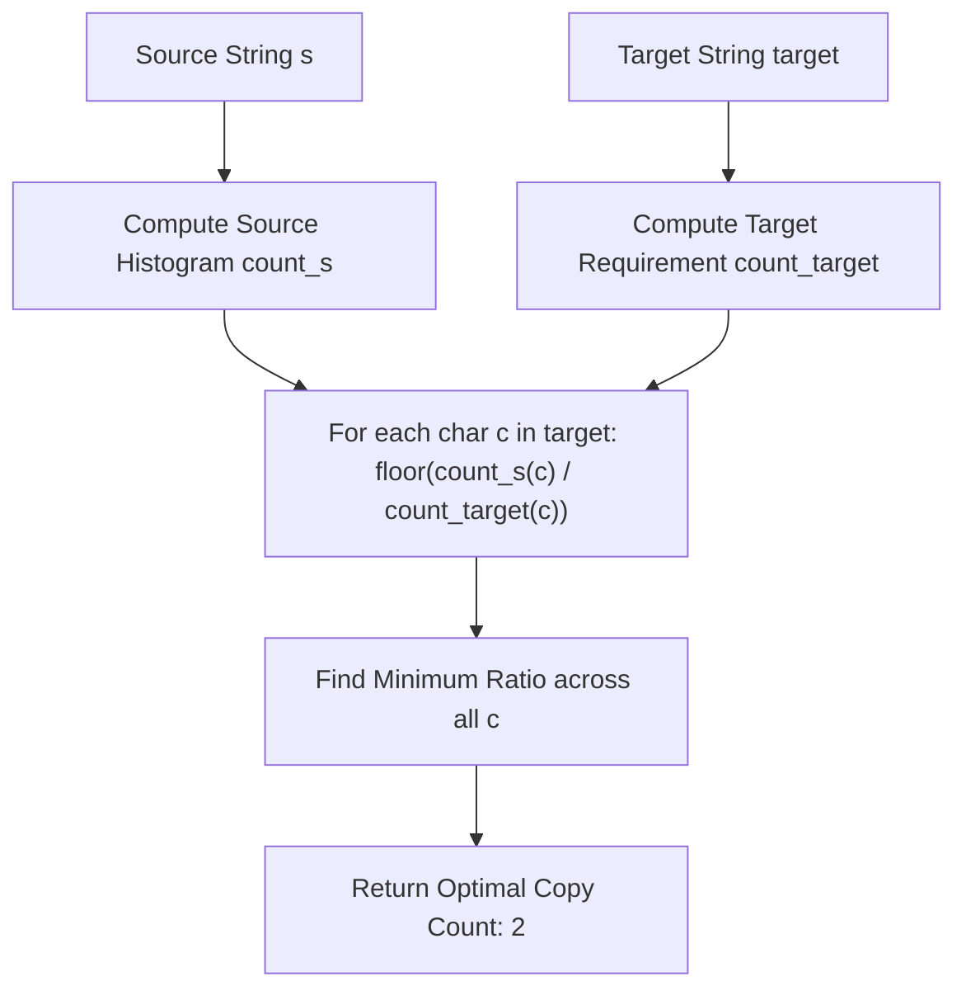

# Guided Example: Rearrange Characters to Make Target String

## 1. Problem Overview & Representative Instance

We are given two strings: a source repository string $s$ and an objective pattern string $target$. We may extract individual characters from $s$ and rearrange them arbitrarily to construct copies of $target$. Each character in $s$ may be consumed at most once.

Our goal is to compute the maximum number of non-overlapping, complete copies of $target$ that can be formed simultaneously.

Consider the representative problem instance:
$$s = \text{"ilovecodingonleetcode"}, \quad target = \text{"code"}$$

Examining the multi-set composition:
- The target string $target = \text{"code"}$ has length $4$ and requires:
  - $1$ copy of `'c'`
  - $1$ copy of `'o'`
  - $1$ copy of `'d'`
  - $1$ copy of `'e'`
- The source string $s = \text{"ilovecodingonleetcode"}$ of length $21$ contains:
  - $2$ copies of `'c'`
  - $4$ copies of `'o'`
  - $2$ copies of `'d'`
  - $4$ copies of `'e'`
  - Additional letters `'i', 'l', 'v', 'n', 't'` which are irrelevant to forming $target$.

For each needed distinct character $c$, we compute the maximum integer number of target instances that the supply of $c$ can sustain:
- Character `'c'`: $\lfloor 2 / 1 \rfloor = 2$
- Character `'o'`: $\lfloor 4 / 1 \rfloor = 4$
- Character `'d'`: $\lfloor 2 / 1 \rfloor = 2$
- Character `'e'`: $\lfloor 4 / 1 \rfloor = 4$

Because all required characters must be present simultaneously to form complete target copies, the global bottleneck is determined by the minimum capacity across all required characters:
$$\min(2, 4, 2, 4) = 2$$

Thus, at most $2$ complete copies of $\text{"code"}$ can be formed.

---

## 2. Mathematical & Algorithmic Principles

### Multi-Set Intersection & Vector Dominance

Let $\Sigma$ denote the alphabet of lowercase English letters. We represent strings $s$ and $target$ by their Parikh frequency vectors in $\mathbb{N}^{|\Sigma|}$:
$$S(c) = \text{frequency of } c \text{ in } s, \quad T(c) = \text{frequency of } c \text{ in } target$$

Forming $k$ disjoint copies of $target$ requires a total character allocation vector of $k \cdot T$. Because each character is extracted without replacement from the source supply $S$, the feasibility condition is governed by component-wise vector domination:
$$k \cdot T(c) \le S(c) \quad \text{for all } c \in \Sigma \text{ with } T(c) > 0$$

Dividing by $T(c) > 0$ yields an independent upper bound for each distinct character:
$$k \le \left\lfloor \frac{S(c)}{T(c)} \right\rfloor$$

Because all character constraints must hold concurrently (satisfying the logical conjunction over all $c \in \text{support}(T)$), the maximal achievable integer scalar $k^*$ is given by the infimum of these individual bounds:
$$k^* = \min_{c \in \Sigma, \, T(c) > 0} \left\lfloor \frac{S(c)}{T(c)} \right\rfloor$$

| Symbol | Mathematical Domain | Operational Meaning |
|---|---|---|
| $S(c)$ | Non-negative integers $\mathbb{N}_0$ | Supply count of character $c$ available in string $s$ |
| $T(c)$ | Positive integers $\mathbb{Z}^+$ | Multiplicity demand of character $c$ required per target copy |
| $\lfloor S(c) / T(c) \rfloor$ | Integer quotient | Independent capacity limit imposed by resource $c$ |
| $k^*$ | Minimal quotient | Binding bottleneck that limits simultaneous assembly |

---

## 3. Step-by-Step Walkthrough with Intermediate State

Let us trace the calculation for $s = \text{"ilovecodingonleetcode"}$ and $target = \text{"code"}$.

### Step 1: Compute Target Requirement Histogram
We parse each character of $target$:
- `'c'` appears $1$ time: $T(\text{'c'}) = 1$
- `'o'` appears $1$ time: $T(\text{'o'}) = 1$
- `'d'` appears $1$ time: $T(\text{'d'}) = 1$
- `'e'` appears $1$ time: $T(\text{'e'}) = 1$

### Step 2: Compute Source Supply Histogram
We tally occurrences across $s$:
- Total occurrences of `'c'` in $s$: $2$
- Total occurrences of `'o'` in $s$: $4$
- Total occurrences of `'d'` in $s$: $2$
- Total occurrences of `'e'` in $s$: $4$
- Other letters present: `'i': 1, 'l': 2, 'v': 1, 'n': 2, 't': 1`. These characters have $T(c) = 0$ and impose no constraints.

### Step 3: Evaluate Component Bounds
We evaluate each distinct character in the target set:

1. Character `'c'`:
   - Supply $S(\text{'c'}) = 2$, Demand $T(\text{'c'}) = 1$.
   - Quotient: $\lfloor 2 / 1 \rfloor = 2$.
   - Current running minimum: $2$.

2. Character `'o'`:
   - Supply $S(\text{'o'}) = 4$, Demand $T(\text{'o'}) = 1$.
   - Quotient: $\lfloor 4 / 1 \rfloor = 4$.
   - Current running minimum: $\min(2, 4) = 2$.

3. Character `'d'`:
   - Supply $S(\text{'d'}) = 2$, Demand $T(\text{'d'}) = 1$.
   - Quotient: $\lfloor 2 / 1 \rfloor = 2$.
   - Current running minimum: $\min(2, 2) = 2$.

4. Character `'e'`:
   - Supply $S(\text{'e'}) = 4$, Demand $T(\text{'e'}) = 1$.
   - Quotient: $\lfloor 4 / 1 \rfloor = 4$.
   - Current running minimum: $\min(2, 4) = 2$.

### Step 4: Final Bottleneck Extraction
Every character in $target$ has been evaluated. The minimum quotient across all required characters is $2$.
The maximal number of rearrangeable copies is $2$.

---

## 4. Comprehensive State Trace

| Distinct Target Character $c$ | Demand $T(c)$ | Supply $S(c)$ in $s$ | Feasible Copies $\lfloor S(c)/T(c) \rfloor$ | Running Minimum $k^*$ | Binding Constraint Status |
|---|---|---|---|---|---|
| `'c'` | $1$ | $2$ | $2$ | $2$ | Binding bottleneck |
| `'o'` | $1$ | $4$ | $4$ | $2$ | Slack present ($+2$ surplus) |
| `'d'` | $1$ | $2$ | $2$ | $2$ | Binding bottleneck |
| `'e'` | $1$ | $4$ | $4$ | $2$ | Slack present ($+2$ surplus) |

---

## 5. Algorithmic Correctness & Soundness

### Sufficiency and Necessary Condition

- **Necessity:** To construct $k$ disjoint copies of $target$, the multiset sum of $k$ copies demands exactly $k \cdot T(c)$ instances of character $c$. If $k > \lfloor S(c) / T(c) \rfloor$ for any $c$, then $k \cdot T(c) > S(c)$, violating the available supply. Hence, no valid configuration can exceed $k^*$.
- **Sufficiency:** Because characters can be chosen from any positions in $s$ without ordering or adjacency restrictions, we can greedily select $k^* \cdot T(c)$ characters of type $c$ for each $c \in target$. Since $k^* \cdot T(c) \le S(c)$ holds simultaneously for all required letters, all $k^*$ copies can be assembled without collision or deficit.
- Therefore, $k^* = \min_{c} \lfloor S(c) / T(c) \rfloor$ is exact.

---

## 6. Edge Cases & Anti-Patterns

### Anti-Pattern: Simulation by String Slicing or Deletion

An inefficient approach is repeatedly searching for characters of $target$ in $s$ and deleting them until a character cannot be found. Modifying strings repeatedly incurs quadratic $O(|s| \cdot |target| \cdot k)$ runtime. In contrast, frequency counting abstracts away spatial ordering and solves the allocation in linear time.

### Edge Case: Missing Required Character ($S(c) = 0$)

If any character required by $target$ does not appear in $s$, then $S(c) = 0$. The integer division yields $\lfloor 0 / T(c) \rfloor = 0$. The running minimum immediately becomes $0$, correctly reflecting that not even a single copy can be constructed.

### Edge Case: Repeated Characters in Target

Consider $target = \text{"aaaa"}$ where $T(\text{'a'}) = 4$. If $s$ contains $10$ `'a'`s, the integer quotient $\lfloor 10 / 4 \rfloor = 2$ properly handles higher multiplicities without overcounting.

---

## 7. Complexity Analysis

### Time Complexity

- **Source Frequency Counting:** Scanning $s$ once to build the character histogram takes $O(|s|)$ time.
- **Target Frequency Counting:** Scanning $target$ once to build the demand histogram takes $O(|target|)$ time.
- **Quotient Minimization:** Iterating over the distinct characters in $target$ takes at most $O(|\Sigma|)$ operations, where $|\Sigma| = 26$ for lowercase English letters.
- **Overall Time Complexity:** $O(|s| + |target|)$, which is strictly linear and optimal.

### Space Complexity

- The frequency histograms store counts for at most $|\Sigma| = 26$ lowercase English letters.
- Since $|\Sigma|$ is a small fixed constant ($26$), auxiliary storage is $O(|\Sigma|) = O(1)$ constant extra space.
