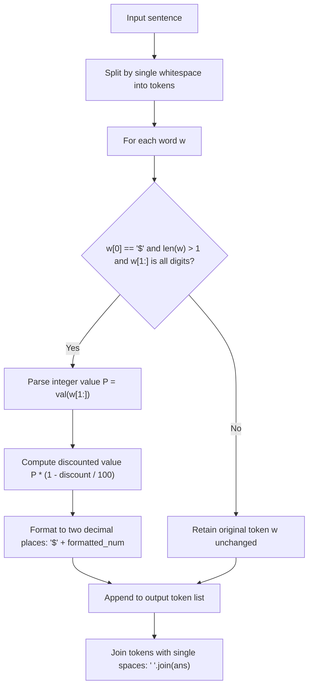

# Guided Example: Apply Discount to Prices

## 1. Problem Overview & Representative Instance

We are given a string $sentence$ consisting of words separated by single spaces, and an integer $discount$ representing a percentage reduction. A word is defined as a sequence of non-whitespace characters. A word qualifies as a **price** if and only if it satisfies two strict criteria:
1. The first character is the dollar sign `'$'`.
2. All subsequent characters form a non-empty sequence composed entirely of decimal digits (`'0'` through `'9'`).

For every word that qualifies as a valid price, we must calculate the discounted price:
$$\text{Price}_{\text{new}} = \text{Price}_{\text{original}} \times \left(1 - \frac{discount}{100}\right)$$
The discounted price is formatted with the leading `'$'` character followed by exactly two fractional decimal digits. All other words—including words where `'$'` appears in other positions, bare dollar signs `'$'`, words containing alphabetic characters after `'$'`, or numbers without a leading `'$'`—must remain completely unchanged.

Consider the representative problem instance:
$$sentence = \text{"there are \$1 \$2 and 5\$ candies in the shop"}, \quad discount = 50$$

Examining each token in the sentence:
- `"there"`: does not begin with `'$'` $\implies$ unmodified.
- `"are"`: does not begin with `'$'` $\implies$ unmodified.
- `"$1"`: begins with `'$'`, remainder `"1"` is non-empty digits $\implies$ valid price of value $1$. Discounted value: $1 \times (1 - 0.50) = 0.50$, formatted as `"$0.50"`.
- `"$2"`: begins with `'$'`, remainder `"2"` is non-empty digits $\implies$ valid price of value $2$. Discounted value: $2 \times (1 - 0.50) = 1.00$, formatted as `"$1.00"`.
- `"and"`: does not begin with `'$'` $\implies$ unmodified.
- `"5$"`: begins with digit `'5'`, not `'$'` $\implies$ unmodified.
- `"candies"`, `"in"`, `"the"`, `"shop"`: do not begin with `'$'` $\implies$ unmodified.

Reassembling the transformed tokens with single space delimiters yields:
$$\text{"there are \$0.50 \$1.00 and 5\$ candies in the shop"}$$

---

## 2. Mathematical & Algorithmic Principles

### Formal Token Validation Predicate

Let a token $w$ be a sequence of characters $w = (c_0, c_1, \dots, c_{k-1})$ of length $k \ge 1$. The indicator predicate $\text{IsPrice}(w) \in \{0, 1\}$ is formally defined as:
$$\text{IsPrice}(w) = [c_0 = \text{'\$'} \land k \ge 2 \land (\forall i \in \{1, \dots, k-1\}, c_i \in \{0, 1, \dots, 9\})]$$

| Test Case Token | $c_0 = \text{'\$'}$ | $k \ge 2$ | All Suffix Chars Digits | $\text{IsPrice}(w)$ | Classification Result |
|---|---|---|---|---|---|
| `"$1"` | True | True ($k=2$) | True (`"1"`) | True | Valid price |
| `"$2"` | True | True ($k=2$) | True (`"2"`) | True | Valid price |
| `"5$"` | False (`'5'`) | True ($k=2$) | N/A | False | Suffix currency symbol (non-price) |
| `"there"` | False (`'t'`) | True ($k=5$) | N/A | False | Regular word |
| `"$"` | True | False ($k=1$) | False (empty suffix) | False | Bare currency symbol |
| `"$10$"` | True | True ($k=4$) | False (`'$'` at index 3) | False | Trailing currency symbol |

### Exact Decimal Precision & Arithmetic Scaling

Let the original integer price extracted from the suffix be:
$$P = \sum_{j=1}^{k-1} c_j \cdot 10^{k-1-j}$$
Given discount rate $D \in [0, 100]$, the post-discount floating-point value is:
$$V = P \times \left(1 - \frac{D}{100}\right) = \frac{P \times (100 - D)}{100}$$
The result is rounded and formatted with exactly two decimal places. For example, if $D = 100$, then $100 - D = 0$, producing $V = 0.00$, outputting `"$0.00"`. If $D = 0$, then $100 - D = 100$, producing $V = P.00$, preserving the price with two added decimal digits.

---

## 3. Step-by-Step Walkthrough with Intermediate State

Let us trace the execution on $sentence = \text{"there are \$1 \$2 and 5\$ candies in the shop"}$ with $discount = 50$.

### Step 1: Whitespace Tokenization
The input sentence is partitioned across space boundaries into an ordered list of 10 words:
$$[\text{"there"}, \text{"are"}, \text{"\$1"}, \text{"\$2"}, \text{"and"}, \text{"5\$"}, \text{"candies"}, \text{"in"}, \text{"the"}, \text{"shop"}]$$

### Step 2: Sequential Token Evaluation

- **Token 0 (`"there"`):**
  - First character is `'t'` $\ne$ `'$'`.
  - Condition fails; keep token as `"there"`.

- **Token 1 (`"are"`):**
  - First character is `'a'` $\ne$ `'$'`.
  - Condition fails; keep token as `"are"`.

- **Token 2 (`"$1"`):**
  - First character is `'$'`.
  - Suffix `"1"` has length $1 \ge 1$ and consists solely of digits.
  - Suffix parsed as integer: $P = 1$.
  - Apply discount: $1 \times (1 - 50 / 100) = 0.50$.
  - Formatted token: `"$0.50"`.

- **Token 3 (`"$2"`):**
  - First character is `'$'`.
  - Suffix `"2"` has length $1 \ge 1$ and consists solely of digits.
  - Suffix parsed as integer: $P = 2$.
  - Apply discount: $2 \times (1 - 50 / 100) = 1.00$.
  - Formatted token: `"$1.00"`.

- **Token 4 (`"and"`):**
  - First character is `'a'` $\ne$ `'$'`.
  - Condition fails; keep token as `"and"`.

- **Token 5 (`"5$"`):**
  - First character is `'5'` $\ne$ `'$'`.
  - Condition fails; keep token as `"5$"`.

- **Tokens 6 through 9 (`"candies"`, `"in"`, `"the"`, `"shop"`):**
  - None start with `'$'`.
  - All remain unchanged.

### Step 3: Reconstruction via Joining
We concatenate the processed tokens with single space separators:
$$\text{"there"} + \text{" "} + \text{"are"} + \text{" "} + \text{"\$0.50"} + \text{" "} + \text{"\$1.00"} + \text{" "} + \text{"and"} + \text{" "} + \text{"5\$"} + \text{" "} + \text{"candies"} + \text{" "} + \text{"in"} + \text{" "} + \text{"the"} + \text{" "} + \text{"shop"}$$
This yields `"there are $0.50 $1.00 and 5$ candies in the shop"`.

---

## 4. Comprehensive State Trace

| Token Index | Raw Word $w$ | Begins with `'$'` | Valid Numeric Suffix | Numerical Price $P$ | Transformed Word $w'$ |
|---|---|---|---|---|---|
| $0$ | `"there"` | False | No | None | `"there"` |
| $1$ | `"are"` | False | No | None | `"are"` |
| $2$ | `"$1"` | True | Yes (`"1"`) | $1$ | `"$0.50"` |
| $3$ | `"$2"` | True | Yes (`"2"`) | $2$ | `"$1.00"` |
| $4$ | `"and"` | False | No | None | `"and"` |
| $5$ | `"5$"` | False | No | None | `"5$"` |
| $6$ | `"candies"` | False | No | None | `"candies"` |
| $7$ | `"in"` | False | No | None | `"in"` |
| $8$ | `"the"` | False | No | None | `"the"` |
| $9$ | `"shop"` | False | No | None | `"shop"` |

---

## 5. Algorithmic Correctness & Soundness

### Delimiter Invariance
The problem specifies that words are separated by exactly one space without leading or trailing spaces. Splitting on whitespace partitions the sentence along these exact boundaries. Rejoining the modified tokens using single space characters guarantees that the spatial structure and word count of the sentence are preserved.

### Completeness of Suffix Digit Validation
A word is only transformed if $w[0] == \text{'\$'}$ and $w[1:]$ consists strictly of digits. 
- If $w = \text{"\$"}$, the slice $w[1:]$ is the empty string `""`. Standard digit checks evaluate empty strings as false, properly rejecting solitary dollar signs.
- If $w = \text{"\$10\$"}$, the suffix `"10$"` contains a non-digit character `'$'`, which immediately fails validation.
- If $w = \text{"\$1a2"}$, the presence of `'a'` causes validation to fail.
Thus, no invalid or malformed tokens can be erroneously converted or corrupted during processing.

---

## 6. Edge Cases & Anti-Patterns

### Anti-Pattern: Global Regular Expression Substitution Without Token Boundary Anchoring
Using a naive regex search for `\$[0-9]+` across the raw sentence string without word boundary checking can corrupt tokens like `"item$100"` or `"$100a"`. Tokens must be evaluated on complete whitespace-delimited word boundaries.

### Edge Case: Full Discount ($discount = 100$)
When $discount = 100$, every valid price becomes $0.00$. The formatting string correctly outputs `"$0.00"`.

### Edge Case: Zero Discount ($discount = 0$)
When $discount = 0$, the numerical price remains unchanged, but it must now be displayed with two decimal places (for example, `"$99"` transforms to `"$99.00"`). The algorithm ensures that integer values are formatted to two decimal points.

---

## 7. Complexity Analysis

### Time Complexity
- **Tokenization:** Splitting the input string $sentence$ of length $L$ requires visiting each character once, taking $O(L)$ time.
- **Validation and Formatting:** For each token of length $l_i$, validating the characters and computing the floating-point discount takes $O(l_i)$ time. Summing across all tokens:
  $$\sum_{i} O(l_i) = O(L)$$
- **Reconstruction:** Joining the list of tokens back into a single string takes $O(L)$ time.
- **Total Time Complexity:** $O(L)$, which is strictly linear in the length of the sentence.

### Space Complexity
- Storing the list of split tokens and the reconstructed result requires $O(L)$ auxiliary memory.
- No additional large data structures are allocated.
- **Total Auxiliary Space Complexity:** $O(L)$ space.
