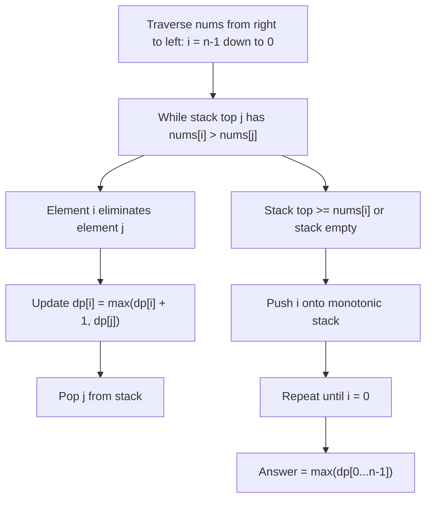

# Guided Example: Steps to Make Array Non-decreasing

## 1. Problem Overview & Representative Instance

We are given a 0-indexed integer array $nums$. In a single step, every element $nums[i]$ that is strictly smaller than its immediate left neighbor ($nums[i - 1] > nums[i]$) is removed from the array simultaneously. This removal process repeats iteratively until no adjacent pair violates the non-decreasing condition.

Our goal is to determine the total number of steps required until the array becomes non-decreasing.

Consider the representative problem instance:
$$nums = [5, 3, 4, 4, 7, 3, 6, 11, 8, 5, 11]$$

Let us trace the physical simulation step by step:
- **Initial Array (Step 0):** $[5, 3, 4, 4, 7, 3, 6, 11, 8, 5, 11]$
  - Active violations where left neighbor is strictly greater:
    - $nums[0] = 5 > nums[1] = 3$ $\implies 3$ removed.
    - $nums[4] = 7 > nums[5] = 3$ $\implies 3$ removed.
    - $nums[7] = 11 > nums[8] = 8$ $\implies 8$ removed.
- **Array after Step 1:** $[5, 4, 4, 7, 6, 11, 5, 11]$
  - Active violations:
    - $5 > 4$ (at index 1) $\implies 4$ removed.
    - $7 > 6$ (at index 4) $\implies 6$ removed.
    - $11 > 5$ (at index 6) $\implies 5$ removed.
- **Array after Step 2:** $[5, 4, 7, 11, 11]$
  - Active violations:
    - $5 > 4$ (at index 1) $\implies 4$ removed.
- **Array after Step 3:** $[5, 7, 11, 11]$
  - Adjacent pairs: $5 \le 7 \le 11 \le 11$. No violations remain.
  - The array is strictly non-decreasing.

Total steps performed: $3$.

---

## 2. Mathematical & Algorithmic Principles

### Physical Intuition: Dominance & Parallel Consumption

Directly simulating array shrinkage is too slow: deleting elements repeatedly takes $O(n^2)$ time in the worst case (for example, a strictly decreasing array $[n, n-1, \dots, 1]$ where elements are peeled off one by one).

Instead, we characterize the exact lifespan of each element:
1. An element $nums[i]$ is permanently preserved if and only if there is no element to its left that is strictly greater than it.
2. If an element $nums[k]$ is removed, it is eliminated by the nearest element to its left that is strictly greater than it and survives long enough to reach it.
3. Multiple elements can be eliminated in parallel during the same step across different subsegments, but an individual survivor element $nums[i]$ can only eliminate one directly adjacent rightward element per step.

### Backwards Dynamic Programming with a Monotonic Stack

Let $dp[i]$ be the number of steps that $nums[i]$ spends actively eliminating elements to its right. If $nums[i]$ never eliminates any element, $dp[i] = 0$.

We iterate backwards from index $n - 1$ down to $0$, maintaining a monotonic stack of candidate elements to the right. When evaluating index $i$:
- For any element $j$ currently on top of the stack with $nums[i] > nums[j]$:
  $nums[i]$ will eliminate $nums[j]$.
- However, $nums[j]$ may itself have eliminated smaller elements to its own right, which consumed $dp[j]$ steps. During those $dp[j]$ steps, $nums[j]$ was actively shielded or processing its own rightward segment.
- Moreover, $nums[i]$ might have already eliminated earlier elements between $i$ and $j$, having already consumed $dp[i]$ steps. Eating $nums[j]$ takes at least $dp[i] + 1$ steps.
- Therefore, the recurrence relation is:
  $$dp[i] = \max(dp[i] + 1, dp[j])$$
  Once accounted for, index $j$ is popped from the stack because it is fully dominated by $nums[i]$ and cannot block or be seen by any element to the left of $i$.
- When all strictly smaller elements are popped, index $i$ is pushed onto the stack.

| Stack Entity / DP State | Mathematical Formalism | Semantic Role in Elimination Dynamics |
|---|---|---|
| Monotonic Stack `stk` | Sequence of indices $k_1, k_2, \dots$ with $nums[k_1] \le nums[k_2] \le \dots$ | Preserves undefeated dominant rightward boundaries |
| $dp[i]$ | $\max_{j \text{ dominated by } i} \max(dp[i] + 1, dp[j])$ | Total rounds index $i$ requires to consume all elements it dominates |
| $\max_{i} dp[i]$ | Global supremum over all $0 \le i < n$ | Total steps until no further adjacent eliminations occur |

---

## 3. Step-by-Step Walkthrough with Intermediate State

Let us trace $nums = [5, 3, 4, 4, 7, 3, 6, 11, 8, 5, 11]$ backwards from $i = 10$ down to $0$.

### Steps $i = 10$ down to $i = 7$:
- **$i = 10$ ($nums[10] = 11$):** Stack is empty. $dp[10] = 0$. Push $10$. Stack: $[10]$.
- **$i = 9$ ($nums[9] = 5$):** Stack top is $10$ with value $11$. Since $5 < 11$, no popping occurs. $dp[9] = 0$. Push $9$. Stack: $[10, 9]$.
- **$i = 8$ ($nums[8] = 8$):**
  - Stack top is $9$ ($val = 5$). Since $8 > 5$, $nums[8]$ dominates $nums[9]$.
  - Pop $9$: $dp[8] = \max(0 + 1, dp[9]) = \max(1, 0) = 1$.
  - Next stack top is $10$ ($val = 11$). Since $8 < 11$, stop.
  - Push $8$. Stack: $[10, 8]$.
- **$i = 7$ ($nums[7] = 11$):**
  - Stack top is $8$ ($val = 8$). Since $11 > 8$, $nums[7]$ dominates $nums[8]$.
  - Pop $8$: $dp[7] = \max(0 + 1, dp[8]) = \max(1, 1) = 1$.
  - Next stack top is $10$ ($val = 11$). Since $11 \not> 11$, stop.
  - Push $7$. Stack: $[10, 7]$.

### Steps $i = 6$ down to $i = 4$:
- **$i = 6$ ($nums[6] = 6$):** Stack top is $7$ ($val = 11$). $6 < 11$. $dp[6] = 0$. Push $6$. Stack: $[10, 7, 6]$.
- **$i = 5$ ($nums[5] = 3$):** Stack top is $6$ ($val = 6$). $3 < 6$. $dp[5] = 0$. Push $5$. Stack: $[10, 7, 6, 5]$.
- **$i = 4$ ($nums[4] = 7$):**
  - Stack top is $5$ ($val = 3$). $7 > 3$. Pop $5$: $dp[4] = \max(0 + 1, dp[5]) = \max(1, 0) = 1$.
  - Stack top is $6$ ($val = 6$). $7 > 6$. Pop $6$: $dp[4] = \max(1 + 1, dp[6]) = \max(2, 0) = 2$.
  - Stack top is $7$ ($val = 11$). $7 < 11$, stop.
  - Push $4$. Stack: $[10, 7, 4]$.

### Steps $i = 3$ down to $i = 1$:
- **$i = 3$ ($nums[3] = 4$):** Stack top is $4$ ($val = 7$). $4 < 7$. $dp[3] = 0$. Push $3$. Stack: $[10, 7, 4, 3]$.
- **$i = 2$ ($nums[2] = 4$):** Stack top is $3$ ($val = 4$). $4 \not> 4$. $dp[2] = 0$. Push $2$. Stack: $[10, 7, 4, 3, 2]$.
- **$i = 1$ ($nums[1] = 3$):** Stack top is $2$ ($val = 4$). $3 < 4$. $dp[1] = 0$. Push $1$. Stack: $[10, 7, 4, 3, 2, 1]$.

### Final Step $i = 0$:
- **$i = 0$ ($nums[0] = 5$):**
  - Stack top is $1$ ($val = 3$). $5 > 3$. Pop $1$: $dp[0] = \max(0 + 1, dp[1]) = \max(1, 0) = 1$.
  - Stack top is $2$ ($val = 4$). $5 > 4$. Pop $2$: $dp[0] = \max(1 + 1, dp[2]) = \max(2, 0) = 2$.
  - Stack top is $3$ ($val = 4$). $5 > 4$. Pop $3$: $dp[0] = \max(2 + 1, dp[3]) = \max(3, 0) = 3$.
  - Stack top is $4$ ($val = 7$). $5 < 7$, stop.
  - Push $0$. Stack: $[10, 7, 4, 0]$.

Taking the maximum across all computed $dp$ values:
$$\max(dp) = \max(3, 0, 0, 0, 2, 0, 0, 1, 1, 0, 0) = 3$$

---

## 4. Comprehensive State Trace

| Index $i$ | $nums[i]$ | Popped Indices $j$ | $dp[j]$ Values | Transition Computation for $dp[i]$ | Final $dp[i]$ | Monotonic Stack Contents |
|---|---|---|---|---|---|---|
| $10$ | $11$ | None | None | Base state | $0$ | $[10]$ |
| $9$ | $5$ | None | None | Base state | $0$ | $[10, 9]$ |
| $8$ | $8$ | $[9]$ | $dp[9] = 0$ | $\max(0+1, 0) = 1$ | $1$ | $[10, 8]$ |
| $7$ | $11$ | $[8]$ | $dp[8] = 1$ | $\max(0+1, 1) = 1$ | $1$ | $[10, 7]$ |
| $6$ | $6$ | None | None | Base state | $0$ | $[10, 7, 6]$ |
| $5$ | $3$ | None | None | Base state | $0$ | $[10, 7, 6, 5]$ |
| $4$ | $7$ | $[5, 6]$ | $dp[5]=0, dp[6]=0$ | $\max(1, 0) \to \max(2, 0) = 2$ | $2$ | $[10, 7, 4]$ |
| $3$ | $4$ | None | None | Base state | $0$ | $[10, 7, 4, 3]$ |
| $2$ | $4$ | None | None | Base state | $0$ | $[10, 7, 4, 3, 2]$ |
| $1$ | $3$ | None | None | Base state | $0$ | $[10, 7, 4, 3, 2, 1]$ |
| $0$ | $5$ | $[1, 2, 3]$ | $dp[1]=0, dp[2]=0, dp[3]=0$ | $\max(1, 0) \to \max(2, 0) \to \max(3, 0) = 3$ | $3$ | $[10, 7, 4, 0]$ |

---

## 5. Algorithmic Correctness & Soundness

### Soundness of the Recurrence $dp[i] = \max(dp[i] + 1, dp[j])$

Consider an element $nums[i]$ that dominates a sequence of elements $j_1, j_2, \dots, j_m$ to its right:
1. **Serialization of Direct Eliminations:** $nums[i]$ can only eliminate one adjacent element directly on any given round. If $nums[i]$ has already spent $dp[i]$ rounds eliminating earlier elements, eliminating the next element requires at least $dp[i] + 1$ rounds.
2. **Waiting for Child Deletions:** An element $j$ cannot be adjacent to $nums[i]$ until all elements that $j$ itself was busy eliminating have already vanished. This independent sub-process required $dp[j]$ steps. Thus, $nums[i]$ cannot consume $j$ before step $dp[j]$ has concluded.
3. Taking the supremum $\max(dp[i] + 1, dp[j])$ over all popped elements captures both the sequential requirement of $i$ and the parallel waiting requirement of $j$, exactly characterizing the completion time.

### Invariant of the Stack
The stack maintains indices in non-decreasing order of their values from top to bottom. Any element popped by $nums[i]$ is strictly smaller than $nums[i]$ and is situated to the right of $i$. Any future element to the left of $i$ that is larger than $nums[i]$ will dominate $nums[i]$ and transitively dominate all elements that $nums[i]$ already accounted for. Hence, popped elements never need to be reconsidered.

---

## 6. Edge Cases & Anti-Patterns

### Anti-Pattern: Direct Simulation with Linked Lists or Dynamic Arrays
Simulating removals on a linked list allows $O(1)$ node deletions, but finding which nodes to delete requires maintaining an active removal queue. In worst-case sequences like strictly descending ladders, the queue processes $O(n)$ elements across $O(n)$ rounds, degrading performance to $O(n^2)$ time.

### Edge Case: Already Non-Decreasing Array
If $nums$ is non-decreasing (e.g., $[1, 2, 3, 4, 5]$), then for every $i$, $nums[i] \le nums[i+1]$. No element is strictly greater than any rightward neighbor, so the stack pops nothing. Every $dp[i] = 0$, and the answer returned is $0$ in $0$ steps.

### Edge Case: Equal Adjacent Elements
If $nums = [5, 5, 5]$, adjacent elements are equal: $nums[i-1] \not> nums[i]$. The condition $nums[i] > nums[j]$ is strict, so equal elements are not popped. All $dp$ values remain $0$, correctly returning $0$.

---

## 7. Complexity Analysis

### Time Complexity
- **Amortized Stack Operations:** Every element index $0 \le i < n$ is pushed onto the stack exactly once.
- Each element is popped from the stack at most once in its entire lifetime.
- Inner loop condition `while stk and nums[i] > nums[stk[-1]]` performs $O(1)$ arithmetic operations per pop.
- Total time across the entire array traversal is bounded by $2n$ operations.
- **Overall Time Complexity:** $O(n)$, which is linear and optimal.

### Space Complexity
- **Dynamic Programming Array:** $dp$ stores $n$ integers, requiring $O(n)$ memory.
- **Monotonic Stack:** The stack holds at most $n$ indices simultaneously, requiring $O(n)$ memory.
- **Total Auxiliary Space Complexity:** $O(n)$.