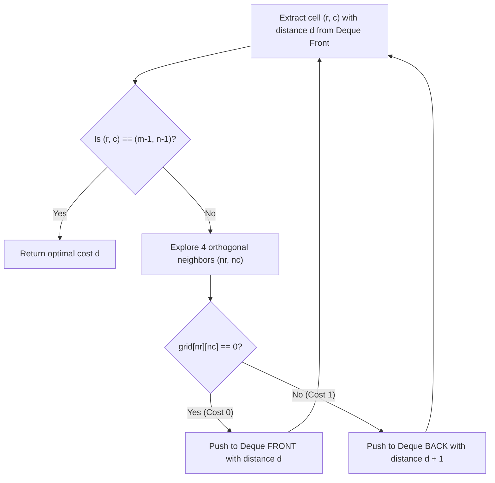

# Guided Example: Minimum Obstacle Removal to Reach Corner

## 1. Problem Overview & Representative Instance

We are given an $m \times n$ integer matrix $grid$, where each cell contains either $0$ (representing an empty, traversable cell) or $1$ (representing an obstacle). Moving between orthogonally adjacent cells is permitted. Moving into an obstacle requires removing it. Both the starting corner $(0, 0)$ and the destination corner $(m - 1, n - 1)$ are guaranteed to be empty ($grid[0][0] = grid[m - 1][n - 1] = 0$).

Our objective is to compute the minimum number of obstacles that must be removed to establish a walkable path from $(0, 0)$ to $(m - 1, n - 1)$.

Consider the representative $3 \times 3$ grid instance:
$$grid = \begin{bmatrix} 0 & 1 & 1 \\ 1 & 1 & 0 \\ 1 & 1 & 0 \end{bmatrix}$$

Let us analyze potential paths from $(0, 0)$ to $(2, 2)$:
- **Path 1 (Along Top Edge then Down):**
  $$(0, 0) \xrightarrow{\text{cost } 1} (0, 1) \xrightarrow{\text{cost } 1} (0, 2) \xrightarrow{\text{cost } 0} (1, 2) \xrightarrow{\text{cost } 0} (2, 2)$$
  Obstacles encountered: cells $(0, 1)$ and $(0, 2)$. Total obstacles removed: $1 + 1 = 2$.
- **Path 2 (Diagonal Corridor Attempt):**
  $$(0, 0) \xrightarrow{\text{cost } 1} (1, 0) \xrightarrow{\text{cost } 1} (1, 1) \xrightarrow{\text{cost } 0} (1, 2) \xrightarrow{\text{cost } 0} (2, 2)$$
  Obstacles encountered: cells $(1, 0)$ and $(1, 1)$. Total obstacles removed: $1 + 1 = 2$.
- **Path 3 (Along Left Edge then Bottom Edge):**
  $$(0, 0) \xrightarrow{\text{cost } 1} (1, 0) \xrightarrow{\text{cost } 1} (2, 0) \xrightarrow{\text{cost } 1} (2, 1) \xrightarrow{\text{cost } 0} (2, 2)$$
  Obstacles encountered: cells $(1, 0), (2, 0), (2, 1)$. Total obstacles removed: $1 + 1 + 1 = 3$.

Every continuous path connecting $(0, 0)$ to $(2, 2)$ must penetrate at least two obstacle cells because the column $1$ and row $1$ barriers divide the grid. Thus, the minimum number of obstacle removals is $2$.

---

## 2. Mathematical & Algorithmic Principles

### Dual-Weight Shortest Path on Graphs

We formulate the grid as a directed, edge-weighted graph $G = (V, E)$:
- **Vertices:** Each cell $(r, c)$ for $0 \le r < m$ and $0 \le c < n$ constitutes a vertex. Total vertices $|V| = m \cdot n$.
- **Edges:** Directed edges exist between orthogonally adjacent cells:
  $$E = \{((r, c), (r', c')) : |r - r'| + |c - c'| = 1\}$$
- **Edge Weights:** The cost of transitioning into neighbor $(r', c')$ is determined entirely by the occupancy of the destination cell:
  $$w((r, c), (r', c')) = grid[r'][c'] \in \{0, 1\}$$

Finding the minimum obstacle removals corresponds to computing the single-source shortest path distance $\text{dist}( (0, 0), (m - 1, n - 1) )$.

### 0-1 Breadth-First Search Monotonicity

Standard BFS assumes uniform edge weights of $1$. General shortest path algorithms like Dijkstra's algorithm handle arbitrary non-negative weights using a priority queue in $O(|E| \log |V|)$ time.

However, when edge weights are strictly restricted to $\{0, 1\}$, a double-ended queue (deque) solves the problem in strictly linear $O(|V| + |E|)$ time:
1. When relaxing an edge with weight $0$, the new distance is $\text{dist} = d$. To preserve monotonic non-decreasing distance ordering in the queue, this state is pushed to the **front** of the deque.
2. When relaxing an edge with weight $1$, the new distance is $\text{dist} = d + 1$. This state is pushed to the **back** of the deque.
3. At any moment, the distances stored in the deque differ by at most $1$, taking the form:
   $$[\underbrace{d, d, \dots, d}_{\text{front group}}, \underbrace{d + 1, d + 1, \dots, d + 1}_{\text{back group}}]$$
This maintains the exact priority queue invariant without comparison overhead.

| Mechanism | General Dijkstra | 0-1 BFS (Double-Ended Queue) |
|---|---|---|
| Priority Maintenance | Binary Heap / Fibonacci Heap | Double-Ended Queue (push-front / push-back) |
| Insertion Cost | $O(\log V)$ per relaxation | $O(1)$ amortized push |
| Total Time Complexity | $O(mn \log(mn))$ | $O(mn)$ strictly linear |
| Distance Separation | Arbitrary positive weights | Binary weights $\{0, 1\}$ |

---

## 3. Step-by-Step Walkthrough with Intermediate State

Let us trace the 0-1 BFS execution on the representative grid:
$$grid = \begin{bmatrix} 0 & 1 & 1 \\ 1 & 1 & 0 \\ 1 & 1 & 0 \end{bmatrix}$$

We initialize a distance matrix $\text{dist}$ with $\infty$, setting $\text{dist}[0][0] = 0$. The double-ended queue starts with $[(0, 0, \text{cost}=0)]$.

### Step 1: Pop $(0, 0)$ with Cost 0
- Current position $(0, 0)$ has $\text{dist} = 0$.
- Evaluate neighbors:
  - Neighbor $(0, 1)$: $grid[0][1] = 1$ (weight 1). New cost $0 + 1 = 1$. Push to **back** of deque.
  - Neighbor $(1, 0)$: $grid[1][0] = 1$ (weight 1). New cost $0 + 1 = 1$. Push to **back** of deque.
- Deque contents: $[(0, 1, 1), (1, 0, 1)]$.

### Step 2: Pop $(0, 1)$ with Cost 1
- Current position $(0, 1)$ with $\text{dist} = 1$.
- Evaluate unvisited neighbors:
  - Neighbor $(0, 2)$: $grid[0][2] = 1$ (weight 1). New cost $1 + 1 = 2$. Push to **back**.
  - Neighbor $(1, 1)$: $grid[1][1] = 1$ (weight 1). New cost $1 + 1 = 2$. Push to **back**.
- Deque contents: $[(1, 0, 1), (0, 2, 2), (1, 1, 2)]$.

### Step 3: Pop $(1, 0)$ with Cost 1
- Current position $(1, 0)$ with $\text{dist} = 1$.
- Evaluate unvisited neighbors:
  - Neighbor $(2, 0)$: $grid[2][0] = 1$ (weight 1). New cost $1 + 1 = 2$. Push to **back**.
  - Neighbor $(1, 1)$ already reached at distance $2$.
- Deque contents: $[(0, 2, 2), (1, 1, 2), (2, 0, 2)]$.

### Step 4: Pop $(0, 2)$ with Cost 2
- Current position $(0, 2)$ with $\text{dist} = 2$.
- Evaluate unvisited neighbors:
  - Neighbor $(1, 2)$: $grid[1][2] = 0$ (weight 0).
  - New cost: $2 + 0 = 2$.
  - Because this is a zero-cost transition, push $(1, 2, 2)$ to the **front** of the deque!
- Deque contents: $[(1, 2, 2), (1, 1, 2), (2, 0, 2)]$.

### Step 5: Pop $(1, 2)$ with Cost 2 (Zero-Cost Propagation)
- Current position $(1, 2)$ with $\text{dist} = 2$.
- Evaluate unvisited neighbors:
  - Neighbor $(2, 2)$: $grid[2][2] = 0$ (weight 0).
  - New cost: $2 + 0 = 2$.
  - Push $(2, 2, 2)$ to the **front** of the deque!
- Deque contents: $[(2, 2, 2), (1, 1, 2), (2, 0, 2)]$.

### Step 6: Pop Target $(2, 2)$ with Cost 2
- The front element is $(2, 2)$ with $\text{cost} = 2$.
- This matches the destination $(m - 1, n - 1)$.
- Because states are popped in non-decreasing order of cost, the first extraction of the destination guarantees the optimal shortest path.
- Algorithm halts and returns $2$.

---

## 4. Comprehensive State Trace

| Deque Extraction Step | Popped Cell $(r, c)$ | Cost $d$ | Neighbor $(nr, nc)$ | Cell Weight | Insertion Position in Deque | Deque State After Relaxation |
|---|---|---|---|---|---|---|
| $1$ | $(0, 0)$ | $0$ | $(0, 1), (1, 0)$ | $1, 1$ | Back, Back | $[(0, 1, 1), (1, 0, 1)]$ |
| $2$ | $(0, 1)$ | $1$ | $(0, 2), (1, 1)$ | $1, 1$ | Back, Back | $[(1, 0, 1), (0, 2, 2), (1, 1, 2)]$ |
| $3$ | $(1, 0)$ | $1$ | $(2, 0)$ | $1$ | Back | $[(0, 2, 2), (1, 1, 2), (2, 0, 2)]$ |
| $4$ | $(0, 2)$ | $2$ | $(1, 2)$ | $0$ | **Front** | $[(1, 2, 2), (1, 1, 2), (2, 0, 2)]$ |
| $5$ | $(1, 2)$ | $2$ | $(2, 2)$ | $0$ | **Front** | $[(2, 2, 2), (1, 1, 2), (2, 0, 2)]$ |
| $6$ | $(2, 2)$ | $2$ | Destination reached | N/A | Terminate | Optimal cost confirmed: $2$ |

---

## 5. Algorithmic Correctness & Soundness

### Monotonic Distance Invariant of 0-1 BFS

**Theorem:** *In 0-1 BFS, elements are extracted from the deque in weakly monotonic ascending order of their shortest-path distances.*

**Proof Sketch:**
1. Suppose the element currently extracted from the front of the deque has distance $d$.
2. All other elements currently residing in the deque have distances in $\{d, d + 1\}$.
3. Weight-0 edges generate new candidates with distance $d + 0 = d$. These are inserted at the head of the deque, preceding all elements with distance $d + 1$.
4. Weight-1 edges generate new candidates with distance $d + 1$. These are appended to the tail of the deque.
5. Consequently, the deque always consists of at most two contiguous blocks: elements of distance $d$ followed by elements of distance $d + 1$.
6. No element of distance $< d$ can ever be generated because edge weights are non-negative.
7. Therefore, when cell $(m - 1, n - 1)$ is first dequeued, its recorded distance is mathematically minimal.

---

## 6. Edge Cases & Anti-Patterns

### Anti-Pattern: Using a Full Priority Queue
Using a `heapq` or `std::priority_queue` introduces an unnecessary logarithmic overhead of $O(\log(mn))$ per push and pop. For a $1000 \times 1000$ grid with $10^6$ cells, this multiplies runtime by $\approx 20\times$, risking Time Limit Exceeded. Double-ended queues perform each push and pop in $O(1)$ time.

### Edge Case: Completely Clear Grid ($grid[r][c] = 0$)
When no obstacles exist between $(0, 0)$ and $(m - 1, n - 1)$, all transitions have weight $0$. The algorithm continuously pushes to the front, behaving identically to standard BFS and reaching the corner with cost $0$.

### Edge Case: Narrow Corridors ($1 \times n$ or $m \times 1$)
In a single-row grid of size $1 \times n$, only one path exists (moving rightward). The algorithm simply sums the obstacle cells along the row, correctly returning $\sum_{c=1}^{n-2} grid[0][c]$.

---

## 7. Complexity Analysis

### Time Complexity
- **State Space:** The grid contains $V = m \cdot n$ cells.
- **Edge Relaxations:** Each cell has at most $4$ orthogonal neighbors, yielding at most $|E| \le 4mn$ transitions.
- **Deque Operations:** Every cell is pushed into the deque at most twice and popped at most once when finalizing its shortest distance.
- Each push-front, push-back, and pop-left operation runs in $O(1)$ constant time.
- **Total Time Complexity:** $O(m \cdot n)$, which is strictly linear and optimal.

### Space Complexity
- **Distance / Visited Table:** Storing the distance or visited status for each cell requires $O(m \cdot n)$ space.
- **Deque Capacity:** At any time, the deque contains at most $4mn$ entries.
- **Total Auxiliary Space Complexity:** $O(m \cdot n)$.
