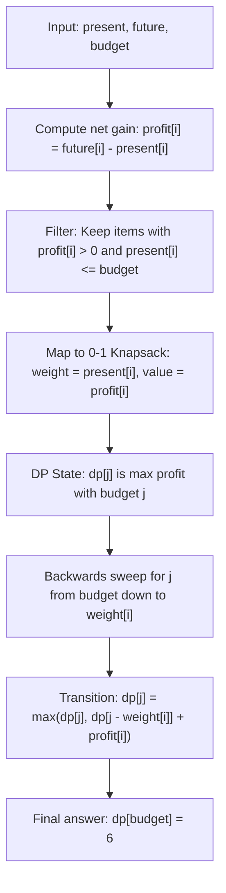

# Guided Example: Maximum Profit From Trading Stocks

## 1. Problem Overview & Representative Instance

We are given two integer arrays $present$ and $future$, each of length $n$, alongside an integer $budget$. Each index $i \in [0, n - 1]$ corresponds to a distinct stock:
- Buying stock $i$ requires spending $present[i]$ immediately.
- Selling stock $i$ later yields $future[i]$.
- The net profit generated by purchasing and later selling stock $i$ is $future[i] - present[i]$. If $future[i] \le present[i]$, trading stock $i$ yields zero or negative return.

Each stock may be purchased at most once, and the total expenditure across all purchased stocks cannot exceed the integer capital limit $budget$. Our objective is to determine the maximum aggregate profit achievable.

Consider the representative problem instance:
$$present = [5, 4, 6, 2, 3], \quad future = [8, 5, 4, 3, 5], \quad budget = 10$$

Let us analyze the individual stock opportunities:
- Stock $0$: Cost $= 5$, Future $= 8 \implies \text{Net Profit} = 8 - 5 = 3$ (Cost-effective: $3/5 = 0.60$).
- Stock $1$: Cost $= 4$, Future $= 5 \implies \text{Net Profit} = 5 - 4 = 1$ (Cost-effective: $1/4 = 0.25$).
- Stock $2$: Cost $= 6$, Future $= 4 \implies \text{Net Profit} = 4 - 6 = -2 \le 0$ (Depreciating stock; rejected).
- Stock $3$: Cost $= 2$, Future $= 3 \implies \text{Net Profit} = 3 - 2 = 1$ (Cost-effective: $1/2 = 0.50$).
- Stock $4$: Cost $= 3$, Future $= 5 \implies \text{Net Profit} = 5 - 3 = 2$ (Cost-effective: $2/3 \approx 0.67$).

The viable candidates with positive net yield are Stocks $\{0, 1, 3, 4\}$.
Total cost of all four candidates: $5 + 4 + 2 + 3 = 14 > 10$ ($budget$ exceeded).
Selecting subset $\{0, 3, 4\}$:
$$\text{Total Cost} = 5 + 2 + 3 = 10 \le 10, \quad \text{Total Profit} = 3 + 1 + 2 = 6$$
No other subset with cost $\le 10$ yields a greater profit. Thus, the optimal total profit is $6$.

---

## 2. Mathematical & Algorithmic Principles

### Equivalence to the Classical 0-1 Knapsack Problem

Let each stock $i \in \{0, \dots, n - 1\}$ be characterized as an item with:
- Item weight (cost): $w_i = present[i] \ge 0$
- Item value (profit): $v_i = \max(0, future[i] - present[i])$
- Knapsack capacity: $W = budget$

We seek a binary decision vector $x \in \{0, 1\}^n$ that solves the integer program:
$$\max_{x \in \{0, 1\}^n} \sum_{i=0}^{n-1} x_i \cdot v_i \quad \text{subject to} \quad \sum_{i=0}^{n-1} x_i \cdot w_i \le W$$

Any stock with $v_i \le 0$ satisfies $x_i = 0$ in any optimal solution (since taking it consumes non-negative budget without improving profit). For all remaining items, this is precisely the 0-1 Knapsack problem.

### Dynamic Programming Formulation

Let $f(i, j)$ represent the maximum profit obtainable using a subset of the first $i$ stocks under an expenditure cap of $j \in [0, budget]$:
1. **Base Case:**
   $$f(0, j) = 0 \quad \text{for all } j \in [0, budget]$$
2. **State Transition:**
   For stock $i$ with weight $w = present[i-1]$ and profit $p = future[i-1] - present[i-1]$:
   - If $p \le 0$ or $j < w$: stock $i$ cannot or should not be purchased:
     $$f(i, j) = f(i - 1, j)$$
   - If $p > 0$ and $j \ge w$: we choose between omitting or purchasing stock $i$:
     $$f(i, j) = \max\big(f(i - 1, j), \, f(i - 1, j - w) + p\big)$$

| Parameter | Mathematical Domain | Algorithmic Role |
|---|---|---|
| Prefix Index $i$ | $0 \le i \le n$ | Boundary of considered stock candidates |
| Budget Capacity $j$ | $0 \le j \le budget$ | Discretized allowable capital remaining |
| State Value $f(i, j)$ | Non-negative integers $\mathbb{N}_0$ | Supremum profit under budget $j$ among first $i$ stocks |

---

## 3. Step-by-Step Walkthrough with Intermediate State

Let us trace the dynamic programming table on the 1D state array $dp[0 \dots 10]$ initialized to all zeros.

### Processing Stock 0: Cost $w = 5$, Profit $p = 3$
Since $p = 3 > 0$, we update $dp[j]$ for $j$ from $10$ down to $5$:
- For $j \in [5, 10]$:
  $$dp[j] = \max(dp[j], dp[j - 5] + 3) = \max(0, 0 + 3) = 3$$
- Array state:
  $$dp = [0, 0, 0, 0, 0, 3, 3, 3, 3, 3, 3]$$

### Processing Stock 1: Cost $w = 4$, Profit $p = 1$
Update $j$ from $10$ down to $4$:
- For $j \in [9, 10]$: $\max(3, dp[j - 4] + 1) = \max(3, 3 + 1) = 4$
- For $j \in [5, 8]$: $\max(3, dp[j - 4] + 1) = \max(3, 0 + 1) = 3$
- For $j = 4$: $\max(0, dp[0] + 1) = 1$
- Array state:
  $$dp = [0, 0, 0, 0, 1, 3, 3, 3, 3, 4, 4]$$

### Processing Stock 2: Cost $w = 6$, Profit $p = -2$
Because $p = -2 \le 0$, stock $2$ yields a loss. The array $dp$ remains completely unchanged.

### Processing Stock 3: Cost $w = 2$, Profit $p = 1$
Update $j$ from $10$ down to $2$:
- $j = 10$: $\max(4, dp[8] + 1) = \max(4, 3 + 1) = 4$
- $j = 9$: $\max(4, dp[7] + 1) = \max(4, 3 + 1) = 4$
- $j = 8$: $\max(3, dp[6] + 1) = \max(3, 3 + 1) = 4$
- $j = 7$: $\max(3, dp[5] + 1) = \max(3, 3 + 1) = 4$
- $j = 6$: $\max(3, dp[4] + 1) = \max(3, 1 + 1) = 3$
- $j = 5$: $\max(3, dp[3] + 1) = \max(3, 0 + 1) = 3$
- $j = 4$: $\max(1, dp[2] + 1) = \max(1, 0 + 1) = 1$
- $j = 3$: $\max(0, dp[1] + 1) = 1$
- $j = 2$: $\max(0, dp[0] + 1) = 1$
- Array state:
  $$dp = [0, 0, 1, 1, 1, 3, 3, 4, 4, 4, 4]$$

### Processing Stock 4: Cost $w = 3$, Profit $p = 2$
Update $j$ from $10$ down to $3$:
- $j = 10$: $\max(4, dp[7] + 2) = \max(4, 4 + 2) = 6$
- $j = 9$: $\max(4, dp[6] + 2) = \max(4, 3 + 2) = 5$
- $j = 8$: $\max(4, dp[5] + 2) = \max(4, 3 + 2) = 5$
- $j = 7$: $\max(4, dp[4] + 2) = \max(4, 1 + 2) = 4$
- $j = 6$: $\max(3, dp[3] + 2) = \max(3, 1 + 2) = 3$
- $j = 5$: $\max(3, dp[2] + 2) = \max(3, 1 + 2) = 3$
- $j = 4$: $\max(1, dp[1] + 2) = \max(1, 0 + 2) = 2$
- $j = 3$: $\max(1, dp[0] + 2) = \max(1, 0 + 2) = 2$
- Final array state:
  $$dp = [0, 0, 1, 2, 2, 3, 3, 4, 5, 5, 6]$$

The entry $dp[10] = 6$ represents the maximum profit achievable with budget $10$.

---

## 4. Comprehensive State Trace

| Stock Index $i$ | Cost $w_i$ | Profit $v_i$ | $dp[0 \dots 4]$ | $dp[5 \dots 7]$ | $dp[8 \dots 10]$ | Key Transition at Capacity $10$ |
|---|---|---|---|---|---|---|
| Initialization | - | - | $[0, 0, 0, 0, 0]$ | $[0, 0, 0]$ | $[0, 0, 0]$ | Initial zero capital baseline |
| Stock $0$ | $5$ | $3$ | $[0, 0, 0, 0, 0]$ | $[3, 3, 3]$ | $[3, 3, 3]$ | $dp[10] = \max(0, dp[5] + 3) = 3$ |
| Stock $1$ | $4$ | $1$ | $[0, 0, 0, 0, 1]$ | $[3, 3, 3]$ | $[3, 4, 4]$ | $dp[10] = \max(3, dp[6] + 1) = 4$ |
| Stock $2$ | $6$ | $\le 0$ | $[0, 0, 0, 0, 1]$ | $[3, 3, 3]$ | $[3, 4, 4]$ | Depreciating asset skipped |
| Stock $3$ | $2$ | $1$ | $[0, 0, 1, 1, 1]$ | $[3, 3, 4]$ | $[4, 4, 4]$ | $dp[10] = \max(4, dp[8] + 1) = 4$ |
| Stock $4$ | $3$ | $2$ | $[0, 0, 1, 2, 2]$ | $[3, 3, 4]$ | $[5, 5, 6]$ | $dp[10] = \max(4, dp[7] + 2) = 6$ |

---

## 5. Algorithmic Correctness & Soundness

### Optimal Substructure Property
The maximum profit achievable using a subset of stocks with total expenditure $\le j$ can be partitioned into two mutually exclusive, exhaustive cases regarding stock $i$:
1. Stock $i$ is not included: the maximum profit is identical to the best configuration using the first $i - 1$ stocks within budget $j$.
2. Stock $i$ is included (valid only if $j \ge present[i-1]$ and $future[i-1] > present[i-1]$): the remaining budget $j - present[i-1]$ must be allocated optimally among the first $i - 1$ stocks.

By induction on $i$ and $j$, $f(i, j)$ computes the exact maximum profit for every sub-budget.

### Invariant of the 1D Backwards Traversal
When implementing space optimization with a 1D array, iterating $j$ in descending order from $budget$ down to $present[i]$ guarantees that the subproblem $dp[j - present[i]]$ has not yet been updated in the current step $i$, accurately referencing $f(i-1, j - present[i])$. This prevents unbounded reuse of the same stock (preserving the 0-1 property).

---

## 6. Edge Cases & Anti-Patterns

### Anti-Pattern: Greedy Sorting by Profit-to-Cost Ratio
A common trap is sorting stocks by their efficiency ratio $v_i / w_i$ and greedily purchasing from highest to lowest ratio. Fractional items can be solved greedily, but 0-1 discrete knapsack cannot. For instance, an item of weight $5$ and profit $3$ (ratio $0.6$) is chosen over two items of weights $3, 2$ and profits $2, 1$ (sum profit $3$), but if budget is $6$, the greedy choice leaves leftover budget that prevents achieving higher total combinations.

### Edge Case: Free Stocks ($present[i] = 0$)
If a stock costs $0$ and has $future[i] > 0$, it provides unbounded free profit. In the 1D DP, an item with weight $0$ would update $dp[j] = \max(dp[j], dp[j] + v)$, which can be incorporated once into the base profit accumulator before running the budget knapsack.

### Edge Case: Zero Budget ($budget = 0$)
When $budget = 0$, no stock with $present[i] > 0$ can be purchased. The algorithm correctly outputs $0$.

---

## 7. Complexity Analysis

### Time Complexity
- Evaluating $n$ stocks across $W = budget$ states involves $n$ outer iterations.
- In each iteration, inner updates run for $j$ from $budget$ down to $present[i]$, requiring at most $budget + 1$ operations.
- Total operations bounded by $O(n \cdot budget)$.
- For $n \le 1000$ and $budget \le 1000$, total operations are at most $10^6$, executing in a few milliseconds.

### Space Complexity
- With 1D dynamic programming, only a single array of length $budget + 1$ is maintained.
- Auxiliary space complexity is strictly $O(budget)$, consuming negligible memory.