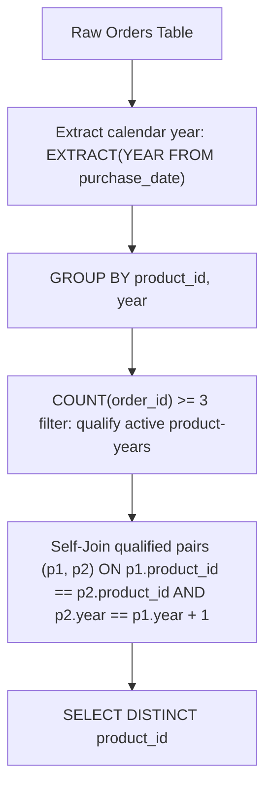

# Guided Example: Products With Three or More Orders in Two Consecutive Years

## 1. Problem Overview & Representative Instance

We are given an `Orders` relational table recording commercial purchases:
- `order_id`: unique identifier for the order record.
- `product_id`: identifier of the product purchased.
- `quantity`: units purchased in that specific order transaction.
- `purchase_date`: date on which the purchase occurred.

We are tasked with identifying all distinct `product_id`s that achieved at least three orders in each of two consecutive calendar years. Notice that the condition counts the number of distinct order events (rows in `Orders`), not the sum of units (`quantity`). Two years are defined as consecutive if their numerical calendar year difference is exactly $1$ ($y_2 = y_1 + 1$).

Consider the representative database instance:

| `order_id` | `product_id` | `quantity` | `purchase_date` |
|---|---|---|---|
| 1 | 1 | 7 | 2020-03-16 |
| 2 | 1 | 4 | 2020-12-02 |
| 3 | 1 | 7 | 2020-05-10 |
| 4 | 1 | 6 | 2021-12-23 |
| 5 | 1 | 5 | 2021-05-21 |
| 6 | 1 | 6 | 2021-10-11 |
| 7 | 2 | 6 | 2022-10-11 |

Analyzing by product and calendar year:
- **Product 1:**
  - In calendar year $2020$: orders with IDs $1, 2, 3$ were placed. Total order count $= 3 \ge 3$.
  - In calendar year $2021$: orders with IDs $4, 5, 6$ were placed. Total order count $= 3 \ge 3$.
  - Because $2021 - 2020 = 1$, Product 1 achieved $\ge 3$ orders across two consecutive calendar years.
- **Product 2:**
  - In calendar year $2022$: only order ID $7$ was placed. Total order count $= 1 < 3$. Product 2 fails the threshold.

Thus, the final query returns solely Product $1$:

| `product_id` |
|---|
| 1 |

---

## 2. Mathematical & Algorithmic Principles

### Relational Reduction: Grouping, Filtering, and Temporal Equijoin

Let $\mathcal{O}$ denote the multiset of tuples $(o, p, q, d) \in \text{Orders}$.
1. **Year Projection:** We define the calendar year extraction function $\pi_{\text{year}}(d) = \lfloor d / 365.25 \rfloor$ (standard calendar year extraction $\text{EXTRACT}(\text{YEAR FROM } d)$).
2. **Cardinality Aggregation:** For each product $p$ and calendar year $y$, the order cardinality is:
   $$C(p, y) = |\{ (o, p', q, d) \in \mathcal{O} : p' = p \land \pi_{\text{year}}(d) = y \}|$$
3. **Qualification Set:** We filter for pairs satisfying the minimum threshold of three transactions:
   $$\mathcal{Q} = \{ (p, y) : C(p, y) \ge 3 \}$$
4. **Consecutive Year Equijoin:** The final output set of product identifiers $\mathcal{S}$ is obtained by projecting onto products that admit an adjacent pair in $\mathcal{Q}$:
   $$\mathcal{S} = \{ p : \exists y \text{ such that } (p, y) \in \mathcal{Q} \land (p, y + 1) \in \mathcal{Q} \}$$

| Relational Operator | Input Relation | Output Schema | Invariant Preserved |
|---|---|---|---|
| Aggregation (`GROUP BY 1, 2`) | Raw `Orders` rows | `(product_id, year, count)` | Exactly one summary row per product per year |
| Predicate Filter (`HAVING COUNT >= 3`) | Aggregated rows | Qualified pairs $\mathcal{Q}$ | Discards years with $< 3$ order events |
| Self-Join (`p1.y = p2.y - 1`) | $\mathcal{Q} \times \mathcal{Q}$ | Qualified consecutive pairs | Verifies adjacent calendar year continuity |
| Distinct Projection (`DISTINCT`) | Joined pairs | Set of unique `product_id` | Deduplicates products qualifying in multiple spans |

---

## 3. Step-by-Step Walkthrough with Intermediate State

Let us trace the relational evaluation on the sample data.

### Step 1: Calendar Year Extraction and Aggregation
We evaluate each record in `Orders`, extracting the calendar year from `purchase_date`, and group by `(product_id, year)`:
- Record $1$: `(p=1, date=2020-03-16)` $\implies (1, 2020)$
- Record $2$: `(p=1, date=2020-12-02)` $\implies (1, 2020)$
- Record $3$: `(p=1, date=2020-05-10)` $\implies (1, 2020)$
- Record $4$: `(p=1, date=2021-12-23)` $\implies (1, 2021)$
- Record $5$: `(p=1, date=2021-05-21)` $\implies (1, 2021)$
- Record $6$: `(p=1, date=2021-10-11)` $\implies (1, 2021)$
- Record $7$: `(p=2, date=2022-10-11)` $\implies (2, 2022)$

Aggregated groups:
- $(p=1, y=2020) \to \text{count} = 3$
- $(p=1, y=2021) \to \text{count} = 3$
- $(p=2, y=2022) \to \text{count} = 1$

### Step 2: Threshold Filtering
Filtering for groups with $\text{count} \ge 3$:
- Group $(1, 2020)$ has $3 \ge 3 \implies$ Retained in $\mathcal{Q}$.
- Group $(1, 2021)$ has $3 \ge 3 \implies$ Retained in $\mathcal{Q}$.
- Group $(2, 2022)$ has $1 < 3 \implies$ Discarded.

The qualified relation $\mathcal{Q}$ contains:
$$\mathcal{Q} = \{(1, 2020), (1, 2021)\}$$

### Step 3: Self-Join for Year Adjacency
We join $\mathcal{Q}$ as $p_1$ with $\mathcal{Q}$ as $p_2$ on condition:
$$p_1.\text{product\_id} = p_2.\text{product\_id} \quad \text{AND} \quad p_2.y = p_1.y + 1$$

Testing tuples:
- Let $p_1 = (1, 2020)$. Looking for matching record with $\text{product\_id} = 1$ and $y = 2020 + 1 = 2021$.
- Record $(1, 2021)$ exists in $\mathcal{Q}$.
- Match confirmed! Product ID $1$ qualifies.

### Step 4: Projection and Deduplication
Projecting the matched `product_id` column and applying `DISTINCT` produces the singleton table:
`[1]`.

---

## 4. Comprehensive State Trace

| Product ID | Calendar Year $y$ | Order Count | Meets Threshold ($\ge 3$)? | Consecutive Successor $y+1$ in $\mathcal{Q}$? | Included in Final Result |
|---|---|---|---|---|---|
| $1$ | $2020$ | $3$ | Yes | Yes ($y=2021$ in $\mathcal{Q}$) | **Yes** |
| $1$ | $2021$ | $3$ | Yes | No ($y=2022$ not in $\mathcal{Q}$) | Handled by $2020$ link |
| $2$ | $2022$ | $1$ | No | N/A | No |

---

## 5. Algorithmic Correctness & Soundness

### Independence from Order Quantity
The business specification requires at least three distinct orders, not a sum of quantities.
- A single order for $100$ units counts as $1$ order.
- Three separate orders of $1$ unit each count as $3$ orders.
Using `COUNT(1)` accurately captures transaction occurrences, avoiding distortion from high-quantity single transactions.

### Exact Year Arithmetic and Gap Exclusion
Two years are strictly consecutive if and only if $y_2 - y_1 = 1$.
- If a product had qualifying orders in $2019$ and $2021$ but none in $2020$, $2021 - 2019 = 2 \ne 1$. The equijoin predicate $p_1.y = p_2.y - 1$ strictly rejects such non-consecutive intervals.
- The `DISTINCT` clause guarantees that products qualifying across multiple consecutive year pairs (e.g. $2020-2021$ and $2021-2022$) appear exactly once in the output.

---

## 6. Edge Cases & Anti-Patterns

### Anti-Pattern: Using Date Difference Instead of Calendar Year
A subtle trap is comparing raw date differences (e.g. `DATEDIFF(d2, d1) <= 365`). Two orders placed on December 31, 2020 and January 1, 2021 are separated by 1 day, but belong to two different calendar years. The definition requires $\ge 3$ orders *within* each calendar year, not within any rolling 365-day interval.

### Edge Case: Three or More Consecutive Years
If a product has $\ge 3$ orders in 2019, 2020, and 2021:
- The pair $(2019, 2020)$ matches.
- The pair $(2020, 2021)$ matches.
Both emit `product_id = 1`. The `SELECT DISTINCT` operator folds them into a single unique row.

### Edge Case: Multiple Orders on the Same Date
If multiple orders for a product are placed on the exact same date (e.g., three orders on `2021-05-21`), each has a distinct `order_id` primary key. `COUNT(1)` correctly counts each distinct order toward that year's total.

---

## 7. Complexity Analysis

### Time Complexity
- **Aggregation Phase:** Reading all $N$ rows in `Orders` and hashing them into groups of `(product_id, year)` takes $O(N)$ time.
- **Filtering Phase:** The number of aggregated groups $M$ is at most $N$. Filtering for counts $\ge 3$ takes $O(M) = O(N)$ time.
- **Self-Join Phase:** Joining qualified records using a hash join or B-tree index on `(product_id, year)` executes in $O(M)$ expected time.
- **Deduplication:** Hashing the resulting product IDs takes $O(M)$ time.
- **Overall Time Complexity:** $O(N)$ where $N$ is the number of rows in the `Orders` table.

### Space Complexity
- Auxiliary memory stores the intermediate CTE groups $\mathcal{Q}$ of size $M \le N$.
- **Auxiliary Space Complexity:** $O(M) \le O(N)$.
