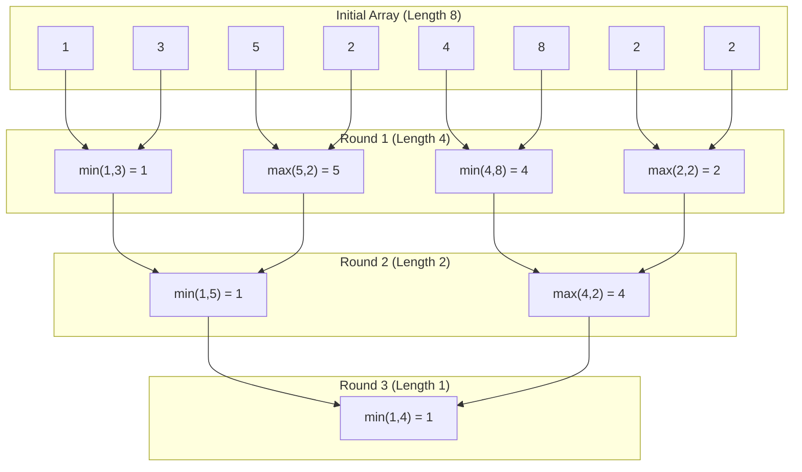

# Guided Example: Min Max Game

## 1. Problem Overview & Representative Instance

We are given a 0-indexed integer array $nums$ whose length $n$ is an exact power of $2$ ($n = 2^k$ for some integer $k \ge 0$). We execute a deterministic reduction tournament until only a single element remains. In each reduction round, an array of length $m$ is transformed into a new array of length $m / 2$ according to the following alternating selection rules for each index $0 \le i < m / 2$:
1. If $i$ is even ($i \equiv 0 \pmod 2$):
   $$\text{newNums}[i] = \min(nums[2i], nums[2i + 1])$$
2. If $i$ is odd ($i \equiv 1 \pmod 2$):
   $$\text{newNums}[i] = \max(nums[2i], nums[2i + 1])$$

The algorithm iteratively replaces $nums$ with $\text{newNums}$ until its length reaches $1$. We must return the final surviving number.

Consider the representative problem instance:
$$nums = [1, 3, 5, 2, 4, 8, 2, 2]$$

The array initially contains $n = 8 = 2^3$ elements. We trace the reduction process across three successive halving rounds:
- **Round 1 ($8 \to 4$ elements):**
  - $i = 0$ (even): $\min(nums[0], nums[1]) = \min(1, 3) = 1$
  - $i = 1$ (odd): $\max(nums[2], nums[3]) = \max(5, 2) = 5$
  - $i = 2$ (even): $\min(nums[4], nums[5]) = \min(4, 8) = 4$
  - $i = 3$ (odd): $\max(nums[6], nums[7]) = \max(2, 2) = 2$
  $$\text{Array after Round 1: } [1, 5, 4, 2]$$
- **Round 2 ($4 \to 2$ elements):**
  - $i = 0$ (even): $\min(1, 5) = 1$
  - $i = 1$ (odd): $\max(4, 2) = 4$
  $$\text{Array after Round 2: } [1, 4]$$
- **Round 3 ($2 \to 1$ element):**
  - $i = 0$ (even): $\min(1, 4) = 1$
  $$\text{Array after Round 3: } [1]$$

The single element remaining is $1$.

---

## 2. Mathematical & Algorithmic Principles

### Tree Contraction and In-Place Overwrite Safety

The reduction process defines a complete binary tournament tree of depth $k = \log_2 n$.
At each level $d \in [0, k - 1]$, an element at index $i$ is computed from a disjoint pair of adjacent cells in the previous level:
$$a = nums[2i], \quad b = nums[2i + 1]$$
- When $i = 0$, reading occurs at indices $0$ and $1$, and the result is written directly back to index $0$. The value at index $1$ is consumed before any subsequent iteration reads or writes it.
- For all $i \ge 1$, we observe the strict inequality:
  $$i < 2i < 2i + 1$$
  Because the write target index $i$ is strictly smaller than the source indices $2i$ and $2i + 1$, writing to $nums[i]$ only overwrites locations that have already completed their read operations in the current round.
  
Therefore, the entire sequence of reductions can be executed in place using the existing array without allocating any auxiliary buffers.

| In-Place Simulation Parameter | Mathematical Expression | Algorithmic Consequence |
|---|---|---|
| Target Write Index | $i$ | Slower cursor advancing by $1$ unit per step |
| Source Read Window | $[2i, 2i + 1]$ | Faster cursor reading $2$ units ahead |
| Overwrite Safety Condition | $i \le 2i$ (strict inequality for $i \ge 1$) | Zero risk of premature clobbering of unread data |
| Active Array Length | $m \leftarrow m / 2$ | Prefix $[0, m - 1]$ contains valid tournament state |

---

## 3. Step-by-Step Walkthrough with Intermediate State

Let us trace the in-place array transformations starting with $nums = [1, 3, 5, 2, 4, 8, 2, 2]$.

### Initial State: $m = 8$
The array has full length $8$:
$$nums = [1, 3, 5, 2, 4, 8, 2, 2]$$

### Round 1: Reduce $m = 8 \to 4$
We update active length to $m = 4$ and iterate $i$ from $0$ to $3$:
- **$i = 0$ (even):**
  - Read $nums[0] = 1, nums[1] = 3$.
  - Operation: $\min(1, 3) = 1$.
  - Write $nums[0] = 1$.
- **$i = 1$ (odd):**
  - Read $nums[2] = 5, nums[3] = 2$.
  - Operation: $\max(5, 2) = 5$.
  - Write $nums[1] = 5$.
- **$i = 2$ (even):**
  - Read $nums[4] = 4, nums[5] = 8$.
  - Operation: $\min(4, 8) = 4$.
  - Write $nums[2] = 4$.
- **$i = 3$ (odd):**
  - Read $nums[6] = 2, nums[7] = 2$.
  - Operation: $\max(2, 2) = 2$.
  - Write $nums[3] = 2$.
- Prefix of length $4$: $[1, 5, 4, 2]$. (Elements at indices $4 \dots 7$ are now inactive).

### Round 2: Reduce $m = 4 \to 2$
Active length becomes $m = 2$. We iterate $i$ from $0$ to $1$:
- **$i = 0$ (even):**
  - Read $nums[0] = 1, nums[1] = 5$.
  - Operation: $\min(1, 5) = 1$.
  - Write $nums[0] = 1$.
- **$i = 1$ (odd):**
  - Read $nums[2] = 4, nums[3] = 2$.
  - Operation: $\max(4, 2) = 4$.
  - Write $nums[1] = 4$.
- Prefix of length $2$: $[1, 4]$.

### Round 3: Reduce $m = 2 \to 1$
Active length becomes $m = 1$. We iterate $i = 0$:
- **$i = 0$ (even):**
  - Read $nums[0] = 1, nums[1] = 4$.
  - Operation: $\min(1, 4) = 1$.
  - Write $nums[0] = 1$.
- Prefix of length $1$: $[1]$.

Tournament terminates since $m = 1$.
Result is $nums[0] = 1$.

---

## 4. Comprehensive State Trace

| Round | Active Span $m$ | Index $i$ | Parity | Read Indices $(2i, 2i+1)$ | Read Values $(a, b)$ | Applied Function | Written Value $nums[i]$ |
|---|---|---|---|---|---|---|---|
| $1$ | $4$ | $0$ | Even | $(0, 1)$ | $(1, 3)$ | $\min(1, 3)$ | $1$ |
| $1$ | $4$ | $1$ | Odd | $(2, 3)$ | $(5, 2)$ | $\max(5, 2)$ | $5$ |
| $1$ | $4$ | $2$ | Even | $(4, 5)$ | $(4, 8)$ | $\min(4, 8)$ | $4$ |
| $1$ | $4$ | $3$ | Odd | $(6, 7)$ | $(2, 2)$ | $\max(2, 2)$ | $2$ |
| $2$ | $2$ | $0$ | Even | $(0, 1)$ | $(1, 5)$ | $\min(1, 5)$ | $1$ |
| $2$ | $2$ | $1$ | Odd | $(2, 3)$ | $(4, 2)$ | $\max(4, 2)$ | $4$ |
| $3$ | $1$ | $0$ | Even | $(0, 1)$ | $(1, 4)$ | $\min(1, 4)$ | $1$ |

---

## 5. Algorithmic Correctness & Soundness

### Termination Guarantee
Because $n$ is guaranteed to be a power of $2$ ($n = 2^k$), the division $m \leftarrow m / 2$ produces integers at every step:
$$2^k \to 2^{k-1} \to \dots \to 2^1 \to 2^0 = 1$$
The loop condition $m > 1$ terminates after exactly $k = \log_2 n$ rounds, guaranteeing both finite termination and that exactly one element remains at index $0$.

### Determinism and Parity Invariant
At round $r$, each index $i$ corresponds uniquely to the sub-interval $[i \cdot 2^r, (i + 1) \cdot 2^r - 1]$ of the initial array. Parity checking ($i \pmod 2$) strictly alternates whether the minimum or maximum is selected. No branches are ambiguous or dependent on external state.

---

## 6. Edge Cases & Anti-Patterns

### Anti-Pattern: Allocating Fresh Arrays Each Round
Constructing a new list `newNums` on every round incurs allocation overhead and wastes memory:
$$\frac{n}{2} + \frac{n}{4} + \dots + 1 = n - 1 \text{ additional allocations}$$
In-place simulation operates directly on `nums`, avoiding garbage collection overhead.

### Edge Case: Single Element Array ($n = 1$)
When $n = 1 = 2^0$, the loop condition $m > 1$ evaluates to false immediately. The algorithm bypasses all rounds and returns $nums[0]$, which is the correct trivial base case.

### Edge Case: Two Element Array ($n = 2$)
When $n = 2$, exactly one round executes for $i = 0$. Since $0$ is even, $\min(nums[0], nums[1])$ is returned.

---

## 7. Complexity Analysis

### Time Complexity
- In Round 1, $n/2$ comparisons are performed.
- In Round 2, $n/4$ comparisons are performed.
- In Round $k$, $1$ comparison is performed.
- Total comparisons across all rounds sum to a geometric series:
  $$\sum_{j=1}^{\log_2 n} \frac{n}{2^j} = \frac{n}{2} \left( 1 + \frac{1}{2} + \frac{1}{4} + \dots \right) = n - 1$$
- **Overall Time Complexity:** $O(n)$, which is linear in the size of the initial array.

### Space Complexity
- Executing in place requires only a few pointer and counter variables ($m, i, a, b$).
- **Auxiliary Space Complexity:** strictly $O(1)$ constant extra memory.
