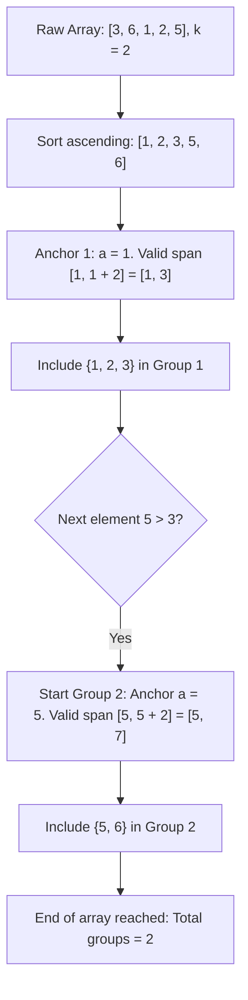

# Guided Example: Partition Array Such That Maximum Difference Is K

## 1. Problem Overview & Representative Instance

We are given an integer array $nums$ and an integer $k$. We must partition $nums$ into one or more non-empty subsequences such that each element of $nums$ appears in exactly one subsequence, and for each individual subsequence, the difference between its maximum and minimum elements does not exceed $k$:
$$\max(S) - \min(S) \le k \quad \text{for all partition blocks } S$$

Our goal is to determine the minimum number of subsequences required to satisfy this condition across the entire array.

Consider the representative problem instance:
$$nums = [3, 6, 1, 2, 5], \quad k = 2$$

Let us sort the elements in ascending numerical order:
$$nums_{\text{sorted}} = [1, 2, 3, 5, 6]$$

Tracing the partition boundaries:
- **First Subsequence Group:**
  - The smallest available element is $1$.
  - Any group containing $1$ can only include values up to $1 + k = 1 + 2 = 3$.
  - Examining candidates: $1 \le 3$, $2 \le 3$, $3 \le 3$.
  - All three values fall within the span $[1, 3]$.
  - Thus, group $S_1 = \{1, 2, 3\}$ has $\max - \min = 3 - 1 = 2 \le 2$.
- **Second Subsequence Group:**
  - The next uncovered element is $5 > 3$. It cannot join $S_1$.
  - It becomes the anchor for a new group with upper ceiling $5 + k = 5 + 2 = 7$.
  - Examining remaining candidates: $5 \le 7$ and $6 \le 7$.
  - Group $S_2 = \{5, 6\}$ has $\max - \min = 6 - 5 = 1 \le 2$.

All elements are covered using $2$ subsequences. No single subsequence can cover both $1$ and $6$ because $6 - 1 = 5 > 2$. Thus, the minimum number of subsequences is $2$.

---

## 2. Mathematical & Algorithmic Principles

### Order Independence of Subsequence Partitioning

A subsequence is formed by choosing an arbitrary subset of indices and reading them in their original left-to-right order. Crucially, the definition of a subsequence does **not** restrict which subset of elements may be chosen—any subset of array elements forms a valid subsequence when sorted by their original indices.

Consequently, partitioning an array into valid subsequences is mathematically equivalent to partitioning the multiset of values into clusters $S_1, S_2, \dots, S_m$ satisfying:
$$\max_{x \in S_j} x - \min_{x \in S_j} x \le k \quad \text{for all } j \in \{1, \dots, m\}$$

Sorting the elements does not change multiset membership or alter the minimum number of clusters required.

### Optimality of Greedy Left-Anchor Interval Stabbing

Let the sorted elements be $x_1 \le x_2 \le \dots \le x_n$.
1. **Left-Anchor Lemma:** The global minimum $x_1$ must belong to some cluster $S$. Because $\max(S) - \min(S) \le k$ and $\min(S) \ge x_1$, every element $y \in S$ must satisfy $y \le x_1 + k$.
2. **Greedy Dominance:** Suppose an optimal solution assigns a subset $S^* \subset [x_1, x_1 + k]$ to the first cluster. If we greedily expand $S^*$ to include **all** elements in the interval $[x_1, x_1 + k]$, the remaining uncovered elements form a subset of the remaining elements in the optimal solution. Removing elements from future clusters can never increase the number of clusters needed to cover the remainder.
3. Therefore, greedily covering all elements in $[x_1, x_1 + k]$ before anchoring the next interval at the smallest uncovered element is strictly optimal.

| Algorithmic State Variable | Definition | Invariant Maintained |
|---|---|---|
| Anchor $a$ | Smallest uncovered value in the current cluster | Sets the interval boundary $[a, a + k]$ |
| Probe Element $b$ | Next sorted element under inspection | Tests condition $b - a \le k$ |
| Group Counter $ans$ | Running count of allocated intervals | Tracks minimum necessary intervals |

---

## 3. Step-by-Step Walkthrough with Intermediate State

Let us trace the algorithm on $nums = [3, 6, 1, 2, 5]$ with $k = 2$.

### Step 1: Ascending Sort
We sort $nums$ in non-decreasing order:
$$nums = [1, 2, 3, 5, 6]$$

### Step 2: Initialize Greedy Pointers
- Start with the first group: $ans = 1$.
- Set first anchor: $a = nums[0] = 1$.
- Valid range for this group: $[1, 1 + 2] = [1, 3]$.

### Step 3: Sequential Scan Across Elements

- **Element $b = nums[0] = 1$:**
  - Difference $b - a = 1 - 1 = 0 \le 2$.
  - Element is covered by the current group.

- **Element $b = nums[1] = 2$:**
  - Difference $b - a = 2 - 1 = 1 \le 2$.
  - Element is covered by the current group.

- **Element $b = nums[2] = 3$:**
  - Difference $b - a = 3 - 1 = 2 \le 2$.
  - Element is covered by the current group.

- **Element $b = nums[3] = 5$:**
  - Difference $b - a = 5 - 1 = 4 > 2$.
  - $5$ cannot fit in the group anchored at $1$.
  - A new group must be started:
    - Increment group count: $ans \leftarrow ans + 1 = 2$.
    - Reset anchor to current element: $a \leftarrow 5$.
  - Valid range for new group: $[5, 5 + 2] = [5, 7]$.

- **Element $b = nums[4] = 6$:**
  - Difference $b - a = 6 - 5 = 1 \le 2$.
  - Element is covered by the new group.

### Step 4: Termination
All elements have been processed. The final value of $ans$ is $2$.

---

## 4. Comprehensive State Trace

| Iteration Index | Current Value $b$ | Active Anchor $a$ | Span Check $b - a$ | Threshold $\le k$ ($k=2$) | Decision | Updated $ans$ | Updated Anchor $a$ |
|---|---|---|---|---|---|---|---|
| Init | - | - | - | - | Initialize | $1$ | $1$ |
| $0$ | $1$ | $1$ | $0$ | True | Included in Group 1 | $1$ | $1$ |
| $1$ | $2$ | $1$ | $1$ | True | Included in Group 1 | $1$ | $1$ |
| $2$ | $3$ | $1$ | $2$ | True | Included in Group 1 | $1$ | $1$ |
| $3$ | $5$ | $1$ | $4$ | False | Start Group 2 | $2$ | $5$ |
| $4$ | $6$ | $5$ | $1$ | True | Included in Group 2 | $2$ | $5$ |

---

## 5. Algorithmic Correctness & Soundness

### Soundness of Group Feasibility
By construction, every group contains a contiguous slice $[i, j]$ of the sorted array such that:
$$nums[j] - nums[i] \le k$$
Because the array is sorted, $nums[i] \le nums[t] \le nums[j]$ for all $i \le t \le j$. Thus, for any pair $u, v \in [i, j]$, $|nums[u] - nums[v]| \le nums[j] - nums[i] \le k$. Each group is guaranteed to be valid.

### Minimality Proof via Stabbing Disjoint Sub-intervals
Let the sequence of chosen anchors be $a_1, a_2, \dots, a_m$. By definition:
$$a_2 > a_1 + k, \quad a_3 > a_2 + k, \quad \dots, \quad a_m > a_{m-1} + k$$
This implies that for any $p < q$:
$$a_q - a_p > k$$
Thus, no two anchor elements $a_p$ and $a_q$ can ever belong to the same valid subsequence. Any valid partition must place each of the $m$ distinct anchors into separate subsequences. Therefore, at least $m$ subsequences are mathematically necessary. Since the algorithm achieves exactly $m$, the solution is minimal.

---

## 6. Edge Cases & Anti-Patterns

### Anti-Pattern: Backtracking or Dynamic Programming
Because the problem mentions partitioning into subsequences, one might suspect an NP-hard set partition problem or complex DP. However, the geometric 1D metric structure combined with the unrestricted nature of subsequences makes greedy interval stabbing strictly optimal.

### Edge Case: $k = 0$
When $k = 0$, only identical values can be grouped together. The condition $b - a > 0$ triggers whenever a new distinct value appears. The answer equals the count of unique elements in $nums$.

### Edge Case: Large $k \ge \max(nums) - \min(nums)$
When $k$ spans the entire array range, $nums[n-1] - nums[0] \le k$. The anchor never changes, and the algorithm returns $1$.

---

## 7. Complexity Analysis

### Time Complexity
- **Sorting:** Sorting an array of length $n$ takes $O(n \log n)$ time.
- **Linear Scan:** The single pass over the sorted array evaluates each element in $O(1)$ time, taking $O(n)$ operations.
- **Overall Time Complexity:** $O(n \log n)$, dominated by sorting.

### Space Complexity
- In-place sorting algorithms (such as Heapsort or introsort) require $O(1)$ to $O(\log n)$ call stack space.
- Only scalar variables ($ans, a, b$) are allocated.
- **Auxiliary Space Complexity:** $O(1)$ or $O(\log n)$ depending on the sort implementation.
