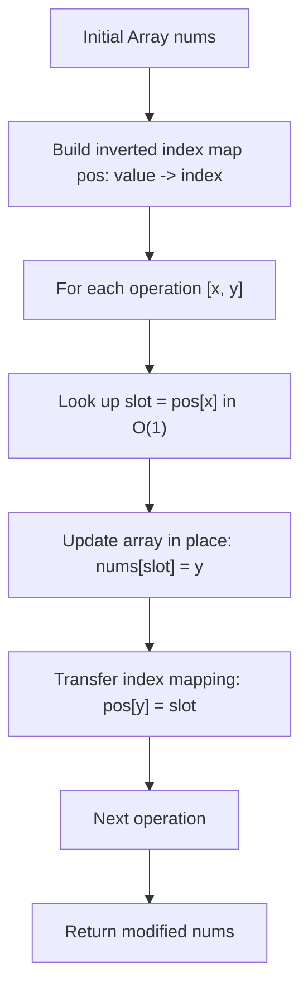

# Guided Example: Replace Elements in an Array

## 1. Problem Overview & Representative Instance

We are given a 0-indexed array $nums$ consisting of $n$ distinct positive integers, alongside a 2D array $operations$ containing $m$ sequential substitution queries. Each query is specified as an ordered pair $\text{operations}[j] = [x, y]$, directing us to locate the element currently equal to $x$ in $nums$ and replace its value with $y$.

The problem guarantees two structural invariants for every operation:
1. The target value $x$ is guaranteed to be present in $nums$ at the time the operation is executed.
2. The replacement value $y$ is guaranteed not to exist in $nums$ at the time of the operation.

Consequently, all elements in $nums$ remain pairwise distinct at all times. Our objective is to determine the final state of $nums$ after executing all $m$ operations in sequence.

Consider the representative problem instance:
$$nums = [1, 2, 4, 6], \quad operations = [[1, 3], [4, 7], [6, 1]]$$

Tracing each operation step:
- **Initial Array State:** $nums = [1, 2, 4, 6]$
  - Mapping values to their indices: $1 \to 0, \, 2 \to 1, \, 4 \to 2, \, 6 \to 3$.
- **Operation 1 ($[1, 3]$):**
  - Locate $x = 1$, which resides at index $0$.
  - Overwrite index $0$ with $y = 3$: $nums[0] = 3$.
  - Transfer index ownership: value $3$ now occupies index $0$.
  - Array state: $[3, 2, 4, 6]$.
- **Operation 2 ($[4, 7]$):**
  - Locate $x = 4$, which resides at index $2$.
  - Overwrite index $2$ with $y = 7$: $nums[2] = 7$.
  - Transfer index ownership: value $7$ now occupies index $2$.
  - Array state: $[3, 2, 7, 6]$.
- **Operation 3 ($[6, 1]$):**
  - Locate $x = 6$, which resides at index $3$.
  - Overwrite index $3$ with $y = 1$: $nums[3] = 1$. (Notice that $1$ was vacated in Operation 1 and is now legally re-introduced).
  - Transfer index ownership: value $1$ now occupies index $3$.
  - Array state: $[3, 2, 7, 1]$.

The final modified array is $[3, 2, 7, 1]$.

---

## 2. Mathematical & Algorithmic Principles

### The Fallacy of Repeated Linear Search

A naive simulation searches linearly through $nums$ for each query $[x, y]$:
$$\text{Cost of scanning } nums = O(n) \implies \text{Total runtime} = O(m \cdot n)$$
With $n, m \le 10^5$, $m \cdot n \approx 10^{10}$ operations, which severely times out.

### Inverted Index as a Dynamic Bijection

Because all elements of $nums$ remain strictly distinct, the mapping from array indices $\{0, \dots, n-1\}$ to values $\{nums[0], \dots, nums[n-1]\}$ is a bijection:
$$f : \{0, \dots, n-1\} \to \mathcal{V}_t$$
where $\mathcal{V}_t \subset \mathbb{Z}^+$ is the set of values present at time step $t$.

We maintain the inverse bijection:
$$g : \mathcal{V}_t \to \{0, \dots, n-1\}, \quad g(v) = \text{index } i \text{ such that } nums[i] = v$$

For each replacement operation $[x, y]$:
1. The target slot is obtained in $O(1)$ expected time:
   $$i = g(x)$$
2. The array is updated in place:
   $$nums[i] \leftarrow y$$
3. The inverse map is updated to reflect the substitution:
   $$g(y) \leftarrow i$$

| Hash Map State | Mathematical Domain | Invariant Maintained |
|---|---|---|
| Inverted Map $g$ | $\mathbb{Z}^+ \to \{0, \dots, n-1\}$ | Maps currently present values to their unique array index |
| Array $nums$ | Vector in $(\mathbb{Z}^+)^n$ | Holds the current permutation of values in exact spatial order |
| Target Index $i = g(x)$ | $0 \le i < n$ | Exact array slot occupied by value $x$ prior to substitution |

---

## 3. Step-by-Step Walkthrough with Intermediate State

Let us trace $nums = [1, 2, 4, 6]$ through $operations = [[1, 3], [4, 7], [6, 1]]$.

### Step 1: Initialize Inverted Index
Construct map $pos$ associating each initial number with its array coordinate:
- $nums[0] = 1 \implies pos[1] = 0$
- $nums[1] = 2 \implies pos[2] = 1$
- $nums[2] = 4 \implies pos[4] = 2$
- $nums[3] = 6 \implies pos[6] = 3$
Current hash map: $\{1: 0, 2: 1, 4: 2, 6: 3\}$.

### Step 2: Execute Operation 1: $[1, 3]$
- Target value $x = 1$, replacement value $y = 3$.
- Retrieve location: $idx = pos[1] = 0$.
- Apply point write: $nums[0] = 3$.
- Reassign location: $pos[3] = 0$.
- Current array: $[3, 2, 4, 6]$.
- Active mapping: $\{3: 0, 2: 1, 4: 2, 6: 3\}$.

### Step 3: Execute Operation 2: $[4, 7]$
- Target value $x = 4$, replacement value $y = 7$.
- Retrieve location: $idx = pos[4] = 2$.
- Apply point write: $nums[2] = 7$.
- Reassign location: $pos[7] = 2$.
- Current array: $[3, 2, 7, 6]$.
- Active mapping: $\{3: 0, 2: 1, 7: 2, 6: 3\}$.

### Step 4: Execute Operation 3: $[6, 1]$
- Target value $x = 6$, replacement value $y = 1$.
- Retrieve location: $idx = pos[6] = 3$.
- Apply point write: $nums[3] = 1$.
- Reassign location: $pos[1] = 3$.
- Current array: $[3, 2, 7, 1]$.
- Active mapping: $\{3: 0, 2: 1, 7: 2, 1: 3\}$.

All operations are complete. Returning $nums = [3, 2, 7, 1]$.

---

## 4. Comprehensive State Trace

| Operation Index | Target Pair $[x, y]$ | Lookup $idx = pos[x]$ | In-Place Write | Updated Map Entry | Resulting Array $nums$ |
|---|---|---|---|---|---|
| Initialization | - | - | - | Initial build | $[1, 2, 4, 6]$ |
| $0$ | $[1, 3]$ | $pos[1] = 0$ | $nums[0] = 3$ | $pos[3] = 0$ | $[3, 2, 4, 6]$ |
| $1$ | $[4, 7]$ | $pos[4] = 2$ | $nums[2] = 7$ | $pos[7] = 2$ | $[3, 2, 7, 6]$ |
| $2$ | $[6, 1]$ | $pos[6] = 3$ | $nums[3] = 1$ | $pos[1] = 3$ | $[3, 2, 7, 1]$ |

---

## 5. Algorithmic Correctness & Soundness

### Uniqueness and Non-Ambiguity
Because $nums$ contains distinct elements initially and each replacement introduces a previously non-existent value $y$, the number of occurrences of any value in $nums$ is at all times either $0$ or $1$. Consequently, $pos[x]$ is always uniquely defined, and every element corresponds to exactly one slot.

### Re-used Value Correctness
An essential test of soundness occurs when a value that was replaced earlier is subsequently reintroduced (such as $1$ being replaced by $3$ in Operation 1, and then reintroduced in Operation 3 replacing $6$).
- When $1$ is replaced by $3$, $pos[3]$ is set to $0$.
- When $1$ is reintroduced at index $3$, $pos[1]$ is overwritten with $3$.
- Because $1$ was not in the active array between Operations 1 and 3, any stale entry in $pos[1]$ is safely overwritten with the new index $3$. No collision occurs.

---

## 6. Edge Cases & Anti-Patterns

### Anti-Pattern: Value-to-Value Forwarding Graph
One might attempt to build a chain graph $1 \to 3$ and resolve final values after reading all operations. However, if a value appears as both a target and a replacement at different time steps (e.g. $1 \to 3$ then $6 \to 1$), the dependencies form cycles or time-dependent state mutations that require complex topological timestamps. Immediate in-place array updates with an inverted index eliminate this entire class of dependency bugs.

### Edge Case: Single Element Array ($n = 1$)
If $n = 1$ with $nums = [10]$ and operations $[[10, 20], [20, 30]]$, the single slot $0$ is updated repeatedly: $pos[10]=0 \to pos[20]=0 \to pos[30]=0$. The array correctly ends with $[30]$.

### Edge Case: Identity or Long Transitive Chains
A chain of operations $a \to b \to c \to d$ successively moves the value at that position through multiple identities, each step taking $O(1)$ and leaving the correct final value.

---

## 7. Complexity Analysis

### Time Complexity
- **Map Initialization:** Iterating over $nums$ of size $n$ to populate the hash map takes $O(n)$ time.
- **Processing Operations:** For each of the $m$ operations, hash map lookup $pos[x]$, array indexing $nums[i] = y$, and map insertion $pos[y] = i$ take $O(1)$ average time.
- Total processing time across $m$ operations is $O(m)$.
- **Overall Time Complexity:** $O(n + m)$, which is strictly linear and optimal.

### Space Complexity
- The hash table $pos$ stores at most $n + m$ key-value pairs across the entire execution (or exactly $n$ if replaced keys are pruned).
- **Auxiliary Space Complexity:** $O(n + m)$ (or $O(n)$ with key deletion).
