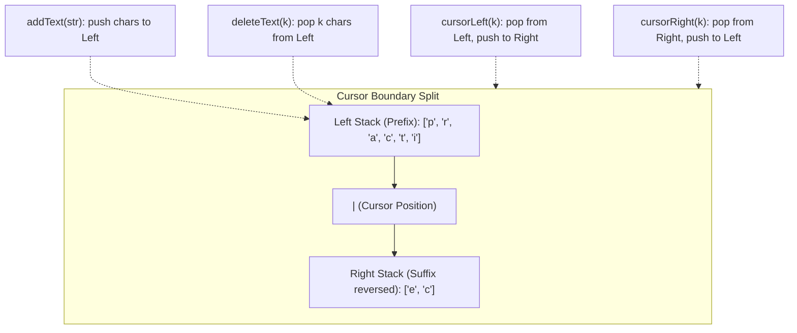

# Guided Example: Design a Text Editor

## 1. Problem Overview & Representative Instance

We are tasked with designing an in-memory text editor that manages a dynamic sequence of characters with an active cursor. The editor supports four primary operations:
1. **`addText(text)`**: Appends the string $text$ immediately to the left of the cursor. The cursor shifts rightward, ending up immediately after the newly inserted text.
2. **`deleteText(k)`**: Deletes up to $k$ characters situated immediately to the left of the cursor. If fewer than $k$ characters precede the cursor, all preceding characters are deleted. Returns the actual count of deleted characters.
3. **`cursorLeft(k)`**: Moves the cursor $k$ positions to the left (clamped to position $0$ if $k$ exceeds the number of preceding characters). Returns a string representing the last $\min(10, L)$ characters to the left of the new cursor position, where $L$ is the count of characters to the left.
4. **`cursorRight(k)`**: Moves the cursor $k$ positions to the right (clamped to the end of the text if $k$ exceeds the remaining suffix). Returns the last $\min(10, L)$ characters to the left of the new cursor position.

Consider the representative problem instance:
- Operations sequence:
  1. `TextEditor()`: Initialize an empty editor.
  2. `addText("leetcode")`: Insert `"leetcode"`.
  3. `deleteText(4)`: Delete $4$ characters preceding cursor.
  4. `addText("practice")`: Insert `"practice"`.
  5. `cursorRight(3)`: Shift cursor right by $3$.
  6. `cursorLeft(8)`: Shift cursor left by $8$.
  7. `deleteText(10)`: Delete up to $10$ characters preceding cursor.
  8. `cursorLeft(2)`: Shift cursor left by $2$.
  9. `cursorRight(6)`: Shift cursor right by $6$.

Traced outcomes:
- `addText("leetcode")` $\implies$ text is `"leetcode|"`.
- `deleteText(4)` $\implies$ deletes `'c', 'o', 'd', 'e'`. Returns $4$. Text is `"leet|"`.
- `addText("practice")` $\implies$ text is `"leetpractice|"`.
- `cursorRight(3)` $\implies$ cursor already at rightmost boundary. Last $10$ characters: `"etpractice"`.
- `cursorLeft(8)` $\implies$ moves before `'p'`. Text is `"leet|practice"`. Last $10$ chars to left: `"leet"`.
- `deleteText(10)` $\implies$ deletes all $4$ characters before cursor (`'l', 'e', 'e', 't'`). Returns $4$. Text is `"|practice"`.
- `cursorLeft(2)` $\implies$ cursor already at index $0$. Returns `""`.
- `cursorRight(6)` $\implies$ shifts right past $6$ characters. Text is `"practi|ce"`. Returns `"practi"`.

---

## 2. Mathematical & Algorithmic Principles

### Dual-Stack (Zipper / Gap Buffer) Paradigm

Maintaining a single contiguous string or array requires shifting $O(N)$ characters on every insertion or deletion at the cursor, leading to $O(N \cdot Q)$ worst-case time for $Q$ operations.

Instead, we represent the text as two independent LIFO stacks partitioned at the cursor position:
1. **`left` Stack:** Contains all characters preceding the cursor in left-to-right order, with the character immediately left of the cursor at the top of the stack.
2. **`right` Stack:** Contains all characters following the cursor, stored in reverse order such that the character immediately right of the cursor is at the top of the stack.

### Operation Mechanics

- **Insertion (`addText`):** Pushing a character to the left of the cursor corresponds to appending directly to `left`:
  $$\text{left.push}(c) \quad \text{for } c \in text$$
  Cost: $O(|text|)$.
- **Deletion (`deleteText`):** Removing $k$ characters left of the cursor corresponds to popping $\min(k, |\text{left}|)$ elements from `left`:
  $$\text{left.pop}() \quad \min(k, |\text{left}|) \text{ times}$$
  Cost: $O(\min(k, |\text{left}|))$.
- **Cursor Motion (`cursorLeft` / `cursorRight`):**
  Moving left by $1$ unit transfers the top of `left` to `right`:
  $$\text{right.push}(\text{left.pop}())$$
  Moving right by $1$ unit transfers the top of `right` to `left`:
  $$\text{left.push}(\text{right.pop}())$$
- **Suffix Extraction:** Reading the last $10$ characters left of the cursor is an inspection of the top $10$ elements of `left`:
  $$\text{left}[\max(0, |\text{left}| - 10) \dots |\text{left}| - 1]$$
  Cost: $O(1)$ constant time (at most $10$ characters).

| Operation | Array / String Naive | Doubly Linked List | Dual-Stack (Zipper) |
|---|---|---|---|
| `addText(text)` | $O(N + \lvert text \rvert)$ | $O(\lvert text \rvert)$ | $O(\lvert text \rvert)$ |
| `deleteText(k)` | $O(N)$ | $O(k)$ | $O(k)$ |
| `cursorLeft(k)` | $O(1)$ | $O(k)$ | $O(k)$ |
| `cursorRight(k)` | $O(1)$ | $O(k)$ | $O(k)$ |
| Memory Overhead | $O(N)$ | $3 \times$ pointer overhead per char | Minimal amortized vector storage |

---

## 3. Step-by-Step Walkthrough with Intermediate State

Let us trace the operations on the dual stacks `left` and `right`.

### Step 1: `TextEditor()`
- `left = []`
- `right = []`

### Step 2: `addText("leetcode")`
- Characters `'l', 'e', 'e', 't', 'c', 'o', 'd', 'e'` pushed to `left`.
- `left = ['l', 'e', 'e', 't', 'c', 'o', 'd', 'e']`
- `right = []`
- Output: `null`

### Step 3: `deleteText(4)`
- Available characters in `left`: $8 \ge 4$. Delete count $= 4$.
- Pop $4$ characters from `left`: `'e', 'd', 'o', 'c'`.
- `left = ['l', 'e', 'e', 't']`
- Output: $4$

### Step 4: `addText("practice")`
- Append characters of `"practice"` to `left`.
- `left = ['l', 'e', 'e', 't', 'p', 'r', 'a', 'c', 't', 'i', 'c', 'e']`
- `right = []`
- Output: `null`

### Step 5: `cursorRight(3)`
- `right` is empty ($|\text{right}| = 0$).
- Movable steps: $\min(3, 0) = 0$. Cursor does not shift.
- Last $\min(10, 12) = 10$ characters of `left`:
  $$\text{left}[2 \dots 11] = \text{"etpractice"}$$
- Output: `"etpractice"`

### Step 6: `cursorLeft(8)`
- Movable steps: $\min(8, |\text{left}|) = \min(8, 12) = 8$.
- Transfer $8$ elements from `left` to `right`:
  - Pop from `left` and push to `right`: `'e', 'c', 'i', 't', 'c', 'a', 'r', 'p'`.
- `left = ['l', 'e', 'e', 't']`
- `right = ['e', 'c', 'i', 't', 'c', 'a', 'r', 'p']` (top is `'p'`)
- Last $\min(10, 4) = 4$ characters of `left`: `"leet"`.
- Output: `"leet"`

### Step 7: `deleteText(10)`
- Movable deletions: $\min(10, |\text{left}|) = \min(10, 4) = 4$.
- Pop all $4$ characters from `left`.
- `left = []`
- Output: $4$

### Step 8: `cursorLeft(2)`
- Movable steps: $\min(2, 0) = 0$.
- `left = []`
- Output: `""`

### Step 9: `cursorRight(6)`
- Movable steps: $\min(6, |\text{right}|) = \min(6, 8) = 6$.
- Transfer $6$ elements from `right` to `left`:
  - Popped from `right`: `'p', 'r', 'a', 'c', 't', 'i'`.
  - Pushed to `left`: `'p', 'r', 'a', 'c', 't', 'i'`.
- `left = ['p', 'r', 'a', 'c', 't', 'i']`
- `right = ['e', 'c']` (top is `'c'`)
- Last $\min(10, 6) = 6$ characters of `left`: `"practi"`.
- Output: `"practi"`

---

## 4. Comprehensive State Trace

| Operation Call | Arguments | Actual Shift / Deltas | `left` Stack State | `right` Stack State | Result Emitted |
|---|---|---|---|---|---|
| `TextEditor` | `()` | - | `[]` | `[]` | `null` |
| `addText` | `"leetcode"` | $+8$ chars to `left` | `['l','e','e','t','c','o','d','e']` | `[]` | `null` |
| `deleteText` | $4$ | $-4$ chars from `left` | `['l','e','e','t']` | `[]` | $4$ |
| `addText` | `"practice"` | $+8$ chars to `left` | `['l','e','e','t','p','r','a','c','t','i','c','e']` | `[]` | `null` |
| `cursorRight`| $3$ | $0$ (boundary hit) | `['l','e','e','t','p','r','a','c','t','i','c','e']` | `[]` | `"etpractice"` |
| `cursorLeft` | $8$ | $8$ transferred $L \to R$ | `['l','e','e','t']` | `['e','c','i','t','c','a','r','p']` | `"leet"` |
| `deleteText` | $10$ | $-4$ chars from `left` | `[]` | `['e','c','i','t','c','a','r','p']` | $4$ |
| `cursorLeft` | $2$ | $0$ (boundary hit) | `[]` | `['e','c','i','t','c','a','r','p']` | `""` |
| `cursorRight`| $6$ | $6$ transferred $R \to L$ | `['p','r','a','c','t','i']` | `['e','c']` | `"practi"` |

---

## 5. Algorithmic Correctness & Soundness

### Invariant Preservation
At every instant:
1. The concatenated sequence $\text{left} + \text{reversed}(\text{right})$ strictly equals the complete textual document.
2. The cursor sits exactly at the interface between `left` and `right`.
3. Moving left moves characters across the boundary from `left` to `right` without altering character identities.
4. Moving right moves characters across the boundary from `right` to `left` without altering character identities.
5. All operations are strictly localized to the boundary: only top-of-stack elements are accessed or manipulated.

### Suffix Truncation Rule
The return value of cursor movement requires the last $\min(10, |\text{left}|)$ characters. Slicing the suffix `left[-10:]` runs in $O(1)$ time because $10$ is a small constant, guaranteeing instantaneous query responses.

---

## 6. Edge Cases & Anti-Patterns

### Anti-Pattern: Monolithic Dynamic String Splicing
Using `str = str[:cursor] + text + str[cursor:]` copies the entire text on every insertion and deletion. For $40\,000$ operations with text length reaching $40\,000$, total character copies exceed $10^9$, causing Time Limit Exceeded.

### Edge Case: Deleting Beyond Left Boundary
When $k > |\text{left}|$, the editor must delete all preceding characters and return $|\text{left}|$, rather than crashing with an empty-stack pop error. Clamping $k \leftarrow \min(k, |\text{left}|)$ ensures safety.

### Edge Case: Cursor Navigation at Boundaries
When cursor is at index $0$, `cursorLeft` transfers $0$ elements. When cursor is at the end ($|\text{right}| = 0$), `cursorRight` transfers $0$ elements. Clamping prevents index-out-of-bounds exceptions.

---

## 7. Complexity Analysis

### Time Complexity
- **`addText(text)`:** Appending $|text|$ characters to `left` takes $O(|text|)$ amortized time.
- **`deleteText(k)`:** Popping at most $k$ elements takes $O(k)$ time.
- **`cursorLeft(k)`:** Transferring at most $k$ elements between stacks takes $O(k)$ time; extracting the $10$-character suffix takes $O(1)$ time. Total time $O(k)$.
- **`cursorRight(k)`:** Transferring at most $k$ elements between stacks takes $O(k)$ time; extracting the $10$-character suffix takes $O(1)$ time. Total time $O(k)$.
- Because each character is inserted once and moved between stacks only when traversed by the cursor, all operations run in optimal time proportional to their operation parameter.

### Space Complexity
- The two stacks store the total text length $N$ characters without auxiliary copies.
- Suffix extraction creates a temporary string of length at most $10$.
- **Total Auxiliary Space Complexity:** strictly $O(N)$ where $N$ is the total text length.
