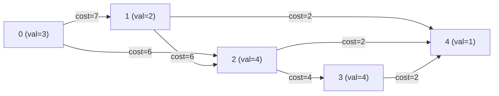

# Guided Example: Jump Game VIII

## 1. Problem Overview & Representative Instance

We are given two 0-indexed integer arrays $nums$ and $costs$, each of length $n$. We begin at index $0$ with an initial accumulated cost of $0$ and must reach the terminal index $n - 1$. 

From any current position $i$, a forward jump to a higher index $j > i$ is permitted if and only if at least one of two transition criteria is met:
1. **Upward Boundary Condition:** $nums[i] \le nums[j]$, and all intermediate elements strictly lie below $nums[i]$:
   $$\forall k \in (i, j), \quad nums[k] < nums[i]$$
2. **Downward Boundary Condition:** $nums[i] > nums[j]$, and all intermediate elements are at least $nums[i]$:
   $$\forall k \in (i, j), \quad nums[k] \ge nums[i]$$

Making a jump from $i$ to $j$ incurs an additional cost of $costs[j]$. Our goal is to determine the minimum total cost required to navigate from index $0$ to index $n - 1$.

Consider the representative problem instance:
$$nums = [3, 2, 4, 4, 1], \quad costs = [3, 7, 6, 4, 2]$$

Analyzing the jump possibilities from each index:
- **From Index $0$ ($nums[0] = 3$):**
  - Upward jump: the first rightward index with value $\ge 3$ is index $2$ ($nums[2] = 4 \ge 3$). The only intermediate is $nums[1] = 2 < 3$. Valid jump $0 \to 2$.
  - Downward jump: the first rightward index with value $< 3$ is index $1$ ($nums[1] = 2 < 3$). There are no intermediates. Valid jump $0 \to 1$.
- **From Index $1$ ($nums[1] = 2$):**
  - Upward jump: first element $\ge 2$ is index $2$ ($nums[2] = 4$). Valid jump $1 \to 2$.
  - Downward jump: first element $< 2$ is index $4$ ($nums[4] = 1$). Intermediates are $nums[2] = 4 \ge 2$ and $nums[3] = 4 \ge 2$. Valid jump $1 \to 4$.
- **From Index $2$ ($nums[2] = 4$):**
  - Upward jump: first element $\ge 4$ is index $3$ ($nums[3] = 4$). Valid jump $2 \to 3$.
  - Downward jump: first element $< 4$ is index $4$ ($nums[4] = 1$). Intermediate $nums[3] = 4 \ge 4$. Valid jump $2 \to 4$.
- **From Index $3$ ($nums[3] = 4$):**
  - Downward jump: first element $< 4$ is index $4$ ($nums[4] = 1$). Valid jump $3 \to 4$.

Evaluating paths to reach $n - 1 = 4$:
- Path $1$: $0 \to 1 \to 4 \implies \text{Cost} = costs[1] + costs[4] = 7 + 2 = 9$.
- Path $2$: $0 \to 2 \to 4 \implies \text{Cost} = costs[2] + costs[4] = 6 + 2 = 8$.
- Path $3$: $0 \to 2 \to 3 \to 4 \implies \text{Cost} = 6 + 4 + 2 = 12$.

The minimum achievable cost is $8$.

---

## 2. Mathematical & Algorithmic Principles

### Out-Degree Boundedness: At Most Two Candidate Jumps Per Index

A naive graph construction tests all $O(n^2)$ pairs $(i, j)$ and inspects intermediate subarrays, requiring $O(n^3)$ operations. However, the problem conditions strictly constrain the out-degree of every vertex to at most $2$:

1. **Next Greater or Equal Element (NGE):**
   Condition 1 requires $nums[j] \ge nums[i]$ and $nums[k] < nums[i]$ for all $i < k < j$.
   - Suppose such a $j$ exists. By definition, $j$ is the **earliest** index to the right of $i$ with $nums[j] \ge nums[i]$.
   - If we attempt to jump to any further index $j' > j$ with $nums[j'] \ge nums[i]$, the index $j$ itself acts as an intermediate element ($i < j < j'$), but $nums[j] \ge nums[i]$, directly violating the condition that all intermediates must be strictly smaller than $nums[i]$.
   - Hence, Condition 1 admits at most **one** target: the immediate Next Greater or Equal element.

2. **Next Strictly Smaller Element (NSE):**
   Condition 2 requires $nums[j] < nums[i]$ and $nums[k] \ge nums[i]$ for all $i < k < j$.
   - By identical logic, $j$ must be the **earliest** index to the right of $i$ with $nums[j] < nums[i]$.
   - Any further index $j'' > j$ would have $j$ as an intermediate element with $nums[j] < nums[i]$, violating the requirement that all intermediates be $\ge nums[i]$.
   - Hence, Condition 2 admits at most **one** target: the immediate Next Strictly Smaller element.

Therefore, the jump relations define a directed acyclic graph (DAG) where $|V| = n$ and $|E| \le 2n$.

### Dual Monotonic Stacks and Topological Dynamic Programming

We precompute the two edges for every index $i$ in $O(n)$ time using two monotonic stack passes:
- **NGE Pass (Right-to-Left):** Maintain a monotonic stack of candidate targets. To find the first element $\ge nums[i]$, pop all stack elements strictly smaller than $nums[i]$. The top of the stack is the target.
- **NSE Pass (Right-to-Left):** Maintain a monotonic stack. To find the first element $< nums[i]$, pop all stack elements $\ge nums[i]$. The top of the stack is the target.

Once edges are established, the natural topological order of the DAG is the spatial order $0, 1, \dots, n-1$ (since all edges satisfy $i < j$). We compute single-source shortest path via 1D DP:
$$f[j] = \min_{(i, j) \in E} (f[i] + costs[j])$$

| Algorithmic Stage | Mechanism | Complexity | Invariant Maintained |
|---|---|---|---|
| NGE Edge Generation | Decreasing monotonic stack | $O(n)$ | Edge $i \to j$ points to leftmost index with $nums[j] \ge nums[i]$ |
| NSE Edge Generation | Increasing monotonic stack | $O(n)$ | Edge $i \to j$ points to leftmost index with $nums[j] < nums[i]$ |
| Dynamic Programming | Forward relaxation over DAG | $O(n)$ | $f[i]$ stores proven minimal cost from $0$ to $i$ |

---

## 3. Step-by-Step Walkthrough with Intermediate State

Let us trace the computation for $nums = [3, 2, 4, 4, 1]$ and $costs = [3, 7, 6, 4, 2]$.

### Step 1: Precomputing Edges via Monotonic Stacks
- **NGE Pass (candidates $\ge nums[i]$):**
  - $i = 4$ ($nums=1$): stack empty. Stack: $[4]$.
  - $i = 3$ ($nums=4$): pop $4$ ($1 < 4$). Stack empty. Stack: $[3]$.
  - $i = 2$ ($nums=4$): top is $3$ ($nums[3]=4 \ge 4$). Edge $2 \to 3$. Stack: $[3, 2]$.
  - $i = 1$ ($nums=2$): top is $2$ ($nums[2]=4 \ge 2$). Edge $1 \to 2$. Stack: $[3, 2, 1]$.
  - $i = 0$ ($nums=3$): pop $1$ ($2 < 3$). Top is $2$ ($nums[2]=4 \ge 3$). Edge $0 \to 2$. Stack: $[3, 2, 0]$.
- **NSE Pass (candidates $< nums[i]$):**
  - $i = 4$ ($nums=1$): stack empty. Stack: $[4]$.
  - $i = 3$ ($nums=4$): top is $4$ ($nums[4]=1 < 4$). Edge $3 \to 4$. Stack: $[4, 3]$.
  - $i = 2$ ($nums=4$): pop $3$ ($nums[3]=4 \ge 4$). Top is $4$ ($nums[4]=1 < 4$). Edge $2 \to 4$. Stack: $[4, 2]$.
  - $i = 1$ ($nums=2$): pop $2$ ($nums[2]=4 \ge 2$). Top is $4$ ($nums[4]=1 < 2$). Edge $1 \to 4$. Stack: $[4, 1]$.
  - $i = 0$ ($nums=3$): top is $1$ ($nums[1]=2 < 3$). Edge $0 \to 1$. Stack: $[4, 1, 0]$.

Compiled adjacency list:
- $g[0] = [2, 1]$
- $g[1] = [2, 4]$
- $g[2] = [3, 4]$
- $g[3] = [4]$
- $g[4] = []$

### Step 2: Dynamic Programming State Relaxation
Initialize $f = [0, \infty, \infty, \infty, \infty]$.

- **Process $i = 0$ ($f[0] = 0$):**
  - Relax edge $0 \to 2$: $f[2] = \min(\infty, 0 + costs[2]) = 0 + 6 = 6$.
  - Relax edge $0 \to 1$: $f[1] = \min(\infty, 0 + costs[1]) = 0 + 7 = 7$.
  - State: $f = [0, 7, 6, \infty, \infty]$.

- **Process $i = 1$ ($f[1] = 7$):**
  - Relax edge $1 \to 2$: $f[2] = \min(6, 7 + costs[2]) = \min(6, 7 + 6) = 6$.
  - Relax edge $1 \to 4$: $f[4] = \min(\infty, 7 + costs[4]) = 7 + 2 = 9$.
  - State: $f = [0, 7, 6, \infty, 9]$.

- **Process $i = 2$ ($f[2] = 6$):**
  - Relax edge $2 \to 3$: $f[3] = \min(\infty, 6 + costs[3]) = 6 + 4 = 10$.
  - Relax edge $2 \to 4$: $f[4] = \min(9, 6 + costs[4]) = \min(9, 6 + 2) = 8$.
  - State: $f = [0, 7, 6, 10, 8]$.

- **Process $i = 3$ ($f[3] = 10$):**
  - Relax edge $3 \to 4$: $f[4] = \min(8, 10 + costs[4]) = \min(8, 10 + 2) = 8$.
  - State: $f = [0, 7, 6, 10, 8]$.

- **Process $i = 4$ ($f[4] = 8$):**
  - Destination reached. Final cost is $f[4] = 8$.

---

## 4. Comprehensive State Trace

| Source Index $i$ | $nums[i]$ | Outgoing Edges $i \to j$ | Base Cost $f[i]$ | Target $j$ ($costs[j]$) | Candidate Cost $f[i] + costs[j]$ | Updated $f[j]$ |
|---|---|---|---|---|---|---|
| $0$ | $3$ | $2, 1$ | $0$ | $2$ ($6$) | $0 + 6 = 6$ | $f[2] = 6$ |
| $0$ | $3$ | $2, 1$ | $0$ | $1$ ($7$) | $0 + 7 = 7$ | $f[1] = 7$ |
| $1$ | $2$ | $2, 4$ | $7$ | $2$ ($6$) | $7 + 6 = 13$ | $f[2] = \min(6, 13) = 6$ |
| $1$ | $2$ | $2, 4$ | $7$ | $4$ ($2$) | $7 + 2 = 9$ | $f[4] = 9$ |
| $2$ | $4$ | $3, 4$ | $6$ | $3$ ($4$) | $6 + 4 = 10$ | $f[3] = 10$ |
| $2$ | $4$ | $3, 4$ | $6$ | $4$ ($2$) | $6 + 2 = 8$ | $f[4] = \min(9, 8) = 8$ |
| $3$ | $4$ | $4$ | $10$ | $4$ ($2$) | $10 + 2 = 12$ | $f[4] = \min(8, 12) = 8$ |
| $4$ | $1$ | None | $8$ | - | Terminal vertex | $f[4] = 8$ |

---

## 5. Algorithmic Correctness & Soundness

### Completeness of the Two-Edge Property
Suppose an index $k > i$ is reachable from $i$ under Condition 1. By Condition 1, all intermediate indices $m \in (i, k)$ have $nums[m] < nums[i]$. If $k$ is not the first index with $nums \ge nums[i]$, let $j \in (i, k)$ be the first such index. Then $j$ is an intermediate between $i$ and $k$ with $nums[j] \ge nums[i]$, contradicting the definition of Condition 1 for $k$. Thus, no qualifying destination beyond $j$ exists for Condition 1. Symmetrical reasoning holds for Condition 2. Hence, keeping at most these two edges captures every valid jump.

### DAG Topological Ordering Guarantee
Since every jump strictly increases the index ($i < j$), the directed graph contains no cycles. The linear index sequence $0, 1, \dots, n-1$ is a valid topological ordering. Relaxing edges in ascending order of $i$ guarantees that when index $i$ is reached, $f[i]$ is the absolute minimum cost to reach $i$.

---

## 6. Edge Cases & Anti-Patterns

### Anti-Pattern: Full Dijkstra with Priority Queue
Because the graph has $V = n$ and $E \le 2n$ and is strictly acyclic, using Dijkstra's algorithm adds an unnecessary $O(n \log n)$ factor. Simple forward DP over the topological order achieves strictly linear $O(n)$ time.

### Edge Case: Two Elements ($n = 2$)
When $n = 2$, either $nums[0] \le nums[1]$ (Condition 1) or $nums[0] > nums[1]$ (Condition 2). In either case, edge $0 \to 1$ exists with no intermediates. The result is simply $costs[1]$.

### Edge Case: All Equal Elements
When all elements in $nums$ are identical (e.g. $[5, 5, 5, 5]$), Condition 1 matches each element to its immediate right neighbor ($i \to i + 1$). The path steps through all vertices, summing costs sequentially.

---

## 7. Complexity Analysis

### Time Complexity
- **Monotonic Stack Precomputation:** Each index is pushed and popped at most once during the NGE pass and once during the NSE pass, taking $O(n)$ time.
- **Graph Construction:** At most $2n$ directed edges are stored, taking $O(n)$ time.
- **DAG DP Relaxation:** Iterating through all $n$ vertices and relaxing at most $2$ outgoing edges per vertex requires $O(n)$ operations.
- **Total Time Complexity:** $O(n)$, which is strictly linear and optimal.

### Space Complexity
- Storing adjacency list $g$ requires at most $2n$ edge entries.
- Storing the DP array $f$ requires $n$ numbers.
- Monotonic stacks hold at most $n$ indices.
- **Auxiliary Space Complexity:** strictly $O(n)$.
