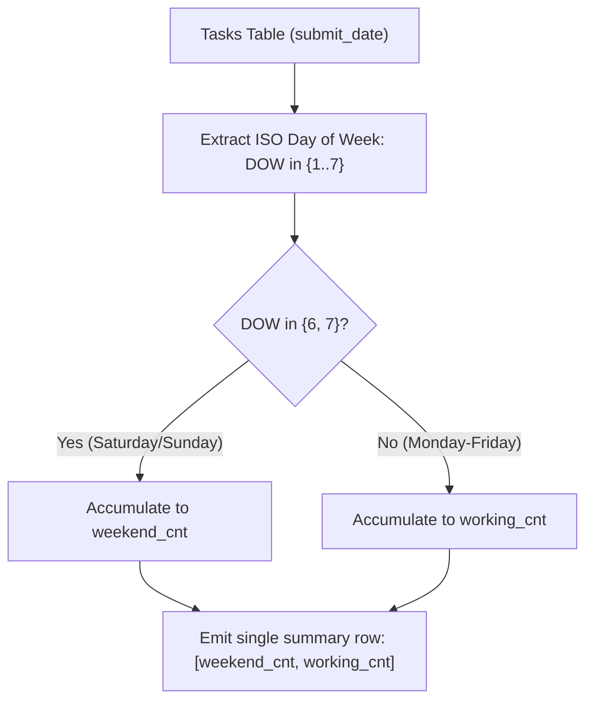

# Guided Example: Tasks Count in the Weekend

## 1. Problem Overview & Representative Instance

We are given a relational table `Tasks` recording task submissions made by assignees:
- `task_id`: unique primary key identifying the task submission.
- `assignee_id`: identifier of the user who submitted the task.
- `submit_date`: calendar date on which the task was submitted.

We are required to categorize every task submission into one of two mutually exclusive temporal partitions:
1. **Weekend Submissions (`weekend_cnt`):** Tasks submitted on either a Saturday or a Sunday.
2. **Working Day Submissions (`working_cnt`):** Tasks submitted on a weekday (Monday through Friday).

Our objective is to compute the total counts for both categories across all rows in the table, returning a single summary record with columns `weekend_cnt` and `working_cnt`.

Consider the representative database instance:

| `task_id` | `assignee_id` | `submit_date` | Day of Week | Classification |
|---|---|---|---|---|
| 1 | 1 | 2022-06-13 | Monday | Working day |
| 2 | 6 | 2022-06-14 | Tuesday | Working day |
| 3 | 6 | 2022-06-15 | Wednesday | Working day |
| 4 | 3 | 2022-06-18 | Saturday | Weekend |
| 5 | 5 | 2022-06-19 | Sunday | Weekend |
| 6 | 7 | 2022-06-19 | Sunday | Weekend |

Examining each submission:
- Task $1$ submitted on `2022-06-13` (Monday) $\implies$ working day.
- Task $2$ submitted on `2022-06-14` (Tuesday) $\implies$ working day.
- Task $3$ submitted on `2022-06-15` (Wednesday) $\implies$ working day.
- Task $4$ submitted on `2022-06-18` (Saturday) $\implies$ weekend.
- Task $5$ submitted on `2022-06-19` (Sunday) $\implies$ weekend.
- Task $6$ submitted on `2022-06-19` (Sunday) $\implies$ weekend.

Aggregating the partitioned occurrences:
$$\text{weekend\_cnt} = 1 + 1 + 1 = 3$$
$$\text{working\_cnt} = 1 + 1 + 1 = 3$$

The query outputs the single row:

| `weekend_cnt` | `working_cnt` |
|---|---|
| 3 | 3 |

---

## 2. Mathematical & Algorithmic Principles

### Calendar Projection and Modular Day Partitioning

Under the ISO 8601 calendar standard, every date $d$ maps deterministically to an integer day-of-week index:
$$\text{ISODOW}(d) \in \{1, 2, 3, 4, 5, 6, 7\}$$
where $1$ corresponds to Monday, $2$ to Tuesday, through $6$ for Saturday, and $7$ for Sunday.

The domain of all calendar days $\mathcal{D} = \{1, \dots, 7\}$ partitions into two disjoint subsets:
$$\mathcal{D}_{\text{weekend}} = \{6, 7\}, \quad \mathcal{D}_{\text{working}} = \{1, 2, 3, 4, 5\}$$
By set-theoretic complement:
$$\mathcal{D}_{\text{weekend}} \cap \mathcal{D}_{\text{working}} = \emptyset, \quad \mathcal{D}_{\text{weekend}} \cup \mathcal{D}_{\text{working}} = \mathcal{D}$$

Consequently, for every record $r \in \text{Tasks}$:
$$[\text{ISODOW}(r.submit\_date) \in \{6, 7\}] + [\text{ISODOW}(r.submit\_date) \notin \{6, 7\}] = 1$$
This guarantees that the conservation law holds:
$$\text{weekend\_cnt} + \text{working\_cnt} = |\text{Tasks}|$$

### Single-Pass Conditional Aggregation

Rather than executing two separate queries with `WHERE` filters and combining them with a Cartesian product, relational engines perform conditional aggregation in a single table scan:
$$\text{weekend\_cnt} = \sum_{r \in \text{Tasks}} \mathbf{1}_{\{\text{ISODOW}(r.submit\_date) \in \{6, 7\}\}}$$
$$\text{working\_cnt} = \sum_{r \in \text{Tasks}} \mathbf{1}_{\{\text{ISODOW}(r.submit\_date) \notin \{6, 7\}\}}$$

| Evaluation Engine | Weekend Predicate | Weekday Predicate | Aggregation Method |
|---|---|---|---|
| PostgreSQL | `EXTRACT(ISODOW FROM submit_date) IN (6, 7)` | `EXTRACT(ISODOW FROM submit_date) NOT IN (6, 7)` | `COUNT(*) FILTER (WHERE ...)` |
| MySQL | `WEEKDAY(submit_date) IN (5, 6)` | `WEEKDAY(submit_date) NOT IN (5, 6)` | `SUM(...)` |
| Standard SQL | `CASE WHEN DOW IN (6,7) THEN 1 ELSE 0 END` | `CASE WHEN DOW NOT IN (6,7) THEN 1 ELSE 0 END` | `SUM(CASE ...)` |

---

## 3. Step-by-Step Walkthrough with Intermediate State

Let us trace the row-by-row evaluation on the sample `Tasks` table.

### Row 1: `task_id = 1, submit_date = 2022-06-13`
- `2022-06-13` is a Monday $\implies \text{ISODOW} = 1$.
- Condition $\text{ISODOW} \in \{6, 7\}$ evaluates to False ($0$).
- Condition $\text{ISODOW} \notin \{6, 7\}$ evaluates to True ($1$).
- Running tallies: $\text{weekend\_cnt} = 0, \, \text{working\_cnt} = 1$.

### Row 2: `task_id = 2, submit_date = 2022-06-14`
- `2022-06-14` is a Tuesday $\implies \text{ISODOW} = 2$.
- Evaluates to working day.
- Running tallies: $\text{weekend\_cnt} = 0, \, \text{working\_cnt} = 2$.

### Row 3: `task_id = 3, submit_date = 2022-06-15`
- `2022-06-15` is a Wednesday $\implies \text{ISODOW} = 3$.
- Evaluates to working day.
- Running tallies: $\text{weekend\_cnt} = 0, \, \text{working\_cnt} = 3$.

### Row 4: `task_id = 4, submit_date = 2022-06-18`
- `2022-06-18` is a Saturday $\implies \text{ISODOW} = 6$.
- Condition $\text{ISODOW} \in \{6, 7\}$ evaluates to True ($1$).
- Condition $\text{ISODOW} \notin \{6, 7\}$ evaluates to False ($0$).
- Running tallies: $\text{weekend\_cnt} = 1, \, \text{working\_cnt} = 3$.

### Row 5: `task_id = 5, submit_date = 2022-06-19`
- `2022-06-19` is a Sunday $\implies \text{ISODOW} = 7$.
- Evaluates to weekend.
- Running tallies: $\text{weekend\_cnt} = 2, \, \text{working\_cnt} = 3$.

### Row 6: `task_id = 6, submit_date = 2022-06-19`
- `2022-06-19` is a Sunday $\implies \text{ISODOW} = 7$.
- Evaluates to weekend.
- Running tallies: $\text{weekend\_cnt} = 3, \, \text{working\_cnt} = 3$.

All rows processed. Final aggregated result: `weekend_cnt = 3, working_cnt = 3`.

---

## 4. Comprehensive State Trace

| Row | `task_id` | `submit_date` | Day Name | Numeric ISODOW | Weekend Flag ($\in \{6, 7\}$) | Working Flag ($\notin \{6, 7\}$) | Cumulative `weekend_cnt` | Cumulative `working_cnt` |
|---|---|---|---|---|---|---|---|---|
| $1$ | $1$ | `2022-06-13` | Monday | $1$ | $0$ | $1$ | $0$ | $1$ |
| $2$ | $2$ | `2022-06-14` | Tuesday | $2$ | $0$ | $1$ | $0$ | $2$ |
| $3$ | $3$ | `2022-06-15` | Wednesday | $3$ | $0$ | $1$ | $0$ | $3$ |
| $4$ | $4$ | `2022-06-18` | Saturday | $6$ | $1$ | $0$ | $1$ | $3$ |
| $5$ | $5$ | `2022-06-19` | Sunday | $7$ | $1$ | $0$ | $2$ | $3$ |
| $6$ | $6$ | `2022-06-19` | Sunday | $7$ | $1$ | $0$ | $3$ | $3$ |

---

## 5. Algorithmic Correctness & Soundness

### Robustness Against Locale and Formatting
Parsing textual day names such as `"Saturday"` or `"Sunday"` can fail in databases configured with non-English locales (e.g., `"samedi"`, `"Sonntag"`). Extracting numerical ISO day-of-week indices (`ISODOW` or `WEEKDAY`) is locale-invariant and computationally direct, preventing linguistic mismatches.

### Handling Empty Input Tables
If the `Tasks` table is completely empty ($|\text{Tasks}| = 0$):
- Standard scalar aggregation on an empty table returns a single row with count $0$ (or null mapped to $0$ via `COALESCE` or `COUNT`).
- The query emits `weekend_cnt = 0, working_cnt = 0` without crashing.

---

## 6. Edge Cases & Anti-Patterns

### Anti-Pattern: Multiple Full Table Scans with UNION or Cross Join
Writing two separate queries:
`(SELECT COUNT(*) FROM Tasks WHERE is_weekend) JOIN (SELECT COUNT(*) FROM Tasks WHERE is_working)`
forces the database engine to scan the `Tasks` storage heap twice. Conditional aggregation scans the table exactly once, halving disk I/O.

### Edge Case: Multiple Submissions by the Same Assignee
If an assignee submits multiple tasks on the same weekend date (like task $5$ and task $6$ on `2022-06-19`), each record has a distinct `task_id` and must be counted separately. The query counts task events, not distinct assignees or distinct dates.

### Edge Case: Zero Weekend or Zero Weekday Tasks
If all submissions occur on weekdays, `weekend_cnt` correctly evaluates to $0$ while `working_cnt` equals the total count of rows.

---

## 7. Complexity Analysis

### Time Complexity
- **Table Scan:** The query reads each of the $N$ rows in the `Tasks` table exactly once.
- **Date Conversion and Evaluation:** Evaluating the day-of-week function and incrementing the accumulator takes $O(1)$ constant time per row.
- **Total Time Complexity:** $O(N)$ linear time in the number of rows.

### Space Complexity
- Accumulation occurs in place using two scalar integer registers (`weekend_cnt` and `working_cnt`).
- **Auxiliary Space Complexity:** $O(1)$ constant space.
