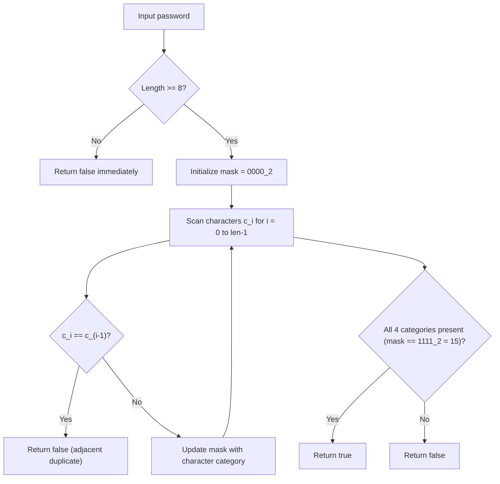

# Guided Example: Strong Password Checker II

## 1. Problem Overview & Representative Instance

We are given a string $password$ and must verify whether it satisfies the definition of a **strong password**. A password qualifies as strong if and only if it simultaneously complies with all six structural requirements:
1. **Minimum Length:** It contains at least $8$ characters ($|password| \ge 8$).
2. **Lowercase Presence:** It contains at least one lowercase English letter (`'a'` through `'z'`).
3. **Uppercase Presence:** It contains at least one uppercase English letter (`'A'` through `'Z'`).
4. **Digit Presence:** It contains at least one numeric digit (`'0'` through `'9'`).
5. **Special Character Presence:** It contains at least one special character from the predefined set:
   $$\mathcal{S} = \{ \text{'!'}, \text{'@'}, \text{'\#'}, \text{'\$'}, \text{'\%'}, \text{'\^'}, \text{'\&'}, \text{'*'}, \text{'('}, \text{')'}, \text{'-'}, \text{'+'} \}$$
6. **No Adjacent Duplicates:** It does not contain two identical characters in immediately adjacent positions ($password[i] \ne password[i - 1]$ for all $1 \le i < |password|$).

Our objective is to return `true` if all six constraints are strictly satisfied, and `false` otherwise.

Consider the representative problem instance:
$$password = \text{"IloveLe3tcode!"}$$

Testing each constraint against the instance:
- **Length Constraint:** The string has length $15 \ge 8$ (Passed).
- **Adjacent Duplicates:**
  - Pairs: `(I, l), (l, o), (o, v), (v, e), (e, L), (L, e), (e, 3), (3, t), (t, c), (c, o), (o, d), (d, e), (e, !)`
  - No adjacent characters are identical (Passed).
- **Character Class Composition:**
  - Lowercase characters: `'l', 'o', 'v', 'e', 'e', 't', 'c', 'o', 'd', 'e'` present (Passed).
  - Uppercase characters: `'I', 'L'` present (Passed).
  - Digits: `'3'` present (Passed).
  - Special characters: `'!'` present in $\mathcal{S}$ (Passed).

All six validation gates succeed. The algorithm returns `true`.

---

## 2. Mathematical & Algorithmic Principles

### Predicate Decomposition and Bitmask State Encoding

We model the validation as the conjunction of six independent boolean predicates:
$$\text{IsStrong}(P) = [|P| \ge 8] \land \left( \bigwedge_{i=1}^{|P|-1} [P[i] \ne P[i-1]] \right) \land \mathcal{C}_{\text{lower}} \land \mathcal{C}_{\text{upper}} \land \mathcal{C}_{\text{digit}} \land \mathcal{C}_{\text{special}}$$

To evaluate the four character categories simultaneously in a single pass without extra memory allocations, we maintain a 4-bit integer bitmask $\mathcal{M} \in [0, 15]$:
- Bit $0$ (Value $2^0 = 1$): Lowercase letter indicator $\mathbf{1}_{\exists c \in P, \, c \in [a-z]}$
- Bit $1$ (Value $2^1 = 2$): Uppercase letter indicator $\mathbf{1}_{\exists c \in P, \, c \in [A-Z]}$
- Bit $2$ (Value $2^2 = 4$): Digit indicator $\mathbf{1}_{\exists c \in P, \, c \in [0-9]}$
- Bit $3$ (Value $2^3 = 8$): Special character indicator $\mathbf{1}_{\exists c \in P, \, c \in \mathcal{S}}$

For each character $c = P[i]$:
1. **Adjacency Assertion:** If $i > 0$ and $c = P[i - 1]$, short-circuit and reject immediately.
2. **Bit Accumulation:** Apply bitwise OR with the corresponding class weight:
   $$\mathcal{M} \leftarrow \mathcal{M} \mid \text{category\_bit}(c)$$

At the conclusion of the string traversal, all four categories are present if and only if:
$$\mathcal{M} = 1 + 2 + 4 + 8 = 15 = 1111_2$$

| Constraint Category | Bit Weight | Numerical Contribution | Target Bit in Mask |
|---|---|---|---|
| Lowercase (`a-z`) | $2^0$ | $1$ | Mask bit $0$ |
| Uppercase (`A-Z`) | $2^1$ | $2$ | Mask bit $1$ |
| Numeric Digit (`0-9`) | $2^2$ | $4$ | Mask bit $2$ |
| Special Character ($\mathcal{S}$) | $2^3$ | $8$ | Mask bit $3$ |
| **All Categories Satisfied** | - | $15$ | $1111_2$ |

---

## 3. Step-by-Step Walkthrough with Intermediate State

Let us trace the single-pass verification on $password = \text{"IloveLe3tcode!"}$ of length $15$.

### Step 1: Pre-Screening Length
- Length $|password| = 15 \ge 8$. Condition passes.
- Initialize bitmask: $\mathcal{M} = 0$.

### Step 2: Sequential Character Evaluation

- **Index $0$, Character `'I'`:**
  - $i = 0$: no preceding character.
  - Category: Uppercase letter $\implies \mathcal{M} \leftarrow 0 \mid 2 = 2$.
- **Index $1$, Character `'l'`:**
  - Check adjacency: `'l' \ne 'I'`.
  - Category: Lowercase letter $\implies \mathcal{M} \leftarrow 2 \mid 1 = 3$.
- **Index $2$, Character `'o'`:**
  - Check adjacency: `'o' \ne 'l'`.
  - Category: Lowercase letter $\implies \mathcal{M} \leftarrow 3 \mid 1 = 3$.
- **Index $3$, Character `'v'`:**
  - Check adjacency: `'v' \ne 'o'`.
  - Category: Lowercase letter $\implies \mathcal{M} \leftarrow 3 \mid 1 = 3$.
- **Index $4$, Character `'e'`:**
  - Check adjacency: `'e' \ne 'v'`.
  - Category: Lowercase letter $\implies \mathcal{M} \leftarrow 3 \mid 1 = 3$.
- **Index $5$, Character `'L'`:**
  - Check adjacency: `'L' \ne 'e'`.
  - Category: Uppercase letter $\implies \mathcal{M} \leftarrow 3 \mid 2 = 3$.
- **Index $6$, Character `'e'`:**
  - Check adjacency: `'e' \ne 'L'`.
  - Category: Lowercase letter $\implies \mathcal{M} = 3$.
- **Index $7$, Character `'3'`:**
  - Check adjacency: `'3' \ne 'e'`.
  - Category: Numeric digit $\implies \mathcal{M} \leftarrow 3 \mid 4 = 7$.
- **Index $8$, Character `'t'`:**
  - Check adjacency: `'t' \ne '3'`.
  - Category: Lowercase letter $\implies \mathcal{M} = 7$.
- **Index $9$, Character `'c'`:**
  - Check adjacency: `'c' \ne 't'`.
  - Category: Lowercase letter $\implies \mathcal{M} = 7$.
- **Index $10$, Character `'o'`:**
  - Check adjacency: `'o' \ne 'c'`.
  - Category: Lowercase letter $\implies \mathcal{M} = 7$.
- **Index $11$, Character `'d'`:**
  - Check adjacency: `'d' \ne 'o'`.
  - Category: Lowercase letter $\implies \mathcal{M} = 7$.
- **Index $12$, Character `'e'`:**
  - Check adjacency: `'e' \ne 'd'`.
  - Category: Lowercase letter $\implies \mathcal{M} = 7$.
- **Index $13$, Character `'!'`:**
  - Check adjacency: `'!' \ne 'e'`.
  - Category: Special character $\in \mathcal{S} \implies \mathcal{M} \leftarrow 7 \mid 8 = 15$.

### Step 3: Final Verification
- All characters evaluated.
- Final bitmask value $\mathcal{M} = 15 = 1111_2$.
- Returns `true`.

---

## 4. Comprehensive State Trace

| Index $i$ | Character $c_i$ | Preceding $c_{i-1}$ | $c_i == c_{i-1}$ | Category Classification | Bit Set | Running Mask $\mathcal{M}$ | Binary Mask |
|---|---|---|---|---|---|---|---|
| $0$ | `'I'` | None | - | Uppercase | $+2$ | $2$ | $0010_2$ |
| $1$ | `'l'` | `'I'` | False | Lowercase | $+1$ | $3$ | $0011_2$ |
| $2$ | `'o'` | `'l'` | False | Lowercase | $+0$ | $3$ | $0011_2$ |
| $3$ | `'v'` | `'o'` | False | Lowercase | $+0$ | $3$ | $0011_2$ |
| $4$ | `'e'` | `'v'` | False | Lowercase | $+0$ | $3$ | $0011_2$ |
| $5$ | `'L'` | `'e'` | False | Uppercase | $+0$ | $3$ | $0011_2$ |
| $6$ | `'e'` | `'L'` | False | Lowercase | $+0$ | $3$ | $0011_2$ |
| $7$ | `'3'` | `'e'` | False | Digit | $+4$ | $7$ | $0111_2$ |
| $8$ | `'t'` | `'3'` | False | Lowercase | $+0$ | $7$ | $0111_2$ |
| $9$ | `'c'` | `'t'` | False | Lowercase | $+0$ | $7$ | $0111_2$ |
| $10$ | `'o'` | `'c'` | False | Lowercase | $+0$ | $7$ | $0111_2$ |
| $11$ | `'d'` | `'o'` | False | Lowercase | $+0$ | $7$ | $0111_2$ |
| $12$ | `'e'` | `'d'` | False | Lowercase | $+0$ | $7$ | $0111_2$ |
| $13$ | `'!'` | `'e'` | False | Special | $+8$ | $15$ | $1111_2$ |

---

## 5. Algorithmic Correctness & Soundness

### Independence and Mutual Exclusivity of Predicate Tests
The character classification predicates partition standard ASCII characters into mutually exclusive categories:
- Lowercase: $c \in ['a', 'z']$
- Uppercase: $c \in ['A', 'Z']$
- Numeric Digits: $c \in ['0', '9']$
- Special Characters: $c \in \mathcal{S}$
No character can belong to two of these classes simultaneously. The bitwise OR operation ensures that each satisfied category sets its dedicated independent bit without interfering with other bits.

### Completeness of the Short-Circuit Failure Detection
- If $|password| < 8$, returning `false` before the loop is sound because adding characters is impossible under inspection.
- If at any point $password[i] == password[i - 1]$, the violation is fatal and immutable regardless of subsequent characters; exiting immediately with `false` is provably correct.
- If the loop completes and $\mathcal{M} = 15$, every required category appeared at least once, and no adjacent duplicates existed.

---

## 6. Edge Cases & Anti-Patterns

### Anti-Pattern: Multiple Full Passes with Regular Expressions
Scanning the string with four separate regular expressions (one for lowercase, one for uppercase, etc.) traverses the string four times and does not easily integrate adjacent duplicate checks. A single sequential pass evaluates all criteria concurrently.

### Edge Case: Adjacent Identical Special Characters
A password like `"Ab1!@#!"` is valid, but `"Ab1!!@#"` has adjacent `'!'` characters at indices $3$ and $4$. The condition $c == password[i - 1]$ properly flags adjacent identical special characters, not just letters.

### Edge Case: Exact Minimum Length ($|password| = 8$)
For a string of length exactly $8$ (e.g. `"Aa1!Bb2@"`), $|password| < 8$ evaluates to false, permitting full inspection.

---

## 7. Complexity Analysis

### Time Complexity
- **Length Check:** Inspecting the length of $password$ takes $O(1)$ time.
- **Single Pass Traversal:** We iterate through each character of $password$ exactly once.
- For each character, the adjacent comparison and character classification require $O(1)$ constant-time operations.
- **Overall Time Complexity:** $O(N)$ where $N = |password|$, which is strictly linear and optimal.

### Space Complexity
- A single integer bitmask $\mathcal{M}$ and a few loop index variables are stored.
- **Auxiliary Space Complexity:** $O(1)$ constant memory.
