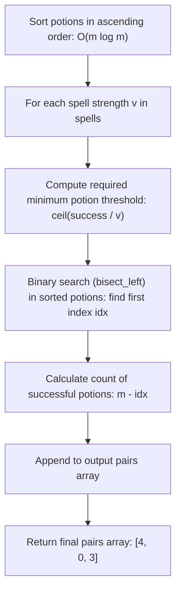

# Guided Example: Successful Pairs of Spells and Potions

## 1. Problem Overview & Representative Instance

We are given two arrays of positive integers: $spells$ of length $n$ and $potions$ of length $m$. In addition, we are given a 64-bit integer $success$. A spell $i$ and a potion $j$ form a **successful pair** if the product of their respective strengths is at least $success$:
$$spells[i] \times potions[j] \ge success$$

Our goal is to compute an integer array $pairs$ of length $n$, where each entry $pairs[i]$ is the total count of potions that can form a successful pair with the $i^{\text{th}}$ spell.

Consider the representative problem instance:
$$spells = [5, 1, 3], \quad potions = [1, 2, 3, 4, 5], \quad success = 7$$

Let us sort the potion array in ascending order:
$$potions = [1, 2, 3, 4, 5], \quad m = 5$$

Evaluating each spell individually:
- **Spell $0$ ($v = 5$):**
  - Minimum potion strength required: $p \ge \lceil 7 / 5 \rceil = 2$.
  - Potions satisfying $p \ge 2$ are $\{2, 3, 4, 5\}$, located at indices $1, 2, 3, 4$.
  - Total successful potions: $5 - 1 = 4$.
- **Spell $1$ ($v = 1$):**
  - Minimum potion strength required: $p \ge \lceil 7 / 1 \rceil = 7$.
  - The maximum potion in the inventory is $5 < 7$. No potions qualify.
  - Total successful potions: $5 - 5 = 0$.
- **Spell $2$ ($v = 3$):**
  - Minimum potion strength required: $p \ge \lceil 7 / 3 \rceil = 3$.
  - Potions satisfying $p \ge 3$ are $\{3, 4, 5\}$, located at indices $2, 3, 4$.
  - Total successful potions: $5 - 2 = 3$.

The resulting array of counts is $[4, 0, 3]$.

---

## 2. Mathematical & Algorithmic Principles

### Monotonic Suffix Property Under Sorting

For any fixed positive spell strength $v = spells[i] > 0$, the function:
$$f(p) = v \cdot p$$
is strictly monotonically increasing in potion strength $p$.

When the $potions$ array is sorted such that $potions[0] \le potions[1] \le \dots \le potions[m - 1]$:
$$v \cdot potions[0] \le v \cdot potions[1] \le \dots \le v \cdot potions[m - 1]$$

Therefore, the set of indices $j$ satisfying $v \cdot potions[j] \ge success$ forms a contiguous suffix $[idx, m - 1]$ of the array:
$$idx = \min \{ j \in [0, m - 1] : potions[j] \ge \lceil success / v \rceil \}$$
If no potion satisfies the threshold, $idx = m$.

The number of successful potions is given by:
$$\text{count} = m - idx$$

### Exact Threshold Arithmetic Without Precision Loss

The inequality $v \cdot p \ge success$ can be solved for integer $p$:
$$p \ge \left\lceil \frac{success}{v} \right\rceil = \left\lfloor \frac{success + v - 1}{v} \right\rfloor$$
Using pure integer division $\lfloor (success + v - 1) / v \rfloor$ eliminates any potential floating-point rounding errors when $success$ reaches $10^{10}$. Alternatively, in languages with 64-bit floating point, $success / v$ can be queried directly via `bisect_left`.

| Parameter | Mathematical Definition | Role in Binary Search |
|---|---|---|
| Potion Inventory | Sorted vector of length $m$ | Monotonic search domain for bisection |
| Target Threshold | $\lceil success / v \rceil$ | Probe comparison target |
| Suffix Boundary $idx$ | $\text{bisect\_left}(potions, \lceil success / v \rceil)$ | Minimal index where product threshold holds |
| Qualifying Count | $m - idx$ | Size of the satisfying rightward interval |

---

## 3. Step-by-Step Walkthrough with Intermediate State

Let us trace the binary search operations on sorted $potions = [1, 2, 3, 4, 5]$ with $success = 7$.

### Step 1: Sorting Phase
The input potions array is sorted in non-decreasing order:
$$potions = [1, 2, 3, 4, 5], \quad m = 5$$

### Step 2: Query for Spell $0$ ($v = 5$)
- Target threshold:
  $$\text{target} = \left\lceil \frac{7}{5} \right\rceil = 2$$
- Binary search for $2$ in $[1, 2, 3, 4, 5]$:
  - Probe middle index $2$: $potions[2] = 3 \ge 2$ (search left half).
  - Probe index $1$: $potions[1] = 2 \ge 2$ (search left half).
  - Probe index $0$: $potions[0] = 1 < 2$ (target is strictly to the right).
  - Insertion index converges to $idx = 1$.
- Suffix count: $m - idx = 5 - 1 = 4$.

### Step 3: Query for Spell $1$ ($v = 1$)
- Target threshold:
  $$\text{target} = \left\lceil \frac{7}{1} \right\rceil = 7$$
- Binary search for $7$ in $[1, 2, 3, 4, 5]$:
  - Every element in $potions$ is strictly smaller than $7$.
  - Insertion index converges past the end of the array: $idx = 5$.
- Suffix count: $m - idx = 5 - 5 = 0$.

### Step 4: Query for Spell $2$ ($v = 3$)
- Target threshold:
  $$\text{target} = \left\lceil \frac{7}{3} \right\rceil = 3$$
- Binary search for $3$ in $[1, 2, 3, 4, 5]$:
  - Probe middle index $2$: $potions[2] = 3 \ge 3$.
  - Probe index $1$: $potions[1] = 2 < 3$.
  - Insertion index converges to $idx = 2$.
- Suffix count: $m - idx = 5 - 2 = 3$.

### Step 5: Assembly
Aggregating individual spell counts produces $[4, 0, 3]$.

---

## 4. Comprehensive State Trace

| Spell Index $i$ | Spell Strength $v$ | Integer Ceiling $\lceil success / v \rceil$ | Binary Search Probe Sequence | Converged Index $idx$ | Qualifying Suffix Span | Count $m - idx$ |
|---|---|---|---|---|---|---|
| $0$ | $5$ | $2$ | $potions[2]=3 \to potions[1]=2 \to potions[0]=1$ | $1$ | $[1 \dots 4] \implies \{2, 3, 4, 5\}$ | $4$ |
| $1$ | $1$ | $7$ | $potions[2]=3 \to potions[4]=5 < 7$ | $5$ | $\emptyset$ | $0$ |
| $2$ | $3$ | $3$ | $potions[2]=3 \to potions[1]=2 < 3$ | $2$ | $[2 \dots 4] \implies \{3, 4, 5\}$ | $3$ |

---

## 5. Algorithmic Correctness & Soundness

### Soundness of the Monotonic Partition
Because all potion strengths are strictly positive and sorted in ascending order:
$$\forall j \ge idx, \quad potions[j] \ge potions[idx] \ge \frac{success}{v} \implies v \cdot potions[j] \ge success$$
Conversely:
$$\forall j < idx, \quad potions[j] < potions[idx] \le \frac{success}{v} \implies v \cdot potions[j] < success$$
Hence, the index $idx$ partitions the potion array into an unsuccessful prefix $[0, idx - 1]$ and a successful suffix $[idx, m - 1]$. The count $m - idx$ is mathematically exact.

### Overflow Prevention
Directly computing the product $spells[i] \cdot potions[j]$ can reach $10^5 \times 10^5 = 10^{10}$, which exceeds standard 32-bit signed integer limits ($2^{31} - 1 \approx 2.14 \times 10^9$). By dividing $success$ by $v$ before searching or by using 64-bit integer arithmetic, integer overflow is avoided.

---

## 6. Edge Cases & Anti-Patterns

### Anti-Pattern: Quadratic Nested Pair Inspection
Running nested loops `for s in spells: for p in potions:` performs $n \cdot m$ comparisons. With $n, m = 10^5$, this requires $10^{10}$ operations and results in Time Limit Exceeded. Sorting once and binary searching cuts this to $O((n + m) \log m)$.

### Edge Case: Universal Failure ($idx = m$)
When a spell is too weak to reach $success$ even with the strongest potion, $idx = m$. The subtraction $m - m = 0$ handles this without special branching.

### Edge Case: Universal Success ($idx = 0$)
When a spell is strong enough that even the weakest potion achieves $success$ ($v \cdot potions[0] \ge success$), $idx = 0$. The subtraction $m - 0 = m$ correctly includes all potions.

---

## 7. Complexity Analysis

### Time Complexity
- **Sorting Potions:** Sorting an array of $m$ elements takes $O(m \log m)$ time.
- **Binary Search Per Spell:** For each of the $n$ spells, `bisect_left` runs in $O(\log m)$ time.
- Across $n$ queries, binary search takes $O(n \log m)$ time.
- **Total Time Complexity:** $O((n + m) \log m)$, which comfortably executes well within 200 milliseconds for $n, m = 10^5$.

### Space Complexity
- Sorting $potions$ in place requires $O(1)$ to $O(\log m)$ space.
- The output array requires $O(n)$ space to store results for all spells.
- **Auxiliary Space Complexity:** $O(n)$ space (or $O(1)$ excluding output array).
