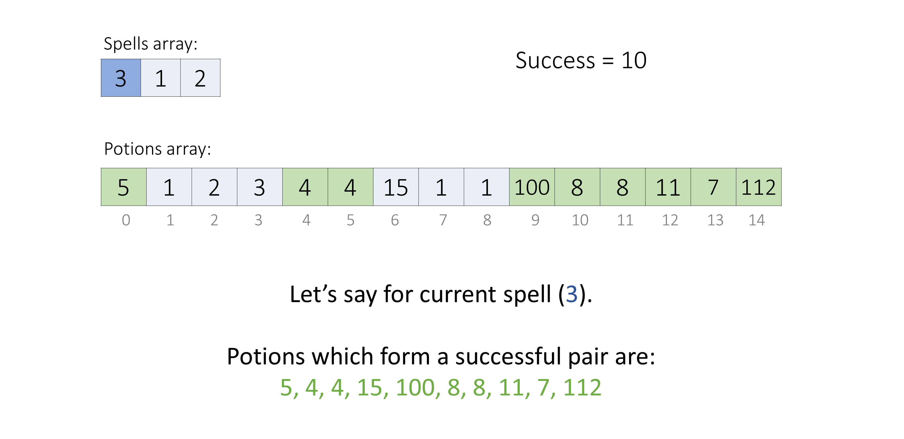
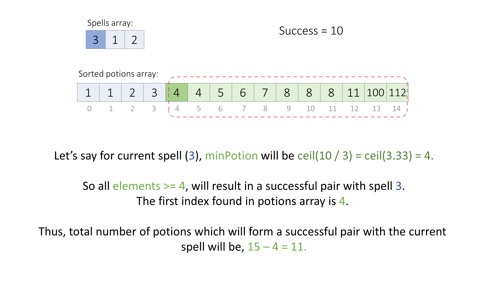
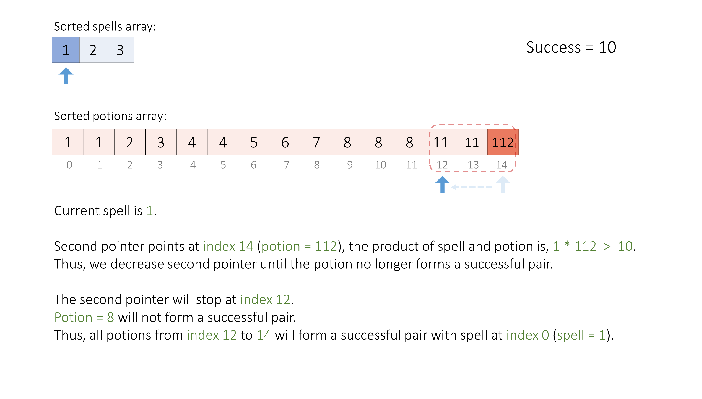
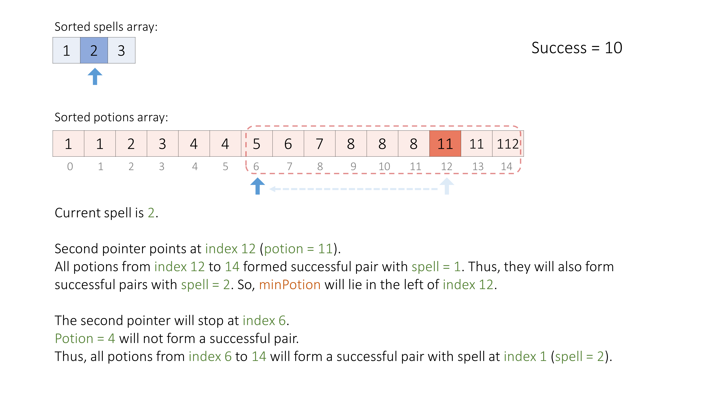

[TOC]

## Solution

---

### Overview

Given two arrays `spells` and `potions`, we need to find for each `spell` how many `potions` will form a **successful pair**.
A spell and potion pair is considered successful if the product of their strengths is at least `success`.



---

### Approach 1: Sorting + Binary Search

#### Intuition

Let's assume for a given $\text{spell}$, we have,  $\text{spell} * \text{a = success}$
So, for all $\text{x}$, where $\text{x} \geq \text{a}$, the result, $\text{spell} * \text{x}$ will always be greater than or equal to $\text{success}$.

This suggests if we know the minimum potion, `minPotion` in the `potions` array, whose product with a given `spell` is more than or equal to `success`, then all the potions which are greater than `minPotion` will also form successful pairs with it.

Now let's find what will be the value of `minPotion`.
The product of `spell` and `minPotion` will be at least `success`.

$\implies \text{spell} * \text{minPotion} \geq \text{success}$
$\implies \text{minPotion} \geq \text{success / spell}$
$\implies \text{minPotion} = \text{ceil(success / spell)}$

Now to easily search for a value in an array, we can use **binary search** if the array is sorted.
Thus, we will sort the `potions` array and search the first index `index` of `minPotion` or the element just greater than `minPotion`.

As we know all the `potions` bigger than `minPotion` will also form a successful pair with the given `spell`,
Thus, all the `potions` whose product with `spell` is greater than or equal to `success` will be all the elements from index `index` till the last element.



This sums up that, we will sort the `potions` array, then for each `spell` in the `spells` array, using binary search we will find the `index` as discussed and count all the potions from `index` till the end as successful potions for the current `spell`.

#### Algorithm

1. Sort the `potions` array in ascending order.
2. Initialize variables:
- `answer`, an array to store the result.
- `m`, length of the `potions` array.
- `maxPotion`, the maximum value in the `potions` array.
3. For each `spell` in the `spells` array:
- Calculate the minimum potion strength required to make the spell successful as `minPotion` using the formula $minPotion = ceil(success / spell)$.
- If `minPotion` is greater than `maxPotion`, store `0` in the `answer` array and continue to the next spell.
- Otherwise, find the index of the first element in the `potions` array that is greater than or equal to `minPotion` using the inbuilt lower bound methods like $\text{lower}_{bound}()$, $bisect.\text{bisect}_{left}()$, `sort.SearchInts()`, etc. or by implementing it on your own.
- Calculate the number of successful pairs possible for the current `spell` as $(m - index)$.
- Store the result in the `answer` vector.
4. Return the `answer` array which contains the number of successful pairs for each `spell`.

#### Implementation

```python
class Solution:
    def successfulPairs(self, spells: List[int], potions: List[int], success: int) -> List[int]:
        # Sort the potions array in increasing order.
        potions.sort()
        answer = []

        m = len(potions)
        maxPotion = potions[m - 1]

        for spell in spells:
            # Minimum value of potion whose product with current spell
            # will be at least success or more.
            minPotion = (success + spell - 1) // spell
            # Check if we don't have any potion which can be used.
            if minPotion > maxPotion:
                answer.append(0)
                continue
            # We can use the found potion, and all potion in its right
            # (as the right potions are greater than the found potion).
            index = bisect.bisect_left(potions, minPotion)
            answer.append(m - index)

        return answer
```

#### Complexity Analysis

Here, $n$ is the number of elements in the `spells` array, and $m$ is the number of elements in the `potions` array.

* Time complexity: $O((m + n) \cdot \log m )$
  - We sort the `potions` array which takes $O(m \log m)$ time.
  - Then, for each element of the `spells` array using binary search we find the respective `minPotion` which takes $O(\log m)$ time. So, for $n$ elements it takes $O(n \log m)$ time.
  - Thus, overall we take $O(m \log m + n \log m)$ time.

* Space complexity: $O(\log m)$ or $O(m)$
  - The output array `answer` is not considered as additional space usage.
  - But some extra space is used when we sort the `potions` array in place. The space complexity of the sorting algorithm depends on the programming language.
- In Python, the sort() method sorts a list using the Timsort algorithm which has $O(m)$ additional space where $m$ is the number of the elements.
- In C++ and Swift, the sort() function is implemented as a hybrid of Quick Sort, Heap Sort, and Insertion Sort, with a worst-case space complexity of $O(\log m)$.
- In Java, Arrays.sort() is implemented using a variant of the Quick Sort algorithm which has a space complexity of $O(\log m)$.
- In JavaScript, the space complexity of sort() is $O(\log m)$.
  - In Swift, we need to create an additional array for keeping sorted `potions` which will take $O(m)$ space.

---

### Approach 2: Sorting + Two Pointers

#### Intuition

Let's say for a given $\text{spell = a}$ and $\text{minPotion = b}$, we have,  $\text{spell} * \text{minPotion} = \text{success}$.
Then for a $\text{spell > a}$, the minimum required potion will be $\text{minPotion} \leq \text{b}$, (if we want result $\geq \text{success}$).

So, if the `spells` and `potions` arrays are sorted in increasing order,
and we know where the `minPotion` for the $i^{th}$ `spell` is present in the `potions` array, then the `minPotion` for the $(i + 1)^{th}$ `spell` will be present at the same or smaller index as for the $i^{th}$ `spell`.

We start with two pointers, **one pointing to the smallest spell** and the **other pointing to the largest potion**.
If the product of the current spell and potion is greater than or equal to `success`, then we keep on decreasing the second pointer to point to a smaller potion. We stop when they don't form a successful pair. Thus, we will have the second pointer pointing to the minimum required potion `minPotion` and we can count the number of potions that form the successful pairs with the current spell based on its index as we did in the previous approach.



Now, when we move to the next spell, as the next spell is greater than the previous spell, the potions which made a successful pair with the previous spell will also form a successful pair with the current spell (as we incremented one number in the product of two numbers, thus their product's result will also increase; it will be greater than `success`).
Thus, we just need to continue decreasing the second pointer from its previous value until it points to the minimum required potion for the current spell again to count the potions.



We continue the above steps until we cover all the spells.

#### Algorithm

1. Create an array of pairs `sortedSpells` with the first element of each pair being a spell strength and the second element being its original index in the `spells` array.
2. Sort the `sortedSpells` and the `potions` arrays in ascending order.
3. Initialize variables:
- `answer`, an array of size `spells.size()` to store the result.
- `m`, length of the `potions` array.
- `potionIndex`, an integer initialized to $m - 1$ to keep track of the index of the current potion in the `potions` array.
4. For each `spell` and its original `index` in the `sortedSpells` array:
- While we have not run out of potions and the product of the current `spell` strength and the strength of the potion at the `potionIndex` is greater than or equal to `success`, decrement `potionIndex` by `1`. We stop at `minPotion` for the current `spell`.
- Calculate the number of successful pairs possible for the current `spell` as $m - (potionIndex + 1)$ and store the result at the `index` position in the `answer` array.
5. Return the `answer` array which contains the number of successful pairs for each `spell`.

#### Implementation

```python
class Solution:
    def successfulPairs(self, spells: List[int], potions: List[int], success: int) -> List[int]:
        sortedSpells = [(spell, index) for index, spell in enumerate(spells)]

        # Sort the 'spells with index' and 'potions' array in increasing order.
        sortedSpells.sort()
        potions.sort()

        answer = [0] * len(spells)
        m = len(potions)
        potionIndex = m - 1

        # For each 'spell' find the respective 'minPotion' index.
        for spell, index in sortedSpells:
            while potionIndex >= 0 and (spell * potions[potionIndex]) >= success:
                potionIndex -= 1
            answer[index] = m - (potionIndex + 1)

        return answer
```

#### Complexity Analysis

Here, $n$ is the number of elements in the `spells` array, and $m$ is the number of elements in the `potions` array.

* Time complexity: $O(n \log n + m \log m)$
  - We create an array `sortedSpells` which takes $O(n)$ time, and then sort the `sortedSpells` and `potions` arrays which take $O(n \log n)$ and $O(m \log m)$ time respectively.
  - Then using two pointers we iterate on each element of the `sortedSpells` and `potions` arrays once which will take $O(n + m)$ time.
  - Thus, overall we take $O(n \log n + m \log m)$ time.

* Space complexity: $O(n + \log m)$ or $O(n + m)$
  - The output array `answer` is not considered as additional space usage.
  - But we create an additional array `sortedSpells` which will take $O(n)$ space.
  - And some extra space is used when we sort the `sortedSpells` and `potions` array in place. The space complexity of the sorting algorithm depends on the programming language.
- In Python, the sort() method sorts a list using the Timsort algorithm which has $O(m)$ additional space where $m$ is the number of the elements.
- In C++ and Swift, the sort() function is implemented as a hybrid of Quick Sort, Heap Sort, and Insertion Sort, with a worst-case space complexity of $O(\log m)$.
- In Java, Arrays.sort() is implemented using a variant of the Quick Sort algorithm which has a space complexity of $O(\log m)$.
- In JavaScript, the space complexity of sort() is $O(\log m)$.
  - Thus, sorting uses either $O(\log n + \log m)$ or $O(n + m)$ space.
  - In Swift, we need to create an additional array for keeping sorted `potions` which will take an additional $O(m)$ space.
  - So, overall we usem $O(n + \log n + \log m) = O(n + \log m)$ or $O(n + n + m) = O(n + m)$ space.