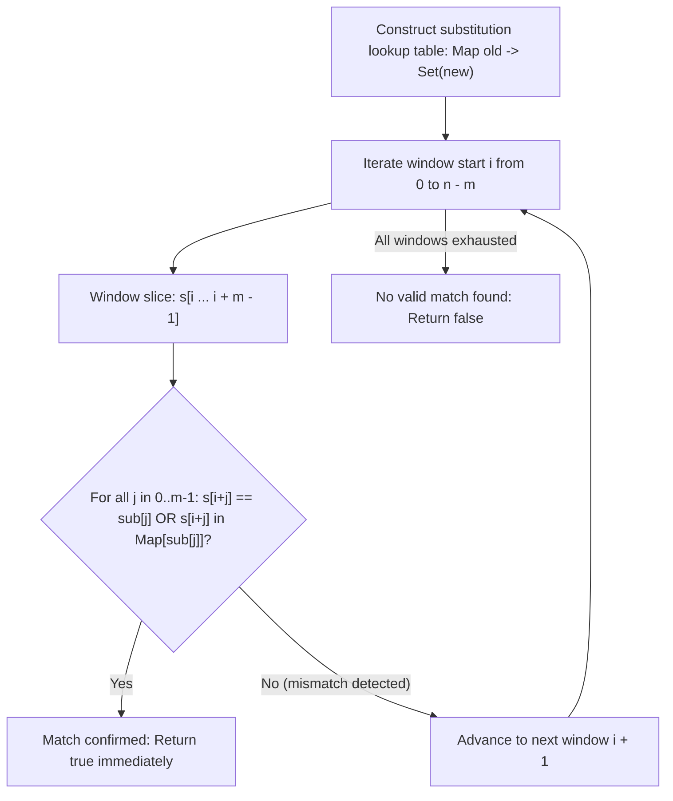

# Guided Example: Match Substring After Replacement

## 1. Problem Overview & Representative Instance

We are given two strings: a text string $s$ of length $n$ and a pattern string $sub$ of length $m$ ($m \le n$). We are also provided a 2D character array $mappings$ where each entry $mappings[k] = [\text{old}_k, \text{new}_k]$ grants permission to substitute any occurrence of character $\text{old}_k$ in $sub$ with $\text{new}_k$. Each character in $sub$ may be replaced at most once, or left unaltered.

Our objective is to determine whether it is possible to transform $sub$ into a string that appears as a contiguous substring of $s$. If any valid alignment in $s$ can be matched under the substitution rules, return `true`; otherwise, return `false`.

Consider the representative problem instance:
$$s = \text{"fool3e7bar"}, \quad sub = \text{"leet"}, \quad mappings = [[\text{'e'}, \text{'3'}], [\text{'t'}, \text{'7'}], [\text{'t'}, \text{'8'}]]$$

The text has length $n = 10$, and the target pattern has length $m = 4$. There are $n - m + 1 = 10 - 4 + 1 = 7$ candidate starting indices $i \in [0, 6]$ in $s$:
- Alignments $i = 0, 1, 2$ fail immediately on initial characters (`"fool"`, `"ool3"`, `"ol3e"` do not match `'l'`).
- Consider alignment $i = 3$, corresponding to the 4-character window $s[3 \dots 6] = \text{"l3e7"}$:
  - Index $j = 0$: $sub[0] = \text{'l'}$, $s[3] = \text{'l'}$. Exact identity match.
  - Index $j = 1$: $sub[1] = \text{'e'}$, $s[4] = \text{'3'}$. Not identical, but mapping $[\text{'e'}, \text{'3'}]$ is available. Valid substitution!
  - Index $j = 2$: $sub[2] = \text{'e'}$, $s[5] = \text{'e'}$. Exact identity match.
  - Index $j = 3$: $sub[3] = \text{'t'}$, $s[6] = \text{'7'}$. Not identical, but mapping $[\text{'t'}, \text{'7'}]$ is available. Valid substitution!

All $4$ character positions in the window $s[3 \dots 6]$ successfully match $sub$ under legal substitutions. The algorithm returns `true`.

---

## 2. Mathematical & Algorithmic Principles

### Directed Compatibility Relation

The substitution rules define an asymmetric compatibility relation $\sim$ over the alphabet $\Sigma$:
$$b \sim a \iff (b = a) \lor (a \in \mathcal{T}(b))$$
where $\mathcal{T}(b) = \{ y : [b, y] \in mappings \}$ is the set of allowed replacements for character $b$.
- **Asymmetry:** Permission to substitute $b$ with $a$ does **not** imply permission to substitute $a$ with $b$.
- **Source Direction:** The character being replaced is always $b \in sub$, transforming into the target character $a \in s$. Characters of $s$ are immutable.

A contiguous slice $s[i \dots i + m - 1]$ matches $sub$ if and only if the component-wise compatibility conjunction holds:
$$\text{Match}(i) = \bigwedge_{j=0}^{m-1} \big( sub[j] \sim s[i + j] \big)$$

### Lookup Acceleration via Direct-Address or Hash Sets

Testing whether $a \in \mathcal{T}(b)$ naively takes $O(|mappings|)$ time per character comparison. Preprocessing $mappings$ into a hash map of sets or a $256 \times 256$ 2D boolean lookup matrix allows evaluating $sub[j] \sim s[i + j]$ in $O(1)$ worst-case time.

Testing each of the $n - m + 1$ starting positions takes at most $m$ constant-time character checks with early-exit pruning on the first mismatch.

| Data Structure | Lookup Mechanism | Query Cost | Memory Overhead |
|---|---|---|---|
| 2D Boolean Array / Hash Sets | Direct matrix indexing $\mathcal{M}[\text{ord}(b)][\text{ord}(a)]$ | $O(1)$ | $O(\lvert \Sigma \rvert^2)$ bounded table |
| Sliding Window Cursor | Linear window increment $i \in [0, n - m]$ | $O(1)$ per step | $O(1)$ index scalar |
| Component-wise Verifier | Short-circuit boolean conjunction $\bigwedge_j$ | $O(1)$ to $O(m)$ | $O(1)$ loop counter |

---

## 3. Step-by-Step Walkthrough with Intermediate State

Let us trace $s = \text{"fool3e7bar"}$, $sub = \text{"leet"}$, and $mappings = [[\text{'e'}, \text{'3'}], [\text{'t'}, \text{'7'}], [\text{'t'}, \text{'8'}]]$ ($n = 10, m = 4$).

### Step 1: Precompute Substitution Sets
We populate dictionary $\mathcal{T}$:
- $\mathcal{T}[\text{'e'}] = \{\text{'3'}\}$
- $\mathcal{T}[\text{'t'}] = \{\text{'7'}, \text{'8'}\}$
- All other characters map to empty sets $\emptyset$.

### Step 2: Sliding Window Examination

- **Window $i = 0$: Substring $s[0 \dots 3] = \text{"fool"}$**
  - $j = 0$: $sub[0] = \text{'l'}$, $s[0] = \text{'f'}$. $\text{'l'} \ne \text{'f'}$ and $\text{'f'} \notin \mathcal{T}[\text{'l'}]$.
  - Mismatch detected at $j = 0$. Short-circuit window $0$.

- **Window $i = 1$: Substring $s[1 \dots 4] = \text{"ool3"}$**
  - $j = 0$: $sub[0] = \text{'l'}$, $s[1] = \text{'o'}$. Mismatch. Short-circuit window $1$.

- **Window $i = 2$: Substring $s[2 \dots 5] = \text{"ol3e"}$**
  - $j = 0$: $sub[0] = \text{'l'}$, $s[2] = \text{'o'}$. Mismatch. Short-circuit window $2$.

- **Window $i = 3$: Substring $s[3 \dots 6] = \text{"l3e7"}$**
  - $j = 0$: $sub[0] = \text{'l'}, s[3] = \text{'l'}$. $b = a$. Match!
  - $j = 1$: $sub[1] = \text{'e'}, s[4] = \text{'3'}$. $b \ne a$, check $\text{'3'} \in \mathcal{T}[\text{'e'}]$. True! Match!
  - $j = 2$: $sub[2] = \text{'e'}, s[5] = \text{'e'}$. $b = a$. Match!
  - $j = 3$: $sub[3] = \text{'t'}, s[6] = \text{'7'}$. $b \ne a$, check $\text{'7'} \in \mathcal{T}[\text{'t'}]$. True! Match!
  - All $4$ positions matched.
  - Return `true`.

---

## 4. Comprehensive State Trace

| Window Start $i$ | Substring $s[i \dots i+3]$ | Tested Pattern Index $j$ | $sub[j] \to s[i+j]$ | Relation Valid? | Verification Outcome |
|---|---|---|---|---|---|
| $0$ | `"fool"` | $0$ | $\text{'l'} \to \text{'f'}$ | False | Mismatch at position $0$ |
| $1$ | `"ool3"` | $0$ | $\text{'l'} \to \text{'o'}$ | False | Mismatch at position $0$ |
| $2$ | `"ol3e"` | $0$ | $\text{'l'} \to \text{'o'}$ | False | Mismatch at position $0$ |
| $3$ | `"l3e7"` | $0$ | $\text{'l'} \to \text{'l'}$ | True ($b = a$) | Position $0$ passed |
| $3$ | `"l3e7"` | $1$ | $\text{'e'} \to \text{'3'}$ | True ($\text{'3'} \in \mathcal{T}[\text{'e'}]$) | Position $1$ passed |
| $3$ | `"l3e7"` | $2$ | $\text{'e'} \to \text{'e'}$ | True ($b = a$) | Position $2$ passed |
| $3$ | `"l3e7"` | $3$ | $\text{'t'} \to \text{'7'}$ | True ($\text{'7'} \in \mathcal{T}[\text{'t'}]$) | Position $3$ passed; **Global Match** |

---

## 5. Algorithmic Correctness & Soundness

### Soundness of Short-Circuit Pruning
At any window position $i$, if an index $j$ is encountered where $sub[j] \ne s[i + j]$ and $s[i + j] \notin \mathcal{T}[sub[j]]$, character $sub[j]$ cannot be transformed to match $s[i + j]$. Because every character in the substring must match its counterpart simultaneously, a single failure immediately disqualifies start position $i$. Aborting the check for window $i$ preserves exact correctness.

### Directional Correctness of Replacement
The problem permits transforming $sub$ into a substring of $s$. A common defect is querying whether $sub[j] \in \mathcal{T}[s[i + j]]$, which reverses the allowed substitution direction. By strictly testing $s[i + j] \in \mathcal{T}[sub[j]]$, the substitution direction $\text{old} \to \text{new}$ is maintained.

---

## 6. Edge Cases & Anti-Patterns

### Anti-Pattern: Generating All Transformed Strings
Attempting to generate all possible strings that $sub$ can morph into results in exponential explosion: if $sub$ has length $100$ and each character has $2$ mappings, there are $2^{100}$ possible strings. Instead, the algorithm fixes the candidate window in $s$ and verifies whether $sub$ can match that specific window in $O(m)$ time.

### Edge Case: Equal Lengths ($n = m$)
When $|s| = |sub|$, there is exactly one starting position $i = 0$. The algorithm evaluates only this single window.

### Edge Case: No Mappings Required (Exact Substring Match)
If $sub$ is already an exact substring of $s$ without modifications, the condition $a == b$ succeeds at every position, correctly returning `true` without accessing the mapping dictionary.

---

## 7. Complexity Analysis

### Time Complexity
- **Preprocessing Mappings:** Reading $K = |mappings|$ pairs into hash sets takes $O(K)$ time.
- **Window Enumeration:** There are $n - m + 1$ window positions.
- **Window Matching:** In each window, at most $m$ character comparisons are performed.
- Worst-case time is $O((n - m + 1) \cdot m + K)$.
- For $n \le 5000, m \le 5000$, $(n - m + 1) \cdot m \le (n/2)^2 \approx 6.25 \times 10^6$ operations, executing in under 0.1 seconds.

### Space Complexity
- Storing the substitution mappings requires storing at most $K$ distinct character transitions.
- Since the alphabet $\Sigma$ of ASCII characters has size at most $256$, the table consumes at most $O(|\Sigma|^2) = O(1)$ space.
- **Auxiliary Space Complexity:** $O(K)$ space.
