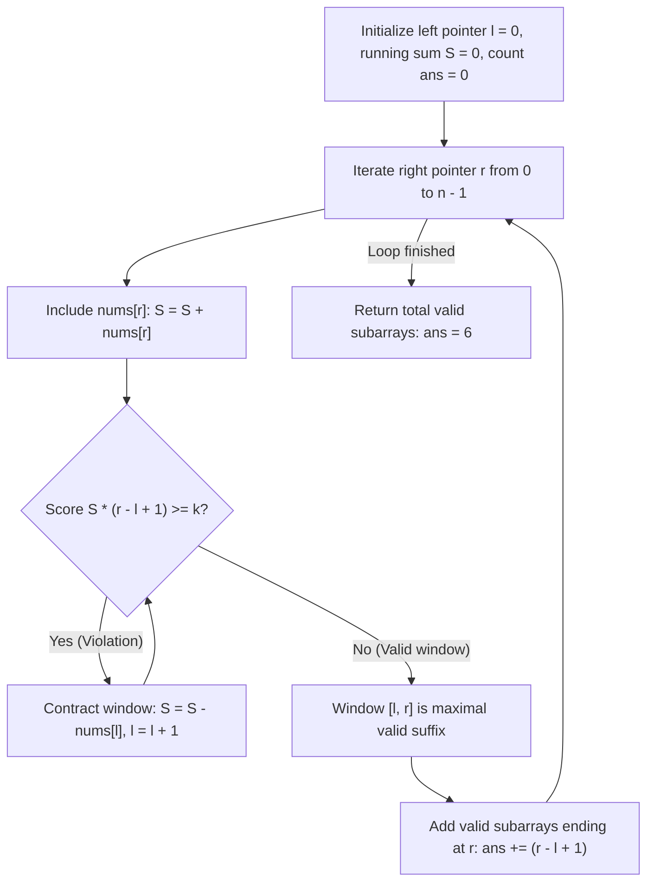

# Guided Example: Count Subarrays With Score Less Than K

## 1. Problem Overview & Representative Instance

We are given a 0-indexed array $nums$ of positive integers and a 64-bit integer $k$. The **score** of a contiguous subarray $nums[l \dots r]$ is defined as the product of the sum of its elements and its length:
$$\text{score}(nums[l \dots r]) = \left( \sum_{i=l}^r nums[i] \right) \times (r - l + 1)$$

Our objective is to calculate the total number of non-empty contiguous subarrays whose score is strictly less than $k$:
$$\text{score}(nums[l \dots r]) < k$$

Consider the representative problem instance:
$$nums = [2, 1, 4, 3, 5], \quad k = 10$$

Let us evaluate candidate subarrays by their right endpoint $r$:
- **Subarrays ending at index $0$:**
  - $nums[0 \dots 0] = [2]$: Sum $= 2$, Length $= 1 \implies \text{Score} = 2 \times 1 = 2 < 10$ (Valid).
  - Count ending at $0$: $1$.
- **Subarrays ending at index $1$:**
  - $nums[1 \dots 1] = [1]$: Sum $= 1$, Length $= 1 \implies \text{Score} = 1 \times 1 = 1 < 10$ (Valid).
  - $nums[0 \dots 1] = [2, 1]$: Sum $= 3$, Length $= 2 \implies \text{Score} = 3 \times 2 = 6 < 10$ (Valid).
  - Count ending at $1$: $2$.
- **Subarrays ending at index $2$:**
  - $nums[2 \dots 2] = [4]$: Sum $= 4$, Length $= 1 \implies \text{Score} = 4 \times 1 = 4 < 10$ (Valid).
  - $nums[1 \dots 2] = [1, 4]$: Sum $= 5$, Length $= 2 \implies \text{Score} = 5 \times 2 = 10 \not< 10$ (Invalid).
  - $nums[0 \dots 2] = [2, 1, 4]$: Sum $= 7$, Length $= 3 \implies \text{Score} = 7 \times 3 = 21 \not< 10$ (Invalid).
  - Count ending at $2$: $1$.
- **Subarrays ending at index $3$:**
  - $nums[3 \dots 3] = [3]$: Sum $= 3$, Length $= 1 \implies \text{Score} = 3 \times 1 = 3 < 10$ (Valid).
  - $nums[2 \dots 3] = [4, 3]$: Sum $= 7$, Length $= 2 \implies \text{Score} = 7 \times 2 = 14 \not< 10$ (Invalid).
  - Count ending at $3$: $1$.
- **Subarrays ending at index $4$:**
  - $nums[4 \dots 4] = [5]$: Sum $= 5$, Length $= 1 \implies \text{Score} = 5 \times 1 = 5 < 10$ (Valid).
  - $nums[3 \dots 4] = [3, 5]$: Sum $= 8$, Length $= 2 \implies \text{Score} = 8 \times 2 = 16 \not< 10$ (Invalid).
  - Count ending at $4$: $1$.

Summing across all right endpoints: $1 + 2 + 1 + 1 + 1 = 6$ valid subarrays.

---

## 2. Mathematical & Algorithmic Principles

### Strict Monotonicity of the Subarray Score

Let $S(l, r) = \sum_{i=l}^r nums[i]$ and $L(l, r) = r - l + 1$. Because all array elements are strictly positive ($nums[i] \ge 1$):
1. **Length Monotonicity:** For any $l_1 < l_2 \le r$, $L(l_1, r) > L(l_2, r)$.
2. **Sum Monotonicity:** Because every element is positive, $S(l_1, r) > S(l_2, r)$.
3. **Score Monotonicity:** Multiplying two strictly positive, strictly increasing quantities yields strict monotonicity:
   $$l_1 < l_2 \implies \text{score}(nums[l_1 \dots r]) > \text{score}(nums[l_2 \dots r])$$

### Consequence for Subarray Counting

For any fixed right boundary $r$:
- If window $nums[l \dots r]$ satisfies $\text{score} < k$, then every sub-window $nums[l' \dots r]$ with $l \le l' \le r$ has:
  $$\text{score}(nums[l' \dots r]) \le \text{score}(nums[l \dots r]) < k$$
- Therefore, if $l^*(r)$ is the smallest index such that $\text{score}(nums[l^*(r) \dots r]) < k$, exactly $r - l^*(r) + 1$ valid subarrays terminate at $r$.
- Furthermore, expanding the right boundary ($r \to r + 1$) strictly increases both sum and length, which implies that the minimal valid left boundary is weakly monotonic:
  $$l^*(r + 1) \ge l^*(r)$$

This enables an $O(n)$ two-pointer sliding window where both $l$ and $r$ advance strictly forward.

| Sliding Window Metric | Mathematical Formulation | Role in Counting Subarrays |
|---|---|---|
| Window Sum $S$ | $\sum_{i=l}^r nums[i]$ | Running sum of active elements in window $[l, r]$ |
| Window Length | $r - l + 1$ | Multiplicative scaling factor for score |
| Score Evaluation | $S \times (r - l + 1)$ | Condition tested against strict threshold $k$ |
| Suffix Contribution | $r - l + 1$ | Number of valid subarrays terminating at index $r$ |

---

## 3. Step-by-Step Walkthrough with Intermediate State

Let us trace the two-pointer sliding window on $nums = [2, 1, 4, 3, 5]$ with $k = 10$.
Initialize $l = 0$, $S = 0$, and total count $ans = 0$.

### Step 1: Advance $r = 0$ ($nums[0] = 2$)
- Add to sum: $S = 0 + 2 = 2$.
- Current window $[0, 0]$: length $= 1$, $\text{score} = 2 \times 1 = 2 < 10$.
- No contraction needed.
- Subarrays added: $r - l + 1 = 0 - 0 + 1 = 1$.
- Cumulative answer: $ans = 1$.

### Step 2: Advance $r = 1$ ($nums[1] = 1$)
- Add to sum: $S = 2 + 1 = 3$.
- Current window $[0, 1]$: length $= 2$, $\text{score} = 3 \times 2 = 6 < 10$.
- No contraction needed.
- Subarrays added: $r - l + 1 = 1 - 0 + 1 = 2$.
- Cumulative answer: $ans = 1 + 2 = 3$.

### Step 3: Advance $r = 2$ ($nums[2] = 4$)
- Add to sum: $S = 3 + 4 = 7$.
- Window $[0, 2]$: length $= 3$, $\text{score} = 7 \times 3 = 21 \ge 10$.
  - Contract: subtract $nums[0]=2$, $S \leftarrow 7 - 2 = 5$, advance $l \leftarrow 1$.
- Window $[1, 2]$: length $= 2$, $\text{score} = 5 \times 2 = 10 \ge 10$.
  - Contract: subtract $nums[1]=1$, $S \leftarrow 5 - 1 = 4$, advance $l \leftarrow 2$.
- Window $[2, 2]$: length $= 1$, $\text{score} = 4 \times 1 = 4 < 10$.
- Subarrays added: $r - l + 1 = 2 - 2 + 1 = 1$.
- Cumulative answer: $ans = 3 + 1 = 4$.

### Step 4: Advance $r = 3$ ($nums[3] = 3$)
- Add to sum: $S = 4 + 3 = 7$.
- Window $[2, 3]$: length $= 2$, $\text{score} = 7 \times 2 = 14 \ge 10$.
  - Contract: subtract $nums[2]=4$, $S \leftarrow 7 - 4 = 3$, advance $l \leftarrow 3$.
- Window $[3, 3]$: length $= 1$, $\text{score} = 3 \times 1 = 3 < 10$.
- Subarrays added: $r - l + 1 = 3 - 3 + 1 = 1$.
- Cumulative answer: $ans = 4 + 1 = 5$.

### Step 5: Advance $r = 4$ ($nums[4] = 5$)
- Add to sum: $S = 3 + 5 = 8$.
- Window $[3, 4]$: length $= 2$, $\text{score} = 8 \times 2 = 16 \ge 10$.
  - Contract: subtract $nums[3]=3$, $S \leftarrow 8 - 3 = 5$, advance $l \leftarrow 4$.
- Window $[4, 4]$: length $= 1$, $\text{score} = 5 \times 1 = 5 < 10$.
- Subarrays added: $r - l + 1 = 4 - 4 + 1 = 1$.
- Cumulative answer: $ans = 5 + 1 = 6$.

Total count of valid subarrays is $6$.

---

## 4. Comprehensive State Trace

| Right Pointer $r$ | Value $nums[r]$ | Initial Window Sum | Initial Score | Contraction Steps (Left Pointer $l$) | Final Valid Window $[l, r]$ | Added Suffixes ($r - l + 1$) | Running Total $ans$ |
|---|---|---|---|---|---|---|---|
| $0$ | $2$ | $2$ | $2 \times 1 = 2 < 10$ | None ($l = 0$) | $[0, 0]$ | $1$ | $1$ |
| $1$ | $1$ | $3$ | $3 \times 2 = 6 < 10$ | None ($l = 0$) | $[0, 1]$ | $2$ | $3$ |
| $2$ | $4$ | $7$ | $7 \times 3 = 21 \ge 10$ | $l=0 \to 1 \to 2$ | $[2, 2]$ | $1$ | $4$ |
| $3$ | $3$ | $7$ | $7 \times 2 = 14 \ge 10$ | $l=2 \to 3$ | $[3, 3]$ | $1$ | $5$ |
| $4$ | $5$ | $8$ | $8 \times 2 = 16 \ge 10$ | $l=3 \to 4$ | $[4, 4]$ | $1$ | $6$ |

---

## 5. Algorithmic Correctness & Soundness

### Completeness and Non-Overlapping Slices
Every contiguous subarray has a unique right endpoint $r \in [0, n - 1]$. By partitioning the total count of valid subarrays by their right boundary, we ensure:
$$\text{Total Subarrays} = \sum_{r=0}^{n-1} |\{ l \le r : \text{score}(nums[l \dots r]) < k \}|$$
Because score decreases monotonically as $l$ increases towards $r$, the set of valid left endpoints is precisely the contiguous integer range $[l^*(r), r]$. The cardinality is exactly $r - l^*(r) + 1$. No valid subarray is counted twice or omitted.

### Strict Bound Invariant
Notice that the problem requires $\text{score} < k$. If an individual element itself has value $\ge k$ (e.g., $nums[i] \ge k$), then at length $1$, $\text{score} = nums[i] \times 1 \ge k$. The contraction loop will increment $l$ past $r$ ($l = r + 1$), giving $r - l + 1 = 0$, correctly contributing $0$ subarrays for that position.

---

## 6. Edge Cases & Anti-Patterns

### Anti-Pattern: Quadratic Double Loop
Testing all pairs $(l, r)$ takes $O(n^2)$ time. For $n = 10^5$, $n^2 = 10^{10}$, causing severe TLE. Monotonic sliding window reduces this to linear time.

### Edge Case: $k = 1$
Because all elements are positive integers ($nums[i] \ge 1$), the minimal score of any single element is $1 \times 1 = 1$. When $k = 1$, no subarray can have score $< 1$. The contraction loop advances $l$ past $r$ at every step, yielding total count $0$.

### Edge Case: Very Large Values of $k$
If $k$ exceeds the score of the entire array ($k > \sum nums \times n$), no contraction ever occurs ($l = 0$ throughout). The algorithm sums $1 + 2 + \dots + n = n(n + 1)/2$, returning the total count of all possible subarrays.

---

## 7. Complexity Analysis

### Time Complexity
- **Right Pointer Advances:** The outer loop increments $r$ from $0$ to $n - 1$, executing exactly $n$ iterations.
- **Left Pointer Advances:** The inner `while` loop increments $l$ whenever a violation occurs. Because $l$ starts at $0$ and never decrements, $l$ is incremented at most $n$ times across the entire execution.
- Total pointer movements are bounded by $2n$.
- **Overall Time Complexity:** $O(n)$, which is linear and optimal.

### Space Complexity
- The algorithm tracks running totals using scalar registers ($l, r, S, ans$).
- No auxiliary arrays or hash maps are required.
- **Auxiliary Space Complexity:** strictly $O(1)$ constant memory.