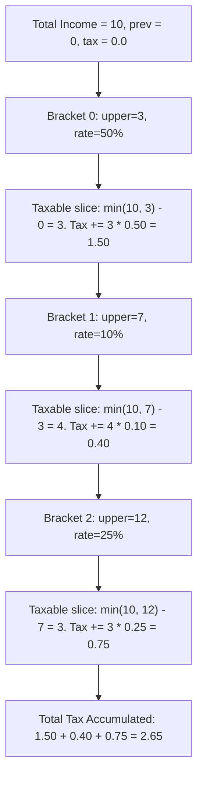

# Guided Example: Calculate Amount Paid in Taxes

## 1. Problem Overview & Representative Instance

We are given a 0-indexed 2D integer array $brackets$ where each entry $brackets[i] = [upper_i, percent_i]$ specifies the upper financial threshold $upper_i$ and the marginal percentage rate $percent_i$ of the $i^{\text{th}}$ tax bracket. The array is strictly sorted in ascending order of $upper_i$. We are also given an integer $income$ representing total earnings.

Taxation is progressive:
- The first bracket taxes income earned in the interval $[0, upper_0]$ at rate $percent_0 / 100$.
- Each subsequent bracket $i \ge 1$ taxes income earned in the half-open interval $(upper_{i-1}, upper_i]$ at rate $percent_i / 100$.
- Once total earnings are fully accounted for, no further tax is assessed on remaining higher brackets.

Our objective is to calculate the total tax paid, formatted as a floating-point number.

Consider the representative problem instance:
$$brackets = [[3, 50], [7, 10], [12, 25]], \quad income = 10$$

Let us decompose the earnings across progressive tiers:
- **Bracket $0$ ($[0, 3]$ at $50\%$):**
  - Income falling into this bracket: $\min(10, 3) - 0 = 3$.
  - Tax assessed: $3 \times \frac{50}{100} = 1.50$.
- **Bracket $1$ ($[3, 7]$ at $10\%$):**
  - Income falling into this bracket: $\min(10, 7) - 3 = 7 - 3 = 4$.
  - Tax assessed: $4 \times \frac{10}{100} = 0.40$.
- **Bracket $2$ ($[7, 12]$ at $25\%$):**
  - Income falling into this bracket: $\min(10, 12) - 7 = 10 - 7 = 3$.
  - Tax assessed: $3 \times \frac{25}{100} = 0.75$.

Summing taxes across all brackets:
$$\text{Total Tax} = 1.50 + 0.40 + 0.75 = 2.65$$

---

## 2. Mathematical & Algorithmic Principles

### Progressive Income Partitioning

Let the bracket boundaries be an ordered sequence of real coordinates:
$$u_0 = 0 < u_1 < u_2 < \dots < u_m$$
where $u_i = brackets[i - 1][0]$ for $i \ge 1$, with corresponding tax rates $r_i = percent_{i-1} / 100$.

The total income $I \ge 0$ induces an active interval $[0, I]$. The intersection of $[0, I]$ with each bracket interval $[u_{i-1}, u_i]$ defines the taxable quantum $\Delta_i$ for tier $i$:
$$\Delta_i = \max\big(0, \, \min(I, u_i) - u_{i-1}\big)$$

The total tax liability is the linear combination of these marginal slices:
$$\mathcal{T}(I) = \sum_{i=1}^m \Delta_i \cdot r_i = \sum_{i=1}^m \max\big(0, \, \min(I, u_i) - u_{i-1}\big) \cdot \frac{percent_{i-1}}{100}$$

| Bracket Classification | Condition on Income $I$ | Taxable Slice $\Delta_i$ | Contribution to Total Tax |
|---|---|---|---|
| Fully Covered Bracket | $I \ge u_i$ | $u_i - u_{i-1}$ | $(u_i - u_{i-1}) \cdot r_i$ |
| Partially Covered Bracket | $u_{i-1} < I < u_i$ | $I - u_{i-1}$ | $(I - u_{i-1}) \cdot r_i$ |
| Untouched Bracket | $I \le u_{i-1}$ | $0$ | $0$ |

---

## 3. Step-by-Step Walkthrough with Intermediate State

Let us trace the computation on $brackets = [[3, 50], [7, 10], [12, 25]]$ with $income = 10$.
Initialize $prev = 0$, $ans = 0$.

### Step 1: Evaluate Bracket $0$ ($upper = 3, percent = 50\%$)
- Bracket lower bound: $prev = 0$.
- Bracket upper bound: $upper = 3$.
- Effective taxable cap: $\min(income, upper) = \min(10, 3) = 3$.
- Taxable width: $3 - prev = 3 - 0 = 3$.
- Marginal tax generated: $3 \times 50 = 150$ cents.
- Update baseline: $prev \leftarrow 3$.
- Running tax accumulator: $ans \leftarrow 150$.

### Step 2: Evaluate Bracket $1$ ($upper = 7, percent = 10\%$)
- Bracket lower bound: $prev = 3$.
- Bracket upper bound: $upper = 7$.
- Effective taxable cap: $\min(10, 7) = 7$.
- Taxable width: $7 - prev = 7 - 3 = 4$.
- Marginal tax generated: $4 \times 10 = 40$ cents.
- Update baseline: $prev \leftarrow 7$.
- Running tax accumulator: $ans \leftarrow 150 + 40 = 190$.

### Step 3: Evaluate Bracket $2$ ($upper = 12, percent = 25\%$)
- Bracket lower bound: $prev = 7$.
- Bracket upper bound: $upper = 12$.
- Effective taxable cap: $\min(10, 12) = 10$.
- Taxable width: $10 - prev = 10 - 7 = 3$.
- Marginal tax generated: $3 \times 25 = 75$ cents.
- Update baseline: $prev \leftarrow 12$.
- Running tax accumulator: $ans \leftarrow 190 + 75 = 265$.

### Step 4: Final Normalization
Convert cents to currency units:
$$\frac{ans}{100} = \frac{265}{100} = 2.65$$
Return $2.65$.

---

## 4. Comprehensive State Trace

| Bracket Index $i$ | Lower Bound $prev$ | Upper Bound $upper$ | Capped Limit $\min(I, upper)$ | Taxable Slice $\Delta$ | Marginal Rate | Incremental Tax | Cumulative Tax Due |
|---|---|---|---|---|---|---|---|
| Init | - | - | - | - | - | - | $0.00$ |
| $0$ | $0$ | $3$ | $3$ | $3$ | $50\%$ | $1.50$ | $1.50$ |
| $1$ | $3$ | $7$ | $7$ | $4$ | $10\%$ | $0.40$ | $1.90$ |
| $2$ | $7$ | $12$ | $10$ | $3$ | $25\%$ | $0.75$ | $2.65$ |

---

## 5. Algorithmic Correctness & Soundness

### Conservation of Total Earnings
Because $brackets$ forms a contiguous partition of the positive real line $[0, u_m]$, the sum of taxable portions across all brackets satisfies:
$$\sum_{i=1}^m \Delta_i = \sum_{i=1}^m \max(0, \min(I, u_i) - u_{i-1}) = \min(I, u_m) = I$$
(since income does not exceed the maximal bracket). Every dollar earned is taxed exactly once at its appropriate marginal rate. No income is double-taxed or exempt from classification.

### Numerical Stability
Accumulating the product $\Delta_i \times percent_i$ using integer arithmetic and performing a single floating-point division by $100$ at the end minimizes intermediate floating-point rounding errors.

---

## 6. Edge Cases & Anti-Patterns

### Anti-Pattern: Applying Flat Tax to Entire Income
A common conceptual mistake is taxing the entire income by the bracket rate corresponding to the top bracket reached (e.g. $10 \times 25\% = 2.50$). Progressive taxation taxes each segment strictly within its own marginal interval.

### Edge Case: Zero Income ($income = 0$)
When $income = 0$, $\min(0, upper_i) = 0$ for all $i$. The expression $\max(0, 0 - prev) = 0$ for every bracket, correctly returning $0.00$.

### Edge Case: Income Exactly Matches a Bracket Boundary
If $income = 7$, bracket $0$ taxes $[0, 3]$, bracket $1$ taxes $[3, 7]$, and bracket $2$ has $\min(7, 12) - 7 = 0$, correctly contributing $0$ tax.

---

## 7. Complexity Analysis

### Time Complexity
- The algorithm performs a single pass over the $B$ entries in the $brackets$ array.
- For each bracket, computing $\min$, $\max$, subtraction, and multiplication takes $O(1)$ time.
- **Overall Time Complexity:** $O(B)$ where $B$ is the number of tax brackets (typically $B \le 100$), executing instantaneously.

### Space Complexity
- Only two scalar registers ($prev$ and $ans$) are maintained.
- **Auxiliary Space Complexity:** strictly $O(1)$ constant memory.
