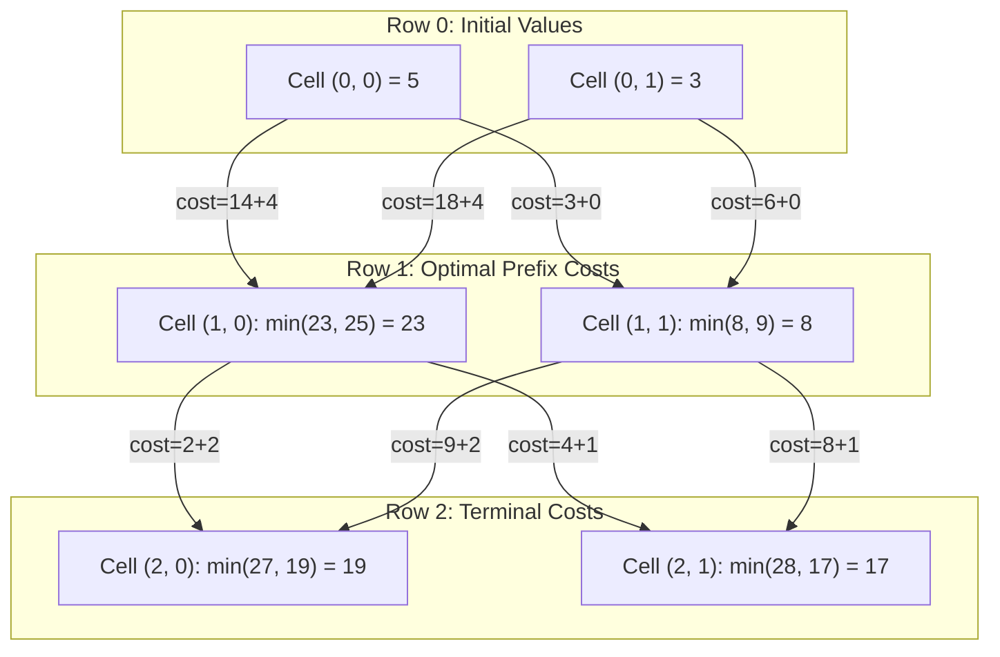

# Guided Example: Minimum Path Cost in a Grid

## 1. Problem Overview & Representative Instance

We are given an $m \times n$ matrix $grid$ consisting of distinct integers from $0$ to $m \cdot n - 1$, alongside a 2D integer array $moveCost$ of size $(m \cdot n) \times n$. 

We start at any cell in the first row (row $0$) and descend through the grid to reach any cell in the final row (row $m - 1$). From a cell $(i, k)$ in row $i$, we may transition to any cell $(i + 1, j)$ in the immediately following row $i + 1$. 
The cost of such a transition consists of two parts:
1. The transition penalty $moveCost[val][j]$, where $val = grid[i][k]$ is the integer value stored at the source cell, and $j$ is the destination column.
2. The intrinsic value $grid[i + 1][j]$ of the newly entered cell.

The cost of an entire path is defined as the sum of all cell values visited plus the sum of all transition costs incurred along the steps. Our objective is to determine the minimum possible total path cost from row $0$ to row $m - 1$.

Consider the representative problem instance:
$$grid = \begin{bmatrix} 5 & 3 \\ 4 & 0 \\ 2 & 1 \end{bmatrix}, \quad moveCost = \begin{bmatrix} 9 & 8 \\ 1 & 5 \\ 10 & 12 \\ 18 & 6 \\ 2 & 4 \\ 14 & 3 \end{bmatrix}$$

Grid dimensions: $m = 3$ rows, $n = 2$ columns.
- Starting at row $0$:
  - Cell $(0, 0)$ has intrinsic cost $5$.
  - Cell $(0, 1)$ has intrinsic cost $3$.
- Evaluating transitions from row $0$ to row $1$:
  - To reach cell $(1, 0)$ (value $4$):
    - From $(0, 0)$ (value $5$): $5 + moveCost[5][0] + 4 = 5 + 14 + 4 = 23$.
    - From $(0, 1)$ (value $3$): $3 + moveCost[3][0] + 4 = 3 + 18 + 4 = 25$.
    - Best cost to reach $(1, 0)$ is $\min(23, 25) = 23$.
  - To reach cell $(1, 1)$ (value $0$):
    - From $(0, 0)$ (value $5$): $5 + moveCost[5][1] + 0 = 5 + 3 + 0 = 8$.
    - From $(0, 1)$ (value $3$): $3 + moveCost[3][1] + 0 = 3 + 6 + 0 = 9$.
    - Best cost to reach $(1, 1)$ is $\min(8, 9) = 8$.
- Evaluating transitions from row $1$ to row $2$:
  - To reach cell $(2, 0)$ (value $2$):
    - From $(1, 0)$ (value $4$, best prefix $23$): $23 + moveCost[4][0] + 2 = 23 + 2 + 2 = 27$.
    - From $(1, 1)$ (value $0$, best prefix $8$): $8 + moveCost[0][0] + 2 = 8 + 9 + 2 = 19$.
    - Best cost to reach $(2, 0)$ is $\min(27, 19) = 19$.
  - To reach cell $(2, 1)$ (value $1$):
    - From $(1, 0)$ (value $4$, best prefix $23$): $23 + moveCost[4][1] + 1 = 23 + 4 + 1 = 28$.
    - From $(1, 1)$ (value $0$, best prefix $8$): $8 + moveCost[0][1] + 1 = 8 + 8 + 1 = 17$.
    - Best cost to reach $(2, 1)$ is $\min(28, 17) = 17$.

The minimal cost among all termination cells in row $2$ is $\min(19, 17) = 17$, achieved via path $(0, 0) \to (1, 1) \to (2, 1)$.

---

## 2. Mathematical & Algorithmic Principles

### Multi-Stage Graph and Optimal Substructure

The problem models a multi-stage directed graph where edges exist strictly between consecutive rows $i$ and $i + 1$. Every path consists of exactly $m$ vertices and $m - 1$ transition edges.

Let $f(i, j)$ denote the minimum cost to reach cell $(i, j)$ in row $i$:
1. **Base Case (Row 0):**
   $$f(0, j) = grid[0][j] \quad \text{for all } j \in [0, n - 1]$$
2. **Dynamic Programming Recurrence (Rows $i \ge 1$):**
   To arrive at column $j$ in row $i$, the previous step must originate from some column $k \in [0, n - 1]$ in row $i - 1$:
   $$f(i, j) = grid[i][j] + \min_{0 \le k < n} \Big( f(i - 1, k) + moveCost[grid[i - 1][k]][j] \Big)$$
3. **Global Target:**
   The answer is the infimum over all terminal column choices in the last row:
   $$\text{Optimum} = \min_{0 \le j < n} f(m - 1, j)$$

Because the recurrence for row $i$ depends strictly on row $i - 1$, the state can be compressed into a single 1D array of size $n$, iteratively updated row by row.

| DP Variable | Dimensionality | Semantic Interpretation |
|---|---|---|
| Vector $f$ | Length $n$ | Stores $\min$ accumulated path cost ending at each column of row $i - 1$ |
| Vector $g$ | Length $n$ | Computes $\min$ accumulated path cost ending at each column of row $i$ |
| $moveCost[val][j]$ | Look-up table | Cost to transition from cell with value $val$ to column $j$ |

---

## 3. Step-by-Step Walkthrough with Intermediate State

Let us trace the DP state updates on the representative instance.

### Step 1: Base Initialization (Row 0)
Initialize $f$ directly with the values of row $0$:
$$f = [grid[0][0], grid[0][1]] = [5, 3]$$

### Step 2: Transitions from Row 0 to Row 1
We compute $g[0]$ and $g[1]$ for row $1$:
- **Destination Column $j = 0$ ($grid[1][0] = 4$):**
  - Origin $k = 0$: $f[0] + moveCost[grid[0][0]][0] + 4 = 5 + moveCost[5][0] + 4 = 5 + 14 + 4 = 23$
  - Origin $k = 1$: $f[1] + moveCost[grid[0][1]][0] + 4 = 3 + moveCost[3][0] + 4 = 3 + 18 + 4 = 25$
  - $g[0] = \min(23, 25) = 23$.
- **Destination Column $j = 1$ ($grid[1][1] = 0$):**
  - Origin $k = 0$: $f[0] + moveCost[5][1] + 0 = 5 + 3 + 0 = 8$
  - Origin $k = 1$: $f[1] + moveCost[3][1] + 0 = 3 + 6 + 0 = 9$
  - $g[1] = \min(8, 9) = 8$.
- Update state: $f \leftarrow g = [23, 8]$.

### Step 3: Transitions from Row 1 to Row 2
We compute $g[0]$ and $g[1]$ for row $2$:
- **Destination Column $j = 0$ ($grid[2][0] = 2$):**
  - Origin $k = 0$: $f[0] + moveCost[grid[1][0]][0] + 2 = 23 + moveCost[4][0] + 2 = 23 + 2 + 2 = 27$
  - Origin $k = 1$: $f[1] + moveCost[grid[1][1]][0] + 2 = 8 + moveCost[0][0] + 2 = 8 + 9 + 2 = 19$
  - $g[0] = \min(27, 19) = 19$.
- **Destination Column $j = 1$ ($grid[2][1] = 1$):**
  - Origin $k = 0$: $f[0] + moveCost[grid[1][0]][1] + 1 = 23 + moveCost[4][1] + 1 = 23 + 4 + 1 = 28$
  - Origin $k = 1$: $f[1] + moveCost[grid[1][1]][1] + 1 = 8 + moveCost[0][1] + 1 = 8 + 8 + 1 = 17$
  - $g[1] = \min(28, 17) = 17$.
- Update state: $f \leftarrow g = [19, 17]$.

### Step 4: Final Extremum Selection
Row $2$ is the terminal row ($m - 1 = 2$).
The minimal path cost across all columns is:
$$\min(f[0], f[1]) = \min(19, 17) = 17$$

---

## 4. Comprehensive State Trace

| Layer Transition | Destination Cell $(i, j)$ | Source Candidates $(i-1, k)$ | Candidate Cost Formulations | Minimum Selected Cost | Updated Array $f$ |
|---|---|---|---|---|---|
| Initialization | Row 0 | None | Base values $[grid[0][0], grid[0][1]]$ | Base setup | $[5, 3]$ |
| Row $0 \to 1$ | $(1, 0)$ (val $4$) | $(0, 0), (0, 1)$ | $5 + 14 + 4 = 23$, $3 + 18 + 4 = 25$ | $\min = 23$ | - |
| Row $0 \to 1$ | $(1, 1)$ (val $0$) | $(0, 0), (0, 1)$ | $5 + 3 + 0 = 8$, $3 + 6 + 0 = 9$ | $\min = 8$ | $[23, 8]$ |
| Row $1 \to 2$ | $(2, 0)$ (val $2$) | $(1, 0), (1, 1)$ | $23 + 2 + 2 = 27$, $8 + 9 + 2 = 19$ | $\min = 19$ | - |
| Row $1 \to 2$ | $(2, 1)$ (val $1$) | $(1, 0), (1, 1)$ | $23 + 4 + 1 = 28$, $8 + 8 + 1 = 17$ | $\min = 17$ | $[19, 17]$ |

---

## 5. Algorithmic Correctness & Soundness

### Bellman's Principle of Optimality
Any subpath of an optimal path is itself optimal. Specifically, if an optimal path from row $0$ to row $m - 1$ visits cell $(i, j)$, the portion of the path from row $0$ to $(i, j)$ must be an optimal path ending at $(i, j)$. If a cheaper prefix existed, substituting that cheaper prefix would reduce the total cost of the overall path, creating a contradiction. Thus, maintaining only the minimum prefix cost $f(i, j)$ for each cell is mathematically sound.

### Layered Acyclicity
Paths strictly advance from row $i$ to $i + 1$. There are no horizontal moves within a row and no backward steps. The graph is topologically sorted by row index, ensuring that all predecessor values $f(i - 1, k)$ are completely finalized before computing $f(i, j)$.

---

## 6. Edge Cases & Anti-Patterns

### Anti-Pattern: Value Look-up Inversion
A frequent indexing defect is looking up $moveCost[k][j]$ using the column index $k$ rather than the cell value $grid[i - 1][k]$. The problem states that $moveCost$ is indexed by the cell value $val \in [0, mn - 1]$. The implementation must query $moveCost[grid[i - 1][k]][j]$.

### Edge Case: Single Row Matrix ($m = 1$)
When $m = 1$, no transitions are made. The loop for $i$ from $1$ to $m - 1$ executes zero iterations. The algorithm directly returns $\min(grid[0])$, which correctly identifies the minimum value in the single row.

### Edge Case: Single Column Matrix ($n = 1$)
When $n = 1$, only one transition choice exists at each step ($k = 0 \to j = 0$). The DP trivially accumulates the single available path down the column.

---

## 7. Complexity Analysis

### Time Complexity
- The outer loop iterates over $m - 1$ row transitions.
- For each row transition, we evaluate $n$ destination columns.
- For each destination column, we consider all $n$ origin columns from the prior row.
- Total transitions evaluated: $(m - 1) \cdot n^2$.
- With $m, n \le 50$, total operations are at most $50 \times 50^2 = 1.25 \times 10^5$, executing in a few milliseconds.
- **Overall Time Complexity:** $O(m \cdot n^2)$, strictly polynomial and optimal.

### Space Complexity
- Compressing the state into two 1D vectors $f$ and $g$ requires $O(n)$ extra memory.
- **Auxiliary Space Complexity:** $O(n)$ space (substantially more efficient than storing the full $m \times n$ table).
