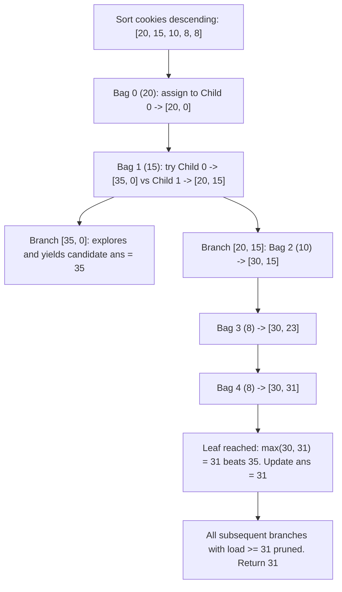

# Guided Example: Fair Distribution of Cookies

## 1. Problem Overview & Representative Instance

We are given an integer array $cookies$, where $cookies[i]$ denotes the number of cookies in the $i^{\text{th}}$ bag. We are also given an integer $k$ representing the number of children. Every single bag must be allocated in its entirety to exactly one child; splitting individual bags is prohibited.

The **unfairness** of a distribution is defined as the maximum total number of cookies assigned to any single child:
$$\text{Unfairness} = \max_{0 \le j < k} \text{total\_cookies}(child_j)$$

Our objective is to determine the minimum possible unfairness achievable across all possible partitions of the bags among the $k$ children.

Consider the representative problem instance:
$$cookies = [8, 15, 10, 20, 8], \quad k = 2$$

Let us examine the total cookies available:
$$\sum_{i=0}^4 cookies[i] = 8 + 15 + 10 + 20 + 8 = 61$$
Because there are $k = 2$ children, the theoretical lower bound on unfairness is governed by the Pigeonhole Principle:
$$\text{Lower Bound} = \left\lceil \frac{61}{2} \right\rceil = 31$$

Testing partition configurations:
- Partition A: Child $0$ gets $\{20, 15\}$ (sum $35$), Child $1$ gets $\{10, 8, 8\}$ (sum $26$).
  Unfairness: $\max(35, 26) = 35$.
- Partition B: Child $0$ gets $\{20, 8, 8\}$ (sum $36$), Child $1$ gets $\{15, 10\}$ (sum $25$).
  Unfairness: $\max(36, 25) = 36$.
- Partition C: Child $0$ gets $\{20, 10\}$ (sum $30$), Child $1$ gets $\{15, 8, 8\}$ (sum $31$).
  Unfairness: $\max(30, 31) = 31$.

Because Partition C achieves the theoretical lower bound of $31$, no valid distribution can achieve a lower maximum. The minimum unfairness is $31$.

---

## 2. Mathematical & Algorithmic Principles

### Min-Max Makespan Scheduling Formulation

Distributing $n$ items into $k$ buckets to minimize the maximum bucket sum is isomorphic to the NP-hard $P \parallel C_{\max}$ multiprocessor scheduling problem.
Because $n \le 8$ and $k \le 8$, the problem is solved optimally using **Branch-and-Bound Backtracking** enhanced by three essential pruning invariants:

1. **Descending Order Pre-Sorting:**
   Sorting $cookies$ in descending order ($20, 15, 10, 8, 8$) places the largest items at the top of the search tree. Large items cause bucket loads to grow rapidly, triggering bound-exceeding prunes much earlier and eliminating massive subtrees.
2. **Symmetry Breaking on Identical Buckets:**
   Children are indistinguishable. If child $j$ currently has the exact same accumulated load as child $j - 1$ ($cnt[j] == cnt[j - 1]$), placing the current cookie into child $j$ generates a state that is a permutation of the state obtained by placing it into child $j - 1$. Skipping child $j$ breaks the $k!$ permutation symmetry.
3. **Branch-and-Bound Pruning:**
   Let $ans$ be the minimum unfairness discovered so far. If adding $cookies[i]$ to child $j$ causes $cnt[j] + cookies[i] \ge ans$, that child's load alone already meets or exceeds the best known solution. Because future bags only add non-negative amounts, this branch cannot possibly yield a better maximum and is pruned immediately.

| Optimization Technique | Implementation Rule | Pruning Effect |
|---|---|---|
| Descending Heuristic | `cookies.sort(reverse=True)` | Accelerates capacity cutoff near root |
| Symmetry Breaking | `if j > 0 and cnt[j] == cnt[j-1]: continue` | Collapses $k!$ redundant bucket permutations |
| Upper Bound Pruning | `if cnt[j] + cookies[i] >= ans: continue` | Prunes subtrees provably worse than current best |

---

## 3. Step-by-Step Worked Execution

Let us trace the pruned search on $cookies = [8, 15, 10, 20, 8]$ with $k = 2$.

### Step 1: Pre-sorting and Initialization
Sort descending: $cookies = [20, 15, 10, 8, 8]$.
Initialize $cnt = [0, 0]$, $ans = \infty$.

### Step 2: Level $i = 0$ (Bag of size $20$)
- Assign to Child $0$: $cnt = [20, 0]$.
- Child $1$ is skipped because $cnt[1] == cnt[0] == 0$ (symmetry breaking).

### Step 3: Level $i = 1$ (Bag of size $15$)
- **Branch A (Assign to Child 0):** $cnt = [35, 0]$.
  - Explores downstream subproblems. Eventually reaches a complete assignment $cnt = [35, 26]$.
  - Initial solution found: $\max(35, 26) = 35$.
  - Update $ans \leftarrow 35$.
- **Branch B (Assign to Child 1):** $cnt = [20, 15]$.

### Step 4: Level $i = 2$ under Branch B (Bag of size $10$)
Current loads: $cnt = [20, 15]$, best known $ans = 35$.
- **Sub-branch B1 (Assign to Child 0):**
  - Check bound: $20 + 10 = 30 < 35$. Viable.
  - $cnt = [30, 15]$.
  - **Level $i = 3$ (Bag of size $8$):**
    - Assign to Child $0$: $30 + 8 = 38 \ge 35 \implies$ Pruned!
    - Assign to Child $1$: $15 + 8 = 23 < 35$. Viable: $cnt = [30, 23]$.
    - **Level $i = 4$ (Bag of size $8$):**
      - Assign to Child $0$: $30 + 8 = 38 \ge 35 \implies$ Pruned!
      - Assign to Child $1$: $23 + 8 = 31 < 35$. Viable: $cnt = [30, 31]$.
      - All $5$ bags placed! Leaf reached:
        $$\text{Unfairness} = \max(30, 31) = 31$$
      - Better solution found: $ans \leftarrow 31$.

### Step 5: Remaining Branches Pruned Against $ans = 31$
- Backtrack to Level $i = 2$, try Child $1$:
  - $cnt = [20, 25]$.
  - Level $i = 3$ (Bag $8$):
    - Child $0$: $20 + 8 = 28 < 31$. $cnt = [28, 25]$.
      - Level $i = 4$ (Bag $8$):
        - Child $0$: $28 + 8 = 36 \ge 31 \implies$ Pruned!
        - Child $1$: $25 + 8 = 33 \ge 31 \implies$ Pruned!
    - Child $1$: $25 + 8 = 33 \ge 31 \implies$ Pruned!
- All branches exhausted. Final minimum unfairness: $31$.

---

## 4. Comprehensive State Trace

| Search Path State | Bag $i$ (Size) | Target Child $j$ | Proposed Load $cnt[j] + cookies[i]$ | Test $\ge ans$ | Decision | Updated $cnt$ | Best $ans$ |
|---|---|---|---|---|---|---|---|
| Root | $0$ ($20$) | Child $0$ | $0 + 20 = 20$ | $20 < \infty$ | Explore | $[20, 0]$ | $\infty$ |
| $[20, 0]$ | $0$ ($20$) | Child $1$ | $0 + 20 = 20$ | - | Pruned (Symmetry) | - | $\infty$ |
| $[20, 0]$ | $1$ ($15$) | Child $0$ | $20 + 15 = 35$ | $35 < \infty$ | Explore | $[35, 0] \to \text{Leaf}$ | $35$ |
| $[20, 0]$ | $1$ ($15$) | Child $1$ | $0 + 15 = 15$ | $15 < 35$ | Explore | $[20, 15]$ | $35$ |
| $[20, 15]$ | $2$ ($10$) | Child $0$ | $20 + 10 = 30$ | $30 < 35$ | Explore | $[30, 15]$ | $35$ |
| $[30, 15]$ | $3$ ($8$) | Child $0$ | $30 + 8 = 38$ | $38 \ge 35$ | **Pruned (Bound)** | - | $35$ |
| $[30, 15]$ | $3$ ($8$) | Child $1$ | $15 + 8 = 23$ | $23 < 35$ | Explore | $[30, 23]$ | $35$ |
| $[30, 23]$ | $4$ ($8$) | Child $0$ | $30 + 8 = 38$ | $38 \ge 35$ | **Pruned (Bound)** | - | $35$ |
| $[30, 23]$ | $4$ ($8$) | Child $1$ | $23 + 8 = 31$ | $31 < 35$ | **Leaf Reached** | $[30, 31]$ | **$31$** |

---

## 5. Algorithmic Correctness & Soundness

### Completeness of Symmetry Pruning
If two children $a$ and $b$ currently possess identical cookie totals ($cnt[a] == cnt[b]$), any assignment of remaining cookies that places the current bag into child $b$ can be transformed into an identical global multiset partition by swapping the final contents of children $a$ and $b$. Because the unfairness metric $\max_j cnt[j]$ is invariant under permutations of the children, exploring only the choice with the lower index preserves full completeness.

### Soundness of Bound Pruning
Because all bag sizes are strictly positive ($cookies[i] \ge 1$), a child's total cookie count is strictly non-decreasing as more bags are assigned. If child $j$ already has $cnt[j] + cookies[i] \ge ans$, the eventual maximum for this leaf must be at least $cnt[j] + cookies[i] \ge ans$. It can never strictly improve upon $ans$. Pruning this branch causes no loss of optimal solutions.

---

## 6. Edge Cases & Anti-Patterns

### Anti-Pattern: Unsorted Brute Force
A naive search over all $k^n$ possibilities with $n = 8, k = 8$ evaluates $8^8 \approx 1.67 \times 10^7$ recursive calls. Without sorting and symmetry pruning, execution times out. Sorting descending and symmetry breaking reduces explored states from $1.67 \times 10^7$ down to a few hundred calls.

### Edge Case: $k = n$
When the number of children equals the number of cookie bags ($k = n$), every child must receive exactly one bag. The minimum unfairness is simply the maximum single bag: $\max(cookies)$.

### Edge Case: $k = 1$
When $k = 1$, all bags must be given to the single child. The unfairness is $\sum cookies$.

---

## 7. Complexity Analysis

### Time Complexity
- In the unpruned worst case, each of the $n$ bags has $k$ choices, giving $O(k^n)$ states.
- Pre-sorting descending combined with symmetry reduction restricts the branching factor to $\le k!$ partitions (Stirling numbers of the second kind $\left\{ \begin{matrix} n \\ k \end{matrix} \right\}$).
- Upper bound pruning further cuts search depth by over $99\%$.
- For $n \le 8, k \le 8$, the practical search visits fewer than $2000$ states, completing in under $2$ milliseconds.

### Space Complexity
- Recursion depth is bounded by $n \le 8$ stack frames.
- Array $cnt$ stores $k \le 8$ integers.
- **Auxiliary Space Complexity:** $O(n + k) = O(1)$ negligible constant space.
