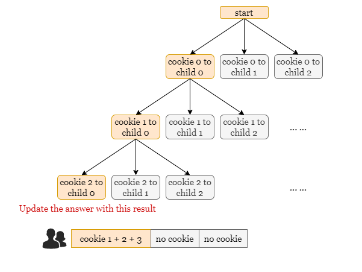
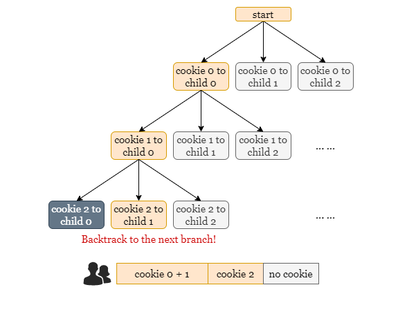
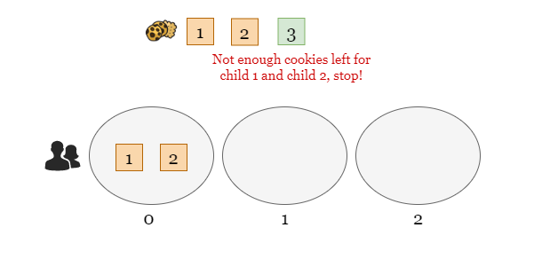
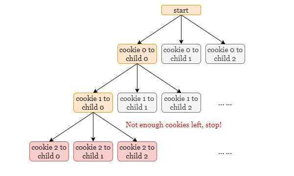

## Solution
---

### Approach: Backtracking

#### Intuition

> If you are not familiar with recursion, please refer to our explore cards [Recursion Explore Card](https://leetcode.com/explore/featured/card/recursion-i/). We will focus on the usage in this article and not the underlying principles or implementation details.

The concept of backtracking involves attempting all possible distributions of cookies. We distribute the current cookie to each child and recursively repeat the process with the next cookie until all the cookies are distributed. Once all the cookies have been distributed, we compute the unfairness of the current distribution and update the minimum unfairness encountered.

Let’s take a look at a scenario with 3 cookies and 3 children that serves as a great example of this.

Initially, we move along the path in yellow by distributing all 3 cookies to child 0, but it is not a valid distribution as child 1 and child 2 receive no cookies.



As a result, we backtrack to the next possible distribution (by distributing the last cookie to child 1) and repeat this process.



After distributing all cookies, we will determine if the current distribution is valid, and if so, we will calculate the unfairness of this distribution.

To optimize the backtracking approach, we can use an early stop technique. Consider the same example in the image below: suppose that we have already distributed the first 2 cookies to child 0. When we come to the last cookie, should we continue the recursion process by distributing it to any child?

The answer is NO, because child 1 and child 2 require at least two cookies, and at this point, we only have one cookie remaining. Consequently, no matter how we distribute this last cookie, it will inevitably lead to an invalid distribution. Therefore, we can discard this path and not proceed further with it.



To implement the early stop technique, we will introduce a parameter named $\text{zero}_{count}$ that represents **the number of children without a cookie**. During the backtracking process, if we have fewer undistributed cookies than $\text{zero}_{count}$, it means that some children will always end up with no cookie. At this point, we can terminate the recursion because it becomes impossible to obtain a valid distribution. The image below illustrates this concept, where the red states are not computed thanks to the early stop, significantly reducing unnecessary recursion steps.



Therefore, the algorithm only tracks the paths that lead to valid distributions and updates the global minimum by the maximum unfairness of each valid distribution.

<br>

#### Algorithm

1) Create an array `distribute` of length `k` initialized with all zeros, which represents the unfairness of each child.

2) Define the recursive function $dfs(i, \text{zero}_{count})$ to distribute the $i^{th}$ cookie:
- If the number of undistributed cookies is less than $\text{zero}_{count}$, which is $n - i < \text{zero}_{count}$, return a large integer like `float('inf')`, implying that the current distribution is invalid.
- If $i = n$, return the maximum value of `distribute` which is the unfairness of this distribution.
- Otherwise, set `answer` as `float('inf')` and continue with step 3.

3) Iterate through `distribute` and for each child `j`:
- Increment $\text{distribute}[j]$ by $\text{cookie}[i]$, if $\text{distribute}[i]$ is 0 before the distribution, decrement $\text{zero}_{count}$ by 1.
- Recursively call $dfs(i + 1, \text{zero}_{count})$ and update `answer` as the minimum unfairness encountered, $answer = min(answer, dfs(i + 1, \text{zero}_{count}))$.
- Decrement $\text{distribute}[j]$ by $\text{cookie}[i]$, if $\text{distribute}[i]$ is 0 after the process, increment $\text{zero}_{count}$ by 1. (This is the backtrack step)

    Return `answer` after the iteration is complete.

4) Return `dfs(0, distribute)`.

#### Implementation

```python
class Solution:
    def distributeCookies(self, cookies: List[int], k: int) -> int:
        cur = [0] * k
        n = len(cookies)

        def dfs(i, zero_count):
            # If there are not enough cookies remaining, return `float('inf')`
            # as it leads to an invalid distribution.
            if n - i < zero_count:
                return float('inf')

            # After distributing all cookies, return the unfairness of this
            # distribution.
            if i == n:
                return max(cur)

            # Try to distribute the i-th cookie to each child, and update answer
            # as the minimum unfairness in these distributions.
            answer = float('inf')
            for j in range(k):
                zero_count -= int(cur[j] == 0)
                cur[j] += cookies[i]

                # Recursively distribute the next cookie.
                answer = min(answer, dfs(i + 1, zero_count))

                cur[j] -= cookies[i]
                zero_count += int(cur[j] == 0)

            return answer

        return dfs(0, k)
```

#### Complexity Analysis

Let $n$ be the length of `cookies`.

* Time complexity: $O(k^n)$

- The algorithm attempts to distribute each of the $n$ cookies to each of the $k$ children, resulting in at most $O(k^n)$ distinct distributions.

* Space complexity: $O(k + n)$
- The array `distribute` represents the status of $k$ children, thus taking up $O(k)$ space.
- The space complexity of a recursive call depends on the maximum depth of the recursive call stack, which is at most $n$. As each recursive call increments `i` by 1. Therefore, at most $n$ levels of recursion will be created, and each level consumes a constant amount of space.

<br/>