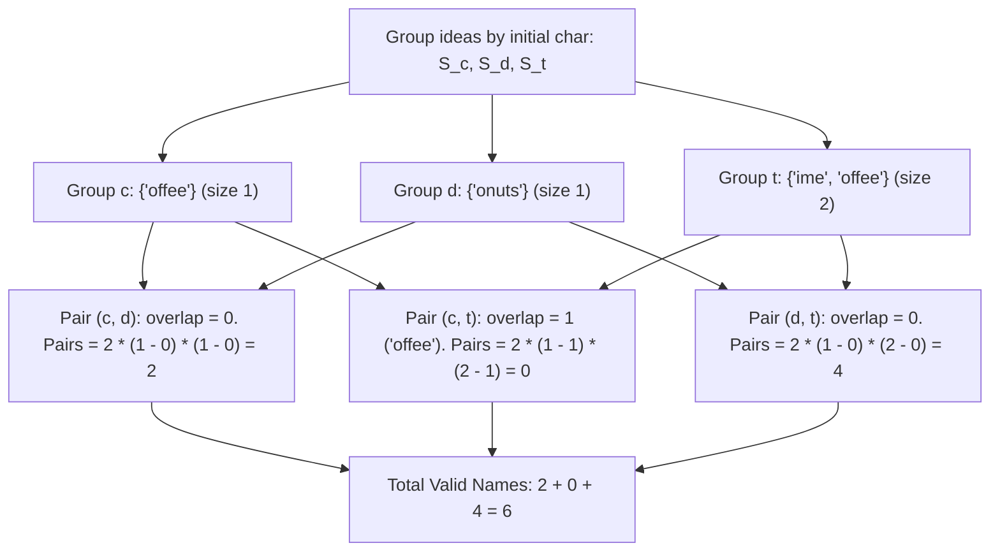

# Guided Example: Naming a Company

## 1. Problem Overview & Representative Instance

We are given an array of distinct strings $ideas$, representing candidate names for a company. A valid company name is formed using an ordered pair of distinct ideas $(A, B)$ via the following procedure:
1. Swap the first character of string $A$ with the first character of string $B$, forming two new strings $A'$ and $B'$.
2. The ordered pair $(A, B)$ produces a **valid company name** formatted as $A' + \text{" "} + B'$ if and only if **neither** $A'$ nor $B'$ appears in the original $ideas$ array:
   $$A' \notin ideas \quad \text{and} \quad B' \notin ideas$$

Our objective is to calculate the total number of distinct valid company names that can be generated. Because order matters ($A' + \text{" "} + B'$ is distinct from $B' + \text{" "} + A'$), we are counting valid ordered pairs $(A, B)$.

Consider the representative problem instance:
$$ideas = [\text{"coffee"}, \text{"donuts"}, \text{"time"}, \text{"toffee"}]$$

Let us partition the words by their initial letter and extract their suffixes:
- Words starting with `'c'`: suffix set $S_{\text{'c'}} = \{\text{"offee"}\}$ (size $1$).
- Words starting with `'d'`: suffix set $S_{\text{'d'}} = \{\text{"onuts"}\}$ (size $1$).
- Words starting with `'t'`: suffix set $S_{\text{'t'}} = \{\text{"ime"}, \text{"offee"}\}$ (size $2$).

Evaluating candidate pairs across initial letter groups:
1. **Pairing Group `'c'` with Group `'d'`:**
   - Suffix intersection: $S_{\text{'c'}} \cap S_{\text{'d'}} = \emptyset$ (no shared suffixes).
   - Valid suffix choices: $1 \times 1 = 1$.
   - Both orderings are valid:
     - $(\text{"coffee"}, \text{"donuts"}) \to \text{"doffee conuts"}$
     - $(\text{"donuts"}, \text{"coffee"}) \to \text{"conuts doffee"}$
   - Contributes $2$ valid company names.
2. **Pairing Group `'c'` with Group `'t'`:**
   - Suffix intersection: $S_{\text{'c'}} \cap S_{\text{'t'}} = \{\text{"offee"}\}$ (shared suffix of size $1$).
   - Suffixes exclusive to `'c'`: $|S_{\text{'c}}| - 1 = 1 - 1 = 0$.
   - If we swap initial letters between `"coffee"` and `"toffee"`, we generate `"toffee"` and `"coffee"`, both of which are in $ideas$.
   - Contributes $0$ valid company names.
3. **Pairing Group `'d'` with Group `'t'`:**
   - Suffix intersection: $S_{\text{'d'}} \cap S_{\text{'t'}} = \emptyset$ (no shared suffixes).
   - Suffixes exclusive to `'d'`: $1 - 0 = 1$.
   - Suffixes exclusive to `'t'`: $2 - 0 = 2$.
   - Valid suffix combinations: $1 \times 2 = 2$.
   - Both orderings are valid:
     - $(\text{"donuts"}, \text{"time"}) \to \text{"tonuts dime"}$
     - $(\text{"time"}, \text{"donuts"}) \to \text{"dime tonuts"}$
     - $(\text{"donuts"}, \text{"toffee"}) \to \text{"tonuts doffee"}$
     - $(\text{"toffee"}, \text{"donuts"}) \to \text{"doffee tonuts"}$
   - Contributes $2 \times 2 = 4$ valid company names.

Summing across all pairs of letter groups:
$$\text{Total Valid Names} = 2 + 0 + 4 = 6$$

---

## 2. Mathematical & Algorithmic Principles

### Decomposition by Initial Letter and Suffix Invariant

Every word $w \in ideas$ can be decomposed uniquely as:
$$w = c + s, \quad \text{where } c = w[0] \in \Sigma, \, s = w[1:] \in \Sigma^*$$
Let $S_c$ denote the set of suffixes associated with initial letter $c$:
$$S_c = \{ s : c + s \in ideas \}$$

Now consider two words $w_1 = c_1 + s_1$ and $w_2 = c_2 + s_2$:
- If $c_1 = c_2$, swapping their first characters yields the exact same strings $w_1$ and $w_2$, which already exist in $ideas$. Thus, no valid pair can share the same initial letter ($c_1 \ne c_2$).
- If $c_1 \ne c_2$, the swapped strings are $w_1' = c_2 + s_1$ and $w_2' = c_1 + s_2$.
- The pair $(w_1, w_2)$ is valid if and only if:
  $$c_2 + s_1 \notin ideas \iff s_1 \notin S_{c_2}$$
  $$c_1 + s_2 \notin ideas \iff s_2 \notin S_{c_1}$$

This means $s_1$ must belong to the relative complement $S_{c_1} \setminus S_{c_2}$, and $s_2$ must belong to $S_{c_2} \setminus S_{c_1}$.

### Combinatorial Product Formula

Let $m(c_1, c_2) = |S_{c_1} \cap S_{c_2}|$ be the count of shared suffixes between groups $c_1$ and $c_2$.
By inclusion-exclusion:
$$|S_{c_1} \setminus S_{c_2}| = |S_{c_1}| - m(c_1, c_2)$$
$$|S_{c_2} \setminus S_{c_1}| = |S_{c_2}| - m(c_1, c_2)$$

Because any choice of $s_1 \in S_{c_1} \setminus S_{c_2}$ can be independently paired with any choice of $s_2 \in S_{c_2} \setminus S_{c_1}$, and each pair can be ordered in $2$ ways:
$$\text{Total Valid Pairs} = \sum_{c_1 < c_2} 2 \cdot \big( |S_{c_1}| - m(c_1, c_2) \big) \cdot \big( |S_{c_2}| - m(c_1, c_2) \big)$$

Because the alphabet size $|\Sigma| = 26$, there are only $\binom{26}{2} = 325$ unordered pairs of characters to inspect, completely independent of the total number of words $N$.

| Character Set Entity | Mathematical Definition | Role in Company Naming |
|---|---|---|
| Suffix Bucket $S_c$ | $\{ w[1:] : w \in ideas \land w[0] = c \}$ | Pool of suffixes accessible to initial letter $c$ |
| Common Overlap $m(c_1, c_2)$ | $|S_{c_1} \cap S_{c_2}|$ | Suffixes that would create collisions if swapped |
| Exclusive Suffixes | $|S_c| - m(c_1, c_2)$ | Suffixes guaranteed to generate brand-new names |

---

## 3. Step-by-Step Walkthrough with Intermediate State

Let us trace the computation for $ideas = [\text{"coffee"}, \text{"donuts"}, \text{"time"}, \text{"toffee"}]$.

### Step 1: Bucket Construction
We populate the 26 character buckets with suffixes:
- Letter `'c'`: $S_{\text{'c'}} = \{\text{"offee"}\} \implies |S_{\text{'c'}}| = 1$.
- Letter `'d'`: $S_{\text{'d'}} = \{\text{"onuts"}\} \implies |S_{\text{'d'}}| = 1$.
- Letter `'t'`: $S_{\text{'t'}} = \{\text{"ime"}, \text{"offee"}\} \implies |S_{\text{'t'}}| = 2$.
- All other 23 buckets are empty ($\emptyset$).

### Step 2: Evaluating Non-Empty Letter Pairs

1. **Pair $(c_1 = \text{'c'}, c_2 = \text{'d'}):$**
   - Sizes: $|S_{\text{'c'}}| = 1, \, |S_{\text{'d'}}| = 1$.
   - Overlap: $S_{\text{'c'}} \cap S_{\text{'d'}} = \emptyset \implies m = 0$.
   - Exclusive counts: $(1 - 0) = 1$ and $(1 - 0) = 1$.
   - Pair contribution: $2 \times 1 \times 1 = 2$.
   - Running total: $ans = 2$.

2. **Pair $(c_1 = \text{'c'}, c_2 = \text{'t'}):$**
   - Sizes: $|S_{\text{'c'}}| = 1, \, |S_{\text{'t'}}| = 2$.
   - Overlap: $\text{"offee"} \in S_{\text{'c'}}$ and $\text{"offee"} \in S_{\text{'t'}} \implies m = 1$.
   - Exclusive counts: $(1 - 1) = 0$ and $(2 - 1) = 1$.
   - Pair contribution: $2 \times 0 \times 1 = 0$.
   - Running total: $ans = 2 + 0 = 2$.

3. **Pair $(c_1 = \text{'d'}, c_2 = \text{'t'}):$**
   - Sizes: $|S_{\text{'d'}}| = 1, \, |S_{\text{'t'}}| = 2$.
   - Overlap: $S_{\text{'d'}} \cap S_{\text{'t'}} = \emptyset \implies m = 0$.
   - Exclusive counts: $(1 - 0) = 1$ and $(2 - 0) = 2$.
   - Pair contribution: $2 \times 1 \times 2 = 4$.
   - Running total: $ans = 2 + 4 = 6$.

All pairs evaluated. Final answer: $6$.

---

## 4. Comprehensive State Trace

| Letter Pair $(c_1, c_2)$ | Pool Size $|S_{c_1}|$ | Pool Size $|S_{c_2}|$ | Overlapping Suffixes $m$ | Exclusive to $c_1$ | Exclusive to $c_2$ | Combinations $2 \times \text{Diff}_1 \times \text{Diff}_2$ | Cumulative $ans$ |
|---|---|---|---|---|---|---|---|---|
| $(\text{'c'}, \text{'d'})$ | $1$ | $1$ | $0$ | $1$ | $1$ | $2 \times 1 \times 1 = 2$ | $2$ |
| $(\text{'c'}, \text{'t'})$ | $1$ | $2$ | $1$ (`"offee"`) | $0$ | $1$ | $2 \times 0 \times 1 = 0$ | $2$ |
| $(\text{'d'}, \text{'t'})$ | $1$ | $2$ | $0$ | $1$ | $2$ | $2 \times 1 \times 2 = 4$ | $6$ |

---

## 5. Algorithmic Correctness & Soundness

### Mutually Exclusive and Exhaustive Partitioning
1. **Partition by Distinct Character Pairs:** Any pair of words $(A, B)$ with distinct initials $c_1 \ne c_2$ falls into exactly one pair of character buckets $(c_1, c_2)$. No pair of words is counted across multiple character bucket pairs.
2. **Exact Independence of Suffix Selection:** A suffix $s_1 \in S_{c_1} \setminus S_{c_2}$ guarantees $c_2 + s_1 \notin ideas$. Independently, $s_2 \in S_{c_2} \setminus S_{c_1}$ guarantees $c_1 + s_2 \notin ideas$. Because these two conditions are completely independent, the total number of valid pairs is the exact Cartesian product of the two set differences.
3. **Completeness:** Words with identical initials ($c_1 = c_2$) can never form valid names because swapped initials yield the original words; omitting them is provably sound.

---

## 6. Edge Cases & Anti-Patterns

### Anti-Pattern: Testing All $O(N^2)$ Word Pairs
Directly testing every pair of words takes $O(N^2 \cdot L)$ time, where $N \le 50\,000$. With $N^2 \approx 2.5 \times 10^9$, this causes catastrophic TLE. Grouping by initial letter reduces pairwise comparison from $N^2$ down to $\binom{26}{2} = 325$ set intersections.

### Edge Case: All Words Share the Same Initial Letter
If all words start with `'a'` (e.g. `["apple", "apricot", "avocado"]`), all words belong to bucket $S_{\text{'a'}}$. All other 25 buckets are empty. The outer sum iterates over zero non-empty pairs, returning $0$.

### Edge Case: Identical Suffix Pools
If two letters have identical suffix sets ($S_{\text{'a'}} = S_{\text{'b'}}$), then $m = |S_{\text{'a'}}| = |S_{\text{'b'}}|$, making $|S_{\text{'a'}}| - m = 0$. The product evaluates to $0$, correctly identifying that every swapped word already exists in the other letter's set.

---

## 7. Complexity Analysis

### Time Complexity
- **Bucket Creation:** Iterating through all $N$ words of length at most $L$ to populate the 26 suffix sets takes $O(N \cdot L)$ time.
- **Pairwise Set Intersection:** There are $\binom{26}{2} = 325$ pairs of character sets. Intersecting two sets $S_{c_1}$ and $S_{c_2}$ takes time proportional to the smaller set size, bounded by $O(\sum |S_c| \cdot 26) = O(26 \cdot N \cdot L)$.
- **Total Time Complexity:** $O(26 \cdot N \cdot L)$, which runs in under $0.2$ seconds for $N = 50\,000$ and $L \le 10$.

### Space Complexity
- Storing the suffix strings across the 26 sets requires $O(N \cdot L)$ memory.
- **Auxiliary Space Complexity:** $O(N \cdot L)$ space.
