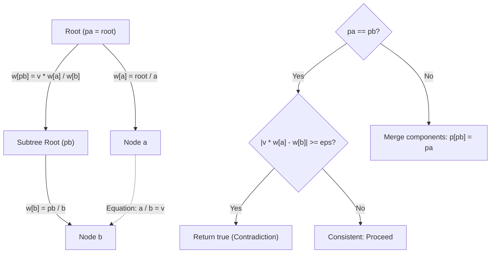

# Guided Example: Check for Contradictions in Equations

## 1. Problem Overview & Representative Instance

We are given a sequence of mathematical division constraints specified by two arrays:
- $equations$: an array of variable pairs where $equations[i] = [A_i, B_i]$ defines the quotient $A_i / B_i$.
- $values$: an array of positive real numbers where $values[i]$ is the asserted numerical value of $A_i / B_i$.

We must determine whether the system of equations contains any mathematical **contradictions**. A contradiction occurs if any equation asserts a ratio between two variables that conflicts with a previously established or algebraically implied ratio (accounting for standard floating-point imprecision with tolerance $\epsilon = 10^{-5}$).

If any contradiction is discovered during sequential evaluation, return `true`; if the entire system of equations is mutually consistent, return `false`.

Consider the representative problem instance:
$$equations = [[\text{"a"}, \text{"b"}], [\text{"b"}, \text{"c"}], [\text{"a"}, \text{"c"}]], \quad values = [3.0, 0.5, 1.5]$$

Let us analyze the algebraic dependencies step by step:
1. Equation 1 ($a / b = 3.0$):
   Establishes the relation between $a$ and $b$: $a = 3.0 \cdot b$.
2. Equation 2 ($b / c = 0.5$):
   Establishes the relation between $b$ and $c$: $b = 0.5 \cdot c$.
   Substituting $b$ into Equation 1 algebraically implies:
   $$\frac{a}{c} = \frac{a}{b} \times \frac{b}{c} = 3.0 \times 0.5 = 1.5$$
3. Equation 3 ($a / c = 1.5$):
   Directly asserts $a / c = 1.5$.
   Comparing asserted value against implied value:
   $$|1.5 - 1.5| = 0.0 < 10^{-5}$$
   The asserted value matches the implied value exactly.

No contradictions arise. The algorithm returns `false`.

Now contrast this with an inconsistent instance:
$$equations = [[\text{"a"}, \text{"b"}], [\text{"b"}, \text{"a"}]], \quad values = [3.0, 0.5]$$
- Equation 1 asserts $a / b = 3.0 \implies b / a = 1 / 3.0 \approx 0.33333$.
- Equation 2 asserts $b / a = 0.5$.
- Difference $|0.5 - 0.33333| = 0.16667 \ge 10^{-5}$. A contradiction is detected, returning `true`.

---

## 2. Mathematical & Algorithmic Principles

### Logarithmic Isomorphism and Multiplicative Disjoint Set Union

A system of multiplicative equations $A / B = v$ is isomorphic to an additive potential system under the natural logarithm:
$$\ln(A) - \ln(B) = \ln(v)$$
To avoid transcendental function calls and maintain numerical precision, we implement a **Weighted Disjoint Set Union (Weighted DSU)** operating directly in the multiplicative group $(\mathbb{R}^+, \times)$.

Each connected component forms a directed tree rooted at an arbitrary representative vertex $R$. For each variable node $x$, we maintain:
- $p[x]$: the parent pointer of node $x$.
- $w[x]$: the multiplicative scale factor relating node $x$ to its parent:
  $$w[x] = \frac{p[x]}{x} \iff p[x] = w[x] \cdot x$$

### Multiplicative Path Compression

When querying $\text{find}(x)$, the recursion traverses up to the root $R$. During backtracking:
$$w[x] \leftarrow w[x] \times w[\text{old\_parent}]$$
$$p[x] \leftarrow R$$
By induction, after path compression:
$$w[x] = \frac{R}{x}$$

### Union and Consistency Checking

Given an equation $A / B = v$, let $pa = \text{find}(A)$ and $pb = \text{find}(B)$:
1. **Case 1 ($pa \ne pb$, Disjoint Components):**
   Variables $A$ and $B$ belong to independent components. We merge component $pb$ into $pa$ by setting $p[pb] = pa$.
   We must determine the bridge weight $w[pb] = pa / pb$:
   $$\frac{pa}{pb} = \frac{w[A] \cdot A}{w[B] \cdot B} = \frac{w[A]}{w[B]} \times \frac{A}{B} = \frac{w[A]}{w[B]} \times v$$
   Therefore:
   $$w[pb] \leftarrow \frac{v \cdot w[A]}{w[B]}$$
2. **Case 2 ($pa == pb$, Cycle / Existing Relation):**
   Variables $A$ and $B$ already share the common root $R$.
   Their algebraically implied ratio is:
   $$\frac{A}{B} = \frac{R / w[A]}{R / w[B]} = \frac{w[B]}{w[A]}$$
   The equation asserts $A / B = v \iff w[B] = v \cdot w[A]$.
   We evaluate the residual discrepancy:
   $$\text{Discrepancy} = |v \cdot w[A] - w[B]|$$
   If $\text{Discrepancy} \ge \epsilon = 10^{-5}$, the assertion contradicts earlier equations.

| Weighted DSU Operation | Multiplicative Formulation | Algebraic Meaning |
|---|---|---|
| Node Scale Factor $w[x]$ | $w[x] = R / x$ | Multiplier converting node value $x$ to root value $R$ |
| Path Compression | $w[x] \leftarrow w[x] \cdot w[p[x]]$ | Collapses multi-hop tree branches into direct root links |
| Component Merge | $w[pb] \leftarrow v \cdot w[A] / w[B]$ | Calibrates relative scale factor between distinct root nodes |
| Consistency Test | $|v \cdot w[A] - w[B]| < \epsilon$ | Validates that implied ratio matches given assertion |

---

## 3. Step-by-Step Walkthrough with Intermediate State

Let us trace $equations = [[\text{"a"}, \text{"b"}], [\text{"b"}, \text{"c"}], [\text{"a"}, \text{"c"}]]$ with $values = [3.0, 0.5, 1.5]$.
Map identifiers to indices: $\text{"a"} \to 0, \, \text{"b"} \to 1, \, \text{"c"} \to 2$.
Initialize $p = [0, 1, 2]$ and $w = [1.0, 1.0, 1.0]$.

### Step 1: Process $a / b = 3.0$ (Indices $0, 1$)
- Find roots:
  - $\text{find}(0) \implies pa = 0, \, w[0] = 1.0$.
  - $\text{find}(1) \implies pb = 1, \, w[1] = 1.0$.
- Because $pa \ne pb$ ($0 \ne 1$), merge component $1$ into $0$:
  - Parent assignment: $p[1] \leftarrow 0$.
  - Bridge weight:
    $$w[1] = \frac{v \cdot w[0]}{w[1]} = \frac{3.0 \times 1.0}{1.0} = 3.0$$
- DSU State:
  - $p = [0, 0, 2]$
  - $w = [1.0, 3.0, 1.0]$

### Step 2: Process $b / c = 0.5$ (Indices $1, 2$)
- Find roots:
  - $\text{find}(1) \implies p[1] = 0$, already root. $pa = 0, \, w[1] = 3.0$.
  - $\text{find}(2) \implies p[2] = 2$, root is $pb = 2, \, w[2] = 1.0$.
- Because $pa \ne pb$ ($0 \ne 2$), merge component $2$ into $0$:
  - Parent assignment: $p[2] \leftarrow 0$.
  - Bridge weight:
    $$w[2] = \frac{v \cdot w[1]}{w[2]} = \frac{0.5 \times 3.0}{1.0} = 1.5$$
- DSU State:
  - $p = [0, 0, 0]$
  - $w = [1.0, 3.0, 1.5]$
  - Physical meaning: $R = 0 \implies w[0] = R/a = 1.0, \, w[1] = R/b = 3.0, \, w[2] = R/c = 1.5$.

### Step 3: Process $a / c = 1.5$ (Indices $0, 2$)
- Find roots:
  - $\text{find}(0) \implies pa = 0, \, w[0] = 1.0$.
  - $\text{find}(2) \implies pb = 0, \, w[2] = 1.5$.
- Because $pa == pb = 0$, both variables already belong to the same component!
- Check consistency:
  $$\text{Discrepancy} = |v \cdot w[0] - w[2]| = |1.5 \times 1.0 - 1.5| = |1.5 - 1.5| = 0.0$$
- Since $0.0 < 10^{-5}$, the equation is consistent.

All equations processed with zero contradictions. Return `false`.

---

## 4. Comprehensive State Trace

| Step | Equation $[A, B] = v$ | $pa = \text{find}(A)$ | $pb = \text{find}(B)$ | Relation State | Action Taken | Bridge Weight $w$ Computed | Residual Error |
|---|---|---|---|---|---|---|---|
| Init | - | - | - | All disjoint | $p=[0, 1, 2], w=[1, 1, 1]$ | - | - |
| $1$ | $a / b = 3.0$ | $0$ ($w=1.0$) | $1$ ($w=1.0$) | Disjoint | Union $p[1]=0$ | $w[1] = 3.0 \times 1 / 1 = 3.0$ | N/A (new edge) |
| $2$ | $b / c = 0.5$ | $0$ ($w=3.0$) | $2$ ($w=1.0$) | Disjoint | Union $p[2]=0$ | $w[2] = 0.5 \times 3 / 1 = 1.5$ | N/A (new edge) |
| $3$ | $a / c = 1.5$ | $0$ ($w=1.0$) | $0$ ($w=1.5$) | Shared Root | Consistency Test | Retained ($w[2]=1.5$) | $|1.5 \times 1 - 1.5| = 0.0$ |

---

## 5. Algorithmic Correctness & Soundness

### Preservation of the Multiplicative Group Invariant
During path compression from node $x$ to root $R$ through intermediate parents $y_1, y_2, \dots, y_k$:
$$\frac{R}{x} = \frac{R}{y_k} \times \frac{y_k}{y_{k-1}} \times \dots \times \frac{y_1}{x} = \prod_{j} w[y_j]$$
The multiplicative accumulation preserves the exact ratio of the node to the root.

### Cycle Detection and Contradiction Soundness
Whenever $pa == pb$, there exists a previous chain of equations connecting $A$ and $B$. The relative values of $A$ and $B$ are uniquely determined by their common root:
$$A = \frac{R}{w[A]}, \quad B = \frac{R}{w[B]} \implies \frac{A}{B} = \frac{w[B]}{w[A]}$$
If the newly asserted value $v$ differs from this implied ratio by at least $\epsilon$, the two constraints cannot be satisfied simultaneously in $\mathbb{R}^+$. The early exit with `true` is provably correct.

---

## 6. Edge Cases & Anti-Patterns

### Anti-Pattern: Direction Confusion in Weighted DSU
A frequent implementation failure is defining $w[x] = x / parent$ instead of $parent / x$ while applying the union formula for $parent / x$. This inverts quotients, turning a multiplication by $v$ into a division by $v$. Consistently maintaining $w[x] = parent / x$ avoids inversion errors.

### Edge Case: Self-Loop Equations ($a / a = 1.0$)
If an equation asserts $a / a = 1.0$, $pa = pb = \text{find}(a)$. The discrepancy is $|1.0 \times w[a] - w[a]| = 0$, evaluating consistently. If an equation asserted $a / a = 2.0$, it immediately flags a contradiction ($|2.0 \times 1 - 1| = 1.0 \ge \epsilon$).

### Edge Case: Disconnected Clusters of Equations
If equations describe multiple independent components (e.g. $\{a, b\}$ and $\{x, y\}$), Weighted DSU maintains disjoint trees with separate roots without cross-talk.

---

## 7. Complexity Analysis

### Time Complexity
- **Variable Mapping:** Scanning $E$ equations to assign unique integer IDs to $V$ variables takes $O(E)$ time.
- **DSU Operations:** For each of the $E$ equations, we perform two `find` calls with path compression and at most one union operation.
- By the Tarjan inverse Ackermann analysis, each DSU operation runs in $O(\alpha(V))$ amortized time.
- **Total Time Complexity:** $O(E \cdot \alpha(V))$, which is virtually indistinguishable from strictly linear $O(E)$ time.

### Space Complexity
- Parent array $p$ and weight array $w$ each consume $O(V)$ floating-point memory.
- Hash map for variable names requires $O(V)$ space.
- **Total Auxiliary Space Complexity:** strictly $O(V)$ space where $V \le 2E$.
