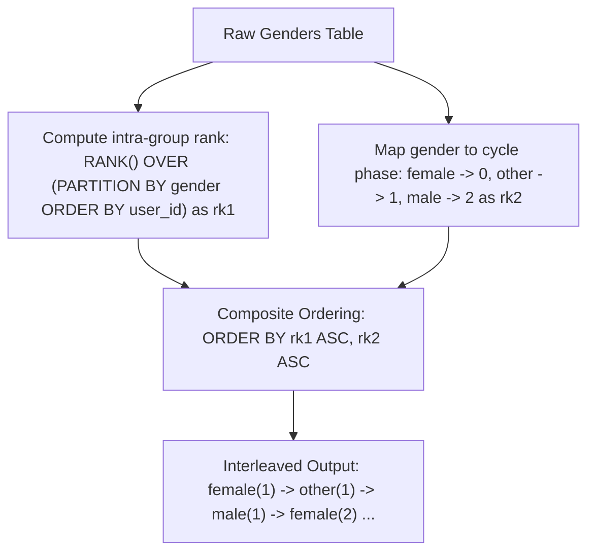

# Guided Example: Arrange Table by Gender

## 1. Problem Overview & Representative Instance

We are given a relational table `Genders` containing user demographic records:
- `user_id`: unique primary key integer identifying each user.
- `gender`: string category taking values in $\{\text{'female'}, \text{'other'}, \text{'male'}\}$.

The problem guarantees that each of the three gender categories appears an equal number of times in the table. We are required to rearrange the rows of `Genders` to satisfy two simultaneous formatting invariants:
1. **Alternating Gender Sequence:** Rows must strictly cycle in the fixed order:
   $$\text{'female'} \to \text{'other'} \to \text{'male'}$$
2. **Intra-Gender Monotonicity:** Within each gender group, users must appear in strictly ascending order of their numerical `user_id`.

Consider the representative database instance:

| `user_id` | `gender` |
|---|---|
| 4 | male |
| 7 | female |
| 2 | other |
| 5 | male |
| 3 | female |
| 8 | male |
| 6 | other |
| 1 | other |
| 9 | female |

Partitioning and sorting each gender category independently by `user_id`:
- **Female Group:** $[3, 7, 9]$
- **Other Group:** $[1, 2, 6]$
- **Male Group:** $[4, 5, 8]$

Interleaving by cycle index $k \in \{1, 2, 3\}$:
- **Cycle 1 (Rank 1):**
  - Female: `user_id = 3`
  - Other: `user_id = 1`
  - Male: `user_id = 4`
- **Cycle 2 (Rank 2):**
  - Female: `user_id = 7`
  - Other: `user_id = 2`
  - Male: `user_id = 5`
- **Cycle 3 (Rank 3):**
  - Female: `user_id = 9`
  - Other: `user_id = 6`
  - Male: `user_id = 8`

The final arranged table is:

| `user_id` | `gender` |
|---|---|
| 3 | female |
| 1 | other |
| 4 | male |
| 7 | female |
| 2 | other |
| 5 | male |
| 9 | female |
| 6 | other |
| 8 | male |

---

## 2. Mathematical & Algorithmic Principles

### Dual-Key Coordinate Transformation

Relational tables are intrinsically unordered multisets. To produce a cyclic, interleaved sequence, we project each record $(u, g)$ into a discrete 2D coordinate space $(rk_1, rk_2)$:

1. **Cycle Rank ($rk_1$):**
   Within each partition defined by $g \in \{\text{'female'}, \text{'other'}, \text{'male'}\}$, we assign each record an ordinal rank based on its `user_id`:
   $$rk_1 = \text{RANK}() \text{ OVER} (\text{PARTITION BY } gender \text{ ORDER BY } user\_id)$$
   Since all three groups have identical cardinality $K$, $rk_1$ spans $\{1, 2, \dots, K\}$ for every category.
2. **Phase Offset ($rk_2$):**
   To enforce the required cyclic ordering inside each cycle, we define a static injection $\phi: \text{Gender} \to \{0, 1, 2\}$:
   $$\phi(\text{'female'}) = 0, \quad \phi(\text{'other'}) = 1, \quad \phi(\text{'male'}) = 2$$
3. **Lexicographical Ordering:**
   Sorting all tuples by the composite key $(rk_1, rk_2)$ lexicographically:
   $$(rk_1, rk_2) < (rk_1', rk_2') \iff (rk_1 < rk_1') \lor (rk_1 = rk_1' \land rk_2 < rk_2')$$
   This guarantees that:
   - All records with cycle rank $1$ appear before any record with cycle rank $2$.
   - Within cycle rank $k$, rows are ordered strictly by phase $0 \to 1 \to 2$ (`female` $\to$ `other` $\to$ `male`).

| Sorting Attribute | Definition | Cardinality | Primary Invariant Enforced |
|---|---|---|---|
| Primary Key $rk_1$ | `RANK() OVER (PARTITION BY gender ORDER BY user_id)` | $K = N/3$ | Clusters corresponding ordinal ranks into identical cycle bands |
| Secondary Key $rk_2$ | `CASE gender WHEN 'female' THEN 0 WHEN 'other' THEN 1 ELSE 2 END` | $3$ | Enforces strict cyclical rotation inside each cycle band |

---

## 3. Step-by-Step Walkthrough with Intermediate State

Let us trace the row-by-row rank assignments on the $9$-row input table.

### Step 1: Assign Intra-Group Rank $rk_1$
Partitioning by `gender` and ordering ascending by `user_id`:
- **Female Group:**
  - `user_id = 3` is the $1^{\text{st}}$ female $\implies rk_1 = 1$.
  - `user_id = 7` is the $2^{\text{nd}}$ female $\implies rk_1 = 2$.
  - `user_id = 9` is the $3^{\text{rd}}$ female $\implies rk_1 = 3$.
- **Other Group:**
  - `user_id = 1` is the $1^{\text{st}}$ other $\implies rk_1 = 1$.
  - `user_id = 2` is the $2^{\text{nd}}$ other $\implies rk_1 = 2$.
  - `user_id = 6` is the $3^{\text{rd}}$ other $\implies rk_1 = 3$.
- **Male Group:**
  - `user_id = 4` is the $1^{\text{st}}$ male $\implies rk_1 = 1$.
  - `user_id = 5` is the $2^{\text{nd}}$ male $\implies rk_1 = 2$.
  - `user_id = 8` is the $3^{\text{rd}}$ male $\implies rk_1 = 3$.

### Step 2: Assign Phase Rank $rk_2$
- Every `'female'` row receives $rk_2 = 0$.
- Every `'other'` row receives $rk_2 = 1$.
- Every `'male'` row receives $rk_2 = 2$.

### Step 3: Composite Sorting by `(rk1, rk2)`
Sorting the rows by `(rk1, rk2)` ascending:
1. $(rk_1 = 1, rk_2 = 0) \implies (3, \text{'female'})$
2. $(rk_1 = 1, rk_2 = 1) \implies (1, \text{'other'})$
3. $(rk_1 = 1, rk_2 = 2) \implies (4, \text{'male'})$
4. $(rk_1 = 2, rk_2 = 0) \implies (7, \text{'female'})$
5. $(rk_1 = 2, rk_2 = 1) \implies (2, \text{'other'})$
6. $(rk_1 = 2, rk_2 = 2) \implies (5, \text{'male'})$
7. $(rk_1 = 3, rk_2 = 0) \implies (9, \text{'female'})$
8. $(rk_1 = 3, rk_2 = 1) \implies (6, \text{'other'})$
9. $(rk_1 = 3, rk_2 = 2) \implies (8, \text{'male'})$

The final interleaved stream is emitted directly.

---

## 4. Comprehensive State Trace

| `user_id` | `gender` | Gender Partition | Partition Order by `user_id` | $rk_1$ Value | $rk_2$ Value | Composite Key $(rk_1, rk_2)$ | Final Emission Order |
|---|---|---|---|---|---|---|---|
| $4$ | male | male | $1^{\text{st}}$ male | $1$ | $2$ | $(1, 2)$ | $3^{\text{rd}}$ |
| $7$ | female | female | $2^{\text{nd}}$ female | $2$ | $0$ | $(2, 0)$ | $4^{\text{th}}$ |
| $2$ | other | other | $2^{\text{nd}}$ other | $2$ | $1$ | $(2, 1)$ | $5^{\text{th}}$ |
| $5$ | male | male | $2^{\text{nd}}$ male | $2$ | $2$ | $(2, 2)$ | $6^{\text{th}}$ |
| $3$ | female | female | $1^{\text{st}}$ female | $1$ | $0$ | $(1, 0)$ | $1^{\text{st}}$ |
| $8$ | male | male | $3^{\text{rd}}$ male | $3$ | $2$ | $(3, 2)$ | $9^{\text{th}}$ |
| $6$ | other | other | $3^{\text{rd}}$ other | $3$ | $1$ | $(3, 1)$ | $8^{\text{th}}$ |
| $1$ | other | other | $1^{\text{st}}$ other | $1$ | $1$ | $(1, 1)$ | $2^{\text{nd}}$ |
| $9$ | female | female | $3^{\text{rd}}$ female | $3$ | $0$ | $(3, 0)$ | $7^{\text{th}}$ |

---

## 5. Algorithmic Correctness & Soundness

### Determinism and Stability
Because `user_id` is a unique primary key, within any partition of `gender`, no two rows can have identical `user_id`. Therefore:
- The window function `RANK() OVER (PARTITION BY gender ORDER BY user_id)` produces strictly distinct, contiguous integers $\{1, 2, \dots, K\}$ without ties.
- The pair $(rk_1, rk_2)$ is strictly unique across all rows in the table.
- Composite sorting `ORDER BY rk1, rk2` is totally ordered and deterministic.

### Strict Rotation Invariant
By construction, the sequence of $(rk_1, rk_2)$ tuples progresses:
$$(1, 0), (1, 1), (1, 2), (2, 0), (2, 1), (2, 2), \dots, (K, 0), (K, 1), (K, 2)$$
Projecting onto `gender`, the values strictly cycle $\text{female} \to \text{other} \to \text{male}$. Projecting onto any individual gender, $rk_1$ strictly increases, ensuring $user\_id$ strictly increases.

---

## 6. Edge Cases & Anti-Patterns

### Anti-Pattern: Correlated Subquery Joins
Attempting to interleave by writing three separate subqueries and joining them on artificial row counters creates unnecessary table scans and memory buffers. Window functions partition and rank in a single pass over the clustered index.

### Edge Case: Minimal Table ($3$ Rows, $1$ Per Gender)
When $N = 3$, $K = 1$. Exactly one cycle executes: $(1, 0), (1, 1), (1, 2)$, emitting the single trio in exact order.

### Edge Case: Non-Contiguous User IDs
User IDs do not need to be consecutive integers (e.g. $100, 500, 9999$). `RANK()` assigns ordinal indices $1, 2, 3$ based on numerical sorting regardless of gaps.

---

## 7. Complexity Analysis

### Time Complexity
- **Partitioning and Ranking:** Evaluating `RANK() OVER (PARTITION BY gender ORDER BY user_id)` partitions the $N$ rows into $3$ groups and sorts each group. Sorting $3$ groups of size $N/3$ takes $3 \times O(\frac{N}{3} \log \frac{N}{3}) = O(N \log N)$ time.
- **Global Sort:** Sorting $N$ rows by composite key $(rk_1, rk_2)$ takes $O(N \log N)$ time.
- **Overall Time Complexity:** $O(N \log N)$, which is optimal for comparison-based relational ordering.

### Space Complexity
- Intermediate CTE stores the auxiliary columns $rk_1$ and $rk_2$ for each of the $N$ rows.
- **Auxiliary Space Complexity:** $O(N)$ space.
