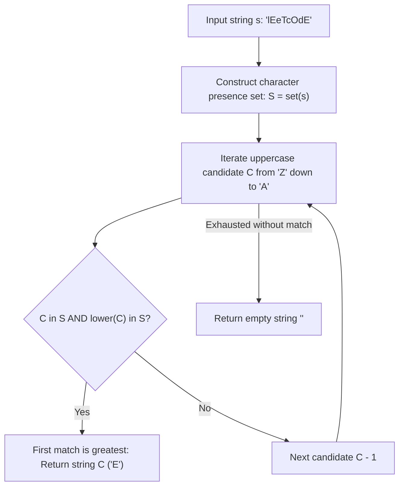

# Guided Example: Greatest English Letter in Upper and Lower Case

## 1. Problem Overview & Representative Instance

We are given a string $s$ consisting of English letters. A letter $L \in \{\text{'A'}, \dots, \text{'Z'}\}$ is defined as **biform** in $s$ if both its uppercase form $L$ and its lowercase form $\text{lower}(L)$ appear at least once in $s$:
$$L \in s \quad \text{and} \quad \text{lower}(L) \in s$$

Among all letters that satisfy this dual-casing condition, our goal is to identify the alphabetically **greatest** letter (closest to `'Z'`) and return it as an uppercase character. If no letter appears in both uppercase and lowercase forms, we return an empty string `""`.

Consider the representative problem instance:
$$s = \text{"lEeTcOdE"}$$

Let us analyze the distinct characters present in $s$:
$$\text{Chars}(s) = \{\text{'l'}, \text{'E'}, \text{'e'}, \text{'T'}, \text{'c'}, \text{'O'}, \text{'d'}\}$$

Examining candidate letters in descending alphabetical order from `'Z'` down to `'A'`:
- Letters `'Z'` down to `'U'`: neither uppercase nor lowercase forms appear in $s$.
- Letter `'T'`: uppercase `'T'` is present, but lowercase `'t'` is absent (Only one case present).
- Letters `'S'` down to `'P'`: absent.
- Letter `'O'`: uppercase `'O'` is present, but lowercase `'o'` is absent.
- Letters `'N'` down to `'F'`: absent.
- Letter `'E'`: uppercase `'E'` is present, and lowercase `'e'` is also present!
  Both casing variants are confirmed in $s$.

Because we scan in strict descending order from `'Z'` downward, the first letter satisfying the condition is guaranteed to be the lexicographically greatest. The algorithm returns `"E"`.

---

## 2. Mathematical & Algorithmic Principles

### Dual-Membership Boolean Predicate

Let $\Sigma_{\text{upper}} = \{\text{'A'}, \text{'B'}, \dots, \text{'Z'}\}$ be the ordered sequence of 26 uppercase letters, and let $\pi: \Sigma_{\text{upper}} \to \Sigma_{\text{lower}}$ map an uppercase letter to its lowercase counterpart.
For a string $s$, we define the character presence set:
$$\mathcal{U} = \{ c : c \in s \}$$

The indicator predicate $\text{Biform}(C)$ for an uppercase character $C \in \Sigma_{\text{upper}}$ is:
$$\text{Biform}(C) = [C \in \mathcal{U} \land \pi(C) \in \mathcal{U}]$$

We seek the supremum under standard alphabetical ordering:
$$C^* = \max_{\prec} \{ C \in \Sigma_{\text{upper}} : \text{Biform}(C) = \text{True} \}$$

### Greedy Descending Early Exit

Because the alphabet contains a small fixed set of 26 letters:
$$\Sigma_{\text{upper}} = \text{"ZYXWVUTSRQPONMLKJIHGFEDCBA"}$$
Iterating in strict descending order guarantees that the first character $C$ satisfying $\text{Biform}(C) == \text{True}$ is mathematically identical to $C^*$. This enables an immediate short-circuit exit without sorting or storing all candidates.

| State Parameter | Data Structure / Domain | Operational Meaning |
|---|---|---|
| Presence Set $\mathcal{U}$ | Hash Set or Bitset of size $256$ | $O(1)$ membership test for character existence |
| Candidate Cursor $C$ | Sequence `'Z'` down to `'A'` | Enforces strict descending alphabetical search order |
| Dual Condition | $C \in \mathcal{U} \land \pi(C) \in \mathcal{U}$ | Conjunction testing simultaneous upper and lower occurrences |

---

## 3. Step-by-Step Walkthrough with Intermediate State

Let us trace the execution on $s = \text{"lEeTcOdE"}$.

### Step 1: Build Unique Character Set
We scan $s$ once and collect all distinct characters:
$$\mathcal{U} = \{\text{'l'}, \text{'E'}, \text{'e'}, \text{'T'}, \text{'c'}, \text{'O'}, \text{'d'}\}$$

### Step 2: Descending Scan Across Uppercase Alphabet
We inspect candidate letters in order:
- **Candidate `'Z'`:** `'Z' \notin \mathcal{U}$ $\implies$ Skip.
- **Candidate `'Y'`:** `'Y' \notin \mathcal{U}$ $\implies$ Skip.
- **Candidate `'X'`:** `'X' \notin \mathcal{U}$ $\implies$ Skip.
- **Candidate `'W'`:** `'W' \notin \mathcal{U}$ $\implies$ Skip.
- **Candidate `'V'`:** `'V' \notin \mathcal{U}$ $\implies$ Skip.
- **Candidate `'U'`:** `'U' \notin \mathcal{U}$ $\implies$ Skip.
- **Candidate `'T'`:** `'T' \in \mathcal{U}$, but $\pi(\text{'T'}) = \text{'t'} \notin \mathcal{U}$. Lowercase missing $\implies$ Skip.
- **Candidate `'S'`:** `'S' \notin \mathcal{U}$ $\implies$ Skip.
- **Candidate `'R'`:** `'R' \notin \mathcal{U}$ $\implies$ Skip.
- **Candidate `'Q'`:** `'Q' \notin \mathcal{U}$ $\implies$ Skip.
- **Candidate `'P'`:** `'P' \notin \mathcal{U}$ $\implies$ Skip.
- **Candidate `'O'`:** `'O' \in \mathcal{U}$, but $\pi(\text{'O'}) = \text{'o'} \notin \mathcal{U}$. Lowercase missing $\implies$ Skip.
- **Candidate `'N'` down to `'F'`:** absent.
- **Candidate `'E'`:**
  - Test uppercase: $\text{'E'} \in \mathcal{U}$ is True.
  - Test lowercase: $\pi(\text{'E'}) = \text{'e'} \in \mathcal{U}$ is True.
  - Both conditions hold!

Candidate `'E'` is the first match. The algorithm halts immediately and returns `"E"`.

---

## 4. Comprehensive State Trace

| Probe Letter $C$ | Uppercase $C \in \mathcal{U}$ | Lowercase $\pi(C) \in \mathcal{U}$ | Conjunction $\text{Biform}(C)$ | Decision | Emitted Result |
|---|---|---|---|---|---|
| `'Z'` down to `'U'` | False | False | False | Continue | - |
| `'T'` | True | False (`'t'` missing) | False | Continue | - |
| `'S'` down to `'P'` | False | False | False | Continue | - |
| `'O'` | True | False (`'o'` missing) | False | Continue | - |
| `'N'` down to `'F'` | False | False | False | Continue | - |
| `'E'` | True | True (`'e'` present) | **True** | **Terminate Early** | `"E"` |

---

## 5. Algorithmic Correctness & Soundness

### Optimality Guarantee of Descending Traversal
Let $S_{\text{valid}} = \{ C \in \Sigma_{\text{upper}} : \text{Biform}(C) \}$.
If $S_{\text{valid}} \ne \emptyset$, there is a unique maximum $C_{\max}$. Because the search probes elements in the strict linear sequence $Z \succ Y \succ \dots \succ A$, every candidate $C \succ C_{\max}$ is tested before $C_{\max}$. Since none of those satisfy the predicate, the first element discovered is guaranteed to be $C_{\max}$.

### Multiplicity Independence
The definition of biformity requires that each case form occurs at least once. Repeated occurrences of the same character (e.g. `'E'` appearing twice) add no new information. Using a set abstracts away multiplicity without loss of validity.

---

## 6. Edge Cases & Anti-Patterns

### Anti-Pattern: Converting Entire String Case
Converting $s$ to lowercase (`s.lower()`) destroys casing information, making it impossible to verify whether both forms existed in the original text. Retaining raw case-sensitive characters is mandatory.

### Edge Case: Disjoint Casing Across Alphabet
Suppose $s = \text{"AbCdEf"}$. The uppercase letters are $\{A, C, E\}$ and the lowercase letters are $\{b, d, f\}$. No letter shares both forms. The loop completes without finding a match, correctly returning `""`.

### Edge Case: Only Uppercase or Only Lowercase
If $s = \text{"ABCXYZ"}$ (all uppercase), for every letter $C$, $\pi(C) \notin \mathcal{U}$. The algorithm correctly returns `""`.

---

## 7. Complexity Analysis

### Time Complexity
- **Set Construction:** Inserting all characters of $s$ of length $L$ into a hash set takes $O(L)$ time.
- **Descending Alphabet Scan:** Testing at most 26 uppercase letters with two $O(1)$ set lookups takes at most $2 \times 26 = 52$ operations, which is $O(1)$ constant time.
- **Total Time Complexity:** $O(L)$ strictly linear in the length of $s$.

### Space Complexity
- Storing unique characters of $s$ in a hash set takes at most $O(\min(L, |\Sigma|)) = O(1)$ space since $|\Sigma| \le 52$ for English letters.
- **Auxiliary Space Complexity:** $O(1)$ constant memory.
