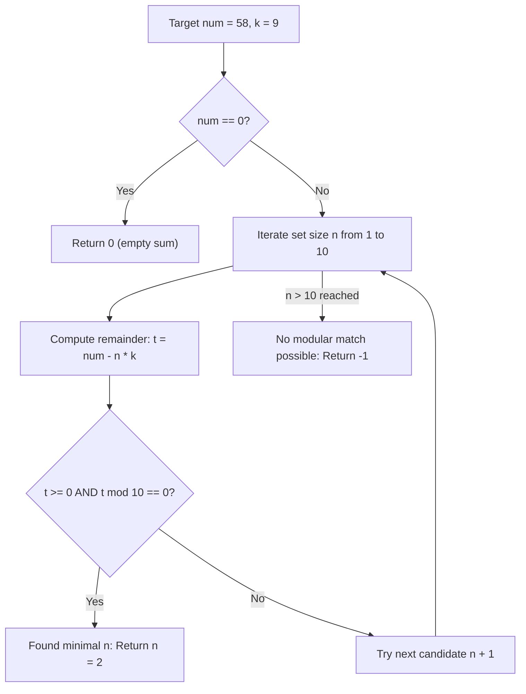

# Guided Example: Sum of Numbers With Units Digit K

## 1. Problem Overview & Representative Instance

We are given two integers: a target sum $num \ge 0$ and a decimal digit $k \in [0, 9]$. We consider the set of all positive integers whose units digit in base $10$ equals $k$:
$$\mathcal{S}_k = \{ x \in \mathbb{Z}^+ : x \equiv k \pmod{10} \}$$

We are tasked with determining the **minimum size** of a multiset of integers from $\mathcal{S}_k$ whose sum equals $num$. If $num$ cannot be expressed as the sum of any combination of elements from $\mathcal{S}_k$, return $-1$. If $num = 0$, an empty multiset of size $0$ achieves the sum $0$.

Consider the representative problem instance:
$$num = 58, \quad k = 9$$

We seek to represent $58$ as the sum of $n$ numbers, each having units digit $9$:
- Testing $n = 1$ number:
  - A single number must equal $58$.
  - But $58 \equiv 8 \pmod{10} \ne 9$. Impossible with $n = 1$.
- Testing $n = 2$ numbers:
  - The sum of units digits is $9 + 9 = 18 \equiv 8 \pmod{10}$.
  - The units digit of $num = 58$ is $8$, matching $18 \pmod{10}$!
  - Subtraction: $58 - (2 \times 9) = 58 - 18 = 40 \ge 0$.
  - Because $40$ is a non-negative multiple of $10$, we can absorb the $40$ into the tens place of one of the numbers:
    $$x_1 = 49, \quad x_2 = 9 \implies 49 + 9 = 58$$
  - Both $49$ and $9$ belong to $\mathcal{S}_9$.

Thus, the minimum multiset size is $2$.

---

## 2. Mathematical & Algorithmic Principles

### Modular Reduction to Units Digit Congruence

Suppose $num$ can be partitioned into $n$ positive integers $x_1, x_2, \dots, x_n \in \mathcal{S}_k$:
$$num = \sum_{j=1}^n x_j$$

Because each $x_j \equiv k \pmod{10}$, we take modulo $10$ on both sides:
$$num \equiv \sum_{j=1}^n x_j \equiv \sum_{j=1}^n k = n \cdot k \pmod{10}$$

This yields the fundamental modular congruence condition:
$$num - n \cdot k \equiv 0 \pmod{10}$$

### Non-Negativity and Tens-Place Absorption Lemma

**Lemma:** *A multiset of size $n \ge 1$ exists if and only if:*
$$num \ge n \cdot k \quad \text{and} \quad (num - n \cdot k) \equiv 0 \pmod{10}$$

**Proof:**
- *Necessity:* For any $x_j \in \mathcal{S}_k$, $x_j = 10 \cdot q_j + k$ with integer $q_j \ge 0$ (if $k > 0$) or $q_j \ge 1$ (if $k = 0$). Summing across all $j$:
  $$num = \sum_{j=1}^n (10 q_j + k) = 10 \sum_{j=1}^n q_j + n \cdot k$$
  Since $q_j \ge 0$, $\sum q_j \ge 0$, implying $num \ge n \cdot k$ and $num - n \cdot k = 10 \sum q_j$ is a multiple of $10$.
- *Sufficiency:* Let $t = num - n \cdot k \ge 0$ with $t \equiv 0 \pmod{10}$. We construct:
  $$x_1 = k + t, \quad x_2 = k, \quad x_3 = k, \quad \dots, \quad x_n = k$$
  Then $x_1 + x_2 + \dots + x_n = (k + t) + (n - 1)k = n \cdot k + t = num$.
  Moreover, $x_1 \equiv k + 0 \equiv k \pmod{10}$ and $x_1 \ge k > 0$ (or if $k = 0$, $t = num > 0$ and $x_1 = t \ge 10 > 0$). Every constructed term is strictly positive and has units digit $k$.

### Finite Bounded Search Space ($n \le 10$)

Because $(n \cdot k) \pmod{10}$ is strictly periodic with period dividing $10$:
$$(n + 10) \cdot k \equiv n \cdot k \pmod{10}$$
Every possible residue class modulo $10$ that $n \cdot k$ can generate appears within the first $10$ integer values:
$$n \in \{1, 2, \dots, 10\}$$

If no candidate in $\{1, \dots, 10\}$ satisfies both $num \ge n \cdot k$ and $(num - n \cdot k) \equiv 0 \pmod{10}$, then no larger $n$ can satisfy the modular congruence while minimizing size. Hence, searching $n \in [1, 10]$ is exhaustive.

| Multiset Size $n$ | Multiple $n \cdot k$ | Residual $t = num - n \cdot k$ | Divisible by $10$? | Feasibility Condition |
|---|---|---|---|---|
| $n = 1$ | $1 \times 9 = 9$ | $58 - 9 = 49$ | No ($49 \not\equiv 0$) | Incompatible units digit |
| $n = 2$ | $2 \times 9 = 18$ | $58 - 18 = 40$ | **Yes** ($40 \equiv 0 \pmod{10}$) | **Minimal valid size** |

---

## 3. Step-by-Step Walkthrough with Intermediate State

Let us trace $num = 58$ with $k = 9$.

### Step 1: Base Case Zero Check
$num = 58 \ne 0$. Proceed to positive integers.

### Step 2: Test Size Candidates $n \in [1, 10]$

- **Candidate $n = 1$:**
  - Product $n \cdot k = 1 \times 9 = 9$.
  - Remainder: $t = 58 - 9 = 49$.
  - Test: $t \ge 0$ ($49 \ge 0$), but $49 \pmod{10} = 9 \ne 0$.
  - Fails modular requirement.

- **Candidate $n = 2$:**
  - Product $n \cdot k = 2 \times 9 = 18$.
  - Remainder: $t = 58 - 18 = 40$.
  - Test: $t \ge 0$ ($40 \ge 0$), and $40 \pmod{10} = 0$.
  - Both conditions satisfied!

Candidate $n = 2$ is the smallest integer satisfying all constraints. The search halts immediately and returns $2$.

---

## 4. Comprehensive State Trace

| Multiset Size Candidate $n$ | Product $n \cdot k$ | Deficit $t = 58 - n \cdot k$ | Non-negative ($t \ge 0$)? | Multiple of $10$ ($t \pmod{10} == 0$)? | Status |
|---|---|---|---|---|---|
| $1$ | $9$ | $49$ | True | False ($9$) | Infeasible |
| $2$ | $18$ | $40$ | True | **True** ($0$) | **Optimal Solution: $n = 2$** |

---

## 5. Algorithmic Correctness & Soundness

### Minimality Proof
Because the search iterates $n$ in strictly increasing order ($1, 2, 3, \dots$), the first integer $n$ that satisfies both $num \ge n \cdot k$ and $(num - n \cdot k) \equiv 0 \pmod{10}$ is mathematically the smallest possible multiset size.

### Impossibility Proof for $-1$
If no $n \in \{1, \dots, 10\}$ satisfies the conditions:
1. If for all $n \in [1, 10]$ with $n \cdot k \le num$, $(num - n \cdot k) \not\equiv 0 \pmod{10}$, then since the sequence of residues $(n \cdot k) \pmod{10}$ repeats with period at most $10$, no larger $n > 10$ can ever produce a different residue. Thus, no combination can ever match the units digit of $num$.
2. For example, if $num = 37$ and $k = 2$, $n \cdot 2$ is always even, so $37 - 2n$ is always odd, which can never be divisible by $10$. The algorithm tests $n \in [1, 10]$, fails all, and returns $-1$.

---

## 6. Edge Cases & Anti-Patterns

### Anti-Pattern: Unbounded Dynamic Programming Coin Change
Formulating this as an unbounded knapsack with coin denominations $\{k, 10+k, 20+k, \dots\}$ requires allocating a DP table of size $num \le 3000$ and computing transitions over hundreds of coins. The closed-form modular arithmetic solves the problem in at most $10$ constant-time checks.

### Edge Case: $num = 0$
When $num = 0$, $0$ can be formed by choosing $0$ numbers. The algorithm checks `if num == 0: return 0` as a special base condition.

### Edge Case: $k = 0$
When $k = 0$, elements must be positive multiples of $10$ ($\{10, 20, 30, \dots\}$).
If $num = 30$, $k = 0$:
- $n = 1$: $t = 30 - 0 = 30 \ge 0$ and $30 \equiv 0 \pmod{10}$. Returns $1$ ($x_1 = 30$).
If $num = 25$, $k = 0$: $25 \not\equiv 0 \pmod{10}$, returns $-1$.

---

## 7. Complexity Analysis

### Time Complexity
- Evaluating the condition $t = num - n \cdot k \ge 0$ and $t \pmod{10} == 0$ takes $O(1)$ arithmetic operations.
- The loop runs for $n \in [1, \min(10, num)]$, which is at most $10$ iterations.
- **Overall Time Complexity:** strictly $O(1)$ constant time.

### Space Complexity
- The algorithm uses only a few scalar integer variables ($num, k, n, t$).
- **Auxiliary Space Complexity:** strictly $O(1)$ constant space.