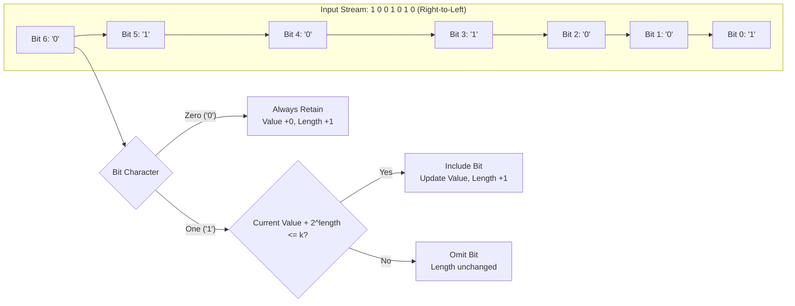

# Guided Example: Longest Binary Subsequence Less Than or Equal to K

## 1. Problem Overview & Representative Instance

Given a binary string $s$ consisting of characters `'0'` and `'1'`, and a positive integer $k$, the task is to determine the maximum length of a subsequence of $s$ that, when evaluated as a base-2 unsigned integer, is less than or equal to $k$.

A subsequence is formed by deleting zero or more characters from $s$ without altering the relative ordering of the remaining characters. Leading zeros in a binary representation do not increase its numerical value, meaning an arbitrary number of zeros can precede the most significant set bit without exceeding $k$.

Consider the representative instance:
- Binary string: $s = \text{"1001010"}$
- Threshold integer: $k = 5$

In binary, $5$ is represented as $101_2$. Our goal is to extract the longest possible subsequence whose numeric value does not exceed $5$.

## 2. Mathematical & Algorithmic Principles

Evaluating any chosen binary subsequence $b = b_{m-1} b_{m-2} \dots b_1 b_0$ (where $b_0$ is the least significant bit and $b_{m-1}$ is the most significant bit) produces an unsigned integer value:

$$\operatorname{val}(b) = \sum_{j=0}^{m-1} b_j \cdot 2^j$$

To maximize the subsequence length $m$ subject to $\operatorname{val}(b) \le k$, we analyze the marginal contribution of each bit:
1. **Zero Bits ($b_j = 0$):** Every zero included in the subsequence adds $+1$ to the total length $m$, but adds exactly $0 \cdot 2^j = 0$ to the numerical value. Retaining every `'0'` present in the original string $s$ is strictly non-detrimental; zeros can never cause $\operatorname{val}(b)$ to exceed $k$.
2. **One Bits ($b_j = 1$):** A one bit positioned at index $j$ from the right contributes $2^j$ to the numerical total. Because $2^j$ grows exponentially with the position $j$, including a set bit at a lower power of two imposes the smallest possible cost against the budget $k$.

Consequently, an optimal greedy strategy scans the string $s$ in reverse order, from right to left:
- When a `'0'` is encountered, it is unconditionally accepted. Its position index in the subsequence increments by $1$.
- When a `'1'` is encountered, we check if adding $2^j$ (where $j$ is the current number of accumulated characters in the chosen subsequence) keeps the running total $\le k$.
  - If $j < 30$ (since $2^{30} > 10^9 \ge k$) and the augmented numerical value does not exceed $k$, the bit is accepted, the numeric total increases by $2^j$, and the subsequence length increments.
  - If adding $2^j$ would exceed $k$, the bit is skipped. Any subsequent `'1'` further to the left would correspond to an even higher power of two ($2^{j'} \ge 2^j$) and thus must also be rejected. All remaining `'0'`s encountered earlier in the string can still be retained freely.

| Component | Role in Selection Process | Mathematical Impact |
|---|---|---|
| Zero Bit (`'0'`) | Unconditional acceptance | Increases length by 1, numeric addition is 0 |
| One Bit (`'1'`) | Greedy right-to-left acceptance | Increases length by 1, numeric addition is $2^j$ |
| Threshold $k$ | Strict upper bound on accumulated value | Cap ensures at most $\lfloor \log_2 k \rfloor + 1$ set bits |

## 3. Step-by-Step Walkthrough with Intermediate State

We process $s = \text{"1001010"}$ with $k = 5$ backwards from index $6$ down to index $0$.
Let $\text{len}$ denote the count of selected subsequence elements, and $\text{val}$ denote the accumulated numerical value.
Initial state: $\text{len} = 0$, $\text{val} = 0$.

- **Step 1 (Index 6, character `'0'`):**
  - Character is `'0'`.
  - Action: Retain unconditionally.
  - New state: $\text{len} = 0 + 1 = 1$, $\text{val} = 0$.

- **Step 2 (Index 5, character `'1'`):**
  - Character is `'1'`. Current exponent candidate is $j = \text{len} = 1$.
  - Marginal value: $2^1 = 2$.
  - Test: $\text{val} + 2 = 0 + 2 = 2 \le 5$.
  - Action: Accept `'1'`.
  - New state: $\text{val} = 2$, $\text{len} = 2$.

- **Step 3 (Index 4, character `'0'`):**
  - Character is `'0'`.
  - Action: Retain unconditionally.
  - New state: $\text{len} = 2 + 1 = 3$, $\text{val} = 2$.

- **Step 4 (Index 3, character `'1'`):**
  - Character is `'1'`. Current exponent candidate is $j = \text{len} = 3$.
  - Marginal value: $2^3 = 8$.
  - Test: $\text{val} + 8 = 2 + 8 = 10 > 5$.
  - Action: Reject `'1'` because the threshold $k = 5$ would be exceeded.
  - New state: $\text{val} = 2$, $\text{len} = 3$.

- **Step 5 (Index 2, character `'0'`):**
  - Character is `'0'`.
  - Action: Retain unconditionally.
  - New state: $\text{len} = 3 + 1 = 4$, $\text{val} = 2$.

- **Step 6 (Index 1, character `'0'`):**
  - Character is `'0'`.
  - Action: Retain unconditionally.
  - New state: $\text{len} = 4 + 1 = 5$, $\text{val} = 2$.

- **Step 7 (Index 0, character `'1'`):**
  - Character is `'1'`. Current exponent candidate is $j = \text{len} = 5$.
  - Marginal value: $2^5 = 32$.
  - Test: $\text{val} + 32 = 2 + 32 = 34 > 5$.
  - Action: Reject `'1'`.
  - Final state: $\text{val} = 2$, $\text{len} = 5$.

The maximum subsequence length is $5$. A valid matching subsequence from the original string is indices $[1, 2, 4, 5, 6]$ yielding `"00010"`, which evaluates to $2 \le 5$.

## 4. Comprehensive State Trace

The table below documents every reverse step across the representative input.

| Scan Step | String Index | Character | Exponent Candidate $j$ | Proposed Addition | Condition Check | Updated Subsequence Length | Running Numerical Value |
|---|---|---|---|---|---|---|---|
| Init | - | - | - | - | - | 0 | 0 |
| 1 | 6 | `'0'` | - | $+0$ | Unconditional zero | 1 | 0 |
| 2 | 5 | `'1'` | 1 | $+2^1 = 2$ | $0 + 2 \le 5$ (Accept) | 2 | 2 |
| 3 | 4 | `'0'` | - | $+0$ | Unconditional zero | 3 | 2 |
| 4 | 3 | `'1'` | 3 | $+2^3 = 8$ | $2 + 8 > 5$ (Reject) | 3 | 2 |
| 5 | 2 | `'0'` | - | $+0$ | Unconditional zero | 4 | 2 |
| 6 | 1 | `'0'` | - | $+0$ | Unconditional zero | 5 | 2 |
| 7 | 0 | `'1'` | 5 | $+2^5 = 32$ | $2 + 32 > 5$ (Reject) | 5 | 2 |

## 5. Algorithmic Correctness & Soundness

The correctness of this greedy selection rests on two structural properties:

1. **Exchange Argument for Zeroes:**
   Suppose an optimal subsequence $S^*$ omits some `'0'` that appeared at index $p$ in $s$. Reinserting this `'0'` into $S^*$ at its relative chronological position increases the length by $1$. The only effect on numerical value is potentially shifting set bits that appear to the left of index $p$ to higher powers of two. However, by choosing the reverse perspective (scanning from right to left), any zero added to the left of already chosen set bits merely acts as a leading zero with respect to those bits, contributing $0 \cdot 2^m = 0$. Therefore, an optimal subsequence containing all available zeros always exists.

2. **Minimality of Least Significant Powers:**
   Suppose we can choose $t$ set bits. The numerical contribution of any $t$ set bits placed at distinct powers $p_1 < p_2 < \dots < p_t$ is strictly minimized when each exponent $p_r$ is as small as possible. Scanning from right to left guarantees that each accepted `'1'` takes the lowest available binary exponent among all remaining candidates. If a candidate `'1'` at position $j$ cannot fit within $k$, no set bit further to the left can ever fit, because its exponent in any subsequent configuration would be strictly greater than $j$.

## 6. Edge Cases & Anti-Patterns

- **All Zeros ($s = \text{"00000"}, k = 1$):**
  - No set bits exist. Every `'0'` is retained, giving answer equal to the length of $s$, with value $0 \le k$.
- **All Ones ($s = \text{"1111"}, k = 5$):**
  - Successive powers are $2^0 = 1$ (value becomes $1$), $2^1 = 2$ (value becomes $3 \le 5$), $2^2 = 4$ (value would be $7 > 5$, rejected). Total length accepted is $2$.
- **Threshold Exceeds Maximum Possible Number ($k \ge 2^{|s|}$):**
  - All bits in $s$ can be retained, producing length equal to the full string length.
- **Large Exponents and Integer Overflow:**
  - If $\text{len} \ge 30$, computing $2^{\text{len}}$ in standard fixed-width integer arithmetic can cause bit-shift overflow if not guarded. Since $k \le 10^9 < 2^{30}$, any candidate `'1'` when $\text{len} \ge 30$ can immediately be deemed unaffordable without computing larger powers.
- **Anti-Pattern (Left-to-Right Pruning):**
  - Attempting to greedily drop set bits from left to right requires dynamic programming or combinatorial search over which zeros to keep as leading zeros. Reverse traversal decouples the zero count from the set bit cost, eliminating backtracking entirely.

## 7. Complexity Analysis

- **Time Complexity:** $\mathcal{O}(n)$, where $n$ is the length of string $s$. We perform a single backward pass over the characters of $s$. At each character, constant-time bitwise and arithmetic operations are performed.
- **Space Complexity:** $\mathcal{O}(1)$ auxiliary space. Only scalar counters for the accumulated length and running numeric value are maintained throughout the scan.
