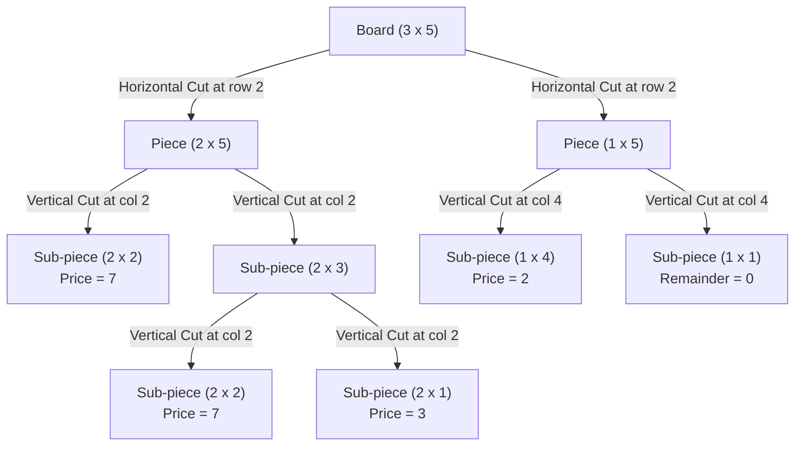

# Guided Example: Selling Pieces of Wood

## 1. Problem Overview & Representative Instance

A rectangular wooden board of height $m$ and width $n$ is available to be cut into smaller rectangular pieces. Each piece of height $h$ and width $w$ listed in a pricing catalog can be sold for an associated price $p$. Any cut made must be a straight, full-length guillotine cut:
- A **horizontal cut** divides a piece of dimensions $h \times w$ into two sub-pieces of dimensions $i \times w$ and $(h - i) \times w$, where $1 \le i < h$.
- A **vertical cut** divides a piece of dimensions $h \times w$ into two sub-pieces of dimensions $h \times j$ and $h \times (w - j)$, where $1 \le j < w$.

Pieces cannot be rotated unless a rotated dimension is explicitly present in the catalog. Unsold remainder pieces yield zero revenue, and each catalog shape can be produced and sold multiple times. The objective is to determine the maximum total revenue obtainable from the original $m \times n$ board.

Consider the representative instance:
- Board dimensions: $m = 3$ (height), $n = 5$ (width)
- Catalog prices:
  - Shape $1 \times 4 \to 2$
  - Shape $2 \times 2 \to 7$
  - Shape $2 \times 1 \to 3$

## 2. Mathematical & Algorithmic Principles

Let $V(h, w)$ denote the optimal revenue achievable from a wooden piece of height $h$ and width $w$. The board can either be sold intact at its catalog price $P(h, w)$ (with $P(h, w) = 0$ if unlisted), or partitioned by a full horizontal cut, or partitioned by a full vertical cut.

Because every guillotine cut partitions the rectangle into two independent sub-problems sharing either the same width or the same height, the principle of optimality holds:

$$V(h, w) = \max \begin{cases} P(h, w), \\ \max_{1 \le i \le \lfloor h/2 \rfloor} \big(V(i, w) + V(h - i, w)\big), \\ \max_{1 \le j \le \lfloor w/2 \rfloor} \big(V(h, j) + V(h, w - j)\big) \end{cases}$$

### Symmetry and Search Reduction
- **Symmetry of Cuts:** Making a horizontal cut of height $i$ leaves a piece of height $h - i$. Evaluating $i$ from $1$ to $\lfloor h/2 \rfloor$ covers all unique unordered pairs $\{i, h - i\}$, halving the loop iterations.
- **Topological Evaluation Order:** Any sub-piece produced has dimensions strictly smaller than the parent along the cutting axis ($i < h$ or $j < w$). By iterating systematically through increasing heights $h \in [1, m]$ and increasing widths $w \in [1, n]$, all required sub-problem revenues $V(i, w)$ and $V(h, j)$ are finalized before evaluating $V(h, w)$.

| Dimension Category | Cut Direction | Sub-piece Breakdown | Candidate Revenue Term |
|---|---|---|---|
| Direct Catalog Listing | None | Intact rectangle $(h, w)$ | $P(h, w)$ |
| Horizontal Partition | Along height $i \in [1, \lfloor h/2 \rfloor]$ | $(i, w)$ and $(h - i, w)$ | $V(i, w) + V(h - i, w)$ |
| Vertical Partition | Along width $j \in [1, \lfloor w/2 \rfloor]$ | $(h, j)$ and $(h, w - j)$ | $V(h, j) + V(h, w - j)$ |

## 3. Step-by-Step Walkthrough with Intermediate State

We construct the table $V(h, w)$ for $h \in [1, 3]$ and $w \in [1, 5]$.
Catalog prices initialized:
- $P(1, 4) = 2$
- $P(2, 1) = 3$
- $P(2, 2) = 7$
All other $P(h, w) = 0$.

### Height 1 Calculations ($h = 1$)
Horizontal cuts are impossible since $\lfloor 1/2 \rfloor = 0$. Only vertical cuts are tested.
- $w = 1$: Catalog $0$. Cuts none. $V(1, 1) = 0$.
- $w = 2$: Cuts $j = 1 \implies V(1, 1) + V(1, 1) = 0$. $V(1, 2) = 0$.
- $w = 3$: Cuts $j = 1 \implies V(1, 1) + V(1, 2) = 0$. $V(1, 3) = 0$.
- $w = 4$: Catalog $P(1, 4) = 2$. Cuts yield $0$. Best is catalog: $V(1, 4) = 2$.
- $w = 5$: Cuts $j = 1 \implies V(1, 1) + V(1, 4) = 0 + 2 = 2$; cuts $j = 2 \implies V(1, 2) + V(1, 3) = 0$. Best is $2$: $V(1, 5) = 2$.

### Height 2 Calculations ($h = 2$)
Horizontal cut candidate: $i = 1 \implies V(1, w) + V(1, w)$.
- $w = 1$: Catalog $P(2, 1) = 3$. Horizontal cut $i = 1 \implies V(1, 1) + V(1, 1) = 0$. Best: $V(2, 1) = 3$.
- $w = 2$: Catalog $P(2, 2) = 7$. Horizontal cut $i = 1 \implies 0 + 0 = 0$. Vertical cut $j = 1 \implies V(2, 1) + V(2, 1) = 3 + 3 = 6$. Best is catalog: $V(2, 2) = 7$.
- $w = 3$: Catalog $0$. Horizontal cut $i = 1 \implies V(1, 3) + V(1, 3) = 0$. Vertical cuts:
  - $j = 1 \implies V(2, 1) + V(2, 2) = 3 + 7 = 10$.
  - Best: $V(2, 3) = 10$.
- $w = 4$: Catalog $0$. Horizontal cut $i = 1 \implies V(1, 4) + V(1, 4) = 2 + 2 = 4$. Vertical cuts:
  - $j = 1 \implies V(2, 1) + V(2, 3) = 3 + 10 = 13$.
  - $j = 2 \implies V(2, 2) + V(2, 2) = 7 + 7 = 14$.
  - Best: $V(2, 4) = 14$.
- $w = 5$: Catalog $0$. Horizontal cut $i = 1 \implies V(1, 5) + V(1, 5) = 2 + 2 = 4$. Vertical cuts:
  - $j = 1 \implies V(2, 1) + V(2, 4) = 3 + 14 = 17$.
  - $j = 2 \implies V(2, 2) + V(2, 3) = 7 + 10 = 17$.
  - Best: $V(2, 5) = 17$.

### Height 3 Calculations ($h = 3$)
Horizontal cut candidate: $i = 1 \implies V(1, w) + V(2, w)$.
- $w = 1$: Catalog $0$. Horizontal cut $i = 1 \implies V(1, 1) + V(2, 1) = 0 + 3 = 3$. $V(3, 1) = 3$.
- $w = 2$: Catalog $0$. Horizontal cut $i = 1 \implies V(1, 2) + V(2, 2) = 0 + 7 = 7$. Vertical cut $j = 1 \implies V(3, 1) + V(3, 1) = 3 + 3 = 6$. Best: $V(3, 2) = 7$.
- $w = 3$: Catalog $0$. Horizontal cut $i = 1 \implies V(1, 3) + V(2, 3) = 0 + 10 = 10$. Vertical cut $j = 1 \implies V(3, 1) + V(3, 2) = 3 + 7 = 10$. Best: $V(3, 3) = 10$.
- $w = 4$: Catalog $0$. Horizontal cut $i = 1 \implies V(1, 4) + V(2, 4) = 2 + 14 = 16$. Vertical cuts:
  - $j = 1 \implies V(3, 1) + V(3, 3) = 3 + 10 = 13$.
  - $j = 2 \implies V(3, 2) + V(3, 2) = 7 + 7 = 14$.
  - Best: $V(3, 4) = 16$.
- $w = 5$: Catalog $0$. Horizontal cut $i = 1 \implies V(1, 5) + V(2, 5) = 2 + 17 = 19$. Vertical cuts:
  - $j = 1 \implies V(3, 1) + V(3, 4) = 3 + 16 = 19$.
  - $j = 2 \implies V(3, 2) + V(3, 3) = 7 + 10 = 17$.
  - Maximum across all options is $19$. Thus, $V(3, 5) = 19$.

## 4. Comprehensive State Trace

The grid below outlines the finalized values for every sub-problem dimension $(h, w)$.

| Height $h$ \ Width $w$ | $w = 1$ | $w = 2$ | $w = 3$ | $w = 4$ | $w = 5$ | Dominant Strategy for Column 5 |
|---|---|---|---|---|---|---|
| $h = 1$ | 0 | 0 | 0 | 2 | 2 | Vertical cut into $(1, 4)$ and $(1, 1)$ |
| $h = 2$ | 3 | 7 | 10 | 14 | 17 | Vertical cut into $(2, 2) + (2, 2) + (2, 1)$ |
| $h = 3$ | 3 | 7 | 10 | 16 | 19 | Horizontal cut into $(1, 5) + (2, 5)$ |

## 5. Algorithmic Correctness & Soundness

1. **Optimal Substructure:**
   Every legal cut divides the rectangle into two smaller rectangles that are completely independent; no future cut across one half can cross into or affect the geometric feasibility of cuts in the other half. Because revenues are non-negative and additive, the maximum revenue of the whole is the exact sum of the maximum revenues of the parts.

2. **Completeness of Guillotine Cuts:**
   By testing all integer partition points $1 \le i \le \lfloor h/2 \rfloor$ along height and $1 \le j \le \lfloor w/2 \rfloor$ along width, every possible initial guillotine cut is evaluated. Inductively, because sub-pieces also explore all guillotine cuts, every valid cutting plan generated by guillotine operations is encompassed in the search space.

## 6. Edge Cases & Anti-Patterns

- **No Matching Catalog Pieces:**
  - If no listed shape fits within dimensions $m \times n$, all $V(h, w)$ evaluate to $0$.
- **Direct Sale Strictly Beats All Cuts:**
  - When an intact large piece commands a premium price higher than the sum of its parts, $P(h, w)$ dominates and no cut is performed.
- **Unsold Scrap (Waste Wood):**
  - Unused portions (such as the $1 \times 1$ piece in our example) yield $0$ revenue. The recurrence naturally handles scrap by assigning $0$ without penalty.
- **Anti-Pattern (Assuming Rotational Invariance):**
  - A $2 \times 1$ piece cannot be sold as a $1 \times 2$ piece unless $[1, 2, p]$ is separately listed. Swapping dimensions in the state transition violates problem constraints.
- **Anti-Pattern (Greedy Price-per-Area Density):**
  - Packing shapes greedily based on revenue per unit area ($p / (h \cdot w)$) fails because geometric fitting constraints often leave awkward unfillable gaps, yielding suboptimal total values.

## 7. Complexity Analysis

- **Time Complexity:** $\mathcal{O}(m \cdot n \cdot (m + n))$. There are $m \times n$ distinct rectangular states. For each state $(h, w)$, we iterate over $\lfloor h/2 \rfloor$ horizontal cuts and $\lfloor w/2 \rfloor$ vertical cuts, requiring $\mathcal{O}(h + w)$ operations per cell. Summing over all cells yields $\mathcal{O}(m \cdot n \cdot (m + n))$. For $m, n \le 200$, total operations remain well under $1.6 \times 10^7$, executing rapidly.
- **Space Complexity:** $\mathcal{O}(m \cdot n)$ auxiliary space to store the two-dimensional dynamic programming table.
