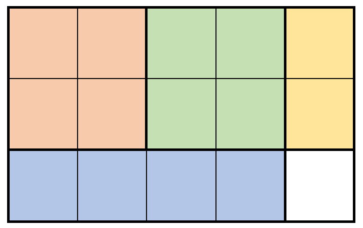
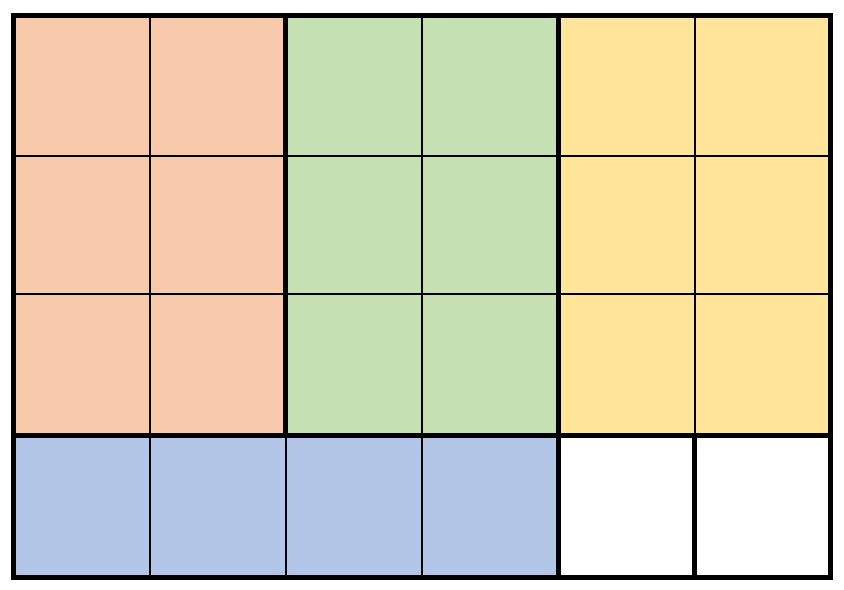

## Description

You are given two integers `m` and `n` that represent the height and width of a rectangular piece of wood. You are also given a 2D integer array `prices`, where $\text{prices}[i] = [h_{i}, w_{i}, \text{price}_{i}]$ indicates you can sell a rectangular piece of wood of height $h_{i}$ and width $w_{i}$ for $\text{price}_{i}$ dollars.

To cut a piece of wood, you must make a vertical or horizontal cut across the **entire** height or width of the piece to split it into two smaller pieces. After cutting a piece of wood into some number of smaller pieces, you can sell pieces according to `prices`. You may sell multiple pieces of the same shape, and you do not have to sell all the shapes. The grain of the wood makes a difference, so you **cannot** rotate a piece to swap its height and width.

Return *the **maximum** money you can earn after cutting an *`m x n`* piece of wood*.

Note that you can cut the piece of wood as many times as you want.
### Function Contract

- `n`: Input parameter.
- Returns expected result.

### Examples
#### Example 1

- **Input:** $m = 3, n = 5, prices = [[1,4,2],[2,2,7],[2,1,3]]$
- **Output:** `19`
- **Explanation:** The diagram above shows a possible scenario. It consists of:
- 2 pieces of wood shaped 2 x 2, selling for a price of 2 * 7 = 14.
- 1 piece of wood shaped 2 x 1, selling for a price of 1 * 3 = 3.
- 1 piece of wood shaped 1 x 4, selling for a price of 1 * 2 = 2.
This obtains a total of 14 + 3 + 2 = 19 money earned.
It can be shown that 19 is the maximum amount of money that can be earned.
#### Example 2

- **Input:** $m = 4, n = 6, prices = [[3,2,10],[1,4,2],[4,1,3]]$
- **Output:** `32`
- **Explanation:** The diagram above shows a possible scenario. It consists of:
- 3 pieces of wood shaped 3 x 2, selling for a price of 3 * 10 = 30.
- 1 piece of wood shaped 1 x 4, selling for a price of 1 * 2 = 2.
This obtains a total of 30 + 2 = 32 money earned.
It can be shown that 32 is the maximum amount of money that can be earned.
Notice that we cannot rotate the 1 x 4 piece of wood to obtain a 4 x 1 piece of wood.
### Constraints

- $1 \le m, n \le 200$

- $1 \le \text{prices.length} \le 2 * 10^{4}$

- $\text{prices}[i].length = 3$

- $1 \le h_{i} \le m$

- $1 \le w_{i} \le n$

- $1 \le \text{price}_{i} \le 10^{6}$

- All the shapes of wood $(h_{i}, w_{i})$ are pairwise **distinct**.