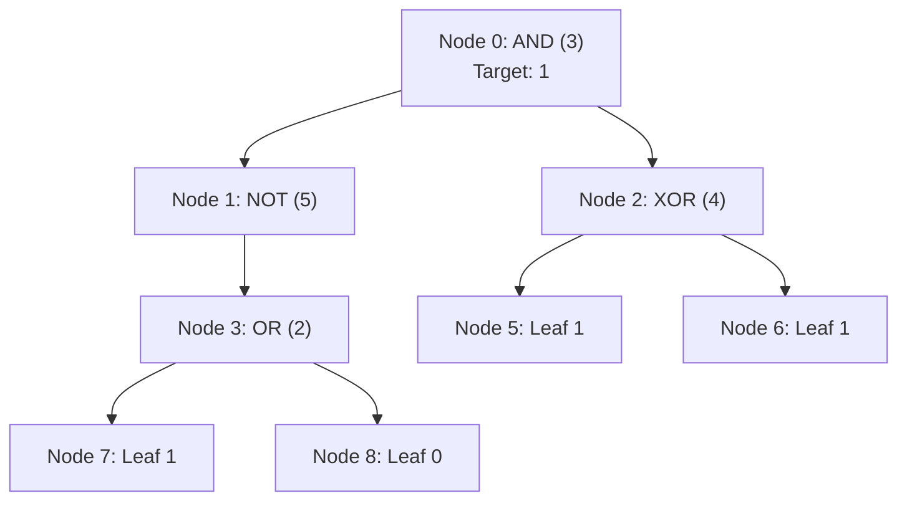

# Guided Example: Minimum Flips in Binary Tree to Get Result

## 1. Problem Overview & Representative Instance

We are given the root of a binary expression tree where every leaf node holds a boolean value ($0$ for false, $1$ for true), and every internal node represents a logical operation:
- $2$: Logical OR ($\lor$)
- $3$: Logical AND ($\land$)
- $4$: Logical XOR ($\oplus$)
- $5$: Logical NOT ($\neg$, a unary operator with exactly one child, either left or right)

Only leaf nodes can be flipped (changing $0 \to 1$ or $1 \to 0$ costs $1$ flip). Internal operator nodes cannot be altered. Given a target boolean value `result` ($\text{true}$ or $\text{false}$), the task is to find the minimum number of leaf flips required so that the entire tree evaluates to `result`.

Consider the representative instance:
- Expression tree: `root = [3, 5, 4, 2, null, 1, 1, 1, 0]`
- Target `result`: $\text{true}$ (numerical value $1$)

The structure represents:
- Root (Node 0): Operation $3$ ($\text{AND}$)
- Left child (Node 1): Operation $5$ ($\text{NOT}$)
- Right child (Node 2): Operation $4$ ($\text{XOR}$)
- Node 1 has a left child Node 3: Operation $2$ ($\text{OR}$)
- Node 3 has children Node 7 (leaf $1$) and Node 8 (leaf $0$)
- Node 2 has children Node 5 (leaf $1$) and Node 6 (leaf $1$)

## 2. Mathematical & Algorithmic Principles

Because leaf flips within one subtree cannot influence calculations in disjoint subtrees, this problem exhibits strict optimal substructure.

For any node $u$, let the state pair be:

$$(c_0(u), c_1(u))$$

where:
- $c_0(u)$ denotes the minimum leaf flips in the subtree rooted at $u$ required to make $u$ evaluate to $0$ ($\text{false}$).
- $c_1(u)$ denotes the minimum leaf flips in the subtree rooted at $u$ required to make $u$ evaluate to $1$ ($\text{true}$).

### Base Cases: Leaf Nodes
For a leaf node $u$:
- If value is $0$: $c_0(u) = 0$, $c_1(u) = 1$.
- If value is $1$: $c_0(u) = 1$, $c_1(u) = 0$.

### Inductive Transitions: Internal Operators
Let $(l_0, l_1)$ and $(r_0, r_1)$ be the cost vectors of the left and right subtrees respectively:

1. **Unary NOT ($u = 5$):**
   Has a single child with cost vector $(ch_0, ch_1)$. Inversion flips the requirements:
   $$c_0(u) = ch_1, \quad c_1(u) = ch_0$$

2. **Binary OR ($u = 2$):**
   Evaluating to $0$ requires both inputs to be $0$:
   $$c_0(u) = l_0 + r_0$$
   Evaluating to $1$ requires at least one input to be $1$:
   $$c_1(u) = \min(l_0 + r_1, \, l_1 + r_0, \, l_1 + r_1)$$

3. **Binary AND ($u = 3$):**
   Evaluating to $1$ requires both inputs to be $1$:
   $$c_1(u) = l_1 + r_1$$
   Evaluating to $0$ requires at least one input to be $0$:
   $$c_0(u) = \min(l_0 + r_0, \, l_0 + r_1, \, l_1 + r_0)$$

4. **Binary XOR ($u = 4$):**
   Evaluating to $0$ requires equal inputs:
   $$c_0(u) = \min(l_0 + r_0, \, l_1 + r_1)$$
   Evaluating to $1$ requires differing inputs:
   $$c_1(u) = \min(l_0 + r_1, \, l_1 + r_0)$$

| Node Type | Operator | Condition for Output 0 | Condition for Output 1 |
|---|---|---|---|
| Leaf | None | Intrinsic value or single flip | Intrinsic value or single flip |
| 5 | $\neg$ (NOT) | Child evaluates to 1 | Child evaluates to 0 |
| 2 | $\lor$ (OR) | Both children evaluate to 0 | Left is 1, Right is 1, or both are 1 |
| 3 | $\land$ (AND) | Left is 0, Right is 0, or both are 0 | Both children evaluate to 1 |
| 4 | $\oplus$ (XOR) | Both children have identical truth values | Children have opposite truth values |

## 3. Step-by-Step Walkthrough with Intermediate State

We evaluate the representative tree using post-order depth-first traversal.

### Step 1: Evaluate Subtree Under Node 3
- Node 7 is a leaf with value $1 \implies (c_0, c_1) = (1, 0)$.
- Node 8 is a leaf with value $0 \implies (c_0, c_1) = (0, 1)$.
- Node 3 represents OR ($2$) applied to Node 7 and Node 8:
  - $c_0(\text{Node 3}) = l_0 + r_0 = 1 + 0 = 1$.
  - $c_1(\text{Node 3}) = \min(l_0 + r_1, l_1 + r_0, l_1 + r_1) = \min(1 + 1, 0 + 0, 0 + 1) = 0$.
  - Cost vector for Node 3: $(c_0, c_1) = (1, 0)$.

### Step 2: Evaluate Node 1 (Unary NOT)
- Node 1 has a single child (Node 3) with cost $(1, 0)$.
- Inverting requirements:
  - $c_0(\text{Node 1}) = c_1(\text{Node 3}) = 0$.
  - $c_1(\text{Node 1}) = c_0(\text{Node 3}) = 1$.
  - Cost vector for Node 1: $(c_0, c_1) = (0, 1)$.

### Step 3: Evaluate Subtree Under Node 2 (Binary XOR)
- Node 5 is a leaf with value $1 \implies (c_0, c_1) = (1, 0)$.
- Node 6 is a leaf with value $1 \implies (c_0, c_1) = (1, 0)$.
- Node 2 represents XOR ($4$) applied to Node 5 and Node 6:
  - $c_0(\text{Node 2}) = \min(l_0 + r_0, l_1 + r_1) = \min(1 + 1, 0 + 0) = 0$.
  - $c_1(\text{Node 2}) = \min(l_0 + r_1, l_1 + r_0) = \min(1 + 0, 0 + 1) = 1$.
  - Cost vector for Node 2: $(c_0, c_1) = (0, 1)$.

### Step 4: Evaluate Root Node 0 (Binary AND)
- Left child (Node 1) has $(c_0, c_1) = (0, 1)$.
- Right child (Node 2) has $(c_0, c_1) = (0, 1)$.
- Root represents AND ($3$):
  - Target output is $1$ ($\text{true}$):
    $$c_1(\text{Node 0}) = l_1 + r_1 = 1 + 1 = 2$$
  - Target output is $0$ ($\text{false}$):
    $$c_0(\text{Node 0}) = \min(l_0 + r_0, l_0 + r_1, l_1 + r_0) = \min(0 + 0, 0 + 1, 1 + 0) = 0$$

Target is $\text{true}$, so the minimum flips required is $c_1(\text{Node 0}) = 2$.

## 4. Comprehensive State Trace

The evaluation order and resulting cost tuples are summarized in bottom-up sequence.

| Post-Order Index | Node ID | Value / Operator | Child References | Minimum Flips for False ($c_0$) | Minimum Flips for True ($c_1$) | Decisive Transition Logic |
|---|---|---|---|---|---|---|
| 1 | Node 7 | Leaf $1$ | None | 1 | 0 | Intrinsic true leaf |
| 2 | Node 8 | Leaf $0$ | None | 0 | 1 | Intrinsic false leaf |
| 3 | Node 3 | OR ($2$) | Left: N7, Right: N8 | 1 | 0 | False requires $1+0$; True requires $0+0$ |
| 4 | Node 1 | NOT ($5$) | Child: N3 | 0 | 1 | Swaps cost vector of Node 3 |
| 5 | Node 5 | Leaf $1$ | None | 1 | 0 | Intrinsic true leaf |
| 6 | Node 6 | Leaf $1$ | None | 1 | 0 | Intrinsic true leaf |
| 7 | Node 2 | XOR ($4$) | Left: N5, Right: N6 | 0 | 1 | False requires identical ($0+0$); True requires differing ($0+1$) |
| 8 | Node 0 | AND ($3$) | Left: N1, Right: N2 | 0 | 2 | True requires both to be True: $1 + 1 = 2$ |

## 5. Algorithmic Correctness & Soundness

1. **Subtree Independence:**
   A tree structure contains no cycles or shared sub-components. Any leaf flipped inside the left subtree of an internal node $u$ alters only the boolean evaluation of that left subtree, with zero side effects on the right subtree. The costs from disjoint children are strictly additive.

2. **Exhaustive Truth Table Coverage:**
   For every binary operator ($2, 3, 4$), the recurrences exhaustively explore all combinations of child values $(\text{left}, \text{right}) \in \{(0,0), (0,1), (1,0), (1,1)\}$ that produce the desired outcome, taking the minimum across all feasible combinations. Because the base cases are exact and transitions cover all truth table assignments, the optimal cost at the root is provably minimal.

## 6. Edge Cases & Anti-Patterns

- **Single Leaf Root (`root = [0]` or `[1]`):**
  - If the single node matches the requested result, cost is $0$; otherwise $1$.
- **Unary NOT Node Child Placement:**
  - The problem specifies that a NOT node has exactly one child, but that child may be placed in the `left` pointer or the `right` pointer. Traversal must inspect whichever child is non-null.
- **Cascaded NOT Operators:**
  - Multiple consecutive NOT gates alternate the cost coordinates $(c_0, c_1) \leftrightarrow (c_1, c_0)$, correctly preserving parity.
- **Anti-Pattern (Greedy Top-Down Selection):**
  - Attempting to decide whether the left or right child should produce $0$ or $1$ from the top down risks making locally suboptimal decisions. Bottom-up synthesis computes the global minimum for both boolean outcomes simultaneously.

## 7. Complexity Analysis

- **Time Complexity:** $\mathcal{O}(N)$, where $N$ is the total number of nodes in the binary tree. Each node is visited exactly once in post-order traversal, performing a constant number of scalar additions and comparisons.
- **Space Complexity:** $\mathcal{O}(H)$, where $H$ is the height of the binary tree, corresponding to the recursion call stack depth. In the worst case of a skewed tree, $H = \mathcal{O}(N)$; for a balanced tree, $H = \mathcal{O}(\log N)$.