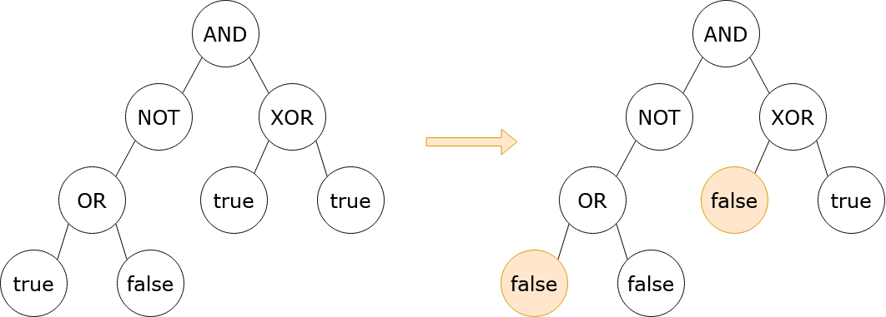

## Description

You are given the `root` of a **binary tree** with the following properties:

- **Leaf nodes** have either the value `0` or `1`, representing `false` and `true` respectively.

- **Non-leaf nodes** have either the value `2`, `3`, `4`, or `5`, representing the boolean operations `OR`, `AND`, `XOR`, and `NOT`, respectively.

You are also given a boolean `result`, which is the desired result of the **evaluation** of the `root` node.

The evaluation of a node is as follows:

- If the node is a leaf node, the evaluation is the **value** of the node, i.e. `true` or `false`.

- Otherwise, **evaluate** the node's children and **apply** the boolean operation of its value with the children's evaluations.

In one operation, you can **flip** a leaf node, which causes a `false` node to become `true`, and a `true` node to become `false`.

Return* the minimum number of operations that need to be performed such that the evaluation of *`root`* yields *`result`. It can be shown that there is always a way to achieve `result`.

A **leaf node** is a node that has zero children.

Note: `NOT` nodes have either a left child or a right child, but other non-leaf nodes have both a left child and a right child.
### Function Contract

**Inputs**

- `root`: The root `TreeNode` of a nonempty binary tree where node values are 0 (false), 1 (true), 2 (OR), 3 (AND), 4 (XOR), or 5 (NOT).

```python
class TreeNode:

    def __init__(
        self,
        val: int = 0,
        left: TreeNode | None = None,
        right: TreeNode | None = None,
    ):
        self.val = val
        self.left = left
        self.right = right
```

- `result`: A boolean value (`True` or `False`) that the root must evaluate to.

**Return value**

Return an integer representing the minimum number of leaf flips required so that the root evaluates to `result`.

### Examples

#### Example 1



- **Input:** `root = [3,5,4,2,null,1,1,1,0], result = true`
- **Output:** `2`
- **Explanation:**
It can be shown that a minimum of 2 nodes have to be flipped to make the root of the tree
evaluate to true. One way to achieve this is shown in the diagram above.
#### Example 2

- **Input:** `root = [0], result = false`
- **Output:** `0`
- **Explanation:**
The root of the tree already evaluates to false, so 0 nodes have to be flipped.
### Constraints

- The number of nodes in the tree is in the range $[1, 10^{5}]$.

- $0 \le \text{Node.val} \le 5$

- `OR`, `AND`, and `XOR` nodes have `2` children.

- `NOT` nodes have `1` child.

- Leaf nodes have a value of `0` or `1`.

- Non-leaf nodes have a value of `2`, `3`, `4`, or `5`.