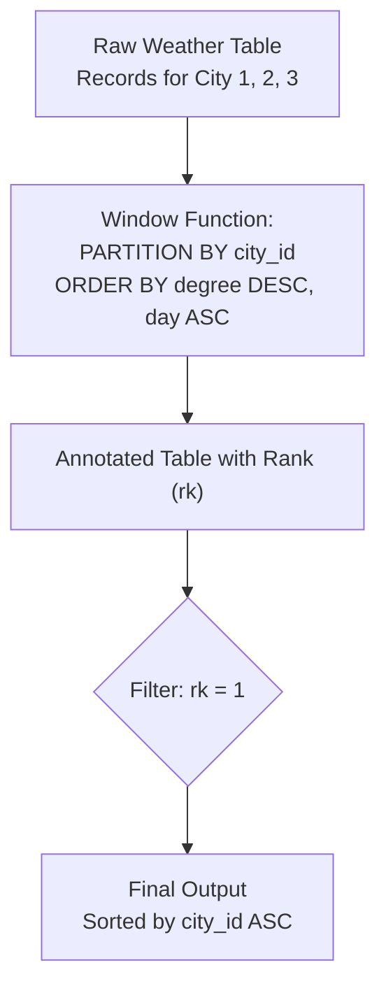

# Guided Example: The First Day of the Maximum Recorded Degree in Each City

## 1. Problem Overview & Representative Instance

We are given a database table named `Weather` containing daily temperature readings across various cities. The schema is defined as:
- `city_id` (integer): Identifier for the city.
- `day` (date): The calendar date of the recording.
- `degree` (integer): The recorded temperature on that date.
- The composite key `(city_id, day)` serves as the primary key, guaranteeing that no city has multiple temperature entries on the same date.

The objective is to report, for each unique `city_id`, the day on which the city experienced its maximum recorded temperature along with that temperature. If a city recorded the maximum temperature on multiple days (a tie), we must return the earliest calendar date among those tied days. The final output must be ordered by `city_id` in ascending order.

Consider the representative dataset:

Representative input rows:
- City 1:
  - `(1, '2022-01-07', -12)`
  - `(1, '2022-03-07', 5)`
  - `(1, '2022-07-07', 24)`
- City 2:
  - `(2, '2022-08-07', 37)`
  - `(2, '2022-08-17', 37)`
- City 3:
  - `(3, '2022-02-07', -7)`
  - `(3, '2022-12-07', -6)`

## 2. Mathematical & Algorithmic Principles

From a relational algebra perspective, this problem requires evaluating an argmax query over partitioned data with a deterministic lexicographical tie-breaking criterion.

Let each record be denoted $r = (\text{city}, \text{day}, \text{temp})$.
For each partition $\mathcal{P}_c = \{r \in \text{Weather} \mid r.\text{city} = c\}$, we establish a strict total order $\prec$ over records within the partition:

$$r_a \prec r_b \iff (r_a.\text{temp} > r_b.\text{temp}) \lor (r_a.\text{temp} = r_b.\text{temp} \land r_a.\text{day} < r_b.\text{day})$$

Because `(city_id, day)` is a primary key, no two records in $\mathcal{P}_c$ share the same date. Hence, if two records have identical temperatures, their dates $r_a.\text{day}$ and $r_b.\text{day}$ are strictly distinct. This ensures that $\prec$ is a strict total order with zero ties.

The problem reduces to selecting the unique minimal element under $\prec$ for each partition:

$$r^*(c) = \arg\min_{r \in \mathcal{P}_c} (\prec)$$

### Implementation Strategy via Window Functions
- **Partitioning:** `PARTITION BY city_id` isolates each city's readings so that rankings are completely independent.
- **Ordering Specification:** `ORDER BY degree DESC, day ASC` aligns directly with $\prec$:
  - `degree DESC` places higher temperatures before lower temperatures (including negative temperatures, where $-6 > -7$).
  - `day ASC` ensures that in case of identical maximum temperatures, the earliest date sorts first.
- **Filtering:** Ranking via `RANK()` or `ROW_NUMBER()` assigns integer $1$ to the top row $r^*(c)$. Filtering `WHERE rk = 1` retains exactly one row per city.

| Query Construct | Operational Mechanism | Role in Solution |
|---|---|---|
| `PARTITION BY city_id` | Divides rows into disjoint city subsets | Prevents cross-city comparison |
| `ORDER BY degree DESC` | Sorts highest temperatures first | Identifies peak warmth |
| `ORDER BY day ASC` | Secondary sort key chronologically | Resolves equal-temperature ties |
| `WHERE rk = 1` | Slices top-ranked tuple per group | Filters out all non-maximal observations |

## 3. Step-by-Step Walkthrough with Intermediate State

We trace the partitioned ranking step by step across all cities.

### Partition 1: `city_id = 1`
Records available:
1. `('2022-01-07', -12)`
2. `('2022-03-07', 5)`
3. `('2022-07-07', 24)`

- Comparing temperatures: $24 > 5 > -12$.
- Ranked order:
  - Rank 1: `('2022-07-07', 24)`
  - Rank 2: `('2022-03-07', 5)`
  - Rank 3: `('2022-01-07', -12)`
- Selected row for City 1: `(1, '2022-07-07', 24)`.

### Partition 2: `city_id = 2`
Records available:
1. `('2022-08-07', 37)`
2. `('2022-08-17', 37)`

- Comparing temperatures: Both records have $\text{degree} = 37$ (a tie).
- Tie-breaker applied: Ascending order of `day`.
  - `'2022-08-07'` is earlier than `'2022-08-17'`.
- Ranked order:
  - Rank 1: `('2022-08-07', 37)`
  - Rank 2: `('2022-08-17', 37)`
- Selected row for City 2: `(2, '2022-08-07', 37)`.

### Partition 3: `city_id = 3`
Records available:
1. `('2022-02-07', -7)`
2. `('2022-12-07', -6)`

- Comparing temperatures: In negative integers, $-6 > -7$.
- Ranked order:
  - Rank 1: `('2022-12-07', -6)`
  - Rank 2: `('2022-02-07', -7)`
- Selected row for City 3: `(3, '2022-12-07', -6)`.

### Final Aggregation and Output Sorting
Collecting all Rank 1 rows and sorting by `city_id ASC`:
1. `(1, '2022-07-07', 24)`
2. `(2, '2022-08-07', 37)`
3. `(3, '2022-12-07', -6)`

## 4. Comprehensive State Trace

The full state of the window calculation across all partitions is detailed below.

| Partition (`city_id`) | Date (`day`) | Temperature (`degree`) | Computed Rank (`rk`) | Filter Status (`rk = 1`) | Selection Justification |
|---|---|---|---|---|---|
| 1 | `2022-07-07` | 24 | 1 | Kept | Highest temperature for City 1 ($24^\circ$) |
| 1 | `2022-03-07` | 5 | 2 | Discarded | Sub-maximal temperature |
| 1 | `2022-01-07` | -12 | 3 | Discarded | Lowest temperature for City 1 |
| 2 | `2022-08-07` | 37 | 1 | Kept | Tied maximum ($37^\circ$), earlier date selected |
| 2 | `2022-08-17` | 37 | 2 | Discarded | Tied maximum ($37^\circ$), later date dropped |
| 3 | `2022-12-07` | -6 | 1 | Kept | Highest temperature for City 3 ($-6 > -7$) |
| 3 | `2022-02-07` | -7 | 2 | Discarded | Sub-maximal negative temperature |

## 5. Algorithmic Correctness & Soundness

1. **Uniqueness of the Top-Ranked Tuple:**
   Because `(city_id, day)` is unique across the table, any tie on `degree` within a city partition is strictly broken by the differing date values. Consequently, the combination `(degree DESC, day ASC)` produces a unique order position for every tuple in the partition. This ensures that exactly one record per city qualifies under `rk = 1`, avoiding duplicated outputs for tied maximums.

2. **Negative Integer Integrity:**
   Standard SQL arithmetic comparisons preserve negative number ordering: $-6 > -7$. The descending sort correctly ranks $-6$ ahead of $-7$, ensuring that cities with below-freezing climates correctly identify their warmest reading.

## 6. Edge Cases & Anti-Patterns

- **All Negative Temperatures:**
  - When all readings for a city are negative, the maximum is the value closest to zero. The descending numeric ordering handles this transparently.
- **Multiple Identical Peaks:**
  - If a city reaches its peak temperature on multiple occasions throughout the year, the secondary sort key `day ASC` guarantees deterministic selection of the earliest calendar day.
- **Anti-Pattern (Group By with Aggregate MAX):**
  - Querying `SELECT city_id, day, MAX(degree) FROM Weather GROUP BY city_id` is invalid SQL in strict modes because `day` is an unaggregated column that does not uniquely determine the maximum row.
- **Anti-Pattern (Correlated Subquery without Tie-Breaking):**
  - Using `WHERE degree = (SELECT MAX(degree) FROM Weather WHERE ...)` fails whenever the maximum temperature occurs on two distinct dates, returning duplicate rows for that city instead of the earliest day.

## 7. Complexity Analysis

- **Time Complexity:** $\mathcal{O}(N \log N)$ where $N$ is the total number of records in the `Weather` table. Sorting or partitioning the rows by `(city_id, degree DESC, day ASC)` dominates execution time. Once sorted, a linear scan of length $N$ filters the top-ranked rows.
- **Space Complexity:** $\mathcal{O}(N)$ temporary buffer space within the query execution engine to store intermediate window rankings before filtering.
