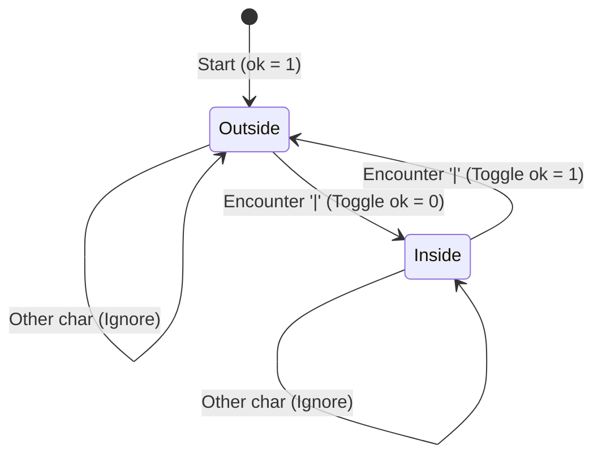

# Guided Example: Count Asterisks

## 1. Problem Overview & Representative Instance

Given a string $s$ consisting of lowercase English letters, vertical bars `'|'`, and asterisks `'*'`, the vertical bars are guaranteed to appear in pairs. Specifically, every odd-indexed vertical bar (1st, 3rd, 5th, etc.) pairs with the immediately subsequent even-indexed vertical bar (2nd, 4th, 6th, etc.) to delimit an enclosed region.

The objective is to return the number of asterisks `'*'` that appear strictly outside of these paired vertical bar sections. Characters occurring between the 1st and 2nd bars, 3rd and 4th bars, and so forth, are considered inside a pair and must be excluded from the count.

Consider the representative instance:
- String: $s = \text{"l|*e*et|c**o|*de|"}$

This string contains four vertical bars at indices 1, 7, 12, and 16, forming two disjoint enclosed pairs:
1. First enclosed pair: between index 1 and index 7 (`"*e*et"`) containing 2 asterisks.
2. Second enclosed pair: between index 12 and index 16 (`"*de"`) containing 1 asterisk.
Outside of these pairs, we observe the segments `"l"`, `"c**o"` (which contains 2 asterisks), and `""`. Hence, exactly 2 asterisks reside outside paired segments.

## 2. Mathematical & Algorithmic Principles

The sequence of vertical bars partitions the string into alternating segments of two distinct types:
- **Active Segments (Outside Pairs):** The prefix preceding the 1st bar, segments situated between the $(2k)$-th bar and $(2k+1)$-th bar for $k \ge 1$, and the suffix following the final bar. Asterisks within these intervals contribute to the final sum.
- **Suppressed Segments (Inside Pairs):** Segments situated between the $(2k-1)$-th bar and $(2k)$-th bar for $k \ge 1$. Asterisks here are excluded.

### Parity State Machine
Let a binary state variable $ok \in \{0, 1\}$ represent the counting permission at any point during a left-to-right scan:
- Initial condition: $ok = 1$ (the scan begins outside any pair).
- Transition rule on vertical bar: $ok \leftarrow ok \oplus 1$ (bitwise XOR with 1 flips between active and suppressed).
- Transition rule on asterisk: $\text{count} \leftarrow \text{count} + ok$.
- Other characters: Leave both $ok$ and $\text{count}$ unchanged.

Because the total number of bars is guaranteed to be even, the machine always finishes the string in the active state ($ok = 1$).

| Encountered Symbol | State Variable $ok$ Effect | Accumulator Action |
|---|---|---|
| Vertical Bar (`'\|'`) | Flips state ($1 \to 0$ or $0 \to 1$) | No addition |
| Asterisk (`'*'`) | Unchanged | Adds $ok$ (adds 1 if outside, 0 if inside) |
| Letter (`'a'`–`'z'`) | Unchanged | No addition |

## 3. Step-by-Step Walkthrough with Intermediate State

We trace the representative string $s = \text{"l|*e*et|c**o|*de|"}$ character by character:

- **Indices 0 to 1 (`"l|"`):**
  - Index 0 (`'l'`): Letter. State $ok = 1$, $\text{count} = 0$.
  - Index 1 (`'|'`): 1st bar encountered. State toggles: $ok = 1 \oplus 1 = 0$. Now entering the first enclosed segment.

- **Indices 2 to 7 (`"*e*et|"`):**
  - Index 2 (`'*'`): Asterisk while $ok = 0$. Disregarded.
  - Indices 3 to 5 (`"e*e"`): Letters and an asterisk at index 4 while $ok = 0$. Disregarded.
  - Index 6 (`'t'`): Letter.
  - Index 7 (`'|'`): 2nd bar encountered. State toggles: $ok = 0 \oplus 1 = 1$. Exiting enclosed segment into active region.

- **Indices 8 to 12 (`"c**o|"`):**
  - Index 8 (`'c'`): Letter.
  - Index 9 (`'*'`): Asterisk while $ok = 1$. $\text{count} = 0 + 1 = 1$.
  - Index 10 (`'*'`): Asterisk while $ok = 1$. $\text{count} = 1 + 1 = 2$.
  - Index 11 (`'o'`): Letter.
  - Index 12 (`'|'`): 3rd bar encountered. State toggles: $ok = 1 \oplus 1 = 0$. Entering second enclosed segment.

- **Indices 13 to 16 (`"*de|"`):**
  - Index 13 (`'*'`): Asterisk while $ok = 0$. Disregarded.
  - Indices 14 to 15 (`"de"`): Letters.
  - Index 16 (`'|'`): 4th bar encountered. State toggles: $ok = 0 \oplus 1 = 1$. Exiting enclosed segment.

String traversal ends. Total valid asterisks accumulated: 2.

## 4. Comprehensive State Trace

The full sequence of state evaluations across all characters is documented below.

| Step Index | Character | Current State ($ok$) | Character Classification | Action Taken | Updated Asterisk Count |
|---|---|---|---|---|---|
| 0 | `'l'` | 1 (Active) | Lowercase letter | No change | 0 |
| 1 | `'\|'` | 1 $\to$ 0 | Bar (1st, Entry) | Toggle $ok \to 0$ | 0 |
| 2 | `'*'` | 0 (Suppressed) | Asterisk | Ignored ($ok = 0$) | 0 |
| 3 | `'e'` | 0 (Suppressed) | Lowercase letter | No change | 0 |
| 4 | `'*'` | 0 (Suppressed) | Asterisk | Ignored ($ok = 0$) | 0 |
| 5 | `'e'` | 0 (Suppressed) | Lowercase letter | No change | 0 |
| 6 | `'t'` | 0 (Suppressed) | Lowercase letter | No change | 0 |
| 7 | `'\|'` | 0 $\to$ 1 | Bar (2nd, Exit) | Toggle $ok \to 1$ | 0 |
| 8 | `'c'` | 1 (Active) | Lowercase letter | No change | 0 |
| 9 | `'*'` | 1 (Active) | Asterisk | Increment count | 1 |
| 10 | `'*'` | 1 (Active) | Asterisk | Increment count | 2 |
| 11 | `'o'` | 1 (Active) | Lowercase letter | No change | 0 + 2 = 2 |
| 12 | `'\|'` | 1 $\to$ 0 | Bar (3rd, Entry) | Toggle $ok \to 0$ | 2 |
| 13 | `'*'` | 0 (Suppressed) | Asterisk | Ignored ($ok = 0$) | 2 |
| 14 | `'d'` | 0 (Suppressed) | Lowercase letter | No change | 2 |
| 15 | `'e'` | 0 (Suppressed) | Lowercase letter | No change | 2 |
| 16 | `'\|'` | 0 $\to$ 1 | Bar (4th, Exit) | Toggle $ok \to 1$ | 2 |

## 5. Algorithmic Correctness & Soundness

1. **Parity Preservation:**
   Because vertical bars are strictly paired, the count of preceding bars at any index $i$ uniquely characterizes the status:
   - If the number of bars preceding $s[i]$ is even, $s[i]$ lies outside all pairs.
   - If the number of bars preceding $s[i]$ is odd, $s[i]$ lies inside an open pair.
   Initializing $ok = 1$ and toggling $ok$ at each bar maintains the invariant $ok \equiv (\text{bars seen} + 1) \pmod 2$. Thus, $ok = 1$ if and only if $s[i]$ is outside all pairs.

2. **Single-Pass Completeness:**
   Since each character is evaluated under its exact local parity without requiring foresight of future characters or backtracking, summing $ok$ for every `'*'` correctly aggregates all valid asterisks.

## 6. Edge Cases & Anti-Patterns

- **Zero Vertical Bars (`s = "iamprogrammer"` or `"*******"`):**
  - State $ok$ remains $1$ throughout the entire string, counting every asterisk present.
- **Empty Enclosed Pair (`s = "||***"`):**
  - First bar sets $ok = 0$, immediately followed by second bar setting $ok = 1$. The subsequent three asterisks are counted correctly.
- **All Asterisks Enclosed (`s = "|***|"`):**
  - All three asterisks encounter $ok = 0$, yielding a total count of 0.
- **Anti-Pattern (Splitting by Delimiter without Index Tracking):**
  - Splitting the string on `'|'` yields a list of substrings where even indices ($0, 2, 4, \dots$) represent outside regions. While valid, string splitting allocates unnecessary memory buffers; a streaming parity toggle achieves the same outcome in $\mathcal{O}(1)$ space.

## 7. Complexity Analysis

- **Time Complexity:** $\mathcal{O}(n)$ where $n$ is the length of string $s$. The algorithm processes the string in a single linear pass with constant-time boolean and arithmetic operations per character.
- **Space Complexity:** $\mathcal{O}(1)$ auxiliary space. Only two integer scalar variables (the parity state flag and the output accumulator) are stored.
