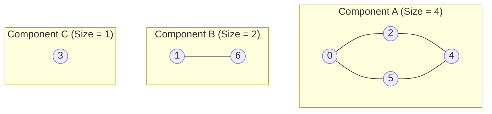

# Guided Example: Count Unreachable Pairs of Nodes in an Undirected Graph

## 1. Problem Overview & Representative Instance

We are given an integer $n$ representing the number of nodes in an undirected graph labeled from $0$ to $n - 1$, and a 2D array `edges` where each entry $[u, v]$ denotes an bidirectional edge between node $u$ and node $v$.

A pair of distinct nodes $(u, v)$ with $u < v$ is defined as **unreachable** if there is no path between $u$ and $v$—that is, $u$ and $v$ reside in different connected components of the graph. The task is to return the total number of unreachable pairs.

Consider the representative instance:
- Total nodes: $n = 7$
- Edges: `[[0, 2], [0, 5], [2, 4], [1, 6], [5, 4]]`

In this graph:
- Edges $(0, 2)$, $(0, 5)$, $(2, 4)$, and $(5, 4)$ connect nodes $\{0, 2, 4, 5\}$ into a 4-node component.
- Edge $(1, 6)$ connects nodes $\{1, 6\}$ into a 2-node component.
- Node $3$ has no incident edges, forming an isolated 1-node component.

## 2. Mathematical & Algorithmic Principles

Any undirected graph partitions uniquely into disjoint connected components $C_1, C_2, \dots, C_k$ such that:
1. Every node belongs to exactly one component: $\sum_{i=1}^k |C_i| = n$.
2. Two nodes $u$ and $v$ are reachable if and only if they reside in the same component $C_i$.

The total number of unordered node pairs in an $n$-node graph is given by the binomial coefficient:

$$\binom{n}{2} = \frac{n(n - 1)}{2}$$

The number of reachable pairs is the sum of reachable pairs inside each component:

$$\text{Reachable Pairs} = \sum_{i=1}^k \binom{|C_i|}{2} = \sum_{i=1}^k \frac{|C_i|(|C_i| - 1)}{2}$$

Therefore, the count of unreachable pairs can be computed either by complementation:

$$\text{Unreachable Pairs} = \binom{n}{2} - \sum_{i=1}^k \binom{|C_i|}{2}$$

or by prefix cross-multiplication:
As each component $C_i$ of size $s_i$ is discovered, every node in $C_i$ forms an unreachable pair with every node in previously processed components. If $S_{i-1} = \sum_{j=1}^{i-1} s_j$ denotes the count of nodes in preceding components, the marginal unreachable pairs contributed by $C_i$ is:

$$\Delta_i = S_{i-1} \cdot s_i$$

Summing $\Delta_i$ across all $k$ components produces the total without needing division or risk of intermediate subtraction anomalies:

$$\text{Total Unreachable Pairs} = \sum_{i=1}^k S_{i-1} \cdot s_i$$

| Metric / Term | Mathematical Formula | Role in Pair Enumeration |
|---|---|---|
| Total Graph Pairs | $\frac{n(n - 1)}{2}$ | Universal upper bound of all node pairs |
| Intra-Component Pairs | $\frac{s_i(s_i - 1)}{2}$ | Mutually reachable pairs within component $i$ |
| Prefix Node Accumulator $S_{i-1}$ | $\sum_{j=1}^{i-1} s_j$ | Count of nodes in previously visited components |
| Marginal Cross-Product $\Delta_i$ | $S_{i-1} \cdot s_i$ | Unreachable pairs formed between component $i$ and all earlier components |

## 3. Step-by-Step Walkthrough with Intermediate State

We identify each connected component using depth-first search (DFS) with a visited array of size $n = 7$.
Let $S$ denote the cumulative count of visited nodes, and $\text{ans}$ denote the running sum of unreachable pairs.
Initial state: $S = 0$, $\text{ans} = 0$, $\text{visited} = [\text{false}, \dots, \text{false}]$.

### Component 1 Discovery
- Start DFS at unvisited node $0$:
  - Traversal reaches nodes $0 \to 2 \to 4 \to 5$.
  - All 4 nodes are marked visited.
  - Component size: $s_1 = 4$.
- Contribution:
  - Marginal unreachable pairs: $\Delta_1 = S \cdot s_1 = 0 \cdot 4 = 0$.
  - Running total: $\text{ans} = 0 + 0 = 0$.
  - Cumulative visited nodes: $S = 0 + 4 = 4$.

### Component 2 Discovery
- Next unvisited node is node $1$:
  - Traversal reaches nodes $1 \to 6$.
  - Both nodes marked visited.
  - Component size: $s_2 = 2$.
- Contribution:
  - Each of the $2$ nodes in Component 2 is unreachable from all $4$ nodes in Component 1.
  - Marginal unreachable pairs: $\Delta_2 = S \cdot s_2 = 4 \cdot 2 = 8$.
  - Running total: $\text{ans} = 0 + 8 = 8$.
  - Cumulative visited nodes: $S = 4 + 2 = 6$.

### Inspection of Visited Nodes
- Node 2 is already visited (skip).

### Component 3 Discovery
- Next unvisited node is node $3$:
  - Node $3$ has no incident edges; DFS terminates immediately.
  - Marked visited.
  - Component size: $s_3 = 1$.
- Contribution:
  - Node $3$ is unreachable from all $6$ previously accumulated nodes in Components 1 and 2.
  - Marginal unreachable pairs: $\Delta_3 = S \cdot s_3 = 6 \cdot 1 = 6$.
  - Running total: $\text{ans} = 8 + 6 = 14$.
  - Cumulative visited nodes: $S = 6 + 1 = 7$.

### Completion Check
- Nodes 4, 5, 6 are already visited.
- All $n = 7$ nodes accounted for ($S = 7$).
- Final answer: $14$.

## 4. Comprehensive State Trace

The sequence of component inspections and running accumulator values is summarized below.

| Step / Node Scan | Component Identified | Nodes in Component | Component Size ($s_i$) | Cumulative Preceding Nodes ($S$) | Cross-Product Addition ($S \cdot s_i$) | Updated Cumulative Pairs ($\text{ans}$) |
|---|---|---|---|---|---|---|
| Scan $i = 0$ | Component A | $\{0, 2, 4, 5\}$ | 4 | 0 | $0 \times 4 = 0$ | 0 |
| Scan $i = 1$ | Component B | $\{1, 6\}$ | 2 | 4 | $4 \times 2 = 8$ | 8 |
| Scan $i = 2$ | Skipped | Already in A | - | 6 | - | 8 |
| Scan $i = 3$ | Component C | $\{3\}$ | 1 | 6 | $6 \times 1 = 6$ | 14 |
| Scan $i = 4$ | Skipped | Already in A | - | 7 | - | 14 |
| Scan $i = 5$ | Skipped | Already in A | - | 7 | - | 14 |
| Scan $i = 6$ | Skipped | Already in B | - | 7 | - | 14 |

## 5. Algorithmic Correctness & Soundness

1. **Partitioning and Non-Overlapping Invariant:**
   Because connected components form an equivalence relation (reflexive, symmetric, transitive reachability), they partition the set of vertices $V$ into pairwise disjoint blocks. Every pair of vertices $(u, v)$ belongs to either the same block (reachable) or different blocks (unreachable).

2. **Prefix Cross-Product Correctness:**
   For any sequence of disjoint component sizes $s_1, s_2, \dots, s_k$, the total number of cross-component pairs is:
   $$\sum_{1 \le i < j \le k} s_i s_j$$
   By standard algebra:
   $$\sum_{1 \le i < j \le k} s_i s_j = \sum_{j=2}^k s_j \left(\sum_{i=1}^{j-1} s_i\right) = \sum_{j=1}^k s_j \cdot S_{j-1}$$
   Thus, adding $S_{j-1} \cdot s_j$ at step $j$ exactly counts every pair between component $j$ and all earlier components without omission or duplication.

## 6. Edge Cases & Anti-Patterns

- **Fully Connected Graph ($k = 1$):**
  - A single component of size $n$ has $S_0 = 0$, yielding $\text{ans} = 0 \times n = 0$. Every node can reach every other node.
- **Completely Disconnected Graph (No edges, $k = n$):**
  - Every component has size $s_i = 1$. The sum evaluates to $0 + 1 + 2 + \dots + (n - 1) = \frac{n(n - 1)}{2}$. All pairs are unreachable.
- **Large Graph Integer Overflow:**
  - For $n = 10^5$, $\binom{n}{2} \approx 5 \times 10^9$, exceeding standard 32-bit signed integers. 64-bit integers must be used for accumulators.
- **Anti-Pattern (Pairwise All-Pairs BFS/DFS):**
  - Running a traversal from every node to count reachable partners takes $\mathcal{O}(n(V + E))$ time, which is prohibitively slow ($\approx 10^{10}$ operations). Component aggregation reduces work to a single global traversal.

## 7. Complexity Analysis

- **Time Complexity:** $\mathcal{O}(V + E) = \mathcal{O}(n + m)$ where $n$ is the number of vertices and $m$ is the number of edges. Building the adjacency list takes $\mathcal{O}(n + m)$. Traversing each vertex and edge via DFS visits each vertex once and traverses each undirected edge twice. Accumulating component counts takes $\mathcal{O}(n)$.
- **Space Complexity:** $\mathcal{O}(n + m)$ auxiliary space. The adjacency list stores $2m$ entries, the boolean visited array requires $n$ entries, and recursion stack depth is at most $n$ in the case of a path graph.
