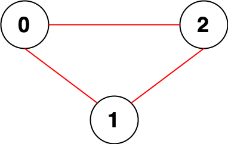
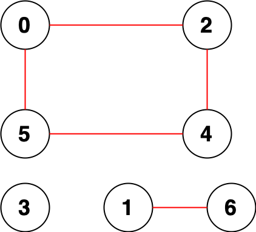

## Description

You are given an integer `n`. There is an **undirected** graph with `n` nodes, numbered from `0` to $n - 1$. You are given a 2D integer array `edges` where $\text{edges}[i] = [a_{i}, b_{i}]$ denotes that there exists an **undirected** edge connecting nodes $a_{i}$ and $b_{i}$.

Return *the **number of pairs** of different nodes that are **unreachable** from each other*.
### Function Contract

- `n`: Input parameter.
- Returns expected result.

### Examples
#### Example 1

- **Input:** $n = 3, edges = [[0,1],[0,2],[1,2]]$
- **Output:** `0`
- **Explanation:** There are no pairs of nodes that are unreachable from each other. Therefore, we return 0.
#### Example 2

- **Input:** $n = 7, edges = [[0,2],[0,5],[2,4],[1,6],[5,4]]$
- **Output:** `14`
- **Explanation:** There are 14 pairs of nodes that are unreachable from each other:
[[0,1],[0,3],[0,6],[1,2],[1,3],[1,4],[1,5],[2,3],[2,6],[3,4],[3,5],[3,6],[4,6],[5,6]].
Therefore, we return 14.
### Constraints

- $1 \le n \le 10^{5}$

- $0 \le \text{edges.length} \le 2 * 10^{5}$

- $\text{edges}[i].length = 2$

- $0 \le a_{i}, b_{i} < n$

- $a_{i} \neq b_{i}$

- There are no repeated edges.