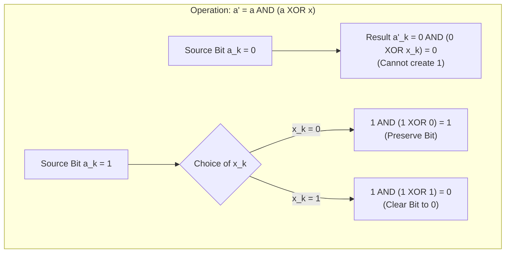

# Guided Example: Maximum XOR After Operations

## 1. Problem Overview & Representative Instance

We are given an integer array `nums`. In a single operation, we can select any index $i$ and any non-negative integer $x$, and replace $nums[i]$ with:

$$nums[i] \text{ AND } (nums[i] \text{ XOR } x)$$

This operation may be applied any number of times on any indices, using independently chosen values of $x$. The goal is to determine the maximum possible value of the total XOR sum of all elements in `nums`:

$$\bigoplus_{i=0}^{n-1} nums[i] = nums[0] \oplus nums[1] \oplus \dots \oplus nums[n-1]$$

Consider the representative instance:
- Input array: `nums = [3, 2, 4, 6]`

Binary representations:
- $3 = 011_2$
- $2 = 010_2$
- $4 = 100_2$
- $6 = 110_2$

If we compute the raw XOR sum without modifications:
$$3 \oplus 2 \oplus 4 \oplus 6 = 011_2 \oplus 010_2 \oplus 100_2 \oplus 110_2 = 011_2 = 3$$
However, with allowable bitwise transformations, we can reach $7 = 111_2$.

## 2. Mathematical & Algorithmic Principles

To understand the scope of the transformation $a \leftarrow a \land (a \oplus x)$, we evaluate its truth table on a single bit position $k$:

- Case $a_k = 0$:
  $$a'_k = 0 \land (0 \oplus x_k) = 0 \land x_k = 0$$
  Regardless of $x_k \in \{0, 1\}$, a bit that is $0$ remains $0$ unconditionally. No sequence of operations can create a $1$ at a bit position where no input number has a $1$.

- Case $a_k = 1$:
  - If we set $x_k = 0$: $a'_k = 1 \land (1 \oplus 0) = 1 \land 1 = 1$ (the bit remains $1$).
  - If we set $x_k = 1$: $a'_k = 1 \land (1 \oplus 1) = 1 \land 0 = 0$ (the bit is cleared to $0$).

Because $x$ can be chosen arbitrarily with distinct bits set, we can independently clear any selected set bit in any number $nums[i]$ to $0$, without affecting any other bit.

### Global XOR Parity Control
In the total XOR sum $\bigoplus_{i=0}^{n-1} nums[i]$, bit $k$ is $1$ if and only if an **odd** number of elements have bit $k$ set to $1$.
- If every number in `nums` has bit $k = 0$, the count of set bits is $0$ (even), so the XOR sum at bit $k$ must be $0$.
- If at least one number in `nums` has bit $k = 1$:
  - Suppose $c \ge 1$ elements originally have bit $k = 1$.
  - We can select exactly one element to retain bit $k = 1$, and use the operation to clear bit $k \to 0$ in all remaining $c - 1$ elements.
  - Exactly one element now possesses bit $k = 1$. Since $1$ is odd, bit $k$ in the resulting XOR sum becomes $1$.

Because bit positions are mutually independent, every bit that appears in at least one element can simultaneously be made $1$ in the final XOR sum. Therefore, the theoretical maximum XOR sum is identically the bitwise OR of all elements:

$$\max \bigoplus_{i=0}^{n-1} nums[i] = \bigvee_{i=0}^{n-1} nums[i]$$

| Bit Status in Input | Operation Capability | Parity Adjustment | Final XOR Bit Result |
|---|---|---|---|
| Absent across all numbers ($0$ everywhere) | Cannot be created | Always $0$ set bits (even) | $0$ |
| Present in at least one number ($\ge 1$ set) | Can clear redundant copies to 0 | Exactly $1$ set bit preserved (odd) | $1$ |

## 3. Step-by-Step Walkthrough with Intermediate State

We trace the representative array `nums = [3, 2, 4, 6]`.
Initial bit columns:
- $3 = 011_2$ (bits 0, 1)
- $2 = 010_2$ (bit 1)
- $4 = 100_2$ (bit 2)
- $6 = 110_2$ (bits 1, 2)

Bit occurrence counts across `nums`:
- Bit 0 ($2^0 = 1$): present in $3$ (count = 1).
- Bit 1 ($2^1 = 2$): present in $3, 2, 6$ (count = 3).
- Bit 2 ($2^2 = 4$): present in $4, 6$ (count = 2).

### Bit Analysis & Transformation:
- **Bit 0 ($2^0$):**
  - Count is 1 (already odd).
  - No operation required. Contributes $2^0 = 1$ to XOR sum.
- **Bit 1 ($2^1$):**
  - Count is 3 (already odd).
  - No operation required. Contributes $2^1 = 2$ to XOR sum.
- **Bit 2 ($2^2$):**
  - Count is 2 (even).
  - If unadjusted, $4 \oplus 6$ cancels bit 2 to $0$.
  - Adjustment: Apply operation on $6$ with $x = 4 = 100_2$.
    $$6 \land (6 \oplus 4) = 6 \land 2 = 2 = 010_2$$
  - New element values: `nums = [3, 2, 4, 2]`.
  - Now bit 2 appears only in $4$ (count = 1, odd).

### Final XOR Sum:
$$\text{XOR Sum} = 3 \oplus 2 \oplus 4 \oplus 2 = 3 \oplus 4 = 7 = 111_2$$
This exactly matches the cumulative bitwise OR:
$$3 \lor 2 \lor 4 \lor 6 = 7$$

## 4. Comprehensive State Trace

The table below demonstrates the cumulative bitwise accumulation as each array element is folded into the running OR total.

| Element Index | Array Value | Binary Form | Running Bitwise OR | Active Bit Positions Set | Target Binary Representation |
|---|---|---|---|---|---|
| Init | - | - | 0 | None | $000_2$ |
| 0 | 3 | $011_2$ | $0 \lor 3 = 3$ | $\{0, 1\}$ | $011_2$ |
| 1 | 2 | $010_2$ | $3 \lor 2 = 3$ | $\{0, 1\}$ | $011_2$ |
| 2 | 4 | $100_2$ | $3 \lor 4 = 7$ | $\{0, 1, 2\}$ | $111_2$ |
| 3 | 6 | $110_2$ | $7 \lor 6 = 7$ | $\{0, 1, 2\}$ | $111_2$ |

## 5. Algorithmic Correctness & Soundness

1. **Upper Bound Tightness:**
   For any bit position $k$, the XOR sum of any transformed array cannot have bit $k = 1$ unless at least one transformed element has bit $k = 1$. Since $a'_k \le a_k$, no transformed element can have bit $k = 1$ unless some original element had bit $k = 1$. Hence, the XOR sum cannot exceed $\bigvee_{i} nums[i]$.

2. **Constructive Reachability:**
   For every bit position $k$ where $\bigvee_{i} nums[i]$ has bit $k = 1$, choose the first element $nums[i^*]$ with bit $k = 1$. For every other element $nums[j]$ ($j \ne i^*$) that also has bit $k = 1$, we clear bit $k$ by choosing $x$ with bit $k$ set. After these operations, exactly one element retains bit $k = 1$, guaranteeing that the $k$-th bit of the final XOR sum is $1$. Because this construction holds across all bit positions simultaneously, the bitwise OR is universally reachable.

## 6. Edge Cases & Anti-Patterns

- **All Zeros (`nums = [0, 0, 0]`):**
  - No set bits exist anywhere. Bitwise OR is $0$, which is the only attainable value.
- **Single Element (`nums = [x]`):**
  - Total XOR sum is simply $x$, and bitwise OR is $x$.
- **Power of Two Elements (`nums = [1, 2, 4, 8]`):**
  - All bits are already disjoint and appear with count 1. No operations are needed; bitwise OR is $15$.
- **Anti-Pattern (Simulating Search or Backtracking):**
  - Attempting to simulate operations on numbers with different values of $x$ generates an exponential search space. Recognizing the algebraic equivalence to bitwise OR reduces the problem to a single linear reduction.

## 7. Complexity Analysis

- **Time Complexity:** $\mathcal{O}(n)$, where $n$ is the number of elements in `nums`. We perform a single linear scan accumulating the bitwise OR over all elements.
- **Space Complexity:** $\mathcal{O}(1)$ auxiliary space. Only a single scalar integer accumulator is required.
