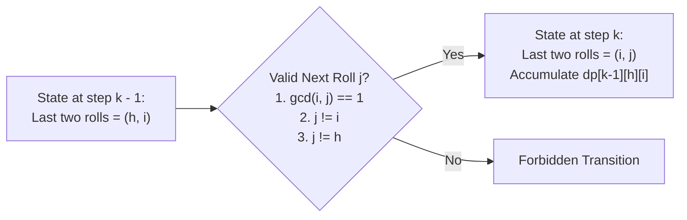

# Guided Example: Number of Distinct Roll Sequences

## 1. Problem Overview & Representative Instance

We are rolling a standard 6-sided die $n$ times. A sequence of rolls $a_1, a_2, \dots, a_n$ (where each $a_k \in \{1, 2, 3, 4, 5, 6\}$) is valid if and only if it satisfies two constraints:
1. **Coprimality of Adjacent Rolls:** The greatest common divisor of any two adjacent rolls must be $1$:
   $$\gcd(a_k, a_{k+1}) = 1 \quad \text{for all } 1 \le k < n$$
2. **Spacing Constraint on Identical Faces:** Any two identical face values must have at least two intervening rolls between them. Equivalently, no duplicate values may appear within a sliding window of size $3$:
   $$a_k \ne a_{k-1} \quad \text{and} \quad a_k \ne a_{k-2}$$

The objective is to compute the number of distinct valid roll sequences of length $n$, modulo $10^9 + 7$.

Consider the representative instance:
- Sequence length: $n = 4$

For small values of $n$:
- $n = 1$: Every individual face $\{1, 2, 3, 4, 5, 6\}$ is valid, giving $6$ sequences.
- $n = 2$: All pairs $(a_1, a_2)$ such that $a_1 \ne a_2$ and $\gcd(a_1, a_2) = 1$, yielding $22$ valid sequences.
- $n = 4$: Validating across length 4 yields $184$ sequences.

## 2. Mathematical & Algorithmic Principles

Because the admissibility of the next roll $a_k = j$ depends strictly on the immediately preceding roll $a_{k-1} = i$ (via $\gcd(i, j) = 1$ and $j \ne i$) and the roll before that $a_{k-2} = h$ (via $j \ne h$), the process is a second-order Markov chain.

### State Representation
We define:
$$dp[k][i][j]$$
as the number of valid roll sequences of length $k$ whose last two rolls are $a_{k-1} = i$ and $a_k = j$, where $i, j \in \{1, 2, 3, 4, 5, 6\}$.

### Base Cases ($k = 2$)
For any pair $(i, j) \in \{1, \dots, 6\}^2$:
$$dp[2][i][j] = \begin{cases} 1 & \text{if } i \ne j \text{ and } \gcd(i, j) = 1 \\ 0 & \text{otherwise} \end{cases}$$

Summing over all pairs $(i, j)$ gives the base count of $22$.

### Recurrence Relation ($k \ge 3$)
To append a new roll $j$ after an existing prefix ending in $(h, i)$:
$$dp[k][i][j] = \sum_{\substack{h \in \{1,\dots,6\} \\ h \ne i, \, h \ne j \\ \gcd(h, i) = 1}} dp[k-1][h][i] \pmod{10^9 + 7}$$

### Coprime Compatibility Matrix on $\{1, 2, 3, 4, 5, 6\}$
The table below illustrates which adjacent transitions $i \to j$ are allowed (where $\gcd(i, j) = 1$ and $i \ne j$).

| Face $i$ | Allowed Adjacent Successors $j$ ($\gcd(i, j) = 1, j \ne i$) | Count of Allowed Successors |
|---|---|---|
| 1 | 2, 3, 4, 5, 6 | 5 |
| 2 | 1, 3, 5 | 3 |
| 3 | 1, 2, 4, 5 | 4 |
| 4 | 1, 3, 5 | 3 |
| 5 | 1, 2, 3, 4, 6 | 5 |
| 6 | 1, 5 | 2 |

Sum of all allowed directed pairs: $5 + 3 + 4 + 3 + 5 + 2 = 22$.

## 3. Step-by-Step Walkthrough with Intermediate State

We trace the evolution from length $k = 2$ through $k = 4$.

### Length $k = 2$
All 22 coprime ordered pairs have $dp[2][i][j] = 1$.
Total valid sequences: $\sum_{i, j} dp[2][i][j] = 22$.

### Transition to Length $k = 3$
For each pair $(i, j)$, we sum $dp[2][h][i]$ over all $h$ such that $\gcd(h, i) = 1$ and $h \ne j$.
- Consider candidate ending pair $(i, j) = (1, 2)$:
  - Valid preceding faces $h$ must satisfy $\gcd(h, 1) = 1$ and $h \ne 1, 2$.
  - Possible $h \in \{3, 4, 5, 6\}$.
  - $dp[3][1][2] = dp[2][3][1] + dp[2][4][1] + dp[2][5][1] + dp[2][6][1] = 1 + 1 + 1 + 1 = 4$.
- Consider candidate ending pair $(i, j) = (2, 1)$:
  - Preceding $h$ must satisfy $\gcd(h, 2) = 1$ and $h \ne 2, 1$.
  - Possible $h \in \{3, 5\}$.
  - $dp[3][2][1] = dp[2][3][2] + dp[2][5][2] = 1 + 1 = 2$.
- Consider candidate ending pair $(i, j) = (6, 1)$:
  - Preceding $h$ must satisfy $\gcd(h, 6) = 1$ and $h \ne 6, 1$.
  - Possible $h \in \{5\}$.
  - $dp[3][6][1] = dp[2][5][6] = 1$.

Summing across all 22 valid $(i, j)$ pairs for $k = 3$:
$$\text{Total}(k = 3) = 66$$

### Transition to Length $k = 4$
We now propagate values from step $3$ into step $4$.
- For each state $(i, j)$, $dp[4][i][j] = \sum_{h \ne j} dp[3][h][i]$.
- For example, with $(i, j) = (1, 2)$:
  - $h \in \{3, 4, 5, 6\}$.
  - Each state $(h, 1)$ at step 3 has accumulated paths:
    - $dp[3][3][1] = 3$
    - $dp[3][4][1] = 2$
    - $dp[3][5][1] = 4$
    - $dp[3][6][1] = 1$
  - Thus, $dp[4][1][2] = 3 + 2 + 4 + 1 = 10$.
- Repeating this across all valid pairs produces the sum for length 4:
$$\text{Total}(k = 4) = 184$$

## 4. Comprehensive State Trace

The table below catalogs sequence count aggregates across lengths $k = 1$ to $4$, broken down by the most frequent terminal faces.

| Sequence Length $k$ | Total Valid Sequences | Terminal Pairs Ending in Face 1 | Terminal Pairs Ending in Face 2 | Terminal Pairs Ending in Face 6 | Primary Invariant Constraint |
|---|---|---|---|---|---|
| 1 | 6 | - | - | - | Single die roll |
| 2 | 22 | 5 pairs | 3 pairs | 2 pairs | Adjacent coprimality |
| 3 | 66 | 17 combinations | 8 combinations | 4 combinations | Distance-2 exclusion ($h \ne j$) |
| 4 | 184 | 48 combinations | 23 combinations | 11 combinations | Full 3-roll sliding window uniqueness |

## 5. Algorithmic Correctness & Soundness

1. **Sufficiency of Two-Step State Memory:**
   The problem constraints mandate that:
   - $a_k \ne a_{k-1}$ and $\gcd(a_{k-1}, a_k) = 1$ (distance 1 constraint).
   - $a_k \ne a_{k-2}$ (distance 2 constraint).
   No condition restricts rolls at distance 3 or greater ($a_k$ can equal $a_{k-3}$). Therefore, the pair $(a_{k-1}, a_k)$ constitutes a sufficient state statistic. Knowing $(h, i)$ contains all historical information required to determine whether $j$ can be chosen.

2. **Modular Arithmetic Invariance:**
   Because the state transitions consist entirely of additions, applying modulo $10^9 + 7$ at each step preserves exact equivalence with the global sequence count.

## 6. Edge Cases & Anti-Patterns

- **Minimal Length $n = 1$:**
  - The loop requires at least two rolls to form a pair. The special case $n = 1$ returns 6 directly.
- **Roll Values with No Common Divisors ($1$ vs primes):**
  - Face 1 is coprime to all numbers $\{1, 2, 3, 4, 5, 6\}$. However, the spacing constraint forbids $1 \to 1$, so face 1 only transitions to $\{2, 3, 4, 5, 6\}$.
- **Anti-Pattern (Full Path Tracking or Backtracking):**
  - Enumerating sequences recursively runs in $\mathcal{O}(4^n)$ time, which times out instantly for $n \approx 10^4$. Compressing history into a $6 \times 6$ transition matrix evaluates each step in constant time.
- **Space Optimization:**
  - Because state at step $k$ depends exclusively on step $k - 1$, storage can be compressed from an array of size $n \times 6 \times 6$ to two matrices of size $6 \times 6$.

## 7. Complexity Analysis

- **Time Complexity:** $\mathcal{O}(n \cdot |\Sigma|^3)$ where $|\Sigma| = 6$ is the die alphabet size. For each length $k \in [3, n]$, we iterate over all triples $(h, i, j) \in \{1,\dots,6\}^3$. Since $|\Sigma| = 6$, $|\Sigma|^3 = 216$ operations per step. For $n \le 10^4$, total operations are $\approx 2.16 \times 10^6$, which finishes in milliseconds.
- **Space Complexity:** $\mathcal{O}(|\Sigma|^2) = \mathcal{O}(1)$ auxiliary space when using two $6 \times 6$ tables for alternating step transitions.