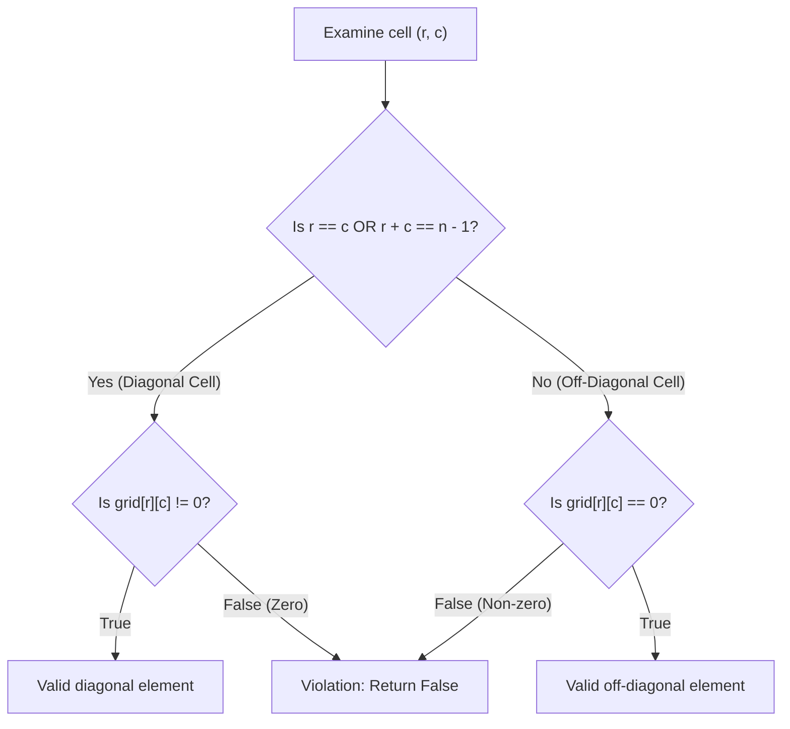

# Guided Example: Check if Matrix Is X-Matrix

## 1. Problem Overview & Representative Instance

We are given an $n \times n$ 2D integer matrix `grid`. A square matrix is formally classified as an **X-Matrix** if both of the following structural requirements are satisfied:
1. **Diagonal Non-Zero Property:** Every element on both the primary (main) diagonal and secondary (anti) diagonal must be non-zero ($grid[r][c] \ne 0$).
2. **Off-Diagonal Zero Property:** Every element that does not lie on either diagonal must be zero ($grid[r][c] = 0$).

If any diagonal cell equals zero, or if any off-diagonal cell is non-zero, the matrix fails the test. We return `true` if `grid` is an X-Matrix, and `false` otherwise.

Consider the representative instance:
$$grid = \begin{pmatrix} 2 & 0 & 0 & 1 \\ 0 & 3 & 1 & 0 \\ 0 & 5 & 2 & 0 \\ 4 & 0 & 0 & 2 \end{pmatrix}$$
Here, $n = 4$. Both diagonals form an "X" pattern, and every remaining entry is zero.

## 2. Mathematical & Algorithmic Principles

For an $n \times n$ matrix with 0-indexed coordinates $(r, c) \in \{0, \dots, n-1\}^2$:
- The **main diagonal** consists of all cells where the row index equals the column index:
  $$\mathcal{D}_{\text{main}} = \{(r, c) \mid r = c\}$$
- The **anti-diagonal** consists of all cells where row and column indices sum to $n - 1$:
  $$\mathcal{D}_{\text{anti}} = \{(r, c) \mid r + c = n - 1\}$$

The union $\mathcal{D} = \mathcal{D}_{\text{main}} \cup \mathcal{D}_{\text{anti}}$ defines the set of all diagonal coordinates.
- If $n$ is even, $|\mathcal{D}| = 2n$, because the two diagonals never intersect.
- If $n$ is odd, $|\mathcal{D}| = 2n - 1$, intersecting at the unique central cell $\left(\frac{n-1}{2}, \frac{n-1}{2}\right)$.

### Necessary and Sufficient Predicates
The matrix is an X-Matrix if and only if:

$$\forall (r, c) \in \{0, \dots, n-1\}^2: \quad \begin{cases} grid[r][c] \ne 0 & \text{if } (r, c) \in \mathcal{D} \\ grid[r][c] = 0 & \text{if } (r, c) \notin \mathcal{D} \end{cases}$$

An early-exit predicate can evaluate each cell during a single nested traversal:
- If $(r = c \lor r + c = n - 1)$, assert $grid[r][c] \ne 0$.
- Otherwise, assert $grid[r][c] = 0$.
Any mismatch immediately terminates the scan with `false`.

| Coordinate Class | Identification Condition | Required Value Set | Permissible Value |
|---|---|---|---|
| Main Diagonal | $r = c$ | Non-zero integers ($\mathbb{Z} \setminus \{0\}$) | Any non-zero |
| Anti-Diagonal | $r + c = n - 1$ | Non-zero integers ($\mathbb{Z} \setminus \{0\}$) | Any non-zero |
| Intersection (Odd $n$) | $r = c = \frac{n-1}{2}$ | Non-zero integers ($\mathbb{Z} \setminus \{0\}$) | Any non-zero |
| Off-Diagonal | $r \ne c \land r + c \ne n - 1$ | Zero only ($\{0\}$) | Strictly 0 |

## 3. Step-by-Step Walkthrough with Intermediate State

We verify each cell of the $4 \times 4$ representative matrix row by row. Here $n = 4$, so $n - 1 = 3$.

### Row $r = 0$:
- $(0, 0)$: $r = c \implies$ Main diagonal. Value is $2 \ne 0$. (Valid)
- $(0, 1)$: Off-diagonal ($0 \ne 1, 0+1 \ne 3$). Value is $0$. (Valid)
- $(0, 2)$: Off-diagonal ($0 \ne 2, 0+2 \ne 3$). Value is $0$. (Valid)
- $(0, 3)$: $r + c = 0 + 3 = 3 \implies$ Anti-diagonal. Value is $1 \ne 0$. (Valid)

### Row $r = 1$:
- $(1, 0)$: Off-diagonal ($1 \ne 0, 1+0 \ne 3$). Value is $0$. (Valid)
- $(1, 1)$: $r = c \implies$ Main diagonal. Value is $3 \ne 0$. (Valid)
- $(1, 2)$: $r + c = 1 + 2 = 3 \implies$ Anti-diagonal. Value is $1 \ne 0$. (Valid)
- $(1, 3)$: Off-diagonal ($1 \ne 3, 1+3 \ne 3$). Value is $0$. (Valid)

### Row $r = 2$:
- $(2, 0)$: Off-diagonal ($2 \ne 0, 2+0 \ne 3$). Value is $0$. (Valid)
- $(2, 1)$: $r + c = 2 + 1 = 3 \implies$ Anti-diagonal. Value is $5 \ne 0$. (Valid)
- $(2, 2)$: $r = c \implies$ Main diagonal. Value is $2 \ne 0$. (Valid)
- $(2, 3)$: Off-diagonal ($2 \ne 3, 2+3 \ne 3$). Value is $0$. (Valid)

### Row $r = 3$:
- $(3, 0)$: $r + c = 3 + 0 = 3 \implies$ Anti-diagonal. Value is $4 \ne 0$. (Valid)
- $(3, 1)$: Off-diagonal ($3 \ne 1, 3+1 \ne 3$). Value is $0$. (Valid)
- $(3, 2)$: Off-diagonal ($3 \ne 2, 3+2 \ne 3$). Value is $0$. (Valid)
- $(3, 3)$: $r = c \implies$ Main diagonal. Value is $2 \ne 0$. (Valid)

All 16 cells adhere to the constraints. Output: `true`.

## 4. Comprehensive State Trace

The evaluation status of all cells across the representative grid is summarized below.

| Coordinate $(r, c)$ | Observed Value | Cell Classification | Invariant Condition Checked | Evaluation Outcome |
|---|---|---|---|---|
| $(0, 0)$ | 2 | Main Diagonal | Must be non-zero ($2 \ne 0$) | Satisfied |
| $(0, 1)$ | 0 | Off-Diagonal | Must be zero ($0 = 0$) | Satisfied |
| $(0, 2)$ | 0 | Off-Diagonal | Must be zero ($0 = 0$) | Satisfied |
| $(0, 3)$ | 1 | Anti-Diagonal | Must be non-zero ($1 \ne 0$) | Satisfied |
| $(1, 0)$ | 0 | Off-Diagonal | Must be zero ($0 = 0$) | Satisfied |
| $(1, 1)$ | 3 | Main Diagonal | Must be non-zero ($3 \ne 0$) | Satisfied |
| $(1, 2)$ | 1 | Anti-Diagonal | Must be non-zero ($1 \ne 0$) | Satisfied |
| $(1, 3)$ | 0 | Off-Diagonal | Must be zero ($0 = 0$) | Satisfied |
| $(2, 0)$ | 0 | Off-Diagonal | Must be zero ($0 = 0$) | Satisfied |
| $(2, 1)$ | 5 | Anti-Diagonal | Must be non-zero ($5 \ne 0$) | Satisfied |
| $(2, 2)$ | 2 | Main Diagonal | Must be non-zero ($2 \ne 0$) | Satisfied |
| $(2, 3)$ | 0 | Off-Diagonal | Must be zero ($0 = 0$) | Satisfied |
| $(3, 0)$ | 4 | Anti-Diagonal | Must be non-zero ($4 \ne 0$) | Satisfied |
| $(3, 1)$ | 0 | Off-Diagonal | Must be zero ($0 = 0$) | Satisfied |
| $(3, 2)$ | 0 | Off-Diagonal | Must be zero ($0 = 0$) | Satisfied |
| $(3, 3)$ | 2 | Main Diagonal | Must be non-zero ($2 \ne 0$) | Satisfied |

## 5. Algorithmic Correctness & Soundness

1. **Exhaustive Coordinate Partitioning:**
   The boolean disjunction $(r = c) \lor (r + c = n - 1)$ partitions the set of all $n^2$ grid cells into two mutually exclusive sets: those that belong to the X diagonals, and those that do not. Checking the respective condition for each cell guarantees that no cell escapes validation.

2. **Short-Circuit Soundness:**
   The definition of an X-Matrix is a universally quantified conjunction over all cells:
   $$\bigwedge_{r, c} \operatorname{Valid}(r, c)$$
   If any single cell violates its respective condition, the global conjunction evaluates to `false` immediately, justifying instant termination.

## 6. Edge Cases & Anti-Patterns

- **Center Cell in Odd Dimensions ($n = 3, 5, \dots$):**
  - For odd $n$, the center cell satisfies both $r = c$ and $r + c = n - 1$. The logical OR condition correctly evaluates it once as a diagonal element, requiring it to be non-zero.
- **Single Cell Matrix ($n = 1$):**
  - The lone cell $(0, 0)$ is on both diagonals ($0 = 0$ and $0 + 0 = 0$). It must be non-zero.
- **Negative Numbers on Diagonals:**
  - The specification permits negative integers on diagonals, requiring only that $grid[r][c] \ne 0$.
- **Anti-Pattern (Pre-clearing Diagonals into Separate Sets):**
  - Allocating extra memory sets or copies of the matrix is redundant; checking coordinates on-the-fly incurs $\mathcal{O}(1)$ overhead.

## 7. Complexity Analysis

- **Time Complexity:** $\mathcal{O}(n^2)$ where $n$ is the dimension of the square matrix. In the worst case (a valid matrix or a violation in the final cell), each of the $n^2$ cells is inspected once. Early-exit returns `false` sooner if an invalid cell is found.
- **Space Complexity:** $\mathcal{O}(1)$ auxiliary space. Only coordinate loop iterators are stored.
