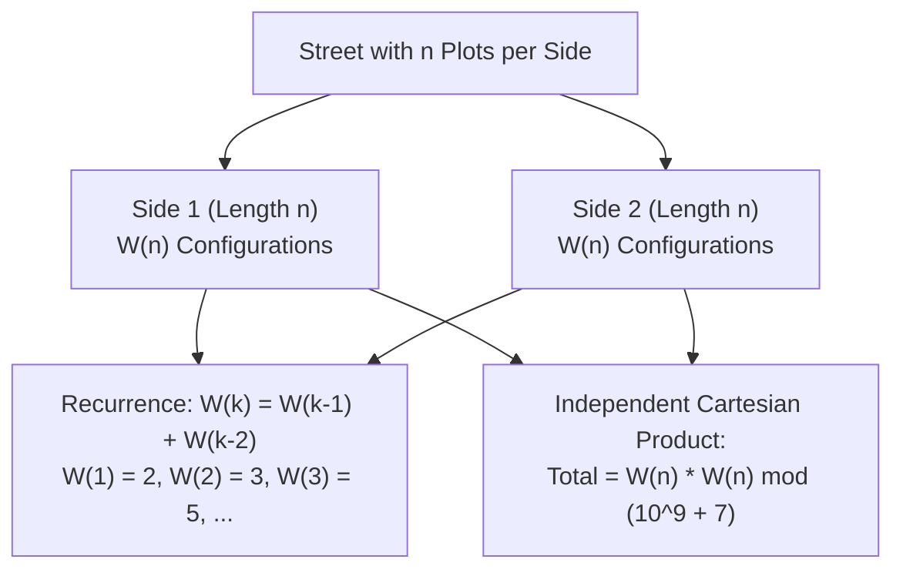

# Guided Example: Count Number of Ways to Place Houses

## 1. Problem Overview & Representative Instance

There is a street with $n$ plots of land on each side, forming two parallel rows of $n$ plots (a total of $2n$ plots). A house may be placed on any plot, subject to one rule:
- **No two houses on the same side of the street may be placed on adjacent plots.**

Houses located directly opposite each other across the street do not restrict one another. The goal is to calculate the total number of valid house placement configurations across both sides of the street, modulo $10^9 + 7$.

Consider the representative instance:
- Street plot count per side: $n = 2$

Plots are arranged as:
- Side 1: Plot 1, Plot 2
- Side 2: Plot 1, Plot 2

For a single side of length 2, the valid house placements are:
1. No houses: $[\emptyset]$
2. House on Plot 1 only: $[\{1\}]$
3. House on Plot 2 only: $[\{2\}]$
(Placing houses on both plots $[\{1, 2\}]$ is forbidden due to adjacency).
There are $3$ valid configurations for Side 1 and independently $3$ valid configurations for Side 2. Combining both sides yields $3 \times 3 = 9$ total configurations.

## 2. Mathematical & Algorithmic Principles

Let $\mathcal{C}_1$ and $\mathcal{C}_2$ denote the sets of valid house configurations for Side 1 and Side 2 respectively. Because adjacency restrictions apply solely to adjacent plots within the same side of the street:

$$\text{Total Configurations} = |\mathcal{C}_1 \times \mathcal{C}_2| = |\mathcal{C}_1| \cdot |\mathcal{C}_2| = \big(W(n)\big)^2$$

where $W(n)$ represents the number of valid house configurations for a single linear row of $n$ plots.

### Linear Path Recurrence
Consider plot $k$ in a row of length $k$:
1. **Plot $k$ is Empty:** The preceding $k - 1$ plots are unconstrained by plot $k$, contributing $W(k - 1)$ valid configurations.
2. **Plot $k$ contains a House:** By the adjacency rule, plot $k - 1$ must be empty. The first $k - 2$ plots can then take any valid arrangement, contributing $W(k - 2)$ configurations.

Summing these disjoint cases yields the classical Fibonacci-type recurrence:

$$W(k) = W(k - 1) + W(k - 2) \quad \text{for } k \ge 3$$

### Boundary Conditions:
- $k = 1$: Plot 1 can be empty or occupied $\implies W(1) = 2$.
- $k = 2$: Possibilities are $\emptyset, \{1\}, \{2\} \implies W(2) = 3$.

Thus, $W(n)$ corresponds to the $(n + 2)$-th Fibonacci number $F_{n+2}$ (under the convention $F_1 = 1, F_2 = 1, F_3 = 2, F_4 = 3, F_5 = 5, \dots$).

| Sequence Step $k$ | Valid Patterns for Length $k$ | Count $W(k)$ | Squaring for Both Sides: $\big(W(k)\big)^2$ |
|---|---|---|---|
| $k = 1$ | $\emptyset$, $\{1\}$ | 2 | $2^2 = 4$ |
| $k = 2$ | $\emptyset$, $\{1\}$, $\{2\}$ | 3 | $3^2 = 9$ |
| $k = 3$ | $\emptyset$, $\{1\}$, $\{2\}$, $\{3\}$, $\{1, 3\}$ | 5 | $5^2 = 25$ |
| $k = 4$ | $\emptyset$, $\{1\}$, $\{2\}$, $\{3\}$, $\{4\}$, $\{1,3\}$, $\{1,4\}$, $\{2,4\}$ | 8 | $8^2 = 64$ |

## 3. Step-by-Step Walkthrough with Intermediate State

We trace the calculation for $n = 5$.
Modulus: $M = 10^9 + 7$.

- **Step 1 ($k = 1$):**
  - Base case: $W(1) = 2$.
  - Configurations: empty, house on 1.

- **Step 2 ($k = 2$):**
  - Base case: $W(2) = 3$.
  - Configurations: empty, house on 1, house on 2.

- **Step 3 ($k = 3$):**
  - Recurrence: $W(3) = W(2) + W(1) = 3 + 2 = 5$.
  - Configurations: empty, {1}, {2}, {3}, {1, 3}.

- **Step 4 ($k = 4$):**
  - Recurrence: $W(4) = W(3) + W(2) = 5 + 3 = 8$.

- **Step 5 ($k = 5$):**
  - Recurrence: $W(5) = W(4) + W(3) = 8 + 5 = 13$.

### Squaring for Both Sides:
Each side has $W(5) = 13$ independent possibilities.
$$\text{Total} = (13 \times 13) \pmod{10^9 + 7} = 169 \pmod{10^9 + 7} = 169$$

## 4. Comprehensive State Trace

The table below illustrates the progression of single-side counts and the resulting total cross-product for lengths $1 \le n \le 6$.

| Plot Count $n$ | Single-Side Ending in House | Single-Side Ending Empty | Single-Side Total $W(n)$ | Modulo Arithmetic ($W(n) \pmod M$) | Final Combined Result $\big(W(n)\big)^2 \pmod M$ |
|---|---|---|---|---|---|
| 1 | 1 | 1 | 2 | 2 | $2^2 = 4$ |
| 2 | 1 | 2 | 3 | 3 | $3^2 = 9$ |
| 3 | 2 | 3 | 5 | 5 | $5^2 = 25$ |
| 4 | 3 | 5 | 8 | 8 | $8^2 = 64$ |
| 5 | 5 | 8 | 13 | 13 | $13^2 = 169$ |
| 6 | 8 | 13 | 21 | 21 | $21^2 = 441$ |

## 5. Algorithmic Correctness & Soundness

1. **Orthogonal Independence of Sides:**
   The constraint specification restricts houses on adjacent plots on the *same side* of the street. No rule prevents placing houses on plot $i$ on Side 1 and plot $i$ on Side 2 simultaneously. Because the constraints for Side 1 and Side 2 share no variables, the joint state space is the direct Cartesian product $\mathcal{C}_1 \times \mathcal{C}_2$, whose cardinality is $|\mathcal{C}_1| \cdot |\mathcal{C}_2| = \big(W(n)\big)^2$.

2. **Exhaustive Recurrence Partitioning:**
   On any side, the state of the final plot $n$ is a binary choice: either it has a house or it is empty. These two scenarios are mutually exclusive and span all valid placements. The bijection between placements ending in an empty plot and valid placements of length $n - 1$, and between placements ending with a house and valid placements of length $n - 2$, proves that $W(n) = W(n-1) + W(n-2)$ accounts for every valid configuration without omission or duplication.

## 6. Edge Cases & Anti-Patterns

- **Minimal Street Length ($n = 1$):**
  - For $n = 1$, each side has 2 options. Total configurations is $2 \times 2 = 4$.
- **Modulo Handling During Squaring:**
  - When $n$ is large, $W(n)$ can be as large as $10^9 + 6$. Multiplying $W(n) \cdot W(n)$ can produce numbers up to $\approx 10^{18}$, which requires 64-bit integer precision before taking the modulo $10^9 + 7$.
- **Anti-Pattern (Simultaneous 2D Grid DP):**
  - Attempting to define a 2D dynamic programming state $dp[i][\text{state}_1][\text{state}_2]$ tracking both sides concurrently quadruples the state transitions unnecessarily. Recognizing independence separates the problem into a 1D sequence followed by a single squaring step.

## 7. Complexity Analysis

- **Time Complexity:** $\mathcal{O}(n)$. Computing the Fibonacci sequence up to index $n + 2$ takes $n$ scalar additions modulo $10^9 + 7$. Squaring takes $\mathcal{O}(1)$ time. (Alternatively, $\mathcal{O}(\log n)$ using $2 \times 2$ matrix exponentiation).
- **Space Complexity:** $\mathcal{O}(1)$ auxiliary space. Only two rolling scalar variables are required to propagate the linear recurrence.
